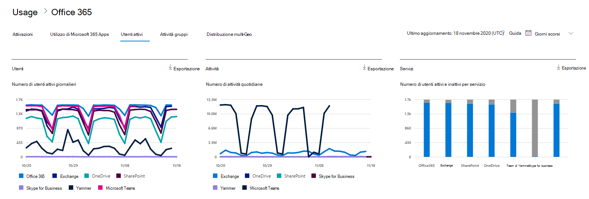

# Valutare il Microsoft 365 utenti attivi

Il dashboard Microsoft 365 **report mostra** la panoramica dell'attività tra i prodotti dell'organizzazione. Consente di eseguire il drill-down fino a visualizzare report a livello di singolo prodotto, per ottenere informazioni più dettagliate sulle attività in ogni prodotto. Vedere l' [argomento di panoramica sui report](activity-reports.md).
  
Ad esempio, è possibile usare il report **Utenti attivi** per sapere quante licenze di prodotto individuali sono in uso nell'organizzazione ed eseguire il drill-down per ottenere informazioni su quali utenti usano quali prodotti. Questo report può aiutare gli amministratori a identificare i prodotti sottoutilizzati o gli utenti che potrebbero aver bisogno di formazione o informazioni aggiuntive. 
  
> [!NOTE]
> Per visualizzare i report, è necessario essere un amministratore globale, un lettore globale o un lettore di report in Microsoft 365 o un amministratore di Exchange, SharePoint, Teams Service, Teams Communications o Skype for Business.  

## Come ottenere il report Utenti attivi

1. Nell'interfaccia di amministrazione passare alla pagina **Report** \> <a href="https://go.microsoft.com/fwlink/p/?linkid=2074756" target="_blank">Utilizzo</a>. 
2. Nella home page del dashboard fai clic sul **pulsante** Visualizza altro nella scheda Utenti attivi - Microsoft 365 Servizi.

## Interpretare il report Utenti attivi

È possibile visualizzare gli utenti attivi nel report Office 365 selezionando la **scheda Utenti** attivi. 

- Il report Utenti attivi può essere visualizzato per le tendenze degli ultimi 7, 30, 90 o 180 giorni. Tuttavia, se si visualizza un giorno specifico nel report, la tabella (7) mostrerà i dati per un massimo di 28 giorni dalla data corrente (non la data di generazione del report).

- I dati in ogni report in genere coprono fino alle ultime 24-48 ore.

- Il grafico Utenti mostra gli utenti attivi giornalieri nel periodo di reporting separato per prodotto.
Il grafico Attività mostra il conteggio giornaliero delle attività nel periodo di reporting separato per prodotto.
Il grafico Servizi mostra il numero di utenti per tipo di attività e servizio.

- Nel grafico Utenti, l'asse x mostra il periodo di tempo di reporting selezionato e l'asse y visualizza gli utenti attivi giornalieri separati e i colori codificati per tipo di licenza.
Nel grafico Attività, l'asse x mostra il periodo di tempo di reporting selezionato e l'asse y visualizza il numero di attività giornaliere separato e il colore codificato per tipo di licenza.
Nel grafico attività Servizi, l'asse X mostra i servizi individuali per cui sono abilitati gli utenti nel periodo di tempo specificato, mentre l'asse Y indica il numero di utenti codificati per colore in base allo stato di attività.

- È possibile filtrare la serie visualizzata nel grafico selezionando un elemento nella legenda. La modifica di questa selezione non modifica le informazioni nella tabella della griglia.

- È inoltre possibile esportare i dati del report in Excel .csv file, selezionando il collegamento Esporta. Vengono esportati i dati di tutti gli utenti, che possono poi essere ordinati e filtrati per ulteriore analisi. Se gli utenti sono meno di 2000, è possibile ordinarli e filtrarli direttamente nella tabella del report. Se invece gli utenti sono più di 2000, per ordinarli e filtrarli occorre esportare i dati.

- È possibile cambiare le informazioni visualizzate nella tabella della griglia con i controlli colonna.
Se l'abbonamento è gestito da 21Vianet, non verrà visualizzato Yammer.

Se i criteri dell'organizzazione impediscono la visualizzazione dei report in cui le informazioni degli utenti sono identificabili, è possibile modificare l'impostazione della privacy per tutti questi report. Vedere la sezione **Come nascondere i dettagli a** livello di utente in Report attività [nell'Microsoft 365 di amministrazione.](activity-reports.md)  
