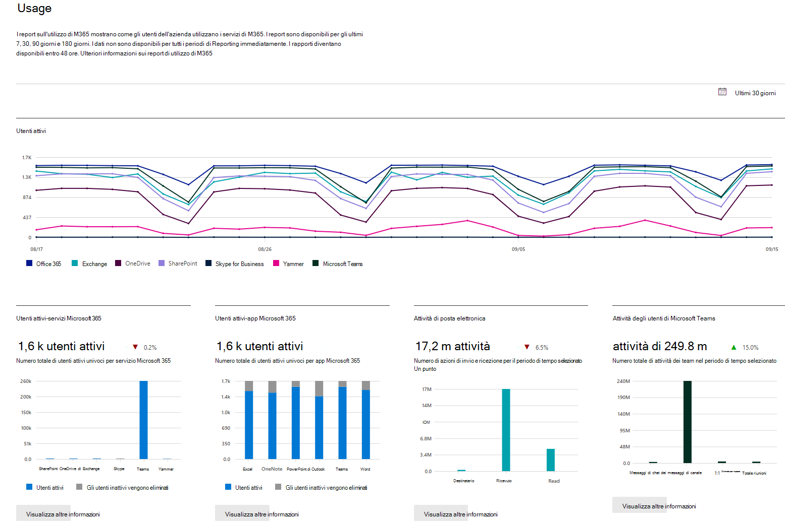

# Report di Microsoft 365 nell'interfaccia di amministrazione

È possibile vedere facilmente come vengono usati i servizi di Microsoft 365 dalle persone nell'azienda. Ad esempio, è possibile identificare chi usa molto un servizio e raggiunge le quote o chi potrebbe non avere necessità di una licenza di Microsoft 365.
  
I report sono disponibili per gli ultimi 7, 30, 90 e 180 giorni. I dati per tutti i periodi di riferimento non saranno subito disponibili. I report diventeranno disponibili entro 48 ore.
  
## Guardare: Usare un report sull'utilizzo in Office 365
  
> [!VIDEO https://www.microsoft.com/videoplayer/embed/fb726f8e-aead-43b2-ba0f-53ba5b886bf7?autoplay=false]
  
## Come accedere al dashboard Report

::: moniker range="o365-worldwide"

1. Nell'interfaccia di amministrazione passare alla pagina **Report** \> <a href="https://go.microsoft.com/fwlink/p/?linkid=2074756" target="_blank">Utilizzo</a>.

::: moniker-end

::: moniker range="o365-germany"

1. Nell'**interfaccia di amministrazione** passare alla pagina <a href="https://go.microsoft.com/fwlink/p/?linkid=848041" target="_blank">Report</a> **\>Utilizzo**.

::: moniker-end

::: moniker range="o365-21vianet"

1. Nell'**interfaccia di amministrazione** passare alla pagina <a href="https://go.microsoft.com/fwlink/p/?linkid=850627" target="_blank">Report</a> **\>Utilizzo**.

::: moniker-end

2. Fare clic sul pulsante **Visualizza altro** dalla scheda riepilogo attività di un servizio, ad esempio e-mail o OneDrive, per visualizzare la pagina dettagli del report. Nelle schede sono disponibili report diversi per il servizio.   

## Chi può vedere i report

Utenti che hanno le autorizzazioni seguenti:
  
- Amministratori globali: è preferibile assegnare questo ruolo solo a poche persone nella società. Questo approccio riduce i rischi per l'azienda.
    
- Amministratori di Exchange
    
- Amministratori di SharePoint
    
- Amministratori di Skype for Business

- Ruolo con autorizzazioni di lettura globali
    
- Ruolo con autorizzazioni di lettura per i report

- Amministratore del servizio Teams

- Amministratore delle comunicazioni di Teams
    
Per altre informazioni, vedere [Informazioni sui ruoli di amministratore](../add-users/about-admin-roles.md) e [Assegnare ruoli di amministratore](../add-users/assign-admin-roles.md).
  
## Quali report attività sono disponibili nell'Interfaccia di amministrazione

In base all'abbonamento, questi sono i report disponibili.

- [Utilizzo del browser Microsoft](browser-usage-report.md) 
  
- [Attività di posta elettronica](email-activity-ww.md)
    
- [Utilizzo delle cassette postali](mailbox-usage.md)
    
- [Attivazioni di Office](microsoft-office-activations-ww.md)

- [Utenti attivi](active-users-ww.md)
  
- [Utilizzo delle applicazioni di posta elettronica](email-apps-usage-ww.md)

- [Attività di Forms](forms-activity-ww.md)

- [Attività Dynamics 365 Customer Voice](forms-pro-activity-ww.md)

- [Gruppi di Microsoft 365](office-365-groups-ww.md)
  
- [Attività degli utenti di OneDrive for Business](onedrive-for-business-activity-ww.md)

- [Utilizzo di OneDrive for Business](onedrive-for-business-usage-ww.md)

- [Utilizzo di Microsoft 365 Apps](microsoft365-apps-usage-ww.md)
  
- [Utilizzo dei sito di SharePoint](sharepoint-site-usage-ww.md)
  
- [Attività di SharePoint](sharepoint-activity-ww.md)
  
- [Attività in Skype for Business Online](/SkypeForBusiness/skype-for-business-online-reporting/activity-report)
  
- [Attività organizzatore di conferenze di Skype for Business Online](/SkypeForBusiness/skype-for-business-online-reporting/conference-organizer-activity-report)
  
- [Attività partecipante a conferenze di Skype for Business Online](/SkypeForBusiness/skype-for-business-online-reporting/conference-participant-activity-report)
  
- [Attività peer-to-peer in Skype for Business Online](/SkypeForBusiness/skype-for-business-online-reporting/peer-to-peer-activity-report)

- [Attività in Yammer](yammer-activity-report-ww.md)

- [Utilizzo di dispositivi Yammer](yammer-device-usage-report-ww.md)

- [Report delle attività dei gruppi di Yammer](yammer-groups-activity-report-ww.md)

- [Attività degli utenti di Microsoft Teams](microsoft-teams-user-activity-preview.md)

- [Utilizzo di dispositivi Microsoft Teams](microsoft-teams-device-usage-preview.md)

## Come visualizzare le informazioni sulle licenze

- Per vedere quante sono le licenze assegnate e quelle non assegnate, passare alla pagina **Fatturazione**\><a href="https://go.microsoft.com/fwlink/p/?linkid=842264" target="_blank"> Licenze</a> nell'interfaccia di amministrazione.
    
- Per vedere gli utenti con licenza, senza licenza o guest, nell'interfaccia di amministrazione passare alla pagina **Utenti** \> <a href="https://go.microsoft.com/fwlink/p/?linkid=834822" target="_blank">Utenti attivi</a>. 
  
## Visualizzare le informazioni sull'utilizzo per un utente specifico

Usare i report del servizio per sapere quanto viene usato il servizio da uno specifico utente. Ad esempio, per sapere quanto spazio di archiviazione della cassetta postale è stato usato da un utente specifico, aprire il report Utilizzo cassette postali e ordinare gli utenti in base al nome. Se ci sono migliaia di utenti, esportare il report in Excel per filtrare rapidamente l'elenco.
  
Non è possibile generare un report in cui si immette l'account di un utente e viene visualizzato un elenco con i servizi usati dall'utente e l'entità dell'utilizzo.

In alcune circostanze i nuovi utenti vengono visualizzati come **sconosciuti**. Ciò è dovuto a ritardi occasionali nella creazione dei profili utente.  
  
## Nascondere i dettagli utente nei report

Se si vogliono nascondere le informazioni a livello di utente quando si generano i report, è possibile apportare rapidamente questa modifica nell'interfaccia di amministrazione.
  
1. Nell'interfaccia di amministrazione passare a **Impostazioni** \> <a href="https://go.microsoft.com/fwlink/p/?linkid=2053743" target="_blank">Servizi &amp; componenti aggiuntivi</a>.

2. Selezionare **Reports**. 
  
3. Nel riquadro **Reports** selezionare le opzioni desiderate e poi salvare le modifiche.
  
L'elenco di utenti avrà questo aspetto:
  

  
Perché le modifiche abbiano effetto sui report nella dashboard dei report occorrerà qualche minuto. Questa impostazione si applica anche all'API dei report.
  
## Cosa succede ai dati di utilizzo quando un account utente viene chiuso?

Ogni volta che si chiude l'account di un utente, Microsoft elimina i dati di utilizzo entro 30 giorni. Quell'utente continuerà a essere incluso nei totali del grafico Attività (vedere numero 1) per i periodi in cui era attivo, ma non verrà visualizzato nella tabella dei Dettagli dell'utente (vedere numero 2).
  
Tuttavia, quando si seleziona un giorno specifico (vedere numero 3), fino a 28 giorni prima della data corrente, il report visualizza l'utilizzo dell'utente per tale giorno nella tabella dei Dettagli utente (vedere numero 2).
  
## Contenuto correlato

[Report nel Centro sicurezza &amp; e conformità](../../compliance/reports-in-security-and-compliance.md) (articolo)\
[Analisi di utilizzo di Microsoft 365](../usage-analytics/usage-analytics.md) (articolo)\
[Personalizzare i report nell'analisi dell'utilizzo di Microsoft 365](../usage-analytics/customize-reports.md) (articolo)