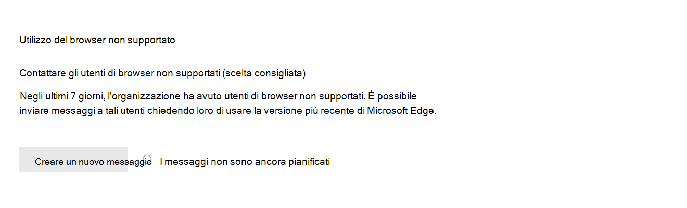

# Microsoft 365 Report nell'interfaccia di amministrazione - Utilizzo del browser MicrosoftMicrosoft 365 Reports in the admin center - Microsoft browser usage

Il dashboard Microsoft 365 **report** mostra una panoramica delle attività tra i prodotti dell'organizzazione.The Microsoft 365 **Reports** dashboard shows you an activity overview across the products in your organization. Consente di analizzare i singoli report a livello di prodotto per fornire informazioni più dettagliate sulle attività all'interno di ogni prodotto.It enables you to drill into individual product level reports to give you more granular insight about the activities within each product. Vedere l' [argomento introduttivo sui report](activity-reports.md).Check out [the Reports overview topic](activity-reports.md). Nel report utilizzo browser Microsoft puoi ottenere informazioni dettagliate su Internet Explorer, Versione legacy di Microsoft Edge e nuovi Microsoft Edge utilizzo.In the Microsoft browser usage report, you can gain insights on Internet Explorer, Microsoft Edge Legacy, and new Microsoft Edge usage. I report di utilizzo si basano Microsoft 365 online accessibili tramite un browser Microsoft.Usage reporting is based on Microsoft 365 online services accessed by using a Microsoft browser.

 > [!NOTE]
 > È necessario essere un amministratore globale, un lettore globale o un lettore di report in Microsoft 365 o un amministratore Exchange, SharePoint o Skype for Business per visualizzare i report.You must be a global administrator, global reader or reports reader in Microsoft 365 or an Exchange, SharePoint, or Skype for Business administrator to see reports.

## Come accedere al report sull'utilizzo del browser MicrosoftHow to get to the Microsoft browser usage report

1. Nell'interfaccia di amministrazione passare alla pagina **Report** \> <a href="https://go.microsoft.com/fwlink/p/?linkid=2074756" target="_blank">Utilizzo</a>.In the admin center, go to the **Reports** \> <a href="https://go.microsoft.com/fwlink/p/?linkid=2074756" target="_blank">Usage</a> page. 
2. Nella home page del dashboard fai clic sul **pulsante Visualizza** altro nella scheda di utilizzo del browser Microsoft.From the dashboard homepage, click on the **View more** button on the Microsoft browser usage card.

## Come inviare una notifica agli utenti per aggiornare il browserHow to notify users to upgrade their browser

Gli amministratori globali possono acconsentire esplicitamente all'invio di messaggi agli utenti tramite i servizi Microsoft 365 su Edge Legacy (non supportato) e Internet Explorer (presto non supportato).Global admins can opt-in to sending messages to users using Microsoft 365 services on Edge Legacy (unsupported) and Internet Explorer (soon to be unsupported). Questo messaggio mirato informa gli utenti che il supporto per questi browser terminerà a breve e collega a un articolo di supporto con informazioni su Microsoft Edge e semplici passaggi da seguire per cambiare browser.This targeted message notifies users that support for these browsers will end soon, and it links to a support article with information on Microsoft Edge and simple steps to follow to switch browsers. 

Questa funzionalità è disponibile nella pagina del report.You can find this feature on the report page. Una volta creato il messaggio, agli utenti viene notificata la frequenza specificata fino al 17 agosto 2021.Once the message is created, users are notified at the frequency specified until August 17, 2021. Puoi disattivare questa funzionalità in qualsiasi momento per interrompere l'invio di notifiche agli utenti.You can turn off this feature at any time to stop sending notifications to users. Per iniziare di nuovo a inviare notifiche, riattivare la funzionalità.To begin sending notifications again, turn the feature back on.

Per ulteriori informazioni, vedere [Microsoft Edge guida & apprendimento](https://support.microsoft.com/microsoft-edge).For more information, see [Microsoft Edge help & learning](https://support.microsoft.com/microsoft-edge).

## Interpretare il report sull'utilizzo del browser MicrosoftInterpret the Microsoft browser usage report

|ElementoItem|DescrizioneDescription|
 |:-----|:-----|
 |1.1.   |Il **report utilizzo browser Microsoft** può essere visualizzato per le tendenze degli ultimi 7, 30, 90 o 180 giorni.The **Microsoft browser usage** report can be viewed for trends over the last 7 days, 30 days, 90 days, or 180 days.    |
 |2.2.   |I dati in ogni report in genere coprono fino agli ultimi sette giorni.The data in each report usually covers up to the last seven days.   |
 |3.3.   |Il **grafico Utenti attivi giornalieri** mostra il numero di utenti giornalieri per Microsoft Edge, Versione legacy di Microsoft Edge e Internet Explorer se usato per accedere ai Microsoft 365 servizi.The **Daily active users** chart shows you the daily user count for Microsoft Edge, Microsoft Edge Legacy and Internet Explorer when used to access to Microsoft 365 services.   |
 |4.4. |Il **grafico Utenti** attivi mostra il numero totale di utenti che usano Microsoft Edge, Versione legacy di Microsoft Edge e Internet Explorer quando vengono usati per accedere ai servizi Microsoft 365 nel periodo di tempo selezionato.The **Active Users** chart shows you the total number of users using Microsoft Edge, Microsoft Edge Legacy and Internet Explorer when used to access to Microsoft 365 services over the selected time period. |
 |5.5. |La tabella visualizza un'analisi dei dati a livello di utente. È possibile aggiungere o rimuovere colonne in una tabella.  The table shows you a breakdown of data at the per-user level. You can add or remove columns from the table.   **Nome** utente è l'indirizzo di posta elettronica dell'utente che si è connesso Microsoft 365 servizi tramite browser Microsoft.**Username** is the email address of the user who connected to Microsoft 365 services using Microsoft browsers.  **Usato Microsoft Edge** mostra un segno di graduazione se l'utente ha usato Microsoft Edge per connettersi a Microsoft 365 servizi.**Used Microsoft Edge** shows a tick mark if the user used Microsoft Edge to connect to Microsoft 365 services.  **Usato Versione legacy di Microsoft Edge** mostra un segno di graduazione se l'utente ha usato Versione legacy di Microsoft Edge per connettersi a Microsoft 365 servizi.**Used Microsoft Edge Legacy** shows a tick mark if the user used Microsoft Edge Legacy to connect to Microsoft 365 services.  **Internet Explorer usato** mostra un segno di graduazione se l'utente ha usato Internet Explorer per connettersi Microsoft 365 servizi.**Used Internet Explorer** shows a tick mark if the user used Internet Explorer to connect to Microsoft 365 services. |
 |6.6. |Selezionare **l'icona Scegli** colonne per aggiungere o rimuovere colonne dal report.Select the **Choose columns** icon to add or remove columns from the report.|
 |7.7. |È inoltre possibile esportare i dati del report in Excel .csv file selezionando il **collegamento Esporta.**You can also export the report data into an Excel .csv file by selecting the **Export** link. In questo modo vengono esportati i dati per tutti gli utenti e è possibile eseguire semplici operazioni di aggregazione, ordinamento e filtro per un'ulteriore analisi.This exports data for all users and enables you to do simple aggregation, sorting, and filtering for further analysis. Se si dispone di meno di 100 utenti, è possibile ordinare e filtrare all'interno della tabella del report stesso.If you have less than 100 users, you can sort and filter within the table in the report itself. Se si dispone di più di 100 utenti, per filtrare e ordinare, sarà necessario esportare i dati.If you have more than 100 users, in order to filter and sort, you will need to export the data.|
