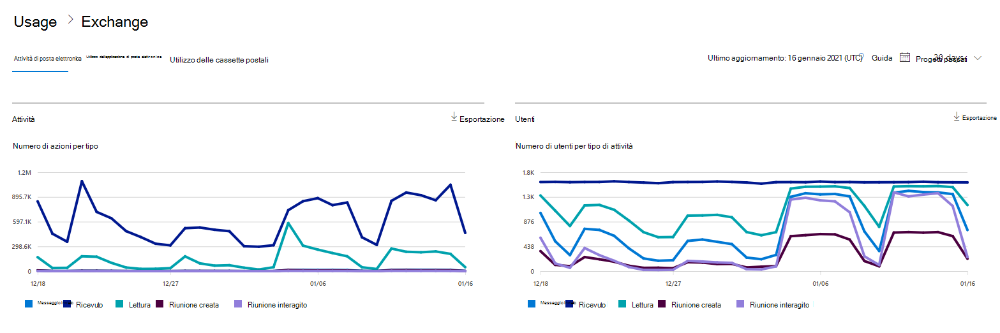
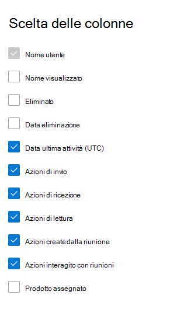

# Report di Microsoft 365 nell'interfaccia di amministrazione - Attività di posta elettronica

Il **dashboard** report di Microsoft 365 mostra la panoramica delle attività tra i prodotti dell'organizzazione. Consente di eseguire il drill-down fino a visualizzare report a livello di singolo prodotto, per ottenere informazioni più dettagliate sulle attività in ogni prodotto. Vedere l' [argomento di panoramica sui report](activity-reports.md).
  
È ad esempio possibile ottenere una panoramica del traffico di posta elettronica nell'organizzazione nella pagina Report e quindi usare il widget analitico Attività posta elettronica per comprendere le tendenze e i dettagli a livello di singolo utente dell'attività di posta elettronica nell'organizzazione.
  
> [!NOTE]
> Per visualizzare i report, è necessario essere un amministratore globale, un lettore globale o un lettore di report in Microsoft 365 o un amministratore di Exchange, SharePoint, Teams Service, Teams Communications o Skype for Business. 

## Come accedere al report attività di posta elettronica

1. Nell'interfaccia di amministrazione passare alla pagina **Report** \> <a href="https://go.microsoft.com/fwlink/p/?linkid=2074756" target="_blank">Utilizzo</a>.
2. Selezionare **Visualizza altro in** Attività di posta **elettronica.** 
3. **Nell'elenco a discesa Attività** di posta elettronica selezionare Attività di posta elettronica di **Exchange.** \> 
  
## Interpretare il report attività di posta elettronica

Per visualizzare l'attività di posta elettronica dell'utente, è possibile esaminare i grafici **Attività** e **Utenti**. 
  

  
|Elemento|Descrizione|
|:-----|:-----|
|1.    |Il report **Attività posta elettronica** può essere visualizzato per le tendenze degli ultimi 7, 30, 90 o 180 giorni. Tuttavia, se si seleziona un giorno specifico nel report, la tabella (7) mostrerà i dati per un massimo di 28 giorni dalla data corrente (non la data in cui è stato generato il report).    |
|2.    |I dati in ogni report in genere riguardano fino alle ultime 24-48 ore.    |
|3.    |Il **grafico Attività** consente di comprendere la tendenza della quantità di attività di posta elettronica in corso nell'organizzazione. È possibile comprendere la suddivisione delle attività di invio, lettura, ricezione, creazione di riunioni o interazione della riunione tramite posta elettronica.    |
|4.    |Il **grafico Utente** consente di comprendere la tendenza della quantità di utenti univoci che generano le attività di posta elettronica. È possibile osservare la tendenza degli utenti che eseguono l'invio di posta elettronica, la lettura della posta elettronica, la ricezione della posta elettronica, la creazione di riunioni o le attività di interazione delle riunioni.    |
|5.    | Nel grafico **Attività,** l'asse Y è il conteggio delle attività del tipo di messaggio di posta elettronica inviato, ricevuto, letto e inviato tramite posta elettronica, riunione creata e riunione interagita.     Nel grafico **attività Utenti,** l'asse Y è l'attività dell'utente che esegue il tipo di messaggio di posta elettronica inviato, ricevuto, letto e-mail, riunione creata o riunione interagita.     L'asse X in entrambi i grafici rappresenta l'intervallo di date selezionato per il report specifico.    |
|6.    |È possibile filtrare la serie visualizzata nel grafico selezionando un elemento nella legenda.    |
|7.    | La tabella mostra un'analisi delle attività di posta elettronica a livello di utente. Sono indicati tutti gli utenti a cui è assegnato un prodotto Exchange unitamente alle relative attività di posta elettronica.     **Nome utente** è l'indirizzo di posta elettronica dell'utente.    **Il nome visualizzato** è il nome completo se l'utente.    **Eliminato** si riferisce all'utente il cui stato corrente è eliminato, ma che era attivo durante una parte del periodo oggetto del report.    **Data eliminazione** indica la data di eliminazione dell'utente.    **Data ultima attività** si riferisce all'ultima volta in cui l'utente ha eseguito un'attività di lettura o invio di messaggi di posta elettronica.    **Azioni di invio** è il numero di volte in cui un'azione di invio di un messaggio di posta elettronica è stata registrata per l'utente.    **Azioni di ricezione** è il numero di volte in cui un'azione di ricezione di un messaggio di posta elettronica è stata registrata per l'utente.    **Azioni di lettura** è il numero di volte in cui un'azione di lettura di un messaggio di posta elettronica è stata registrata per l'utente.    **Azioni create riunione è** il numero di volte in cui è stata registrata un'azione di invio di una convocazione di riunione per l'utente.    **Azioni interagite riunione** è il numero di volte in cui una convocazione di riunione accetta, provvisoria, rifiuta o annulla l'azione è stata registrata per l'utente.    **I prodotti** assegnati sono i prodotti assegnati a questo utente.     Se i criteri dell'organizzazione impediscono la visualizzazione dei report in cui le informazioni degli utenti sono identificabili, è possibile modificare l'impostazione della privacy per tutti questi report. Vedere la sezione **Come nascondere i dettagli** a livello di utente nei report attività nell'interfaccia di amministrazione di Microsoft [365.](activity-reports.md)    |
|8.    |Selezionare **Scegli colonne** per aggiungere o rimuovere colonne dal report.    |
|9.    |È inoltre possibile esportare i dati del report in un file CSV di Excel selezionando il **collegamento Esporta.** Vengono esportati i dati di tutti gli utenti, che possono poi essere ordinati e filtrati per ulteriore analisi. Se gli utenti sono meno di 2000, è possibile ordinarli e filtrarli direttamente nella tabella del report. Se invece gli utenti sono più di 2000, per ordinarli e filtrarli occorre esportare i dati.    |
|||
   
> [!NOTE]
> Il report Attività di posta elettronica è disponibile solo per le cassette postali associate agli utenti che dispongono di licenze.
