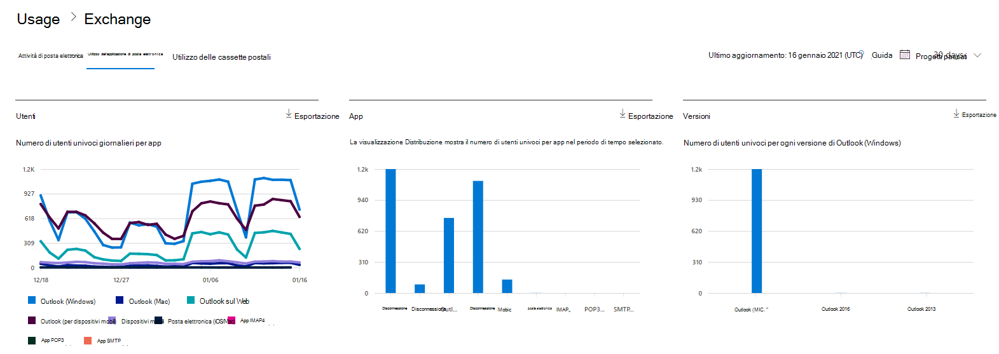
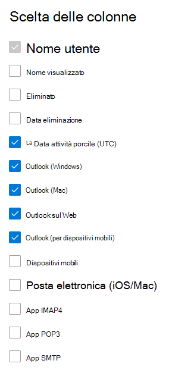

# Microsoft 365 Report nell'interfaccia di amministrazione - Utilizzo delle app di posta elettronicaMicrosoft 365 Reports in the admin center - Email apps usage

Il dashboard Microsoft 365 **report mostra** la panoramica dell'attività tra i prodotti dell'organizzazione.The Microsoft 365 **Reports** dashboard shows you the activity overview across the products in your organization. Consente di eseguire il drill-down fino a visualizzare report a livello di singolo prodotto, per ottenere informazioni più dettagliate sulle attività in ogni prodotto.It enables you to drill in to individual product level reports to give you more granular insight about the activities within each product. Vedere l' [argomento introduttivo sui report](activity-reports.md).Check out [the Reports overview topic](activity-reports.md). Nel report sull'utilizzo delle app di posta elettronica puoi vedere quante app di posta elettronica si connettono a Exchange Online.In the email apps usage report, you can see how many email apps are connecting to Exchange Online. È anche possibile visualizzare le informazioni sulla versione delle app di Outlook usate dagli utenti, che consentirà di contattare gli utenti che usano versioni non supportate per consigliare l'installazione di versioni supportate di Outlook.You can also see the version information of Outlook apps that users are using, which will allow you to follow up with those who are using unsupported versions to install supported versions of Outlook.
  
> [!NOTE]
> Per visualizzare i report, è necessario essere un amministratore globale, un lettore globale o un lettore di report in Microsoft 365 o un amministratore di Exchange, SharePoint, Teams Service, Teams Communications o Skype for Business.You must be a global administrator, global reader or reports reader in Microsoft 365 or an Exchange, SharePoint, Teams Service, Teams Communications, or Skype for Business administrator to see reports.  
 
## Come accedere al report app di posta elettronicaHow to get to the email apps report

1. Nell'interfaccia di amministrazione passare alla pagina **Report** \> <a href="https://go.microsoft.com/fwlink/p/?linkid=2074756" target="_blank">Utilizzo</a>.In the admin center, go to the **Reports** \> <a href="https://go.microsoft.com/fwlink/p/?linkid=2074756" target="_blank">Usage</a> page.
2. Selezionare **Visualizza altro in** Attività di posta **elettronica.**Select **View More** under **Email activity**. 
3. **Nell'elenco a discesa Attività di** posta elettronica selezionare Exchange utilizzo delle app di posta  \> **elettronica.**From the **Email activity** drop-down list, select **Exchange** \> **Email apps usage**.
  
## Interpretare il report delle app di posta elettronicaInterpret the email apps report

Puoi visualizzare l'attività delle app di posta elettronica esaminando i grafici **Utenti** **e** client.You can get a view into email apps activity by looking at the **Users** and **Clients** charts. 
  

  
|ElementoItem|DescrizioneDescription|
|:-----|:-----|
|1.1.    |Il **report Utilizzo app di** posta elettronica può essere visualizzato per le tendenze degli ultimi 7, 30, 90 o 180 giorni.The **Email apps usage** report can be viewed for trends over the last 7 days, 30 days, 90 days, or 180 days. Tuttavia, se si seleziona un giorno specifico nel report, la tabella (7) mostrerà i dati per un massimo di 28 giorni dalla data corrente (non la data di generazione del report).However, if you select a particular day in the report, the table (7) will show data for up to 28 days from the current date (not the date the report was generated).    |
|2.2.    |I dati in ogni report in genere coprono fino alle ultime 24-48 ore.The data in each report usually covers up to the last 24 to 48 hours.    |
|3.3.    |La visualizzazione **Utenti** mostra il numero di utenti univoci che si sono connessi a Exchange Online con qualsiasi app di posta elettronica.The **Users** view shows you the number of unique users that connected to Exchange Online using any email app.    |
|4.4.    |La visualizzazione **App** mostra il numero di utenti univoci per ogni app nel periodo di tempo selezionato.The **Apps** view shows you the number of unique users by app over the selected time period.    |
|5.5.    |La **visualizzazione** Versioni mostra il numero di utenti univoci per ogni versione di Outlook in Windows.The **Versions** view shows you the number of unique users for each version of Outlook in Windows.    |
|6.6.    | Nel grafico **Utenti** l'asse Y rappresenta il numero totale di utenti univoci che si sono connessi a un'app in qualsiasi giorno del periodo di riferimento.On the **Users** chart, the Y axis is the total count of unique users that connected to an app on any day of the reporting period.     Nel grafico **Utenti** l'asse X rappresenta il numero totale di utenti univoci che hanno usato l'app in tale periodo di riferimento.On the **Users** chart, the X axis is number of unique users that used the app for that reporting period.     Nel grafico **App** l'asse Y rappresenta il numero totale di utenti univoci che hanno usato un'app specifica durante il periodo di riferimento.On the **Apps** chart, the Y axis is the total count of unique users who used a specific app during the reporting period.     Nel grafico **App** l'asse X è l'elenco di app nella propria organizzazione.On the **Apps** chart, the X axis is the list of apps in your organization.     Nel grafico **Versioni** l'asse Y è il numero totale di utenti univoci che usano una versione specifica di Outlook per il desktop.On the **Versions** chart, the Y axis is the total count of unique users using a specific version of Outlook desktop. Se il report non è in grado di risolvere il numero di versione di Outlook, la quantità verrà visualizzata **come Indeterminato.**If the report can't resolve the version number of Outlook, the quantity will show as **Undetermined**.     Nel grafico **Versioni** l'asse X è l'elenco di app nella propria organizzazione.On the **Versions** chart, the X axis is the list of apps in your organization.    |
|7.7.    |È possibile filtrare la serie visualizzata nel grafico selezionando un elemento nella legenda.You can filter the series you see on the chart by selecting an item in the legend.    |
|8.8.    | Non tutti gli elementi saranno visibili nelle colonne dell'elenco finché non verranno aggiunti.You might not see all the items in the list below in the columns until you add them.  **Username** è il nome del proprietario dell'app di posta elettronica.**Username** is the name of the email app's owner.    **Data ultima attività è** l'ultima data in cui l'utente ha letto o inviato un messaggio di posta elettronica.**Last activity date** is the latest date the user read or sent an email message.    **Mac mail**, **Outlook per Mac** e **Outlook**, **Outlook Mobile** e **Outlook sul Web** sono alcuni esempi di app di posta elettronica che potrebbero essere presenti nell'organizzazione.**Mac mail**, **Mac Outlook** and **Outlook**, **Outlook mobile** and **Outlook on the web** are examples of email apps you may have in your organization.     Se i criteri dell'organizzazione impediscono la visualizzazione dei report in cui le informazioni degli utenti sono identificabili, è possibile modificare l'impostazione della privacy per tutti questi report.If your organization's policies prevents you from viewing reports where user information is identifiable, you can change the privacy setting for all these reports. Vedere la sezione **Come nascondere i dettagli a** livello di utente nei Report attività [nell'Microsoft 365 di amministrazione.](activity-reports.md)Check out the **How do I hide user level details?** section in the [Activity Reports in the Microsoft 365 admin center](activity-reports.md).    |
|9.9.    |Selezionare **Scegli colonne** per aggiungere o rimuovere colonne dal report.Select **Choose columns** to add or remove columns from the report.    |
|10.10.    |È inoltre possibile esportare i dati del report in Excel .csv file, selezionando il **collegamento Esporta.**You can also export the report data into an Excel .csv file, by selecting the **Export** link. Vengono esportati i dati di tutti gli utenti, che possono poi essere ordinati e filtrati per ulteriore analisi.This exports data of all users and enables you to do simple sorting and filtering for further analysis. Se gli utenti sono meno di 2000, è possibile ordinarli e filtrarli direttamente nella tabella del report.If you have less than 2000 users, you can sort and filter within the table in the report itself. Se invece gli utenti sono più di 2000, per ordinarli e filtrarli occorre esportare i dati.If you have more than 2000 users, in order to filter and sort, you will need to export the data.    |
|||
   
