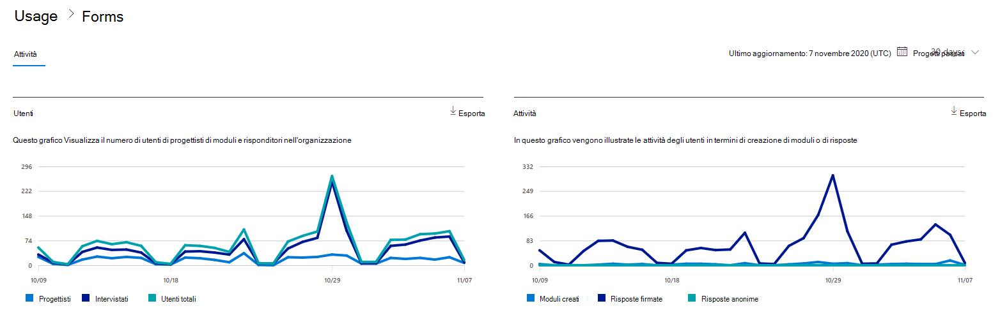
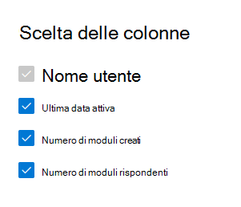

# Microsoft 365 Report nell'interfaccia di amministrazione - Attività dei moduli

Il dashboard Microsoft 365 **report mostra** la panoramica dell'attività tra i prodotti dell'organizzazione. Consente di eseguire il drill-down fino a visualizzare report a livello di singolo prodotto, per ottenere informazioni più dettagliate sulle attività in ogni prodotto. Vedere l' [argomento di panoramica sui report](activity-reports.md).
  
Ad esempio, è possibile comprendere l'attività di ogni utente con licenza per l'utilizzo di Microsoft Forms esaminando l'interazione con i moduli. Consente inoltre di comprendere il livello di collaborazione in corso esaminando il numero di moduli creati e di moduli a cui l'utente ha risposto.
  
> [!NOTE]
> Per visualizzare i report, è necessario essere un amministratore globale, un lettore globale o un lettore di report in Microsoft 365 o un amministratore di Exchange, SharePoint, Teams Service, Teams Communications o Skype for Business.  
 
## Come accedere al report attività Moduli

1. Nell'interfaccia di amministrazione passare alla pagina **Report** \> <a href="https://go.microsoft.com/fwlink/p/?linkid=2074756" target="_blank">Utilizzo</a>. 
2. Nella home page del dashboard fai clic sul **pulsante Visualizza** altro nella scheda Moduli.
  
## Interpretare il report attività Moduli

È possibile visualizzare le attività nel report Moduli scegliendo la **scheda** Attività. 

Selezionare **Scegli colonne** per aggiungere o rimuovere colonne dal report.    

È inoltre possibile esportare i dati del report in Excel .csv file selezionando il **collegamento Esporta.** Vengono esportati i dati di tutti gli utenti, che possono poi essere ordinati e filtrati per ulteriore analisi. Se gli utenti sono meno di 2000, è possibile ordinarli e filtrarli direttamente nella tabella del report. Se invece gli utenti sono più di 2000, per ordinarli e filtrarli occorre esportare i dati. 
  
|Elemento|Descrizione|
|:-----|:-----|
|**Metrica**|**Definizione**|
|Username    |Indirizzo di posta elettronica dell'utente che ha eseguito l'attività in Microsoft Forms.    |
|Data ultima attività (UTC)    |Data più recente in cui l'utente ha eseguito un'attività del modulo per l'intervallo di date selezionato. Per visualizzare l'attività relativa a una data specifica, selezionare la data direttamente nel grafico.  In questo modo la tabella verrà filtrata per visualizzare i dati relativi all'attività dei file solo per gli utenti che hanno eseguito l'attività in quel giorno specifico.    |
|Numero di moduli creati    |Numero di moduli creati dall'utente.     |
|Numero di moduli che hanno risposto    |Numero di moduli a cui l'utente ha inviato risposte.|
|||
