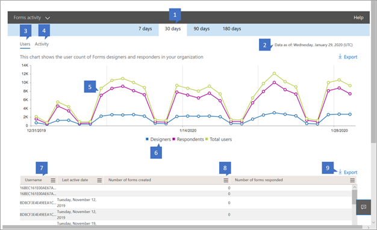

# Report di Microsoft 365 nell'interfaccia di amministrazione - Attività dei moduliMicrosoft 365 Reports in the admin center - Forms activity

Il **dashboard** report di Microsoft 365 mostra la panoramica delle attività tra i prodotti dell'organizzazione.The Microsoft 365 **Reports** dashboard shows you the activity overview across the products in your organization. Consente di eseguire il drill-down fino a visualizzare report a livello di singolo prodotto, per ottenere informazioni più dettagliate sulle attività in ogni prodotto.It enables you to drill in to individual product level reports to give you more granular insight about the activities within each product. Vedere l' [argomento introduttivo sui report](activity-reports.md).Check out [the Reports overview topic](activity-reports.md).
  
È ad esempio possibile comprendere l'attività di ogni utente con licenza per l'utilizzo di Microsoft Forms esaminando l'interazione con i moduli.For example, you can understand the activity of every user licensed to use Microsoft Forms by looking at their interaction with forms. Consente inoltre di comprendere il livello di collaborazione in corso esaminando il numero di moduli creati e di moduli a cui l'utente ha risposto.It also helps you to understand the level of collaboration going on by looking at the number of forms created and forms the user responded to.
  
> [!NOTE]
> Per visualizzare i report, è necessario essere un amministratore globale, un lettore globale o un lettore di report in Microsoft 365 o un amministratore di Exchange, SharePoint, Teams Service, Teams Communications o Skype for Business.You must be a global administrator, global reader or reports reader in Microsoft 365 or an Exchange, SharePoint, Teams Service, Teams Communications, or Skype for Business administrator to see reports. 

## Come accedere al report Attività moduliHow to get to the Forms activity report

1. Nell'interfaccia di amministrazione passare alla pagina **Report** \> <a href="https://go.microsoft.com/fwlink/p/?linkid=2074756" target="_blank">Utilizzo</a>.In the admin center, go to the **Reports** \> <a href="https://go.microsoft.com/fwlink/p/?linkid=2074756" target="_blank">Usage</a> page.

    
2. **Nell'elenco a discesa Selezionare un report** selezionare Attività  \> **moduli.**From the **Select a report** drop-down, select **Forms** \> **activity**.

## Interpretare il report attività dei moduliInterpret the forms activity report

È possibile visualizzare l'attività dei moduli dell'utente esaminando i grafici **Attività** **e Utenti.**You can get a view into your user's forms activity by looking at the **Activity** and **Users** charts. 

|ElementoItem|DescrizioneDescription|
|:-----|:-----|
|1.1.    |Il **report Attività** moduli può essere visualizzato per le tendenze degli ultimi 7, 30, 90 o 180 giorni.The **Forms activity** report can be viewed for trends over the last 7 days, 30 days, 90 days, or 180 days. Tuttavia, se si seleziona un giorno specifico nel report, la tabella (7) mostrerà i dati per un massimo di 28 giorni dalla data corrente (non la data in cui è stato generato il report).However, if you select a particular day in the report, the table (7) will show data for up to 28 days from the current date (not the date the report was generated).    |
|2.2.    |I dati in ogni report in genere riguardano fino alle ultime 24-48 ore.The data in each report usually covers up to the last 24 to 48 hours.    |
|3.3.    |La **visualizzazione** Utenti consente di comprendere la tendenza nel numero di utenti dei moduli attivi.The **Users** view helps you to understand the trend in the number of active forms users. Un utente viene considerato attivo se ha eseguito un'attività attorno a un modulo (creazione, modifica, visualizzazione e così via) o se ha risposto a un modulo entro un periodo di tempo specifico.A user is considered active if he or she has executed an activity around a form (create, edit, view, etc.) or responded to a form within the specific time period.    |
|4.4.    |La **visualizzazione** Attività consente di comprendere la tendenza del numero di utenti attivi.The **Activity** view helps you to understand the trend in the number of active users. Un utente viene considerato attivo se ha eseguito un'attività sui file, ad esempio salvataggio, sincronizzazione, modifica o condivisione, o ha visitato una pagina in un intervallo di tempo specificato.A user is considered active if he or she has executed a file activity (save, sync, modify, or share) or visited a page within the specific time period.  NOTA: un'attività può verificarsi più volte per una singola maschera, ma verrà conteggiato come un unico modulo attivo.NOTE: An activity can occur multiple times for a single form, but will count only as one active form. È ad esempio possibile creare una maschera e continuare a modificare lo stesso modulo più volte in un periodo di tempo specificato, ma verrà conteggiato come un unico modulo.For example, you can create a form and continue to edit the same form multiple times over a specified time period, but it will count only as one single form. Tuttavia, se un utente ha inviato più risposte per lo stesso modulo, ogni risposta sarebbe comunque una risposta singola e pertanto verrà conteggiata più volte.However if a user submitted multiple responses for the same form, each response would still be an individual response and thus be counted multiple times.   |
|5.5. |Nel grafico **Utenti** l'asse Y è il numero di utenti univoci.On the **Users** chart, the Y axis is the number of unique users. L'asse X è la data in cui sono attivi gli utenti univoci.X axis is the date that the unique users are active on. Le legende sono:The legends are:  **I progettisti** significano che l'utente ha creato o modificato un modulo.**Designers** means the user has created or edited a form. **I risponditori** significano che l'utente ha inviato risposte a un modulo.**Responders** means that the user has submitted response(s) to a form.  **Utenti totali** indica chiunque nell'azienda sia stato progettista o risponditore.**Total users** means anyone in the company who has been a designer or responder.   Nel grafico **Attività** l'asse Y è il numero di forme o risposte univoche.On the **Activity** chart, the Y axis is the count of unique forms or responses. L'asse X è la data in cui si è verificata l'attività del modulo o della risposta.X axis is the date that the form or response activity occurred. Le legende sono:The legends are:  **I moduli** creati sono il conteggio dei moduli univoci creati dagli utenti.**Forms created** is the count of unique forms that the users have created.  **Risposte firmate il** numero di risposte con accesso ricevute dagli utenti dell'organizzazione.**Signed in responses** the count of signed in responses the users in the organization have received.  **Risposte anonime** è il numero di risposte anonime ricevute dagli utenti dell'organizzazione.**Anonymous responses** is the count of anonymous responses the users in the organization have received.  |
|6.6. |È possibile filtrare la serie visualizzata nel grafico selezionando un elemento nella legenda.You can filter the series you see on the chart by selecting an item in the legend. Nel grafico Utenti, ad esempio, selezionare progettisti, risponditori o utenti totali per visualizzare solo le informazioni correlate a ognuno di essi.For example, on the Users chart, select designers, responders, or total users to see only the info related to each one. La modifica di questa selezione non modifica le informazioni nella tabella della griglia sottostante.Changing this selection doesn't change the info in the grid table below it.|
|7.7. |La tabella mostra un'analisi delle attività a livello di singolo utente.The table shows you a breakdown of the activities at the per-user level. Le legende sono:The legends are:  **Il** nome utente è l'indirizzo di posta elettronica dell'utente che ha eseguito l'attività in Microsoft Forms.**Username** is the email address of the user who performed the activity on Microsoft Forms. **Data ultima attività (UTC)** è la data più recente in cui un'attività del modulo è stata eseguita dall'utente per l'intervallo di date selezionato.**Last activity date (UTC)** is the latest date a form activity was performed by the user for the selected date range. Per visualizzare l'attività relativa a una data specifica, selezionare la data direttamente nel grafico.To see activity that occurred on a specific date, select the date directly in the chart.  In questo modo la tabella verrà filtrata in modo da visualizzare i dati sulle attività dei file solo per gli utenti che hanno eseguito l'attività in tale giorno specifico.This will filter the table to display file activity data only for users who performed the activity on that specific day.  **Il numero di moduli creati** è il numero di moduli creati dall'utente.**Number of forms created** is the number of forms that the user created.  **Il numero di moduli a cui ha** risposto è il numero di moduli a cui l'utente ha inviato risposte.**Number of forms responded** is the number of forms that the user has submitted responses to.|
|8.8. |Selezionare **l'icona Gestisci** colonne per aggiungere o rimuovere colonne dal report.Select the **Manage columns** icon to add or remove columns from the report.|
|9.9. |È inoltre possibile esportare i dati del report in un file CSV di Excel selezionando il **collegamento Esporta.**You can also export the report data into an Excel .csv file by selecting the **Export** link. In questo modo vengono esportati i dati per tutti gli utenti e è possibile eseguire semplici operazioni di aggregazione, ordinamento e filtro per un'ulteriore analisi.This exports data for all users and enables you to do simple aggregation, sorting and filtering for further analysis. Se sono presenti meno di 100 utenti, è possibile ordinare e filtrare all'interno della tabella del report stesso.If you have fewer than 100 users, you can sort and filter within the table in the report itself. Se sono presenti più di 100 utenti, per filtrare e ordinare, sarà necessario esportare i dati.If you have more than 100 users, in order to filter and sort, you will need to export the data.|