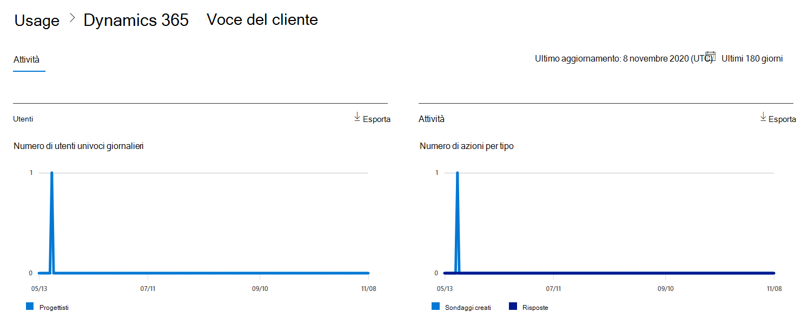
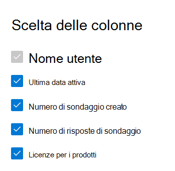

# Microsoft 365 Report nell'interfaccia di amministrazione - Attività di Dynamics 365 Customer Voice

Il dashboard Microsoft 365 **report mostra** la panoramica dell'attività tra i prodotti dell'organizzazione. Consente di eseguire il drill-down fino a visualizzare report a livello di singolo prodotto, per ottenere informazioni più dettagliate sulle attività in ogni prodotto. Vedere l' [argomento di panoramica sui report](activity-reports.md).
  
Ad esempio, è possibile comprendere l'attività di ogni utente con licenza per l'uso di Microsoft Dynamics 365 Customer Voice esaminando le interazioni con Dynamics 365 Customer Voice. Consente inoltre di comprendere il livello di collaborazione in corso esaminando il numero di sondaggi Pro creati e Pro cui gli utenti hanno risposto. 
  
> [!NOTE]
> Per visualizzare i report, è necessario essere un amministratore globale, un lettore globale o un lettore di report in Microsoft 365 o un amministratore di Exchange, SharePoint, Teams Service, Teams Communications o Skype for Business.  
 
## Come accedere al report attività Di Dynamics 365 Customer Voice

1. Nell'interfaccia di amministrazione passare alla pagina **Report** \> <a href="https://go.microsoft.com/fwlink/p/?linkid=2074756" target="_blank">Utilizzo</a>. 
2. Nella home page del dashboard fai clic sul **pulsante** Visualizza altro nella scheda Voce cliente dynamics 365.
  
## Interpretare il report attività di Dynamics 365 Customer Voice

È possibile visualizzare le attività nel report Voce cliente dynamics 365 scegliendo la **scheda** Attività. 

Selezionare **Scegli colonne** per aggiungere o rimuovere colonne dal report.    

È inoltre possibile esportare i dati del report in Excel .csv file selezionando il **collegamento Esporta.** Vengono esportati i dati di tutti gli utenti, che possono poi essere ordinati e filtrati per ulteriore analisi. Se gli utenti sono meno di 2000, è possibile ordinarli e filtrarli direttamente nella tabella del report. Se invece gli utenti sono più di 2000, per ordinarli e filtrarli occorre esportare i dati. 
  
|Elemento|Descrizione|
|:-----|:-----|
|**Metrica**|**Definizione**|
|Username    |Indirizzo di posta elettronica dell'utente che ha eseguito l'attività in Microsoft Forms.    |
|Data ultima attività (UTC)    |Data più recente in cui l'utente ha eseguito un'attività del modulo per l'intervallo di date selezionato. Per visualizzare l'attività relativa a una data specifica, selezionare la data direttamente nel grafico. In questo modo la tabella verrà filtrata per visualizzare i dati relativi all'attività dei file solo per gli utenti che hanno eseguito l'attività in quel giorno specifico.    |
|Numero di sondaggi creati    |Numero di sondaggi creati dall'utente.     |
|Numero di risposte al sondaggio    |Numero di risposte dei risponditori a cui è stato distribuito il sondaggio.|
|||