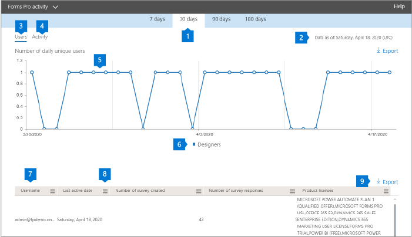

# Rapporti Microsoft 365 nell'interfaccia di amministrazione-attività di moduli ProMicrosoft 365 Reports in the admin center - Forms Pro activity

Il Dashboard Microsoft 365 **Reports** illustra la panoramica delle attività tra i prodotti dell'organizzazione.The Microsoft 365 **Reports** dashboard shows you the activity overview across the products in your organization. Consente di eseguire il drill-down fino a visualizzare report a livello di singolo prodotto, per ottenere informazioni più dettagliate sulle attività in ogni prodotto.It enables you to drill in to individual product level reports to give you more granular insight about the activities within each product. Vedere l' [argomento introduttivo sui report](activity-reports.md).Check out [the Reports overview topic](activity-reports.md).
  
Ad esempio, è possibile comprendere l'attività di ogni utente concesso in licenza per l'utilizzo di Microsoft Forms Pro analizzando le interazioni con i moduli Pro.For example, you can understand the activity of every user licensed to use Microsoft Forms Pro by looking at their interactions with Forms Pro. Consente inoltre di comprendere il livello di collaborazione che si sta verificando analizzando il numero di sondaggi Pro creati e le indagini Pro a cui gli utenti hanno risposto.It also helps you to understand the level of collaboration going on by looking at the number of Pro Surveys created and Pro Surveys to which the users responded to. 
  
> [!NOTE]
> È necessario essere un amministratore globale, un lettore globale o un lettore di report in Microsoft 365 o un amministratore di Exchange, SharePoint, teams, Communications o Skype for business per visualizzare i report.You must be a global administrator, global reader or reports reader in Microsoft 365 or an Exchange, SharePoint, Teams Service, Teams Communications, or Skype for Business administrator to see reports. 

## Come accedere al report attività moduli ProHow to get to the Forms Pro activity report

1. Nell'interfaccia di amministrazione passare alla pagina **Report** \> <a href="https://go.microsoft.com/fwlink/p/?linkid=2074756" target="_blank">Utilizzo</a>.In the admin center, go to the **Reports** \> <a href="https://go.microsoft.com/fwlink/p/?linkid=2074756" target="_blank">Usage</a> page.

    
2. Nell'elenco **a discesa selezionare un report** selezionare attività **moduli Pro** \> **activity**.From the **Select a report** drop-down, select **Forms Pro** \> **activity**.

## Interpretare il report attività moduliInterpret the forms activity report

È possibile ottenere una visualizzazione nell'attività Forms Pro dell'utente esaminando i grafici **attività** e **utenti** .You can get a view into your user's Forms Pro activity by looking at the **Activity** and **Users** charts. 

|ElementoItem|DescrizioneDescription|
|:-----|:-----|
|1.1.    |Il report attività **moduli Pro** può essere visualizzato per le tendenze degli ultimi 7, 30, 90 giorni o 180 giorni.The **Forms Pro** activity report can be viewed for trends over the last 7 days, 30 days, 90 days, or 180 days. Tuttavia, se si seleziona un giorno specifico nel report, la tabella (7) visualizzerà i dati per un massimo di 28 giorni dalla data corrente (non la data in cui è stato generato il report).However, if you select a particular day in the report, the table (7) will show data for up to 28 days from the current date (not the date the report was generated).     |
|2.2.    |I dati di ogni report sono in genere recenti come le ultime 48 ore.The data in each report is usually as recent as the last 48 hours.    |
|3.3.    |La visualizzazione **utenti** consente di conoscere la tendenza nel numero di utenti di moduli attivi Pro.The **Users** view helps you to understand the trend in the number of active Forms Pro users. Un utente viene considerato attivo se ha eseguito un'attività attorno a un sondaggio Pro (creare, modificare, visualizzare e così via) entro il periodo di tempo specifico.A user is considered active if they have executed an activity around a Pro Survey (create, edit, view, etc.) within the specific time period.    |
|4.4.    |La visualizzazione **attività** consente di comprendere la tendenza nel numero di utenti attivi.The **Activity** view helps you to understand the trend in the number of active users. Un utente viene considerato attivo se ha eseguito un'attività sui file, ad esempio salvataggio, sincronizzazione, modifica o condivisione, o ha visitato una pagina in un intervallo di tempo specificato.A user is considered active if he or she has executed a file activity (save, sync, modify, or share) or visited a page within the specific time period.  Nota: un'attività può verificarsi più volte per un singolo sondaggio, ma conterà solo come un sondaggio attivo.NOTE: An activity can occur multiple times for a single survey, but will count only as one active Survey. Ad esempio, è possibile creare un sondaggio Pro e continuare a modificare lo stesso sondaggio più volte nel corso di un periodo di tempo specificato, conterà solo come un singolo sondaggio.For example, you can create a Pro Survey and continue to edit the same Survey multiple times over a specified time period, it will count only as one single Survey.  |
|5.5. |Nel grafico **utenti** l'asse Y rappresenta il numero di utenti univoci.On the **Users** chart, the Y axis is the number of unique users. Asse X è la data in cui gli utenti univoci sono attivi.X axis is the date that the unique users are active on. Le legende sono:The legends are:  I **progettisti** significa che l'utente ha creato o modificato un sondaggio moduli Pro.**Designers** means the user has created or edited a Forms Pro Survey.  Nel grafico **attività** , l'asse Y è il numero di risposte Pro dei moduli per sondaggio.On the **Activity** chart, the Y axis is the count of Forms Pro responses per survey. Asse X è la data in cui si è verificata l'attività di rilevamento o di risposta.X axis is the date that the Survey or Response activity occurred. Le legende sono:The legends are:  I **sondaggi creati** sono il numero di sondaggi specifici per i moduli Pro creati dagli utenti**Surveys created** is the count of unique Forms Pro surveys that the users have created **Responses** è il numero di risposte anonime o non anonime che gli utenti che hanno ricevuto il sondaggio sono stati inviati.**Responses** is the count of anonymous or non-anonymous responses that the users who received the survey have submitted. |
|6.6. |È possibile filtrare la serie visualizzata nel grafico selezionando un elemento nella legenda.You can filter the series you see on the chart by selecting an item in the legend. Ad esempio, nel grafico utenti, selezionare progettisti, risponditori o utenti totali per visualizzare solo le informazioni relative a ognuna di esse.For example, on the Users chart, select designers, responders, or total users to see only the info related to each one. La modifica di questa selezione non modifica le informazioni nella tabella della griglia sottostante.Changing this selection doesn't change the info in the grid table below it.|
|7.7. |Nella tabella viene illustrata una ripartizione delle attività a livello di utente. Le legende sono:The table shows you a breakdown of the activities at the per-user level.The legends are:  **Username** è l'indirizzo di posta elettronica dell'utente che ha eseguito l'attività in Microsoft Forms.**Username** is the email address of the user who performed the activity on Microsoft Forms. **Data ultima attività (UTC)** è la data più recente in cui l'utente ha eseguito un'attività del modulo per l'intervallo di date selezionato.**Last activity date (UTC)** is the latest date a form activity was performed by the user for the selected date range. Per visualizzare l'attività relativa a una data specifica, selezionare la data direttamente nel grafico.To see activity that occurred on a specific date, select the date directly in the chart. In questo modo la tabella verrà filtrata per visualizzare i dati relativi alle attività dei file solo per gli utenti che hanno eseguito l'attività in quel giorno specifico.This will filter the table to display file activity data only for users who performed the activity on that specific day.  **Numero di sondaggi creati** è il numero di sondaggi creati dall'utente.**Number of surveys created** is the number of surveys that the user created.  Il **numero di risposte di sondaggio** è il numero di risposte provenienti da risponditori a cui è stato distribuito il sondaggio.**Number of survey responses** is the number of responses from responders to whom the survey was distributed to.|
|8.8. |Selezionare l'icona **Gestisci colonne** per aggiungere o rimuovere colonne dal report.Select the **Manage columns** icon to add or remove columns from the report.|
|9.9. |È inoltre possibile esportare i dati del report in un file CSV di Excel selezionando il collegamento **Esporta** .You can also export the report data into an Excel .csv file by selecting the **Export** link. In questo modo vengono esportati i dati per tutti gli utenti e è possibile eseguire un'aggregazione semplice, l'ordinamento e il filtraggio per un'ulteriore analisi.This exports data for all users and enables you to do simple aggregation, sorting and filtering for further analysis. Se sono presenti meno di 100 utenti, è possibile ordinarli e filtrarli all'interno della tabella del report stesso.If you have less than 100 users, you can sort and filter within the table in the report itself. Se si dispone di più di 100 utenti, per filtrare e ordinare i dati dovranno essere esportati.If you have more than 100 users, in order to filter and sort, you will need to export the data.|