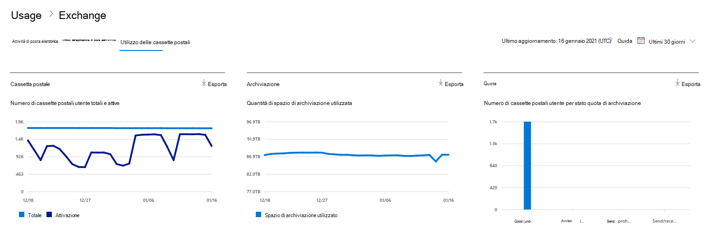
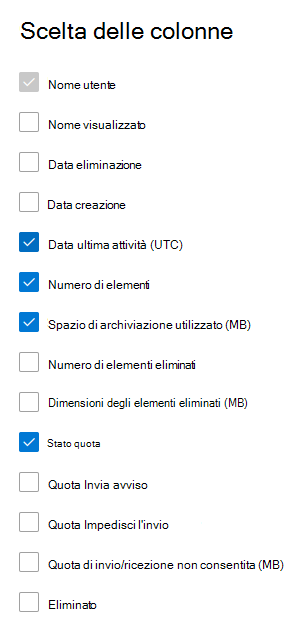

# Report di Microsoft 365 nell'interfaccia di amministrazione - Utilizzo delle cassette postaliMicrosoft 365 Reports in the admin center - Mailbox usage

Il **rapporto** sull'utilizzo delle cassette postali fornisce informazioni sugli utenti con una cassetta postale utente e sul livello di attività di ognuno in base all'invio, alla lettura, alla creazione di un appuntamento, all'invio di una riunione, all'accettazione di una riunione, al rifiuto della riunione e all'annullamento dell'attività di riunione.The **Mailbox usage report** provides information about users with a user mailbox and the level of activity by each based on the email send, read, create appointment, send meeting, accept meeting, decline meeting and cancel meeting activity. Fornisce anche informazioni sullo spazio di archiviazione usato da ogni cassetta postale utente e sul numero di cassette postali che hanno quasi raggiunto le quote di archiviazione.It also provides information about how much storage has been consumed by each user mailbox, and how many of them are approaching storage quotas. 
  
> [!NOTE]
> Per visualizzare i report, è necessario essere un amministratore globale, un lettore globale o un lettore di report in Microsoft 365 o un amministratore di Exchange, SharePoint, Teams Service, Teams Communications o Skype for Business.You must be a global administrator, global reader or reports reader in Microsoft 365 or an Exchange, SharePoint, Teams Service, Teams Communications, or Skype for Business administrator to see reports. 
 
## Come accedere al report sull'utilizzo delle cassette postaliHow to get to the mailbox usage report

1. Nell'interfaccia di amministrazione passare alla pagina **Report** \> <a href="https://go.microsoft.com/fwlink/p/?linkid=2074756" target="_blank">Utilizzo</a>.In the admin center, go to the **Reports** \> <a href="https://go.microsoft.com/fwlink/p/?linkid=2074756" target="_blank">Usage</a> page.
2. Selezionare **Visualizza altro in** Attività di posta **elettronica.**Select **View More** under **Email activity**. 
3. **Nell'elenco a discesa Attività di** posta elettronica selezionare Utilizzo cassetta postale di **Exchange.** \> From the **Email activity** drop-down list, select **Exchange** \> **Mailbox usage**.

## Interpretare il report sull'utilizzo delle cassette postaliInterpret the mailbox usage report

È possibile ottenere una panoramica sull' **utilizzo delle cassette postali** dell'organizzazione esaminando i grafici **Cassetta postale**, **Spazio di archiviazione** e **Quota**.You can get a view into your organization's **Mailbox usage** by looking at the **Mailbox**, **Storage** and **Quota** charts. 
  

|ElementoItem|DescrizioneDescription|
|:-----|:-----|
|1.1.    |Il report **Utilizzo delle cassette postali** può essere visualizzato per le tendenze degli ultimi 7, 30, 90 o 180 giorni.The **Mailbox usage** report can be viewed for trends over the last 7 days, 30 days, 90 days, or 180 days. Tuttavia, se si seleziona un giorno specifico nel report, la tabella mostrerà i dati per un massimo di 28 giorni dalla data corrente (non la data in cui è stato generato il report).However, if you select a particular day in the report, the table will show data for up to 28 days from the current date (not the date the report was generated).    |
|2.2.    |I dati in ogni report in genere riguardano fino alle ultime 24-48 ore.The data in each report usually covers up to the last 24 to 48 hours.    |
|3.3.    |Il grafico Cassetta postali mostra il numero totale di cassette postali utente nell'organizzazione e il numero totale di cassette attive in un determinato giorno del periodo oggetto del report.The Mailbox chart shows you the total number of user mailbox in your organization, and the total number that are active on any given day of the reporting period. Una cassetta postale utente viene considerata attiva se ha inviato, letto, creato un appuntamento, invia una riunione, accetta la riunione, rifiuta la riunione e annulla l'attività di riunione.A user mailbox is considered active if it had an email send, read, create appointment, send meeting, accept meeting, decline meeting and cancel meeting activity.    |
|4.4.    |Il grafico **Spazio di archiviazione** mostra la quantità di spazio di archiviazione usata nell'organizzazione.The **Storage** chart shows you amount of storage used in your organization. Il grafico di archiviazione non include le cassette postali di archiviazione.Storage Chart doesn't include archive mailboxes. Per ulteriori informazioni sull'espansione automatica dell'archiviazione, vedere [Panoramica dell'archiviazione illimitata in Microsoft 365.](https://docs.microsoft.com/microsoft-365/compliance/unlimited-archiving)For more information about auto-expanding archiving, see [Overview of unlimited archiving in Microsoft 365](https://docs.microsoft.com/microsoft-365/compliance/unlimited-archiving).  |
|5.5.    | Il grafico **Quota** mostra il numero di cassette postali utente in ogni categoria di quota. Sono disponibili quattro categorie di quota:  The **Quota** chart shows you the number of user mailboxes in each quota category. There are four quota categories:     Buona: numero di utenti il cui spazio di archiviazione è inferiore alla Quota per inviare avviso.Good - number of users whose storage used is below the issue warning quota.     Avviso: numero di utenti il cui spazio di archiviazione usato è pari o superiore alla Quota per inviare avviso, ma inferiore alla Quota per impedire invioWarning - number of users whose storage used is at or above issue warning, but below prohibit send quota     Non è possibile inviare: numero di utenti il cui spazio di archiviazione usato è pari o superiore alla Quota per impedire invio, ma inferiore alla Quota per impedire invio/ricezioneCan't send - number of users whose storage used is at or above the prohibit send quota, but below prohibit send/receive quota     Non è possibile inviare/ricevere: numero di utenti il cui spazio di archiviazione usato è pari o superiore alla Quota per impedire invio/ricezioneCan't send/receive - number of users whose storage used is at or above prohibit send/receive quota    |
|6.6.    | Nel grafico **Cassetta postale** l'asse Y è il numero di cassette postali utente.On the **Mailbox** chart, the Y axis is the count of user mailboxes.     Nel grafico **Spazio di archiviazione** l'asse Y è la quantità di spazio di archiviazione usata dalle cassette postali utente nell'organizzazione.On the **Storage** chart, the Y axis is the amount of storage being used by user mailboxes in your organization.     Nel grafico **Quota** l'asse Y è il numero di cassette postali utente in ogni quota di archiviazione.On the **Quota** chart, the Y axis is the number of user mailboxes in each storage quota.     L'asse X nei grafici Cassetta postale e Spazio di archiviazione rappresenta l'intervallo di date selezionato per il report specifico.The X axis on the Mailbox and Storage charts is the selected date range for this specific report.     L'asse X nei grafici Quota è la categoria di quota.The X axis on the Quota charts is the quota category.    |
|7.7.    |È possibile filtrare i grafici visualizzati selezionando un elemento nella legenda.You can filter charts you see by selecting an item in the legend.    |
|8.8.    | La tabella mostra un'analisi dell'utilizzo delle cassette postali a livello di utente. È possibile aggiungere altre colonne alla tabella.  The table shows you a breakdown of mailbox usage at the per-user level. You can add additional columns to the table.    **Nome utente** è l'indirizzo di posta elettronica dell'utente.**User name** is the email address of the user.    **Nome visualizzato** è il nome completo dell'utente.**Display Name** is the full name if the user.    **Eliminato** si riferisce alla cassetta postale il cui stato corrente è eliminato, ma che era attiva durante una parte del periodo oggetto del report.**Deleted** refers to the mailbox whose current state is deleted, but was active during some part of the reporting period of the report.    **Data eliminazione** indica la data di eliminazione della cassetta postale.**Deleted date** is the date the mailbox was deleted.    **Data di creazione** indica la data di creazione della cassetta postale.**Create date** is the date the mailbox was created.    **Data ultima attività** indica la data in cui è stata eseguita un'attività di invio o lettura di un messaggio di posta elettronica nella cassetta postale.**Last activity date** refers to the date the mailbox had an email send or read activity.    **Numero di elementi** indica il numero totale di elementi nella cassetta postale.**Item count** refers to the total number of items in the mailbox.    **Spazio di archiviazione usato (MB)** indica lo spazio di archiviazione totale usato.**Storage used (MB)** refers to the total storage used.    **Conteggio elementi eliminati** si riferisce al numero totale di elementi eliminati nella cassetta postale.**Deleted Item Count** refers to the total number of deleted items in the mailbox.   **Dimensione elementi eliminati (MB)** si riferisce alla dimensione totale di tutti gli elementi eliminati nella cassetta postale.**Deleted Item Size (MB)** refers to the total size of all deleted items in the mailbox.   **Quota per inviare avviso (MB)** indica il limite dello spazio di archiviazione raggiunto il quale il proprietario della cassetta postale riceve un avviso che lo avverte che sta per raggiungere la quota di archiviazione.**Issue warning quota (MB)** refers to the storage limit when the mailbox owner will receive a warning that it's about to hit the storage quota.    **Quota per impedire invio (MB)** indica il limite dello spazio di archiviazione raggiunto il quale la cassetta postale non può più inviare messaggi di posta elettronica.**Prohibit send quota (MB)** refers to the storage limit when the mailbox can no longer send emails.    **Quota per impedire invio/ricezione (MB)** indica il limite dello spazio di archiviazione raggiunto il quale la cassetta postale non può più inviare o ricevere messaggi di posta elettronica.**Prohibit send receive quota (MB)** refers to the storage limit when the mailbox can no longer send or receive emails.     Se i criteri dell'organizzazione impediscono la visualizzazione dei report in cui le informazioni degli utenti sono identificabili, è possibile modificare l'impostazione della privacy per tutti questi report.If your organization's policies prevents you from viewing reports where user information is identifiable, you can change the privacy setting for all these reports. Vedere la sezione **Nascondere i dettagli dell'utente nella** sezione dei report nei report attività nell'interfaccia di amministrazione di Microsoft [365.](activity-reports.md)Check out the **Hide user details in the reports** section in the [Activity Reports in the Microsoft 365 admin center](activity-reports.md).    |
|9.9.    |Selezionare **Scegli colonne** per aggiungere o rimuovere colonne dal report.Select **Choose columns** to add or remove columns from the report.    |
|10.10.    |È inoltre possibile esportare i dati del report in un file CSV di Excel selezionando il **collegamento Esporta.**You can also export the report data into an Excel .csv file, by selecting the **Export** link.    |
|||
   
