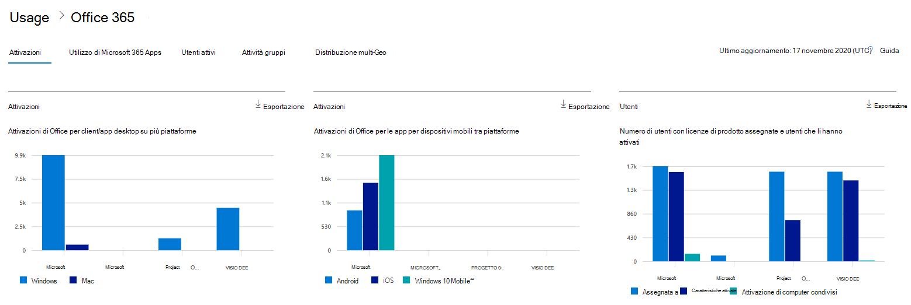
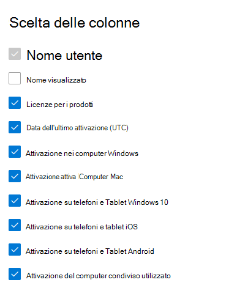

# Microsoft 365 Report nell'interfaccia di amministrazione - Microsoft Office attivazioni

Il dashboard Microsoft 365 **report mostra** la panoramica dell'attività tra i prodotti dell'organizzazione. Consente di eseguire il drill-down fino a visualizzare report a livello di singolo prodotto, per ottenere informazioni più dettagliate sulle attività in ogni prodotto. Vedere l' [argomento di panoramica sui report](activity-reports.md).
  
Il report Attivazioni di Office consente di visualizzare quali utenti hanno attivato la sottoscrizione di Office in almeno un dispositivo. Fornisce una suddivisione delle attivazioni Microsoft 365 Apps for enterprise, Project e Visio Pro per Office 365, nonché la suddivisione delle attivazioni tra desktop e dispositivi. Questo report può essere utile per identificare gli utenti che potrebbero richiedere ulteriore assistenza e supporto per attivare la sottoscrizione di Office.
  
> [!NOTE]
> Per visualizzare i report, è necessario essere un amministratore globale, un lettore globale o un lettore di report in Microsoft 365 o un amministratore di Exchange, SharePoint, Teams Service, Teams Communications o Skype for Business.  
  
## Come ottenere il report Attivazioni di Office

1. Nell'interfaccia di amministrazione passare alla pagina **Report** \> <a href="https://go.microsoft.com/fwlink/p/?linkid=2074756" target="_blank">Utilizzo</a>. 
2. Nella home page del dashboard fai clic sul **pulsante** Visualizza altro nella scheda Office attivazioni.
  
## Interpretare il report Attivazioni di Office
  
È possibile visualizzare le attivazioni nel report Office 365 selezionando la **scheda Attivazioni.** 

Selezionare **Scegli colonne** per aggiungere o rimuovere colonne dal report.    

È inoltre possibile esportare i dati del report in Excel .csv file selezionando il **collegamento Esporta.** Vengono esportati i dati di tutti gli utenti, che possono poi essere ordinati e filtrati per ulteriore analisi. Se gli utenti sono meno di 2000, è possibile ordinarli e filtrarli direttamente nella tabella del report. Se invece gli utenti sono più di 2000, per ordinarli e filtrarli occorre esportare i dati. 

|Elemento|Descrizione|
|:-----|:-----|
|**Metrica**|**Definizione**|
|Username    |Indirizzo di posta elettronica dell'utente.    |
|Nome visualizzato    |Nome completo dell'utente.    |
|Licenze di prodotto    |Prodotti assegnati a questo utente.    |
|Data ultima attivazione(UTC)    |Data in cui l'utente Office su un desktop o un dispositivo.    |
|Attivazione in Windows computer    |Il numero di Windows desktop attivati da un utente Office attivato.    |
|Attivazione nei computer Mac   |Numero di desktop Mac attivati da un Office attivato.|
|Attivazione su Windows 10 telefoni e tablet    |Il numero di Windows 10 mobili attivati da un utente Office attivato.    |
|Attivazione su telefoni e tablet iOS    |Numero di dispositivi iOS attivati da un utente Office attivato.|
|Attivazione su telefoni e tablet Android    |Il numero di dispositivi Android su cui un utente ha Office attivato.    |
|Attivazione di computer condivisi usati |Questo vale se l'utente ha usato Office tramite l'attivazione di computer condivisi.|
|||
   