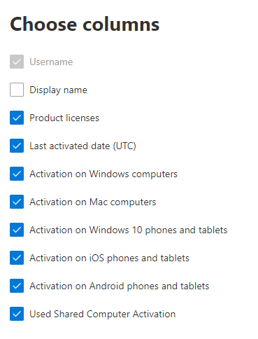

# Rapporti Microsoft 365 nell'interfaccia di amministrazione-attivazioni di Microsoft Office

Il Dashboard Microsoft 365 **Reports** illustra la panoramica delle attività tra i prodotti dell'organizzazione. Consente di eseguire il drill-down fino a visualizzare report a livello di singolo prodotto, per ottenere informazioni più dettagliate sulle attività in ogni prodotto. Vedere l' [argomento di panoramica sui report](activity-reports.md).
  
Il report Attivazioni di Office consente di visualizzare quali utenti hanno attivato la sottoscrizione di Office in almeno un dispositivo. Fornisce una ripartizione delle attivazioni delle sottoscrizioni di Microsoft 365 Apps for Enterprise, Project e Visio Pro per Office 365, nonché la ripartizione delle attivazioni tra desktop e dispositivi. Questo report può essere utile per identificare gli utenti che potrebbero richiedere ulteriore assistenza e supporto per attivare la sottoscrizione di Office.
  
> [!NOTE]
> È necessario essere un amministratore globale, un lettore globale o un lettore di report in Microsoft 365 o un amministratore di Exchange, SharePoint, teams, Communications o Skype for business per visualizzare i report.  
  
## Come ottenere il report Attivazioni di Office

1. Nell'interfaccia di amministrazione passare alla pagina **Report** \> <a href="https://go.microsoft.com/fwlink/p/?linkid=2074756" target="_blank">Utilizzo</a>. 
2. Nella Home page del dashboard, fare clic sul pulsante **Visualizza altro** sulla scheda attivazioni di Office.
  
## Interpretare il report Attivazioni di Office
  
È possibile visualizzare le attivazioni nel report di Office 365 scegliendo la scheda **attivazioni** . 

Selezionare **Scegli colonne** per aggiungere o rimuovere colonne dal report.    

È inoltre possibile esportare i dati del report in un file CSV di Excel selezionando il collegamento **Esporta** . Vengono esportati i dati di tutti gli utenti, che possono poi essere ordinati e filtrati per ulteriore analisi. Se gli utenti sono meno di 2000, è possibile ordinarli e filtrarli direttamente nella tabella del report. Se invece gli utenti sono più di 2000, per ordinarli e filtrarli occorre esportare i dati. 

|Elemento|Descrizione|
|:-----|:-----|
|**Metrica**|**Definizione**|
|Nome utente    |L'indirizzo di posta elettronica dell'utente.    |
|Nome visualizzato    |Nome completo dell'utente.    |
|Licenze per i prodotti    |I prodotti assegnati a questo utente.    |
|Data dell'ultimo attivazione (UTC)    |Data in cui l'utente ha attivato Office su un desktop o su un dispositivo.    |
|Attivazione nei computer Windows    |Il numero di desktop di Windows a cui un utente ha attivato Office.    |
|Attivazione nei computer Mac   |Il numero di desktop Mac su cui l'utente ha attivato Office.|
|Attivazione su telefoni e Tablet Windows 10    |Il numero di dispositivi mobili Windows 10 in cui un utente ha attivato Office.    |
|Attivazione su telefoni e tablet iOS    |Il numero di dispositivi iOS su cui l'utente ha attivato Office.|
|Attivazione su telefoni e Tablet Android    |Il numero di dispositivi Android attivati da un utente.    |
|Attivazione del computer condiviso utilizzato |Questo è vero se l'utente ha utilizzato Office tramite l'attivazione di computer condivisi.|
|||
   