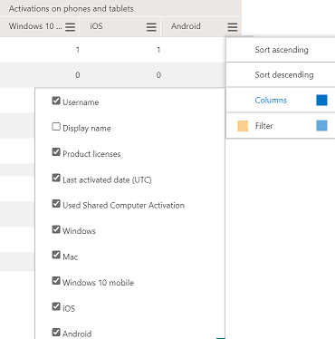

# Rapporti Microsoft 365 nell'interfaccia di amministrazione-attivazioni di Microsoft Office

Il Dashboard Microsoft 365 **Reports** illustra la panoramica delle attività tra i prodotti dell'organizzazione. Consente di eseguire il drill-down fino a visualizzare report a livello di singolo prodotto, per ottenere informazioni più dettagliate sulle attività in ogni prodotto. Vedere l' [argomento di panoramica sui report](activity-reports.md).
  
Il report Attivazioni di Office consente di visualizzare quali utenti hanno attivato la sottoscrizione di Office in almeno un dispositivo. Fornisce una ripartizione delle attivazioni delle sottoscrizioni di Microsoft 365 Apps for Enterprise, Project e Visio Pro per Office 365, nonché la ripartizione delle attivazioni tra desktop e dispositivi. Questo report può essere utile per identificare gli utenti che potrebbero richiedere ulteriore assistenza e supporto per attivare la sottoscrizione di Office.
  
> [!NOTE]
> È necessario essere un amministratore globale, un lettore globale o un lettore di report in Microsoft 365 o un amministratore di Exchange, SharePoint, teams, Communications o Skype for business per visualizzare i report.  
  
## Come ottenere il report Attivazioni di Office

1. Nell'interfaccia di amministrazione passare alla pagina **Report** \> <a href="https://go.microsoft.com/fwlink/p/?linkid=2074756" target="_blank">Utilizzo</a>.

    
2. Nell'elenco **a discesa selezionare un report** selezionare **Office 365** \> **attivazioni**. 
  
## Interpretare il report Attivazioni di Office

Per una panoramica sulle attivazioni di Office dell'organizzazione, vedere i grafici **Attivazioni** e **Utenti**. 
  

  
|Elemento|Descrizione|
|:-----|:-----|
|1    |Il report Attivazioni di Office presenta lo stato corrente dei dati delle attivazioni di licenze di Office [alla data del report presentato nell'angolo in alto a destra del grafico].    |
|2     |In genere, i dati di ogni report coprono fino alle ultime 24-48 ore.    |
|3     |Il grafico **Attivazioni** mostra il conteggio delle attivazioni di Office nei PC desktop e nei dispositivi.    |
|4     |Il grafico **Utenti** mostra il conteggio degli utenti abilitati e di quelli che hanno attivato l'abbonamento a Office nei PC desktop o nei dispositivi.    |
|5     | Nel grafico **Attivazioni** l'asse Y rappresenta il conteggio delle attivazioni di Office.     Nel grafico **Utenti** l'asse Y rappresenta l'utente che esegue l'attività di attivazione di Office.     L'asse X in entrambi i grafici rappresenta l'intervallo di date selezionato per il report specifico.    |
|6     |È possibile filtrare i grafici visualizzati selezionando un elemento nella legenda. Ad esempio, nel grafico **attivazioni** , selezionare **Windows OS**, **Mac OS**, **Windows 10 Mobile**, **iOS** o **Android** per visualizzare solo le informazioni relative a ognuna di esse. La modifica di questa selezione non modifica le informazioni nella tabella della griglia.       |
|7     | La tabella visualizza un'analisi delle attivazioni di Office a livello utente. Si tratta dell'elenco di tutti gli utenti a cui è assegnato il prodotto Office. È possibile aggiungere altre colonne alla tabella.      **Nome utente** è l'indirizzo di posta elettronica dell'utente.    **Nome visualizzato** è il nome completo se l'utente.    Le **licenze di prodotto** sono i prodotti assegnati a questo utente.    **Data ultima attivazione** fa riferimento alla data di attivazione di Office in un PC desktop o un dispositivo.    L' **attivazione del computer condiviso utilizzato** è vera se l'utente ha utilizzato Office tramite l'attivazione di computer condivisi.   **Windows** si riferisce al numero di desktop di Windows a cui l'utente ha attivato Office.    **Mac** si riferisce al numero di desktop Mac su cui l'utente ha attivato Office.    **Windows 10 Mobile** si riferisce al numero di dispositivi mobili Windows 10 a cui un utente ha attivato Office.    **iOS** si riferisce al numero di dispositivi iOS su cui l'utente ha attivato Office.    **Android** si riferisce al numero di dispositivi Android che un utente ha attivato Office.     Se i criteri dell'organizzazione impediscono la visualizzazione dei report in cui le informazioni degli utenti sono identificabili, è possibile modificare l'impostazione della privacy per tutti questi report. Consultare i **Dettagli dell'utente Hide nella sezione Reports** nei [rapporti attività nell'interfaccia di amministrazione di Microsoft 365](activity-reports.md).    |
|||
   

