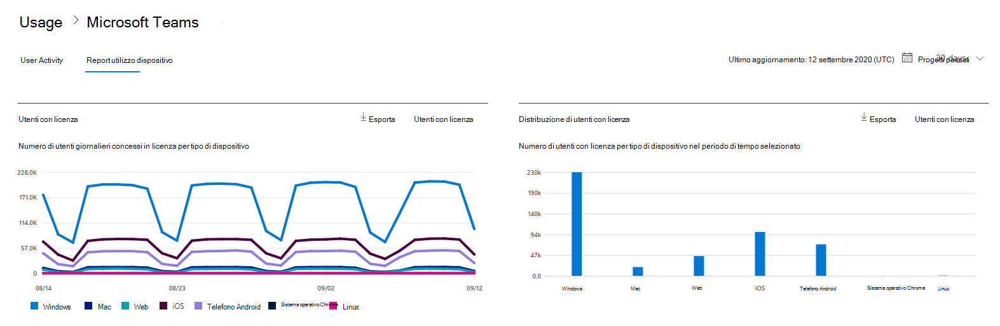
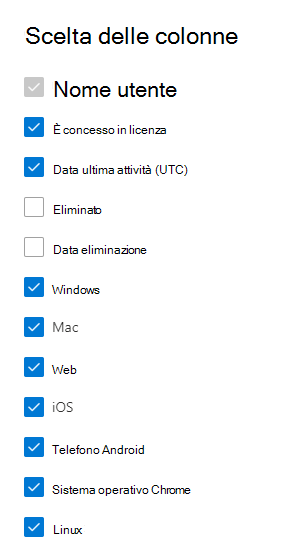

# Report di Microsoft 365 nell'interfaccia di amministrazione - Utilizzo dei dispositivi di Microsoft Teams

Il **dashboard** report di Microsoft 365 mostra la panoramica delle attività tra i prodotti dell'organizzazione. Consente di eseguire il drill-down fino a visualizzare report a livello di singolo prodotto, per ottenere informazioni più dettagliate sulle attività in ogni prodotto. Vedere l' [argomento introduttivo sui report](activity-reports.md). Nel report Utilizzo app Microsoft Teams è possibile ottenere informazioni approfondite sulle app di Microsoft Teams usate nell'organizzazione.
  
> [!NOTE]
> Per visualizzare i report, è necessario essere un amministratore globale, un lettore globale o un lettore di report in Microsoft 365 o un amministratore di Exchange, SharePoint, Teams Service, Teams Communications o Skype for Business.  
 
## Come accedere al report Utilizzo app Microsoft Teams

1. Nell'interfaccia di amministrazione passare alla pagina **Report** \> <a href="https://go.microsoft.com/fwlink/p/?linkid=2074756" target="_blank">Utilizzo</a>. 
2. Dalla home page del dashboard, fare clic sul pulsante Visualizza **altro** nella scheda attività di Microsoft Teams.
  
## Interpretare il report Utilizzo app Microsoft Teams

È possibile visualizzare l'uso del dispositivo nel report di Teams scegliendo la **scheda Uso del** dispositivo. 

Selezionare **Scegli colonne** per aggiungere o rimuovere colonne dal report.    

È inoltre possibile esportare i dati del report in un file CSV di Excel selezionando il **collegamento Esporta.** Vengono esportati i dati di tutti gli utenti, che possono poi essere ordinati e filtrati per ulteriore analisi. Se gli utenti sono meno di 2000, è possibile ordinarli e filtrarli direttamente nella tabella del report. Se invece gli utenti sono più di 2000, per ordinarli e filtrarli occorre esportare i dati. 

Il report **Utilizzo di dispositivi Microsoft Teams** può essere visualizzato per le tendenze degli ultimi 7, 30, 90 o 180 giorni. Tuttavia, se si seleziona un giorno specifico nel report, la tabella (7) mostrerà i dati per un massimo di 28 giorni dalla data corrente (non la data in cui è stato generato il report).
  
|Elemento|Descrizione|
|:-----|:-----|
|**Metrica**|**Definizione**|
|Nome utente    |Nome visualizzato dell'utente.    |
|Windows    |Selezionato se l'utente era attivo nel client desktop di Teams in un computer basato su Windows.    |
|Mac    |Selezionato se l'utente era attivo nel client desktop di Teams in un computer macOS.    |
|iOS    |Selezionato se l'utente era attivo nel client per dispositivi mobili di Teams per iOS.    |
|Telefono Android    | Selezionato se l'utente era attivo nel client per dispositivi mobili di Teams per Android.    |
|Sistema operativo Chrome    |Selezionato se l'utente era attivo nel client desktop di Teams in un computer ChromeOS.|
|Linux    | Selezionato se l'utente era attivo nel client desktop di Teams in un computer Linux.    |
|Web    |Selezionato se l'utente era attivo nel client Web di Teams nei dispositivi.|
|Data ultima attività (UTC)    |L'ultima data (UTC) in cui l'utente ha partecipato a un'attività di Teams.    |
|È concesso in licenza|Selezionato se l'utente ha la licenza per l'uso di Teams.|
|||