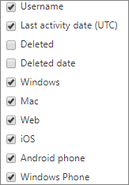

# Microsoft 365 Report nell'interfaccia di amministrazione - utilizzo Microsoft Teams dispositivo

Il dashboard Microsoft 365 **report mostra** la panoramica dell'attività tra i prodotti dell'organizzazione. Consente di eseguire il drill-down fino a visualizzare report a livello di singolo prodotto, per ottenere informazioni più dettagliate sulle attività in ogni prodotto. Vedere l' [argomento introduttivo sui report](activity-reports.md). Nel report Utilizzo app Microsoft Teams è possibile ottenere informazioni approfondite sulle app di Microsoft Teams usate nell'organizzazione.
  
> [!NOTE]
> Per visualizzare i report, è necessario essere un amministratore globale, un lettore globale o un lettore di report in Microsoft 365 o un amministratore di Exchange, SharePoint, Teams Service, Teams Communications o Skype for Business.  
 
## Come accedere al report Utilizzo app Microsoft Teams

1. Nell'interfaccia di amministrazione passare alla pagina **Report** \> <a href="https://go.microsoft.com/fwlink/p/?linkid=2074756" target="_blank">Utilizzo</a>.

    
2. **Nell'elenco a discesa Selezionare** un report selezionare Microsoft Teams  \> **dispositivo**.
  
## Interpretare il report Utilizzo app Microsoft Teams

Per avere un quadro d'insieme dell'utilizzo delle app di Microsoft Teams, è possibile esaminare i grafici **Utenti** e **Distribuzione**. 
  

  
|Elemento|Descrizione|
|:-----|:-----|
|1.    |Il report **Utilizzo di dispositivi Microsoft Teams** può essere visualizzato per le tendenze degli ultimi 7, 30, 90 o 180 giorni. Tuttavia, se si seleziona un giorno specifico nel report, la tabella (7) mostrerà i dati per un massimo di 28 giorni dalla data corrente (non la data di generazione del report).    |
|2.    |I dati in ogni report in genere coprono fino alle ultime 24-48 ore.    |
|3.    |La visualizzazione **Utenti** mostra il numero di utenti univoci giornalieri per app.    |
|4.    |La visualizzazione **Distribuzione** mostra il numero di utenti univoci per app nel periodo di tempo selezionato.    |
|5.    | Nel grafico **Utenti** l'asse Y rappresenta il numero di utenti per app.     Nel grafico **Distribuzione** l'asse Y rappresenta il numero di utenti che usano l'app specificata.     L'asse X nei grafici rappresenta l'intervallo di date selezionato per il report specifico.    |
|6.    |È possibile filtrare la serie visualizzata nel grafico selezionando un elemento nella legenda. Ad esempio,  nel grafico Utenti seleziona **Windows,** **Mac,** **Chiamate,** **Web,** telefono **Android** o telefono Windows per visualizzare solo le informazioni **relative a** ognuno di essi. La modifica di questa selezione non modifica le informazioni nella tabella della griglia.    |
|7.    | L'elenco dei gruppi visualizzati dipende dal set di tutti i gruppi che erano presenti (che non sono stati eliminati) nell'intervallo di tempo più ampio (180 giorni). Il numero di attività varia in base alla data selezionata.    NOTA: potresti non visualizzare tutte le voci dell'elenco seguente nelle colonne finché non le aggiungi.  **Nome utente** è l'indirizzo di posta elettronica dell'utente. È possibile visualizzare l'indirizzo di posta elettronica effettivo o rendere questo campo anonimo.    **Data ultima attività (UTC)** è la data più recente in cui l'utente ha partecipato a un'attività di Microsoft Teams in un'app.    **Eliminato** indica se il team è stato eliminato. Se il team viene eliminato, ma c'è stata attività nel periodo di generazione dei report, viene visualizzato nella griglia con questa voce impostata su true.    **Data eliminazione** indica la data di eliminazione del team.    **Windows** è selezionato se l'utente era attivo in un'app Windows durante il periodo di tempo specificato.    **Mac** è selezionato se l'utente era attivo in un'app Mac durante il periodo di tempo specificato.    **Web** è selezionato se l'utente era attivo in un'app Web durante il periodo di tempo specificato.    **iOS** è selezionato se l'utente era attivo in un'app per iOS durante il periodo di tempo specificato.    **Telefono Android** è selezionato se l'utente era attivo in un'app per Android durante il periodo di tempo specificato.    **Windows Phone** è selezionato se l'utente era attivo in un'app per Windows Phone durante il periodo di tempo specificato.     Se i criteri dell'organizzazione impediscono la visualizzazione dei report in cui le informazioni degli utenti sono identificabili, è possibile modificare l'impostazione della privacy per tutti questi report. Vedere la sezione **Come nascondere i dettagli a** livello di utente nei Report attività [nell'Microsoft 365 di amministrazione.](activity-reports.md)    |
|8.    |Selezionare **Colonne** per aggiungere o rimuovere colonne dal report.    |
|9.    |È inoltre possibile esportare i dati del report in Excel .csv file, selezionando il **collegamento Esporta.** Vengono esportati i dati di tutti gli utenti, che possono poi essere ordinati e filtrati per ulteriore analisi. Se gli utenti sono meno di 2000, è possibile ordinarli e filtrarli direttamente nella tabella del report. Se invece gli utenti sono più di 2000, per ordinarli e filtrarli occorre esportare i dati.    |
|||
   
  

