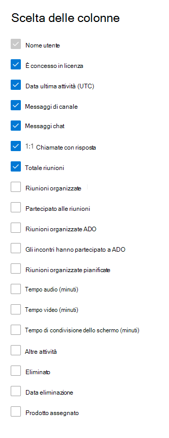

# Report di Microsoft 365 nell'interfaccia di amministrazione - Attività degli utenti di Microsoft TeamsMicrosoft 365 Reports in the admin center - Microsoft Teams user activity

Il **dashboard** report di Microsoft 365 mostra la panoramica delle attività tra i prodotti dell'organizzazione.The Microsoft 365 **Reports** dashboard shows you the activity overview across the products in your organization. Consente di eseguire il drill-down fino a visualizzare report a livello di singolo prodotto, per ottenere informazioni più dettagliate sulle attività in ogni prodotto.It enables you to drill in to individual product level reports to give you more granular insight about the activities within each product. Vedere l' [argomento introduttivo sui report](activity-reports.md).Check out [the Reports overview topic](activity-reports.md). Nel report Attività degli utenti di Microsoft Teams è possibile ottenere informazioni approfondite sull'attività di Microsoft Teams nell'organizzazione.In the Microsoft Teams user activity report, you can gain insights into the Microsoft Teams activity in your organization.
  
> [!NOTE]
> Per visualizzare i report, è necessario essere un amministratore globale, un lettore globale o un lettore di report in Microsoft 365 o un amministratore di Exchange, SharePoint, Teams Service, Teams Communications o Skype for Business.You must be a global administrator, global reader or reports reader in Microsoft 365 or an Exchange, SharePoint, Teams Service, Teams Communications, or Skype for Business administrator to see reports.  
 
## Come accedere al report Attività degli utenti di Microsoft TeamsHow to get to the Microsoft Teams user activity report

1. Nell'interfaccia di amministrazione passare alla pagina **Report** \> <a href="https://go.microsoft.com/fwlink/p/?linkid=2074756" target="_blank">Utilizzo</a>.In the admin center, go to the **Reports** \> <a href="https://go.microsoft.com/fwlink/p/?linkid=2074756" target="_blank">Usage</a> page.
2. Dalla home page del dashboard, fare clic sul pulsante Visualizza **altro** nella scheda attività di Microsoft Teams.From the dashboard homepage, click on the **View more** button on the Microsoft Teams activity card.

## Interpretare il report Attività degli utenti di Microsoft TeamsInterpret the Microsoft Teams user activity report

È possibile visualizzare l'attività degli utenti nel report di Teams scegliendo la **scheda Attività** utente.You can view the user activity in the Teams report by choosing the **User activity** tab.  

Selezionare **Scegli colonne** per aggiungere o rimuovere colonne dal report.Select **Choose columns** to add or remove columns from the report.    

È inoltre possibile esportare i dati del report in un file CSV di Excel selezionando il **collegamento Esporta.**You can also export the report data into an Excel .csv file by selecting the **Export** link. Vengono esportati i dati di tutti gli utenti, che possono poi essere ordinati e filtrati per ulteriore analisi.This exports data of all users and enables you to do simple sorting and filtering for further analysis. Se gli utenti sono meno di 2000, è possibile ordinarli e filtrarli direttamente nella tabella del report.If you have less than 2000 users, you can sort and filter within the table in the report itself. Se invece gli utenti sono più di 2000, per ordinarli e filtrarli occorre esportare i dati.If you have more than 2000 users, in order to filter and sort, you will need to export the data. Il formato esportato per **l'ora audio,** **l'ora video** e il tempo di condivisione **dello** schermo segue il formato di durata ISO8601.The exported format for **audio time**, **video time**, and **screen share time** follows ISO8601 duration format.

Per garantire la qualità dei dati, eserciteremo controlli di convalida dei dati giornalieri per gli ultimi tre giorni e colmando eventuali lacune rilevate.To ensure data quality, we perform daily data validation checks for the past three days and will be filling any gaps detected. Durante il processo potrebbero verificarsi differenze nei dati cronologici.You may notice differences in historical data during the process.

|ElementoItem|DescrizioneDescription|
|:-----|:-----|
|**Metrica****Metric**|**Definizione****Definition**|
|Nome utenteUser name    |Indirizzo di posta elettronica dell'utente.The email address of the user. È possibile visualizzare il nome effettivo o rendere questo campo anonimo.You can display the actual email address or make this field anonymous.     |
|Messaggi di canaleChannel messages     |Numero di messaggi univoci che l'utente ha pubblicato in una chat del team durante il periodo di tempo specificato.The number of unique messages that the user posted in a team chat during the specified time period.    |
|Messaggi di chatChat messages     |Numero di messaggi univoci che l'utente ha pubblicato in una chat privata durante il periodo di tempo specificato.The number of unique messages that the user posted in a private chat during the specified time period.    |
|Totale riunioniTotal meetings     |Numero di riunioni online a cui l'utente ha partecipato durante il periodo di tempo specificato.The number of online meetings that the user participated in during the specified time period.    |
|Chiamate 1:11:1 calls     | Numero di chiamate 1:1 a cui l'utente ha partecipato durante il periodo di tempo specificato.The number of 1:1 calls that the user participated in during the specified time period.    |
|Data ultima attività (UTC)Last activity date (UTC)    |L'ultima data in cui l'utente ha partecipato a un'attività di Microsoft Teams.The last date that the user participated in a Microsoft Teams activity.  |
|Riunioni adhocMeetings participated adhoc     | Numero di riunioni non pianificate nel calendario a cui l'utente ha partecipato durante il periodo di tempo specificato.The number of meetings not scheduled on the calendar that the user participated in during the specified time period.    |
|Riunioni organizzate adhocMeetings organized adhoc   |Numero di riunioni non pianificate nel calendario organizzato dall'utente durante il periodo di tempo specificato.The number of meetings not scheduled on the calendar that the user organized during the specified time period.  |
|Riunioni pianificateMeetings organized scheduled    |Numero di riunioni pianificate organizzate da un utente durante il periodo di tempo specificato.The number of scheduled meetings  a user organized during the specified time period.    |
|È concesso in licenzaIs licensed |Selezionato se l'utente ha la licenza per l'uso di Teams.Selected if the user is licensed to use Teams.|
|Altre attivitàOther activity|L'utente è attivo, ma ha eseguito altre attività rispetto ai tipi di azione esposti offerti nel rapporto (invio o risposta a messaggi di canale e messaggi di chat, pianificazione o partecipazione a chiamate e riunioni 1:1).The User is active but has performed other activities than exposed action types offered in the report (sending or replying to channel messages and chat messages, scheduling or participating in 1:1 calls and meetings). Esempi di azioni sono quando un utente modifica lo stato di Teams o il messaggio di stato di Teams o apre un post di messaggio del canale, ma non risponde.Examples actions are when a user changes the Teams status or the Teams status message or opens a Channel Message post but does not reply. |
|||