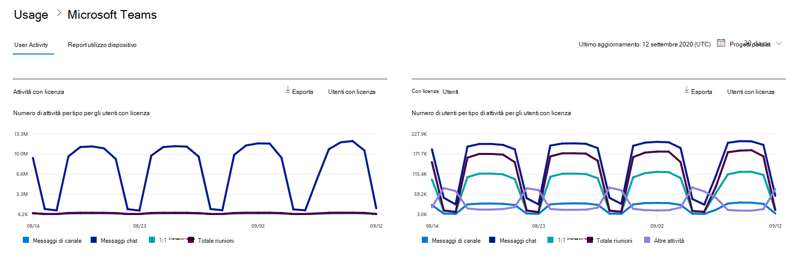
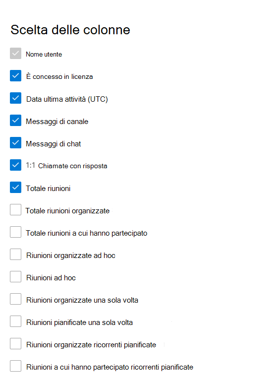

# Report di Microsoft 365 nell'interfaccia di amministrazione - Attività degli utenti di Microsoft Teams

Il **dashboard** dei report di Microsoft 365 mostra la panoramica delle attività tra i prodotti dell'organizzazione. Consente di eseguire il drill-down fino a visualizzare report a livello di singolo prodotto, per ottenere informazioni più dettagliate sulle attività in ogni prodotto. Vedere l' [argomento introduttivo sui report](activity-reports.md). Nel report Attività degli utenti di Microsoft Teams è possibile ottenere informazioni approfondite sull'attività di Microsoft Teams nell'organizzazione.
  
> [!NOTE]
> Per visualizzare i report, è necessario essere un amministratore globale, un lettore globale o un lettore di report in Microsoft 365 o un amministratore di Exchange, SharePoint, Teams Service, Teams Communications o Skype for Business.  
 
## Come accedere al report Attività degli utenti di Microsoft Teams

1. Nell'interfaccia di amministrazione passare alla pagina **Report** \> <a href="https://go.microsoft.com/fwlink/p/?linkid=2074756" target="_blank">Utilizzo</a>.
2. Nella home page del dashboard fai clic sul **pulsante Visualizza** altro nella scheda attività di Microsoft Teams.

## Interpretare il report Attività degli utenti di Microsoft Teams

È possibile visualizzare l'attività utente nel report Teams scegliendo la **scheda Attività** utente.  

Selezionare **Scegli colonne** per aggiungere o rimuovere colonne dal report.    

È inoltre possibile esportare i dati del report in un file CSV di Excel selezionando il **collegamento Esporta.** Vengono esportati i dati di tutti gli utenti, che possono poi essere ordinati e filtrati per ulteriore analisi. Se gli utenti sono meno di 2000, è possibile ordinarli e filtrarli direttamente nella tabella del report. Se invece gli utenti sono più di 2000, per ordinarli e filtrarli occorre esportare i dati. Il formato esportato per **l'ora audio,** **l'ora video** e il tempo di condivisione dello schermo **segue** il formato di durata ISO8601.

Il report **Attività degli utenti di Microsoft Teams** può essere visualizzato per le tendenze degli ultimi 7, 30, 90 o 180 giorni. Tuttavia, se si seleziona un giorno specifico nel report, la tabella (7) mostrerà i dati per un massimo di 28 giorni dalla data corrente (non la data di generazione del report).

Per garantire la qualità dei dati, eserciteremo controlli giornalieri di convalida dei dati negli ultimi tre giorni e colmando eventuali lacune rilevate. Durante il processo potrebbero verificarsi differenze nei dati cronologici.

|Elemento|Descrizione|
|:-----|:-----|
|**Metrica**|**Definizione**|
|Nome utente    |Indirizzo di posta elettronica dell'utente. È possibile visualizzare il nome effettivo o rendere questo campo anonimo.     |
|Messaggi di canale     |Numero di messaggi univoci che l'utente ha pubblicato in una chat del team durante il periodo di tempo specificato.    |
|Messaggi di chat     |Numero di messaggi univoci che l'utente ha pubblicato in una chat privata durante il periodo di tempo specificato.    |
|Totale riunioni     |Numero di riunioni online a cui l'utente ha partecipato durante il periodo di tempo specificato.    |
|Chiamate 1:1     | Numero di chiamate 1:1 a cui l'utente ha partecipato durante il periodo di tempo specificato.    |
|Data ultima attività (UTC)    |Data dell'ultima partecipazione dell'utente a un'attività di Microsoft Teams.  |
|Riunioni partecipate ad hoc     | Numero di riunioni ad hoc a cui un utente ha partecipato durante il periodo di tempo specificato.    |
|Riunioni organizzate ad hoc   |Numero di riunioni ad hoc organizzate da un utente durante il periodo di tempo specificato.  |
|Totale riunioni organizzate    |Somma delle riunioni programmate, ricorrenti, ad hoc e non classificate una sola volta organizzate da un utente durante il periodo di tempo specificato.    |
|Totale riunioni partecipate    |Somma delle riunioni programmate, ricorrenti, ad hoc e non classificate a cui un utente ha partecipato durante il periodo di tempo specificato.    |
|Riunioni organizzate una sola volta    |Numero di riunioni pianificate una sola volta organizzate da un utente durante il periodo di tempo specificato.    |
|Riunioni organizzate ricorrenti pianificate    |Numero di riunioni ricorrenti organizzate da un utente durante il periodo di tempo specificato.    |
|Riunioni partecipate una sola volta pianificate    |Numero di riunioni programmate una sola volta a cui un utente ha partecipato durante il periodo di tempo specificato.    |
|Riunioni partecipate ricorrenti pianificate    |Numero di riunioni ricorrenti a cui un utente ha partecipato durante il periodo di tempo specificato.    |
|È concesso in licenza    |Selezionato se l'utente ha la licenza per l'utilizzo di Teams.  |
|Altre attività   |L'utente è attivo, ma ha eseguito altre attività rispetto ai tipi di azione esposti offerti nel report (invio o risposta a messaggi di canale e messaggi di chat, pianificazione o partecipazione a chiamate e riunioni 1:1). Esempi di azioni sono quando un utente modifica lo stato di Teams o il messaggio di stato di Teams o apre un post di messaggio del canale ma non risponde.   |
|riunioni non classificate  |Quella che non può essere classificata come pianificazione o ricorrente o ad hoc. Si tratta di numeri brevi e per lo più non possono essere identificati a causa di informazioni di telemetria manomissionate. |
|||