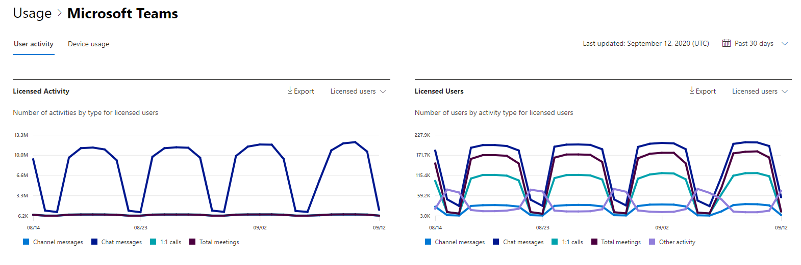

# Report di Microsoft 365 nell'interfaccia di amministrazione-attività utente di Microsoft TeamsMicrosoft 365 Reports in the admin center - Microsoft Teams user activity

Il Dashboard Microsoft 365 **Reports** illustra la panoramica delle attività tra i prodotti dell'organizzazione.The Microsoft 365 **Reports** dashboard shows you the activity overview across the products in your organization. Consente di eseguire il drill-down fino a visualizzare report a livello di singolo prodotto, per ottenere informazioni più dettagliate sulle attività in ogni prodotto.It enables you to drill in to individual product level reports to give you more granular insight about the activities within each product. Vedere l' [argomento introduttivo sui report](activity-reports.md).Check out [the Reports overview topic](activity-reports.md). Nel report Attività degli utenti di Microsoft Teams è possibile ottenere informazioni approfondite sull'attività di Microsoft Teams nell'organizzazione.In the Microsoft Teams user activity report, you can gain insights into the Microsoft Teams activity in your organization.
  
> [!NOTE]
> È necessario essere un amministratore globale, un lettore globale o un lettore di report in Microsoft 365 o un amministratore di Exchange, SharePoint, teams, Communications o Skype for business per visualizzare i report.You must be a global administrator, global reader or reports reader in Microsoft 365 or an Exchange, SharePoint, Teams Service, Teams Communications, or Skype for Business administrator to see reports.  
 
## Come accedere al report Attività degli utenti di Microsoft TeamsHow to get to the Microsoft Teams user activity report

1. Nell'interfaccia di amministrazione passare alla pagina **Report** \> <a href="https://go.microsoft.com/fwlink/p/?linkid=2074756" target="_blank">Utilizzo</a>.In the admin center, go to the **Reports** \> <a href="https://go.microsoft.com/fwlink/p/?linkid=2074756" target="_blank">Usage</a> page.
2. Nella Home page del dashboard, fare clic sul pulsante **Visualizza altro** sulla scheda attività Microsoft teams.From the dashboard homepage, click on the **View more** button on the Microsoft Teams activity card.

## Interpretare il report Attività degli utenti di Microsoft TeamsInterpret the Microsoft Teams user activity report

È possibile visualizzare l'attività utente nel rapporto teams scegliendo la scheda **attività utente** .You can view the user activity in the Teams report by choosing the **User activity** tab.  

Selezionare **Scegli colonne** per aggiungere o rimuovere colonne dal report.Select **Choose columns** to add or remove columns from the report.    

È inoltre possibile esportare i dati del report in un file CSV di Excel selezionando il collegamento **Esporta** .You can also export the report data into an Excel .csv file by selecting the **Export** link. Vengono esportati i dati di tutti gli utenti, che possono poi essere ordinati e filtrati per ulteriore analisi.This exports data of all users and enables you to do simple sorting and filtering for further analysis. Se gli utenti sono meno di 2000, è possibile ordinarli e filtrarli direttamente nella tabella del report.If you have less than 2000 users, you can sort and filter within the table in the report itself. Se invece gli utenti sono più di 2000, per ordinarli e filtrarli occorre esportare i dati.If you have more than 2000 users, in order to filter and sort, you will need to export the data. Il formato esportato per il tempo **audio**, **video** e tempo di **condivisione dello schermo** segue il formato di durata ISO8601.The exported format for **audio time**, **video time** and **screen share time** follows ISO8601 duration format.

|ElementoItem|DescrizioneDescription|
|:-----|:-----|
|**Metrica****Metric**|**Definizione****Definition**|
|Nome utenteUser name    |L'indirizzo di posta elettronica dell'utente.The email address of the user. È possibile visualizzare il nome effettivo o rendere questo campo anonimo.You can display the actual email address or make this field anonymous.     |
|Messaggi di canaleChannel messages     |Il numero di messaggi univoci inviati dall'utente in una chat del team durante il periodo di tempo specificato.The number of unique messages that the user posted in a team chat during the specified time period.    |
|Messaggi chatChat messages     |Il numero di messaggi univoci che l'utente ha inviato in una chat privata durante il periodo di tempo specificato.The number of unique messages that the user posted in a private chat during the specified time period.    |
|Totale riunioniTotal meetings     |Il numero di riunioni online a cui l'utente ha partecipato durante il periodo di tempo specificato.The number of online meetings that the user participated in during the specified time period.    |
|1:1 chiamate1:1 calls     | Il numero di chiamate 1:1 che l'utente ha partecipato durante il periodo di tempo specificato.The number of 1:1 calls that the user participated in during the specified time period.    |
|Data ultima attività (UTC)Last activity date (UTC)    |Ultima data in cui l'utente ha partecipato a un'attività di Microsoft teams.The last date that the user participated in a Microsoft Teams activity.  |
|Gli incontri hanno partecipato ad AdhocMeetings participated adhoc     | Il numero di riunioni non pianificate nel calendario in cui l'utente ha partecipato durante il periodo di tempo specificato.The number of meetings not scheduled on the calendar that the user participated in during the specified time period.    |
|Riunioni organizzate ad hocMeetings organized adhoc   |Il numero di riunioni non pianificate nel calendario che l'utente ha organizzato durante il periodo di tempo specificato.The number of meetings not scheduled on the calendar that the user organized during the specified time period.  |
|Riunioni organizzate pianificateMeetings organized scheduled    |Il numero di riunioni pianificate che un utente ha organizzato durante il periodo di tempo specificato.The number of scheduled meetings  a user organized during the specified time period.    |
|È concesso in licenzaIs licensed |Selezionato se l'utente è autorizzato a usare i team.Selected if the user is licensed to use Teams.|
|Altre attivitàOther activity|l'utente è considerato attivo ma ha un valore pari a zero per i messaggi di chat, 1:1 chiamate, i messaggi di canale, le riunioni totali e i valori metrici organizzati per le riunioni.the User is considered active but has a zero value for the Chat Messages, 1:1 calls, Channel Messages, Total Meetings, and Meetings organized metric values. Esempi di azioni si verificano quando un utente apre un messaggio di canale, ma non risponde o quando viene ricevuto un messaggio privato e viene letto ma non risposto.Examples actions are when a user opens a Channel Message post but does not reply or when a Private message is received and it is read but not responded to. |
|||