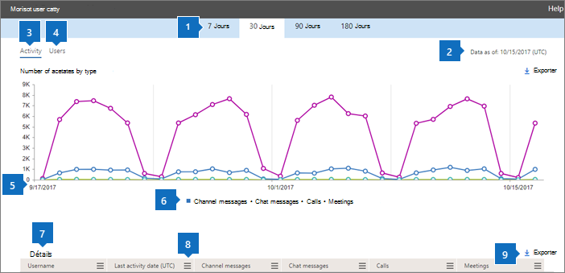

# Report di Microsoft 365 nell'interfaccia di amministrazione-attività utente di Microsoft TeamsMicrosoft 365 Reports in the admin center - Microsoft Teams user activity

Il Dashboard Microsoft 365 **Reports** illustra la panoramica delle attività tra i prodotti dell'organizzazione.The Microsoft 365 **Reports** dashboard shows you the activity overview across the products in your organization. Consente di eseguire il drill-down fino a visualizzare report a livello di singolo prodotto, per ottenere informazioni più dettagliate sulle attività in ogni prodotto.It enables you to drill in to individual product level reports to give you more granular insight about the activities within each product. Vedere l' [argomento introduttivo sui report](activity-reports.md).Check out [the Reports overview topic](activity-reports.md). Nel report Attività degli utenti di Microsoft Teams è possibile ottenere informazioni approfondite sull'attività di Microsoft Teams nell'organizzazione.In the Microsoft Teams user activity report, you can gain insights into the Microsoft Teams activity in your organization.
  
> [!NOTE]
> È necessario essere un amministratore globale, un lettore globale o un lettore di report in Microsoft 365 o un amministratore di Exchange, SharePoint, teams, Communications o Skype for business per visualizzare i report.You must be a global administrator, global reader or reports reader in Microsoft 365 or an Exchange, SharePoint, Teams Service, Teams Communications, or Skype for Business administrator to see reports.  
 
## Come accedere al report Attività degli utenti di Microsoft TeamsHow to get to the Microsoft Teams user activity report

1. Nell'interfaccia di amministrazione passare alla pagina **Report** \> <a href="https://go.microsoft.com/fwlink/p/?linkid=2074756" target="_blank">Utilizzo</a>.In the admin center, go to the **Reports** \> <a href="https://go.microsoft.com/fwlink/p/?linkid=2074756" target="_blank">Usage</a> page.

    
2. Nell'elenco **a discesa selezionare un report** selezionare attività utente di **Microsoft teams** \> **User activity**.From the **Select a report** drop-down, select **Microsoft Teams** \> **User activity**.
  
## Interpretare il report Attività degli utenti di Microsoft TeamsInterpret the Microsoft Teams user activity report

Per avere un quadro d'insieme delle attività degli utenti di Microsoft Teams, è possibile osservare i grafici **Attività** e **Utenti**.You can get a view into Microsoft Teams user activity by looking at the **Activity** and **Users** charts. 
  
|ElementoItem|DescrizioneDescription|
|:-----|:-----|
|1.1.    |Il report **Attività degli utenti di Microsoft Teams** può essere visualizzato per le tendenze degli ultimi 7, 30, 90 o 180 giorni.The **Microsoft Teams user activity** report can be viewed for trends over the last 7 days, 30 days, 90 days, or 180 days. Tuttavia, se si seleziona un giorno specifico nel report, la tabella (7) visualizzerà i dati per un massimo di 28 giorni dalla data corrente (non la data in cui è stato generato il report).However, if you select a particular day in the report, the table (7) will show data for up to 28 days from the current date (not the date the report was generated).    |
|2.2.    |In genere, i dati di ogni report coprono fino alle ultime 24-48 ore.The data in each report usually covers up to the last 24 to 48 hours.    |
|3.3.    |La visualizzazione **Attività** mostra il numero di attività di Microsoft Teams per tipo di attività. I tipi di attività sono numero di messaggi in chat dei team, messaggi in chat privati, chiamate o riunioni.  The **Activity** view shows you the number of Microsoft Teams activities by activity type. The activity types are number of teams chat messages, private chat messages, calls, or meetings.    |
|4.4.    |La visualizzazione **Utenti** mostra il numero di utenti per tipo di attività. I tipi di attività sono numero di messaggi in chat dei team, messaggi in chat privati, chiamate o riunioni.  The **Users** view shows you the number of users by activity type. The activity types are number of teams chat messages, private chat messages, calls, or meetings.    |
|5.5.    | Nel grafico **Attività** l'asse Y rappresenta il numero di occorrenze dell'attività specificata.On the **Activity** chart, the Y axis is the count of specified activity.     Nel grafico **File** l'asse Y rappresenta il numero di utenti che partecipano a chat in team, chat private, chiamate o riunioni.On the **Files** chart, the Y axis is the number of users participating in teams chats, private chats, calls, or meetings.     L'asse X nei grafici rappresenta l'intervallo di date selezionato per il report specifico.The X axis on the charts is the selected date range for the specific report.    |
|6.6.    |È possibile filtrare la serie visualizzata nel grafico selezionando un elemento nella legenda.You can filter the series you see on the chart by selecting an item in the legend. Ad esempio, nel grafico **attività** selezionare messaggi di **canale**, **messaggi di chat**, **chiamate**o **riunioni** per visualizzare solo le informazioni relative a ognuna di esse.For example, on the **Activity** chart, select **Channel messages**, **Chat messages**, **Calls**, or **Meetings** to see only the info related to each one. La modifica di questa selezione non modifica le informazioni nella tabella della griglia.Changing this selection doesn't change the info in the grid table.    |
|7.7.    | L'elenco dei gruppi visualizzati dipende dal set di tutti i gruppi che erano presenti (che non sono stati eliminati) nell'intervallo di tempo più ampio (180 giorni). Il numero di attività varia in base alla data selezionata.  The list of groups shown is determined by the set of all groups that existed (weren't deleted) across the widest (180-day) reporting time frame. The activity count will vary according to the date selection.    Nota: è possibile che non vengano visualizzati tutti gli elementi nell'elenco in basso nelle colonne finché non vengono aggiunti.NOTE: You might not see all the items in the list below in the columns until you add them. **Nome utente** è l'indirizzo di posta elettronica dell'utente.**Username** is the email address of the user. È possibile visualizzare l'indirizzo di posta elettronica effettivo o rendere questo campo anonimo.You can display the actual email address or make this field anonymous.    **Data ultima attività (UTC)** è la data più recente in cui l'utente ha partecipato a un'attività di Microsoft Teams.**Last Activity Date (UTC)** refers to the last date that the user participated in a Microsoft Teams activity.    **Messaggi del canale** è il numero di messaggi univoci che l'utente ha pubblicato in una chat del team nel periodo di tempo specificato.**Channel messages** is the number of unique messages that the user posted in a team chat during the specified time period.    **Messaggi in chat** è il numero di messaggi univoci che l'utente ha pubblicato in una chat privata nel periodo di tempo specificato.**Chat messages** is the number of unique messages that the user posted in a private chat during the specified time period.    **Chiamate** è il numero di chiamate a cui l'utente ha partecipato nel periodo di tempo specificato.**Calls** is the number of calls that the user participated in during the specified time period.    **Riunioni** è il numero di riunioni online a cui l'utente ha partecipato nel periodo di tempo specificato.**Meetings** is the number of online meetings that the user participated in during the specified time period.    **Altra attività** è il numero di altre attività del team a cui l'utente ha partecipato.**Other activity** is the number of other team activities by the user.    **Eliminato** indica se il team è stato eliminato. Se il team viene eliminato, ma c'è stata attività nel periodo di generazione dei report, viene visualizzato nella griglia con questa voce impostata su true.  **Deleted** indicates if the team is deleted. If the team is deleted, but had activity in the reporting period, it will show up in the grid with deleted set to true.    **Data eliminazione** indica la data di eliminazione del team.**Deleted date** is the date that the team was deleted.    **Prodotto assegnato** indica l'elenco dei prodotti assegnati all'utente.**Product assigned** is the list of products that are assigned to the user.     Se i criteri dell'organizzazione impediscono la visualizzazione dei report in cui le informazioni degli utenti sono identificabili, è possibile modificare l'impostazione della privacy per tutti questi report.If your organization's policies prevents you from viewing reports where user information is identifiable, you can change the privacy setting for all these reports. Vedere la sezione **come nascondere i dettagli a livello di utente** nei [rapporti attività nell'interfaccia di amministrazione di Microsoft 365](activity-reports.md).Check out the **How do I hide user level details?** section in the [Activity Reports in the Microsoft 365 admin center](activity-reports.md).    |
|8.8.    |Selezionare **colonne** per aggiungere o rimuovere colonne dal report.Select **Columns** to add or remove columns from the report.    |
|9.9.    |È inoltre possibile esportare i dati del report in un file CSV di Excel selezionando il collegamento **Esporta** .You can also export the report data into an Excel .csv file by selecting the **Export** link. Vengono esportati i dati di tutti gli utenti, che possono poi essere ordinati e filtrati per ulteriore analisi.This exports data of all users and enables you to do simple sorting and filtering for further analysis. Se gli utenti sono meno di 2000, è possibile ordinarli e filtrarli direttamente nella tabella del report.If you have less than 2000 users, you can sort and filter within the table in the report itself. Se invece gli utenti sono più di 2000, per ordinarli e filtrarli occorre esportare i dati.If you have more than 2000 users, in order to filter and sort, you will need to export the data.    |
|||
   

