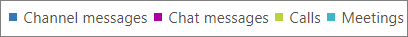

# Microsoft 365 dell'interfaccia di amministrazione - Microsoft Teams'attività degli utenti

Il dashboard Microsoft 365 **report mostra** la panoramica dell'attività tra i prodotti dell'organizzazione. Consente di eseguire il drill-down fino a visualizzare report a livello di singolo prodotto, per ottenere informazioni più dettagliate sulle attività in ogni prodotto. Vedere l' [argomento introduttivo sui report](activity-reports.md). Nel report Attività degli utenti di Microsoft Teams è possibile ottenere informazioni approfondite sull'attività di Microsoft Teams nell'organizzazione.
  
> [!NOTE]
> Per visualizzare i report, è necessario essere un amministratore globale, un lettore globale o un lettore di report in Microsoft 365 o un amministratore di Exchange, SharePoint, Teams Service, Teams Communications o Skype for Business.  
 
## Come accedere al report Attività degli utenti di Microsoft Teams

1. Nell'interfaccia di amministrazione passare alla pagina **Report** \> <a href="https://go.microsoft.com/fwlink/p/?linkid=2074756" target="_blank">Utilizzo</a>.

    
2. **Nell'elenco a discesa Selezionare** un report selezionare Microsoft Teams Attività  \> **utente.**
  
## Interpretare il report Attività degli utenti di Microsoft Teams

Per avere un quadro d'insieme delle attività degli utenti di Microsoft Teams, è possibile osservare i grafici **Attività** e **Utenti**. 
  
|Elemento|Descrizione|
|:-----|:-----|
|1.    |Il report **Attività degli utenti di Microsoft Teams** può essere visualizzato per le tendenze degli ultimi 7, 30, 90 o 180 giorni. Tuttavia, se si seleziona un giorno specifico nel report, la tabella (7) mostrerà i dati per un massimo di 28 giorni dalla data corrente (non la data di generazione del report).    |
|2.    |I dati in ogni report in genere coprono fino alle ultime 24-48 ore.    |
|3.    |Per garantire la qualità dei dati, eserciteremo controlli di convalida dei dati giornalieri per gli ultimi cinque giorni e colmando eventuali lacune rilevate. Durante il processo potrebbero verificarsi differenze nei dati cronologici.    |
|4.    |La visualizzazione **Attività** mostra il numero di attività di Microsoft Teams per tipo di attività. I tipi di attività sono numero di messaggi in chat dei team, messaggi in chat privati, chiamate o riunioni.    |
|5.    |La visualizzazione **Utenti** mostra il numero di utenti per tipo di attività. I tipi di attività sono numero di messaggi in chat dei team, messaggi in chat privati, chiamate o riunioni.    |
|6.    | Nel grafico **Attività,** l'asse Y è il conteggio dell'attività specificata.     Nel grafico **File,** l'asse Y è il numero di utenti che partecipano a chat di team, chat private, chiamate o riunioni.     L'asse X dei grafici è l'intervallo di date selezionato per il report specifico.    |
|7.    |È possibile filtrare la serie visualizzata nel grafico selezionando un elemento nella legenda. Ad esempio, nel grafico **Attività** seleziona Messaggi di **canale,** **Messaggi chat,** **Chiamate** o **Riunioni** per visualizzare solo le informazioni correlate a ognuno di essi. La modifica di questa selezione non modifica le informazioni nella tabella della griglia.    |
|8.    | L'elenco dei gruppi visualizzati dipende dal set di tutti i gruppi che erano presenti (che non sono stati eliminati) nell'intervallo di tempo più ampio (180 giorni). Il numero di attività varia in base alla data selezionata.    NOTA: potresti non visualizzare tutte le voci dell'elenco seguente nelle colonne finché non le aggiungi. **Nome utente** è l'indirizzo di posta elettronica dell'utente. È possibile visualizzare l'indirizzo di posta elettronica effettivo o rendere questo campo anonimo.    **Data ultima attività (UTC)** è la data più recente in cui l'utente ha partecipato a un'attività di Microsoft Teams.    **Messaggi del canale** è il numero di messaggi univoci che l'utente ha pubblicato in una chat del team nel periodo di tempo specificato.    **Messaggi in chat** è il numero di messaggi univoci che l'utente ha pubblicato in una chat privata nel periodo di tempo specificato.    **Chiamate** è il numero di chiamate a cui l'utente ha partecipato nel periodo di tempo specificato.    **Riunioni** è il numero di riunioni online a cui l'utente ha partecipato nel periodo di tempo specificato.    **Altra attività** è il numero di altre attività del team a cui l'utente ha partecipato.    **Eliminato** indica se il team è stato eliminato. Se il team viene eliminato, ma c'è stata attività nel periodo di generazione dei report, viene visualizzato nella griglia con questa voce impostata su true.    **Data eliminazione** indica la data di eliminazione del team.    **Prodotto assegnato** indica l'elenco dei prodotti assegnati all'utente.     Se i criteri dell'organizzazione impediscono la visualizzazione dei report in cui le informazioni degli utenti sono identificabili, è possibile modificare l'impostazione della privacy per tutti questi report. Vedere la sezione **Come nascondere i dettagli a** livello di utente nei Report attività [nell'Microsoft 365 di amministrazione.](activity-reports.md)    |
|9.    |Selezionare **Colonne** per aggiungere o rimuovere colonne dal report.    |
|10.    |È inoltre possibile esportare i dati del report in Excel .csv file selezionando il **collegamento Esporta.** Vengono esportati i dati di tutti gli utenti, che possono poi essere ordinati e filtrati per ulteriore analisi. Se gli utenti sono meno di 2000, è possibile ordinarli e filtrarli direttamente nella tabella del report. Se invece gli utenti sono più di 2000, per ordinarli e filtrarli occorre esportare i dati.    |
|||
   

