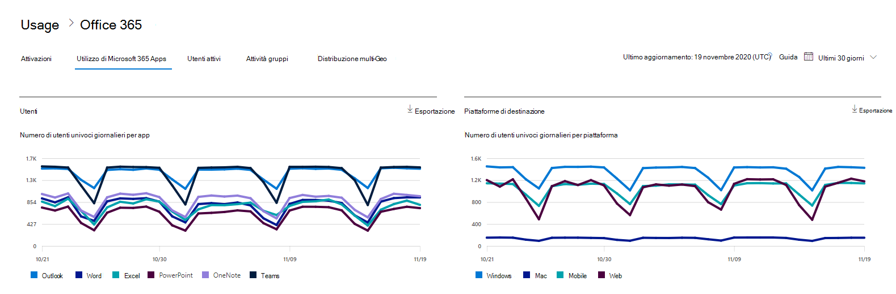

# Report di Microsoft 365 nell'interfaccia di amministrazione-utilizzo delle app di Microsoft 365

Il Dashboard Microsoft 365 **Reports** illustra la panoramica delle attività tra i prodotti dell'organizzazione. Consente di eseguire il drill-down fino a visualizzare report a livello di singolo prodotto, per ottenere informazioni più dettagliate sulle attività in ogni prodotto. Vedere l' [argomento introduttivo sui report](activity-reports.md).

 Ad esempio, è possibile comprendere l'attività di ogni utente concesso in licenza per l'utilizzo delle app di Microsoft 365 Apps esaminando le attività tra le app e il modo in cui vengono utilizzate tra le varie piattaforme.

 > [!NOTE]
 > È necessario essere un amministratore globale, un lettore globale o un lettore di report in Microsoft 365 o un amministratore di Exchange, SharePoint o Skype for business per visualizzare i report.

## Come ottenere il report di utilizzo di Microsoft 365 Apps

1. Nell'interfaccia di amministrazione passare alla pagina **Report** \> <a href="https://go.microsoft.com/fwlink/p/?linkid=2074756" target="_blank">Utilizzo</a>. 
2. Nella Home page del dashboard, fare clic sul pulsante **Visualizza altre informazioni** sulla scheda utenti attivi-Microsoft 365 Apps.

## Interpretare il report di utilizzo di Microsoft 365 Apps

È possibile ottenere una visualizzazione nell'attività delle app di Microsoft 365 dell'utente esaminando gli **utenti** e i grafici delle **piattaforme** .

|Elemento|Descrizione|
 |:-----|:-----|
 |1.   |Il report di **utilizzo di Microsoft 365 Apps** può essere visualizzato per le tendenze degli ultimi 7, 30, 90 o 180 giorni. Tuttavia, se si seleziona un giorno specifico nel report, la tabella (7) visualizzerà i dati per un massimo di 28 giorni dalla data corrente (non la data in cui è stato generato il report).   |
 |2.   |I dati di ogni report vengono in genere riferiti agli ultimi sette giorni.   |
 |3.   |La visualizzazione **utenti** Mostra la tendenza nel numero di utenti attivi per ogni app: Outlook, Word, Excel, PowerPoint, OneNote e teams. Gli utenti attivi sono tutti coloro che eseguono azioni intenzionali all'interno di queste app.   |
 |4.   |La visualizzazione **piattaforme** Mostra l'andamento degli utenti attivi in tutte le app per ogni piattaforma – Windows, Mac, Web e mobile.   |
 |5. |Nel grafico **utenti** l'asse Y rappresenta il numero di utenti attivi univoci per l'app corrispondente. Nel grafico **piattaforme** l'   asse Y rappresenta il numero di utenti univoci per la rispettiva piattaforma. L'asse X in entrambi i grafici è la data in cui è stata utilizzata un'app in una determinata piattaforma. |
 6. |È possibile filtrare la serie visualizzata nel grafico selezionando un elemento nella legenda. Ad esempio, nel grafico **utenti** , selezionare Outlook, Word, Excel, PowerPoint, OneDrive o teams per visualizzare solo le informazioni relative a ognuna di esse. La modifica di questa selezione non modifica le informazioni nella tabella della griglia sottostante.|
 |7. |La tabella visualizza un'analisi dei dati a livello di utente. È possibile aggiungere o rimuovere colonne in una tabella.   **Username** è l'indirizzo di posta elettronica dell'utente che ha eseguito l'attività nelle app Microsoft.  **Data ultima attivazione (UTC)** è la data più recente in cui l'utente ha attivato la sottoscrizione di Microsoft 365 Apps.  **Data ultima attività (UTC)** è la data più recente in cui l'utente ha eseguito un'attività intenzionale. Per visualizzare l'attività relativa a una data specifica, selezionare la data direttamente nel grafico.  Le altre colonne identificano se l'utente era attivo su tale piattaforma per tale app (all'interno di Microsoft 365 Apps) nel periodo selezionato. |
 |8. |Selezionare l'icona **Scegli colonne** per aggiungere o rimuovere colonne dal report.|
 |9. |È inoltre possibile esportare i dati del report in un file CSV di Excel selezionando il collegamento **Esporta** . In questo modo vengono esportati i dati per tutti gli utenti e è possibile eseguire un'operazione di aggregazione, ordinamento e filtraggio semplici per un'ulteriore analisi. Se sono presenti meno di 100 utenti, è possibile ordinarli e filtrarli all'interno della tabella del report stesso. Se si dispone di più di 100 utenti, per filtrare e ordinare i dati dovranno essere esportati.|
