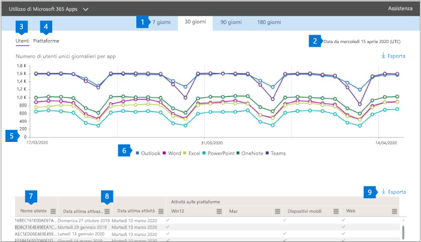

# Report di Microsoft 365 nell'interfaccia di amministrazione - Utilizzo di Microsoft 365 Apps

Il **dashboard** dei report di Microsoft 365 mostra la panoramica delle attività tra i prodotti dell'organizzazione. Consente di eseguire il drill-down fino a visualizzare report a livello di singolo prodotto, per ottenere informazioni più dettagliate sulle attività in ogni prodotto. Vedere l' [argomento introduttivo sui report](activity-reports.md).

 Ad esempio, puoi comprendere l'attività di ogni utente con licenza per usare le app di Microsoft 365 Apps esaminando le attività tra le app e il modo in cui vengono utilizzate su più piattaforme.

 > [!NOTE]
 > Per visualizzare i report, è necessario essere un amministratore globale, un lettore globale o un lettore di report in Microsoft 365 o un amministratore di Exchange, SharePoint o Skype for Business.

## Come accedere al report sull'utilizzo di Microsoft 365 Apps

1. Nell'interfaccia di amministrazione passare alla pagina **Report** \> <a href="https://go.microsoft.com/fwlink/p/?linkid=2074756" target="_blank">Utilizzo</a>.

 2. **Nell'elenco a discesa Selezionare** un report selezionare Uso di Office **365**   \>  **Microsoft 365 Apps.**

## Interpretare il report sull'utilizzo di Microsoft 365 Apps

Puoi visualizzare l'attività di Microsoft 365 Apps dell'utente esaminando i grafici **Utenti** **e** piattaforma.

|Elemento|Descrizione|
 |:-----|:-----|
 |1.   |Il report **sull'utilizzo di Microsoft 365 Apps** può essere visualizzato per le tendenze degli ultimi 7, 30, 90 o 180 giorni. Tuttavia, se si seleziona un giorno specifico nel report, la tabella (7) mostrerà i dati per un massimo di 28 giorni dalla data corrente (non la data di generazione del report).   |
 |2.   |I dati in ogni report in genere coprono fino agli ultimi sette giorni.   |
 |3.   |La **visualizzazione** Utenti mostra la tendenza del numero di utenti attivi per ogni app: Outlook, Word, Excel, PowerPoint, OneNote e Teams. Gli "utenti attivi" sono tutti coloro che eseguono azioni intenzionali all'interno di queste app.   |
 |4.   |La **visualizzazione** Piattaforme mostra la tendenza degli utenti attivi in tutte le app per ogni piattaforma: Windows, Mac, Web e Mobile.   |
 |5. |Nel grafico **Utenti,** l'asse Y è il numero di utenti attivi univoci per la rispettiva app. Nel grafico **Piattaforme,**   l'asse Y è il numero di utenti univoci per la rispettiva piattaforma. L'asse X in entrambi i grafici è la data in cui un'app è stata usata in una determinata piattaforma. |
 6. |È possibile filtrare la serie visualizzata nel grafico selezionando un elemento nella legenda. Ad esempio, nel grafico **Utenti** selezionare Outlook, Word, Excel, PowerPoint, OneDrive o Teams per visualizzare solo le informazioni correlate a ognuno di essi. La modifica di questa selezione non modifica le informazioni nella tabella griglia sottostante.|
 |7. |La tabella visualizza un'analisi dei dati a livello di utente. È possibile aggiungere o rimuovere colonne in una tabella.   **Nome** utente è l'indirizzo di posta elettronica dell'utente che ha eseguito l'attività in Microsoft Apps.  **Data dell'ultima attivazione (UTC)** è la data più recente in cui l'utente ha attivato l'abbonamento a Microsoft 365 Apps.  **Data ultima attività (UTC)** è la data più recente in cui un'attività intenzionale è stata eseguita dall'utente. Per visualizzare l'attività relativa a una data specifica, selezionare la data direttamente nel grafico.  Le colonne seguenti corrispondono a ogni app che identifica se l'utente era attivo in tale app nel periodo selezionato:   **Outlook**  **Word**  **Excel** **PowerPoint**  **OneNote**   Le colonne seguenti corrispondono a ogni piattaforma che identifica se l'utente era attivo su tale piattaforma per qualsiasi app (all'interno di Microsoft 365 Apps) nel periodo selezionato:  **Outlook (Windows)** **Outlook (Mac)** **Outlook (Web)**  **Outlook (mobile)**  **Word (Windows)**  **Word (Mac)**  **Word (Web)**  **Word (mobile)**  **Excel (Windows)**  **Excel (Mac)**  **Excel (Web)**  **Excel (mobile)**  **PowerPoint (Windows)**  **PowerPoint (Mac)** **PowerPoint (Web)**  **PowerPoint (mobile)**  **OneNote (Windows)**  **OneNote (Mac)**  **OneNote (Web)** **OneNote (mobile)**  **Teams (Windows)**  **Teams (Mac)**  **Teams (Web)** **Teams (mobile)** |
 |8. |Selezionare **l'icona Gestisci** colonne per aggiungere o rimuovere colonne dal report.|
 |9. |È inoltre possibile esportare i dati del report in un file CSV di Excel selezionando il **collegamento Esporta.** In questo modo vengono esportati i dati per tutti gli utenti e è possibile eseguire semplici operazioni di aggregazione, ordinamento e filtro per un'ulteriore analisi. Se si dispone di meno di 100 utenti, è possibile ordinare e filtrare all'interno della tabella del report stesso. Se si dispone di più di 100 utenti, per filtrare e ordinare, sarà necessario esportare i dati.|
