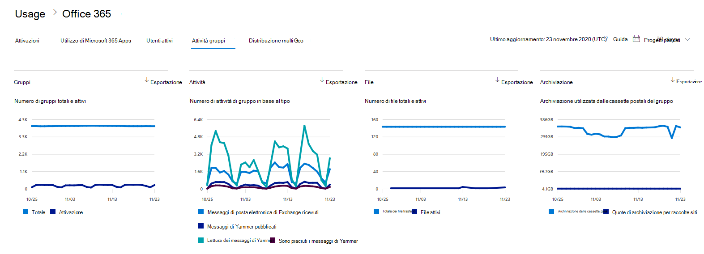

# Microsoft 365 Report nell'interfaccia di amministrazione - Microsoft 365 gruppi

Il dashboard Microsoft 365 **report mostra** la panoramica dell'attività tra i prodotti dell'organizzazione. Consente di eseguire il drill-down fino a visualizzare report a livello di singolo prodotto, per ottenere informazioni più dettagliate sulle attività in ogni prodotto. Vedere l' [argomento introduttivo sui report](activity-reports.md). Nel report Microsoft 365 gruppi di lavoro, è possibile ottenere informazioni dettagliate sull'attività dei gruppi nell'organizzazione e vedere quanti gruppi vengono creati e utilizzati.
  
> [!NOTE]
> Per visualizzare i report, è necessario essere un amministratore globale, un lettore globale o un lettore di report in Microsoft 365 o un amministratore di Exchange, SharePoint, Teams Service, Teams Communications o Skype for Business.  
  
## Come accedere al report gruppi

1. Nell'interfaccia di amministrazione passare alla pagina **Report** \> <a href="https://go.microsoft.com/fwlink/p/?linkid=2074756" target="_blank">Utilizzo</a>. 
2. Nella home page del  dashboard, fare clic sul pulsante Visualizza altro nella scheda Utenti attivi - Microsoft 365 Apps o Utenti attivi - Microsoft 365 Services per accedere alla pagina del report Office 365.
  
## Interpretare il report dei gruppi

È possibile visualizzare le attivazioni nel report Office 365 selezionando la **scheda Attività** gruppi. 

Selezionare **Scegli colonne** per aggiungere o rimuovere colonne dal report.    

È inoltre possibile esportare i dati del report in Excel .csv file selezionando il **collegamento Esporta.** Vengono esportati i dati di tutti gli utenti, che possono poi essere ordinati e filtrati per ulteriore analisi. Se gli utenti sono meno di 2000, è possibile ordinarli e filtrarli direttamente nella tabella del report. Se invece gli utenti sono più di 2000, per ordinarli e filtrarli occorre esportare i dati. 

|Elemento|Descrizione|
|:-----|:-----|
|**Metrica**|**Definizione**|
|Nome del gruppo    |Nome del gruppo.    |
|Eliminato    |Numero di gruppi eliminati. Se il gruppo viene eliminato, ma c'è stata attività nel periodo della relazione, verrà visualizzato nella griglia con questo flag impostato su true.    |
|Proprietario del gruppo    |Nome del proprietario del gruppo.    |
|Data ultima attività (UTC)    |Data più recente in cui un messaggio è stato ricevuto dal gruppo. Si tratta dell'ultima data in cui si è verificata un'attività in una conversazione di posta elettronica, in Yammer o nel sito.    |
|Tipo    |Tipo di gruppo. Può essere privato o pubblico.    |
|Messaggi di posta elettronica ricevuti Exchange    |Numero di messaggi ricevuti dal gruppo.|
|Messaggi di posta elettronica Exchange (totale)    |Numero totale di elementi nella cassetta postale del gruppo.    |
|Archiviazione delle cassette postali utilizzata per Exchange (MB)    |Archiviazione utilizzata dalla cassetta postale del gruppo.  |
|SharePoint file (totale)    |Numero di file archiviati nei SharePoint di gruppo.    |
|SharePoint file (attivi)    |Numero di file nel sito SharePoint gruppo su cui sono stati evasi (visualizzati o modificati, sincronizzati, condivisi internamente o esternamente) durante il periodo di reporting.    |
|Spazio di archiviazione totale del sito SharePoint (MB)    |Quantità di spazio di archiviazione in MB utilizzata durante il periodo di reporting.    |
|Messaggi in Yammer (inseriti)    |Numero di messaggi inseriti nel gruppo Yammer durante il periodo di reporting.    |
|Messaggi in Yammer (lettura)    |Numero di conversazioni lette nel gruppo Yammer durante il periodo di reporting.    |
|Messaggi in Yammer (mi piace)    |Numero di messaggi apprezzati nel gruppo Yammer durante il periodo di reporting.    |
|Membri    |Numero di membri del gruppo.    |
|Membri esterni |Numero di utenti esterni nel gruppo.|
|||

## Contenuto correlato

[Microsoft 365 report nell'interfaccia di amministrazione](activity-reports.md) (articolo)\
[Report nel Centro sicurezza & conformità](../../compliance/reports-in-security-and-compliance.md) (articolo)\
[Microsoft 365 report nell'interfaccia di amministrazione - Utenti attivi](../../admin/activity-reports/active-users-ww.md) (articolo)

