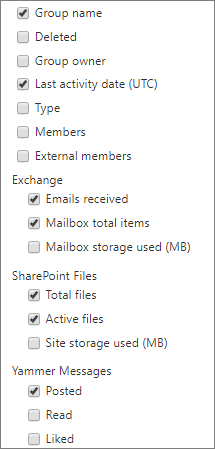

# Report di Microsoft 365 nell'interfaccia di amministrazione - Gruppi di Microsoft 365Microsoft 365 Reports in the admin center - Microsoft 365 groups

Il **dashboard** dei report di Microsoft 365 mostra la panoramica delle attività tra i prodotti dell'organizzazione.The Microsoft 365 **Reports** dashboard shows you the activity overview across the products in your organization. Consente di eseguire il drill-down fino a visualizzare report a livello di singolo prodotto, per ottenere informazioni più dettagliate sulle attività in ogni prodotto.It enables you to drill in to individual product level reports to give you more granular insight about the activities within each product. Vedere l' [argomento introduttivo sui report](activity-reports.md).Check out [the Reports overview topic](activity-reports.md). Nel report Gruppi di Microsoft 365 è possibile ottenere informazioni dettagliate sull'attività dei gruppi nell'organizzazione e vedere quanti gruppi vengono creati e usati.In the Microsoft 365 groups report, you can gain insights into the activity of groups in your organization and see how many groups are being created and used.
  
> [!NOTE]
> Per visualizzare i report, è necessario essere un amministratore globale, un lettore globale o un lettore di report in Microsoft 365 o un amministratore di Exchange, SharePoint, Teams Service, Teams Communications o Skype for Business.You must be a global administrator, global reader or reports reader in Microsoft 365 or an Exchange, SharePoint, Teams Service, Teams Communications, or Skype for Business administrator to see reports.  
  
## Come accedere al report gruppiHow to get to the groups report

1. Nell'interfaccia di amministrazione passare alla pagina **Report** \> <a href="https://go.microsoft.com/fwlink/p/?linkid=2074756" target="_blank">Utilizzo</a>.In the admin center, go to the **Reports** \> <a href="https://go.microsoft.com/fwlink/p/?linkid=2074756" target="_blank">Usage</a> page.

2. Nelle opzioni selezionare **Visualizza altro** in Utenti attivi - Servizi di Microsoft **365.**From the options, select **View more** under **Active users - Microsoft 365 Services**.
3. **Nell'elenco a discesa Selezionare un report** selezionare Attività gruppi di Office **365.** \> From the **Select a report** drop-down, select **Office 365** \> **Groups activity**.
  
## Interpretare il report dei gruppiInterpret the groups report

È possibile visualizzare l'attività dei gruppi esaminando i grafici **Gruppi,** **Attività,** **File** **e Archiviazione.**You can get a view into groups activity by looking at the **Groups**, **Activity**, **Files**, and **Storage** charts. 
  

  
|ElementoItem|DescrizioneDescription|
|:-----|:-----|
|1.1.    |Il report gruppi di **Microsoft 365** può essere visualizzato per le tendenze degli ultimi 7, 30, 90 o 180 giorni.The **Microsoft 365 groups** report can be viewed for trends over the last 7 days, 30 days, 90 days, or 180 days. Tuttavia, se si seleziona un giorno specifico nel report, la tabella (7) mostrerà i dati per un massimo di 28 giorni dalla data corrente (non la data di generazione del report).However, if you select a particular day in the report, the table (7) will show data for up to 28 days from the current date (not the date the report was generated).    |
|2.2.    |I dati in ogni report in genere coprono fino alle ultime 24-48 ore.The data in each report usually covers up to the last 24 to 48 hours.    |
|3.3.    |La **visualizzazione** Gruppi mostra un numero totale di gruppi esistenti in un determinato giorno e gruppi attivi in tale giorno in base alle conversazioni di posta elettronica, ai post di Yammer e alle attività dei file di SharePoint e alle pagine di SharePoint visualizzate.The **Groups** view shows a total number of groups that existed on any given day, and active groups on that day based on Email Conversations, Yammer Posts and SharePoint file activities and SharePoint pages viewed.    |
|4.4.    |La visualizzazione **Attività** mostra il numero di attività dei gruppi con tutti i carichi di lavoro di gruppo.The **Activity** view shows you the number of group activities across group workloads. È possibile visualizzare i messaggi di posta elettronica di Exchange ricevuti dalle cassette di posta elettronica di tutti i gruppi, in qualsiasi giorno durante il periodo di riferimento.You can view the Exchange emails received by the group mailboxes across all groups, on any day during the reporting period. È inoltre possibile visualizzare i messaggi inseriti, letti e apprezzati tra i gruppi di Yammer associati a un gruppo.You can also see messages posted, read, and liked across the Yammer groups associated with a group.   |
|5.5.    |La **visualizzazione File** mostra il numero totale di file attivi e totali in tutti i siti di gruppo associati a un gruppo.The **Files** view shows you the number of total and active files across all group sites associated with a group.    |
|6.6.    |La visualizzazione **Archiviazione** mostra lo spazio di archiviazione totale usato in tutte le cassette postali e in tutti i siti del gruppo.The **Storage** view shows you the total storage used across all group mailboxes and group sites.    |
|7.7.    | Nel grafico **Gruppi** l'asse Y rappresenta il numero di gruppi (che può essere visualizzato come confronto tra totali e attivi).On the **Groups** chart, Y-axis is the number of groups (which can be seen as total vs active).     Nel grafico **Attività,** l'asse Y è il numero di volte in cui un'attività è stata eseguita in gruppi.On the **Activity** chart, Y-axis is the number of times an activity was performed in groups.     Nel grafico **File** l'asse Y rappresenta il numero di file totali o attivi.On the **Files** chart, the Y axis is the number of either total or active files.     Nel grafico **Archiviazione** l'asse Y rappresenta lo spazio di archiviazione totale usato dalla cassetta postale o dal sito del gruppo.On the **Storage** chart, the Y axis is total storage used by the group mailbox or site.     L'asse X in tutti e tre i grafici rappresenta l'intervallo di date selezionato per il report specifico.The X axis on all three charts is the selected date range for the specific report.    |
|8.8.    |È possibile filtrare la serie visualizzata nel grafico selezionando un elemento nella legenda.You can filter the series you see on the chart by selecting an item in the legend. Ad esempio, nel grafico  **Gruppi**  seleziona Totale o Totale attivo e Numero attivo di gruppi per visualizzare solo le informazioni correlate a  essi.For example, on the **Groups** chart, select **Total** or **Active**  to see only the info related to each one. La modifica di questa selezione non modifica le informazioni nella tabella della griglia.Changing this selection doesn't change the info in the grid table.    |
|9.9.    | L'elenco dei gruppi da mostrare dipende dal set di tutti i gruppi che erano presenti (che non sono stati eliminati) nel periodo di tempo di riferimento più ampio (180 giorni). Il numero di attività (le conversazioni di posta elettronica, i post di Yammer e le attività sui siti di SharePoint) varia in base alla selezione di date.  The list of groups shown is determined by the set of all groups that existed (weren't deleted) across the widest (180-day) reporting time frame. The activity count (email conversations, Yammer posts and SharePoint file activities) will vary according to the date selection.    NOTA: potresti non visualizzare tutte le voci dell'elenco seguente nelle colonne finché non le aggiungi.NOTE: You might not see all the items in the list below in the columns until you add them. **Nome gruppo** è il nome del gruppo.**Group name** is the name of the group.    **Eliminati** è il numero di gruppi eliminati. Se il gruppo viene eliminato, ma c'è stata attività nel periodo della relazione, verrà visualizzato nella griglia con questo flag impostato su true.  **Deleted** is the number of deleted groups. If the group is deleted, but had activity in the reporting period it will show up in the grid with this flag set to true.    **Proprietario del gruppo** è il nome del proprietario del gruppo.**Group owner** is the name of the group owner.    **Data ultima attività** è l'ultima data in cui un messaggio è stato ricevuto dal gruppo.**Last activity date** is the latest date a message was received by the group. Si tratta dell'ultima data in cui si è verificata un'attività in una conversazione di posta elettronica, in Yammer o nel sito.- This is the latest date an activity happened in an email conversation, Yammer, or the Site.    **Tipo** è il tipo di gruppo. Può essere privato o pubblico.  **Type** is the type of group. This can be private or public group.    **Membri** è il numero di membri del gruppo.**Members** is the number of members in the group.    **Membri esterni** è il numero di utenti esterni del gruppo.**External members** is the number of external users in the group.    **Exchange****Exchange**   **Messaggi ricevuti** è il numero di messaggi ricevuti dal gruppo.**Emails received** is the number of messages received by the group.    **Totale elementi cassetta postale** è il numero di elementi presenti nella cassetta postale del gruppo.**Mailbox total items** is the total number of items in the group's mailbox.    **Spazio di archiviazione della cassetta postale usato** è lo spazio di archiviazione usato dalla cassetta postale del gruppo.**Mailbox storage used** is the storage used by the group's mailbox.    **File di SharePoint****SharePoint Files**   **Totale file** è il numero di file archiviati nei siti del gruppo di SharePoint.**Total files** is the number of files stored in SharePoint group sites.    **File attivi** è il numero di file nel sito di gruppo di SharePoint che sono stati visualizzati, modificati, sincronizzati, condivisi internamente o esternamente durante il periodo di riferimento.**Active files** is the number of files in the SharePoint group site that were acted on (viewed or modified, synched , shared internally or externally) during the reporting period    **Spazio di archiviazione del sito usato (MB)** è la quantità di spazio di archiviazione, in MB, usata durante il periodo di riferimento.**Site storage used (MB)** is the amount of storage in MB used during the reporting period.    **Messaggi di Yammer****Yammer Messages**   **Pubblicati** è il numero dei messaggi pubblicati nel gruppo di Yammer nel periodo di riferimento.**Posted** is the number of messages posted in the Yammer group over the reporting period.    **Letti** è il numero delle conversazioni lette nel gruppo di Yammer nel periodo di riferimento.**Read** is the number of conversations read in the Yammer group over the reporting period.    **Apprezzati** è il numero dei messaggi con Mi piace nel gruppo di Yammer nel periodo di riferimento.**Liked** is the number of messages liked in the Yammer group over the reporting period.     Se i criteri dell'organizzazione impediscono la visualizzazione dei report in cui le informazioni degli utenti sono identificabili, è possibile modificare l'impostazione della privacy per tutti questi report.If your organization's policies prevents you from viewing reports where user information is identifiable, you can change the privacy setting for all these reports. Vedere la **sezione Come nascondere i dettagli a livello di utente nelle** relazioni attività nell'interfaccia di amministrazione di Microsoft [365.](activity-reports.md)Check out the **How do I hide user level details?** section in the [Activity Reports in the Microsoft 365 admin center](activity-reports.md).    |
|10,10,    |Selezionare o toccare **Il pulsante** Altre azioni OWA altre azioni accanto a un'intestazione di colonna per aggiungere o rimuovere colonne  report.Select or tap **More Actions** button  next to a column heading to add or remove columns from the report.    |
|11,11,    |È inoltre possibile esportare i dati del report in un file CSV di Excel selezionando il **collegamento Esporta.**You can also export the report data into an Excel .csv file by selecting the **Export** link. Vengono esportati i dati di tutti gli utenti, che possono poi essere ordinati e filtrati per ulteriore analisi.This exports data of all users and enables you to do simple sorting and filtering for further analysis. Se gli utenti sono meno di 2000, è possibile ordinarli e filtrarli direttamente nella tabella del report.If you have less than 2000 users, you can sort and filter within the table in the report itself. Se invece gli utenti sono più di 2000, per ordinarli e filtrarli occorre esportare i dati.If you have more than 2000 users, in order to filter and sort, you will need to export the data.    |
|||

