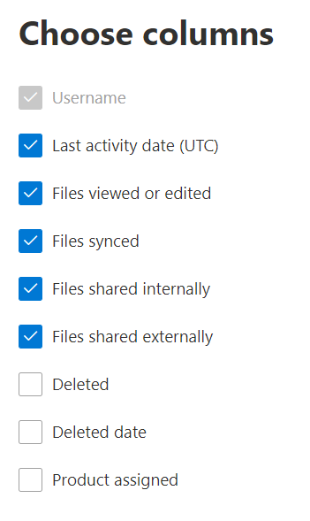

# Rapporti Microsoft 365 nell'interfaccia di amministrazione-attività di OneDrive for business

Il Dashboard Microsoft 365 **Reports** illustra la panoramica delle attività tra i prodotti dell'organizzazione. Consente di eseguire il drill-down fino a visualizzare report a livello di singolo prodotto, per ottenere informazioni più dettagliate sulle attività in ogni prodotto. Vedere l' [argomento di panoramica sui report](activity-reports.md).
  
Ad esempio, è possibile comprendere l'attività di tutti gli utenti con licenza per l'uso di OneDrive osservandone l'interazione con i file in OneDrive. È anche utile per comprendere il livello di collaborazione in corso osservando il numero di file condivisi.
  
> [!NOTE]
> È necessario essere un amministratore globale, un lettore globale o un lettore di report in Microsoft 365 o un amministratore di Exchange, SharePoint, teams, Communications o Skype for business per visualizzare i report.  
 
## Come ottenere il report Attività di OneDrive?

1. Nell'interfaccia di amministrazione passare alla pagina **Report** \> <a href="https://go.microsoft.com/fwlink/p/?linkid=2074756" target="_blank">Utilizzo</a>. 
2. Nella Home page del dashboard, fare clic sul pulsante **Visualizza altro** sulla scheda OneDrive.
  
## Interpretare il report sull'attività di OneDrive for Business

È possibile visualizzare le attività nel report di OneDrive scegliendo la scheda **attività** . 

Selezionare **Scegli colonne** per aggiungere o rimuovere colonne dal report.    

È inoltre possibile esportare i dati del report in un file CSV di Excel selezionando il collegamento **Esporta** . Vengono esportati i dati di tutti gli utenti, che possono poi essere ordinati e filtrati per ulteriore analisi. Se gli utenti sono meno di 2000, è possibile ordinarli e filtrarli direttamente nella tabella del report. Se invece gli utenti sono più di 2000, per ordinarli e filtrarli occorre esportare i dati. 
  
|Elemento|Descrizione|
|:-----|:-----|
|**Metrica**|**Definizione**|
|Nome utente    |Nome utente del proprietario dell'account OneDrive.    |
|Data ultima attività (UTC)    |La data più recente in cui è stata eseguita un'attività sui file nell'account OneDrive per l'intervallo di date selezionato. . Per visualizzare l'attività relativa a una data specifica, selezionare la data direttamente nel grafico.    |
|File visualizzati o modificati    |Il numero di file che l'utente ha caricato, scaricato, modificato o visualizzato.     |
|File sincronizzati    |Il numero di file che sono stati sincronizzati dal dispositivo locale di un utente all'account OneDrive.   |
|File condivisi internamente    | Il numero di file che sono stati condivisi con gli utenti all'interno dell'organizzazione o con utenti all'interno di gruppi (che possono includere utenti esterni).    |
|File condivisi esternamente    |Il numero di file che sono stati condivisi con utenti esterni all'organizzazione.  |
|Eliminato    | Ciò indica che la licenza dell'utente è stata rimossa.    Nota: l'attività per un utente eliminato continuerà a essere visualizzata in un report a condizione che sia stata concessa una licenza in un determinato momento durante il periodo di tempo selezionato. La colonna **Eliminati** consente di notare che l'utente potrebbe non essere più attivo, ma ha contribuito ai dati nel report.    |
|Data di eliminazione    |La data in cui la licenza dell'utente è stata rimossa.  |
|Prodotto assegnato    |Prodotti Microsoft 365 che sono concessi in licenza all'utente.|
|||