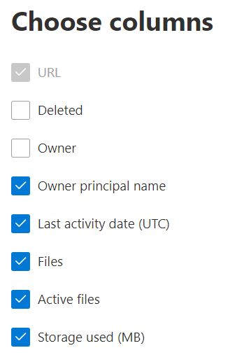

# Microsoft 365 Report nell'interfaccia di amministrazione - OneDrive for Business utilizzo

Il dashboard Microsoft 365 **report mostra** la panoramica dell'attività tra i prodotti dell'organizzazione. Consente di eseguire il drill-down fino a visualizzare report a livello di singolo prodotto, per ottenere informazioni più dettagliate sulle attività in ogni prodotto. Vedere l' [argomento di panoramica sui report](activity-reports.md).
  
Ad esempio, la scheda OneDrive sul dashboard offre una panoramica generale del valore ricevuto da OneDrive for Business per quanto riguarda il numero totale di file e di risorse di archiviazione usati in tutti gli account nell'organizzazione. È quindi possibile analizzare questo valore per comprendere le tendenze degli account di OneDrive attivi, il numero di file con cui interagiscono gli utenti e le risorse di archiviazione usate. Vengono visualizzati anche dettagli per i singoli account di OneDrive.
  
> [!NOTE]
> Per visualizzare i report, è necessario essere un amministratore globale, un lettore globale o un lettore di report in Microsoft 365 o un amministratore di Exchange, SharePoint, Teams Service, Teams Communications o Skype for Business.  
 
## Come ottenere il report Attività di OneDrive?

1. Nell'interfaccia di amministrazione passare alla pagina **Report** \> <a href="https://go.microsoft.com/fwlink/p/?linkid=2074756" target="_blank">Utilizzo</a>. 
2. Nella home page del dashboard fai clic sul **pulsante** Visualizza altro nella OneDrive dashboard.
  
## Interpretare il report sull'utilizzo di OneDrive

È possibile visualizzare l'utilizzo nel report OneDrive scegliendo la **scheda** Utilizzo. 

Selezionare **Scegli colonne** per aggiungere o rimuovere colonne dal report.    

È inoltre possibile esportare i dati del report in Excel .csv file selezionando il **collegamento Esporta.** Vengono esportati i dati di tutti gli utenti, che possono poi essere ordinati e filtrati per ulteriore analisi. Se gli utenti sono meno di 2000, è possibile ordinarli e filtrarli direttamente nella tabella del report. Se invece gli utenti sono più di 2000, per ordinarli e filtrarli occorre esportare i dati. 
  
|Elemento|Descrizione|
|:-----|:-----|
|**Metrica**|**Definizione**|
|URL    |L'indirizzo Web dell'utente OneDrive.   |
|Eliminato    |Lo stato di eliminazione del OneDrive. Un account viene contrassegnato come eliminato dopo almeno 7 giorni.    |
|Proprietario    |Nome utente dell'amministratore principale del OneDrive.     |
|Nome dell'entità proprietario    |L'indirizzo di posta elettronica del proprietario del OneDrive.   |
|Data ultima attività (UTC)    | Data più recente in cui è stata eseguita un'attività di file nel OneDrive. Se in OneDrive non ci sono state attività sui file, il valore sarà vuoto.    |
|File    |Numero di file nell'OneDrive.  |
|File attivi    | Numero di file attivi entro il periodo di tempo.  NOTA: se i file sono stati rimossi durante il periodo di tempo specificato per il report, il numero di file attivi visualizzati nel report potrebbe essere superiore al numero corrente di file nel OneDrive. >  Gli utenti eliminati continueranno a essere visualizzati nei report per 180 giorni.    |
|Archiviazione utilizzato (MB)    |Quantità di spazio di archiviazione OneDrive in MB. |
|||