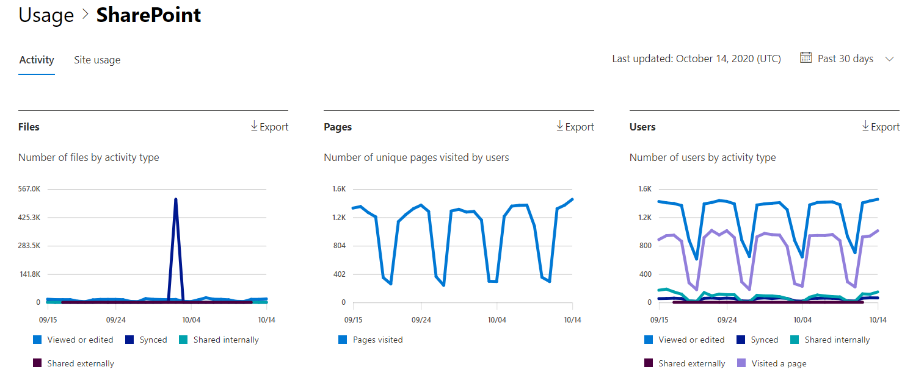

# Report di Microsoft 365 nell'interfaccia di amministrazione - Attività di SharePointMicrosoft 365 Reports in the admin center - SharePoint activity

In qualità di amministratore di Microsoft 365, il dashboard **Report** mostra la panoramica delle attività tra i vari prodotti dell'organizzazione.As an Microsoft 365 admin, the **Reports** dashboard shows you the activity overview across various products in your organization. Consente di eseguire il drill-down per ottenere informazioni più dettagliate sulle attività specifiche di ogni prodotto.It enables you to drill in to get more granular insight about the activities specific to each product. Consultare i report [attività nell'interfaccia di amministrazione di Microsoft 365.](activity-reports.md)Check out the [activity reports in the Microsoft 365 admin center](activity-reports.md).
  
Ad esempio, è possibile comprendere l'attività di tutti gli utenti con licenza per l'uso di SharePoint osservandone l'interazione con i file. È anche utile per comprendere il livello di collaborazione in corso osservando il numero di file condivisi.For example, you can understand the activity of every user licensed to use SharePoint by looking at their interaction with files. It also helps you to understand the level of collaboration going on by looking at the number of files shared.
  
> [!NOTE]
> Per visualizzare i report, è necessario essere un amministratore globale, un lettore globale o un lettore di report in Microsoft 365 o un amministratore di Exchange, SharePoint, Teams Service, Teams Communications o Skype for Business.You must be a global administrator, global reader or reports reader in Microsoft 365 or an Exchange, SharePoint, Teams Service, Teams Communications, or Skype for Business administrator to see reports. 
 
## Come si torna al report attività in SharePoint?How do I get to the to the SharePoint activity report?

1. Nell'interfaccia di amministrazione passare alla pagina **Report** \> <a href="https://go.microsoft.com/fwlink/p/?linkid=2074756" target="_blank">Utilizzo</a>.In the admin center, go to the **Reports** \> <a href="https://go.microsoft.com/fwlink/p/?linkid=2074756" target="_blank">Usage</a> page. 
2. Nella home page del dashboard fare clic sul **pulsante Visualizza** altro nella scheda di SharePoint.From the dashboard homepage, click on the **View more** button on the SharePoint card.
  
## Interpretare il report attività di SharePointInterpret the SharePoint activity report

È possibile visualizzare le attività nel report di SharePoint scegliendo la **scheda** Attività.You can view the activities in the SharePoint report by choosing the **Activity** tab. 

Selezionare **Scegli colonne** per aggiungere o rimuovere colonne dal report.Select **Choose columns** to add or remove columns from the report.    

È inoltre possibile esportare i dati del report in un file CSV di Excel selezionando il **collegamento Esporta.**You can also export the report data into an Excel .csv file by selecting the **Export** link. Vengono esportati i dati di tutti gli utenti, che possono poi essere ordinati e filtrati per ulteriore analisi.This exports data of all users and enables you to do simple sorting and filtering for further analysis. Se gli utenti sono meno di 2000, è possibile ordinarli e filtrarli direttamente nella tabella del report.If you have less than 2000 users, you can sort and filter within the table in the report itself. Se invece gli utenti sono più di 2000, per ordinarli e filtrarli occorre esportare i dati.If you have more than 2000 users, in order to filter and sort, you will need to export the data. 
  
|ElementoItem|DescrizioneDescription|
|:-----|:-----|
|**Metrica****Metric**|**Definizione****Definition**|
|Nome utenteUsername    |L'indirizzo di posta elettronica dell'utente che ha eseguito l'attività nel sito di SharePoint.The email address of the user who performed the activity on the SharePoint Site.    |
|Data ultima attività (UTC)Last activity date (UTC)    |Data più recente in cui è stata eseguita un'attività di file o è stata visitata una pagina per l'intervallo di date selezionato.The latest date a file activity was performed or a page was visited for the selected date range. Per visualizzare l'attività relativa a una data specifica, selezionare la data direttamente nel grafico.To see activity that occurred on a specific date, select the date directly in the chart.    |
|File visualizzati o modificatiFiles viewed or edited    |Numero di file caricati, scaricati, modificati o visualizzati dall'utente.The number of files that the user uploaded, downloaded, modified, or viewed.     |
|File sincronizzatiFiles synced    |Numero di file sincronizzati dal dispositivo locale di un utente al sito di SharePoint.The number of files that have been synced from a user's local device to the SharePoint site.   |
|File condivisi internamenteFiles shared internally    | Numero di file che sono stati condivisi con gli utenti all'interno dell'organizzazione o con utenti all'interno di gruppi (che potrebbero includere utenti esterni).The count of files that have been shared with users within the organization, or with users within groups (that might include external users).    |
|File condivisi esternamenteFiles shared externally    |Numero di file condivisi con utenti esterni all'organizzazione.The number of files that have been shared with users outside of the organization.  |
|Pagine visitatePages visited    |Visite a pagine univoche dell'utente.The visits to unique pages by the user.  |
|EliminatoDeleted    | Ciò indica che la licenza dell'utente è stata rimossa.This indicates that the user's license was removed.     **NOTA:** L'attività per un utente eliminato continuerà a essere visualizzata nel report, purché sia stato concesso in licenza in un determinato momento durante il periodo di tempo selezionato.**NOTE:** Activity for a deleted user will still display in the report as long as he or she was licensed at some time during the selected time period. La colonna Eliminati consente di notare che l'utente potrebbe non essere più attivo, ma ha contribuito ai dati nel report.The Deleted column helps you to note that the user may no longer be active, but contributed to the data in the report.    |
|Data eliminazioneDeleted date    |Data in cui è stata rimossa la licenza dell'utente.The date on which the user's license was removed.  |
|Prodotto assegnatoProduct assigned    |Prodotti Microsoft 365 concessi in licenza all'utente.The Microsoft 365 products that are licensed to the user.|
|||