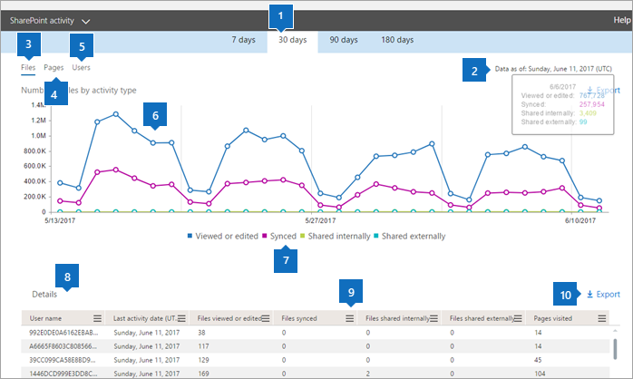

# Report di Microsoft 365 nell'interfaccia di amministrazione-attività di SharePoint

In qualità di amministratore Microsoft 365, nel dashboard dei **report** viene illustrata la panoramica delle attività in vari prodotti dell'organizzazione. Consente di eseguire il drill-down per ottenere informazioni più dettagliate sulle attività specifiche di ogni prodotto. Consultare i [report attività nell'interfaccia di amministrazione di Microsoft 365](activity-reports.md).
  
Ad esempio, è possibile comprendere l'attività di tutti gli utenti con licenza per l'uso di SharePoint osservandone l'interazione con i file. È anche utile per comprendere il livello di collaborazione in corso osservando il numero di file condivisi.
  
> [!NOTE]
> Alcune funzionalità vengono introdotte gradualmente. Questo significa che questa funzionalità potrebbe non essere ancora disponibile o essere diversa da quella descritta negli articoli della Guida. Se non è ancora disponibile, lo sarà tra breve. 
  
Per conoscere la quantità di attività eseguita in ogni sito di SharePoint e l'utilizzo dello spazio di archiviazione, visualizzare il [report utilizzo dei siti di SharePoint](sharepoint-site-usage.md).
  
> [!NOTE]
> È necessario essere un amministratore globale, un lettore globale o un lettore di report in Microsoft 365 o un amministratore di Exchange, SharePoint, teams, Communications o Skype for business per visualizzare i report.  
 
## Come si torna al report attività in SharePoint?

1. Nell'interfaccia di amministrazione passare alla pagina **Report** \> <a href="https://go.microsoft.com/fwlink/p/?linkid=2074756" target="_blank">Utilizzo</a>.

    
2. Nell'elenco **a discesa selezionare un report** selezionare attività di **SharePoint** \> **Activity**.
  
## Interpretazione del report attività di SharePoint

Per avere una visuale dell'attività di SharePoint, è possibile osservare le visualizzazioni **File** e **Utenti**.  
  
|Elemento|Descrizione|
|:-----|:-----|
|1.    |Il **report attività di SharePoint** può essere visualizzato per le tendenze degli ultimi 7, 30, 90 o 180 giorni. Tuttavia, se si seleziona un giorno specifico nel report, la tabella (7) visualizzerà i dati per un massimo di 28 giorni dalla data corrente (non la data in cui è stato generato il report).    |
|2.    |In genere, i dati di ogni report coprono fino alle ultime 24-48 ore.    |
|3.    |La visualizzazione **File** consente di conoscere il numero univoco di utenti con licenza che interagiscono con i file archiviati nei siti di SharePoint.    |
|4.    |La visualizzazione **Pagine** mostra il numero di pagine univoche visitate dagli utenti.    |
|5.    |La visualizzazione **Utenti** consente di conoscere la tendenza nel numero di utenti attivi. Un utente viene considerato attivo se ha eseguito un'attività sui file, ad esempio salvataggio, sincronizzazione, modifica o condivisione, o ha visitato una pagina in un intervallo di tempo specificato.    Nota: un'attività dei file può verificarsi più volte per un singolo file, ma verrà conteggiato solo come un file attivo. Ad esempio, è possibile salvare e sincronizzare più volte lo stesso file in un periodo di tempo specificato, ma verrà conteggiato come un solo file attivo e un solo file sincronizzato nei dati.           |
|6.    | Nel grafico **File** l'asse Y è il numero di file univoci che un utente ha salvato, sincronizzato, modificato oppure condiviso.     Nel grafico **Utenti** l'asse Y è il numero di utenti univoci che hanno eseguito attività su un file, ad esempio salvataggio, sincronizzazione, modifica o condivisione, in un sito.     Nel grafico **Pagine** l'asse X corrisponde al numero di pagine univoche visitate dagli utenti.     L'asse X in tutti i grafici rappresenta l'intervallo di date selezionato per il report specifico.    |
|7.    |È possibile filtrare la serie visualizzata nel grafico selezionando un elemento nella legenda. Ad esempio, nel grafico **file** selezionare **visualizzato o modificato**, **sincronizzato**, **condiviso internamente**o **condiviso esternamente** per visualizzare solo le informazioni relative a ognuna di esse. La modifica di questa selezione non modifica le informazioni nella tabella della griglia.    |
|8.    | La tabella mostra un'analisi delle attività a livello di sito.       **Username** è l'indirizzo di posta elettronica dell'utente che ha eseguito l'attività nel sito di SharePoint.    **Data ultima attività (UTC)** è la data più recente in cui è stata eseguita un'attività sui file o è stata visitata una pagina nell'intervallo di date selezionato. Per visualizzare l'attività relativa a una data specifica, selezionare la data direttamente nel grafico.       In questo modo la tabella verrà filtrata per visualizzare i dati relativi alle attività dei file solo per gli utenti che hanno eseguito l'attività in quel giorno specifico.     **File visualizzati o modificati** è il numero di file che l'utente ha caricato, scaricato, modificato o visualizzato.     **File sincronizzati** è il numero di file che sono stati sincronizzati dal dispositivo locale di un utente al sito di SharePoint.     **File condivisi internamente** è il numero di file che sono stati condivisi con gli utenti all'interno dell'organizzazione o con utenti all'interno di gruppi (che potrebbero includere utenti esterni).     **File condivisi esternamente** è il numero di file che sono stati condivisi con gli utenti all'esterno dell'organizzazione.     Le **pagine visitate** sono le visite alle pagine univoche da parte dell'utente.     **Eliminato** indica che la licenza dell'utente è stata rimossa.     **Nota:** L'attività per un utente eliminato continuerà a essere visualizzata nel report purché sia stata concessa una licenza in un determinato momento durante il periodo di tempo selezionato. La colonna Eliminati consente di notare che l'utente potrebbe non essere più attivo, ma ha contribuito ai dati nel report.    **Data eliminazione** è la data in cui la licenza dell'utente è stata rimossa.     **Prodotto assegnato** sono i prodotti Microsoft 365 che sono concessi in licenza all'utente.    |
|9.    |Selezionare l'icona **Gestisci colonne**  per aggiungere o rimuovere colonne dal report.    |
|10.    |È inoltre possibile esportare i dati del report in un file CSV di Excel selezionando il collegamento **Esporta** . Vengono esportati i dati di tutti gli utenti, che possono poi essere ordinati e filtrati per ulteriori analisi. Se gli utenti sono meno di 2000, è possibile ordinarli e filtrarli direttamente nella tabella del report. Se invece gli utenti sono più di 2000, per ordinarli e filtrarli occorre esportare i dati.    |
|||
   

