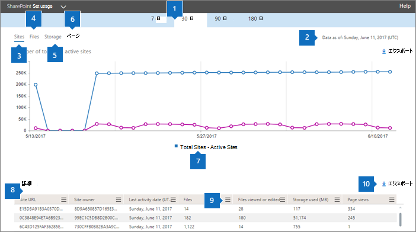

# Report di Microsoft 365 nell'interfaccia di amministrazione-utilizzo del sito di SharePointMicrosoft 365 Reports in the admin center - SharePoint site usage

In qualità di amministratore Microsoft 365, nel dashboard dei **report** viene illustrata la panoramica delle attività in vari prodotti dell'organizzazione.As an Microsoft 365 admin, the **Reports** dashboard shows you the activity overview across various products in your organization. Consente di eseguire il drill-down per ottenere informazioni più dettagliate sulle attività specifiche di ogni prodotto.It enables you to drill in to get more granular insight about the activities specific to each product. È possibile, ad esempio, ottenere una visualizzazione generale del valore ricavato da SharePoint in termini di numero totale di file archiviati dagli utenti nei siti di SharePoint, numero di file attivamente in uso e spazio di archiviazione utilizzato in tutti questi siti.For example, you can get a high level view of the value you are getting from SharePoint in terms of the total number of files that users store in SharePoint sites, how many files are actively being used, and the storage consumed across all these sites. È quindi possibile eseguire il drill-down del report sull'utilizzo dei siti di SharePoint per conoscere le tendenze e i dettagli a livello di sito.Then, you can drill into the SharePoint site usage report to understand the trends and per site level details for all sites. 
  
> [!NOTE]
> È necessario essere un amministratore globale, un lettore globale o un lettore di report in Microsoft 365 o un amministratore di Exchange, SharePoint, teams, Communications o Skype for business per visualizzare i report.You must be a global administrator, global reader or reports reader in Microsoft 365 or an Exchange, SharePoint, Teams Service, Teams Communications, or Skype for Business administrator to see reports. 
 
## Come ottenere il report sull'utilizzo del sito di SharePointHow to get to the SharePoint site usage report

1. Nell'interfaccia di amministrazione passare alla pagina **Report** \> <a href="https://go.microsoft.com/fwlink/p/?linkid=2074756" target="_blank">Utilizzo</a>.In the admin center, go to the **Reports** \> <a href="https://go.microsoft.com/fwlink/p/?linkid=2074756" target="_blank">Usage</a> page.

    
2. Nell'elenco **a discesa selezionare un report** selezionare **utilizzo sito**di **SharePoint** \> .From the **Select a report** drop-down, select **SharePoint** \> **Site usage**.
  
## Interpretazione del report sull'utilizzo del sito di SharePointInterpreting the SharePoint site usage report

  
|||
|:-----|:-----|
|1.1.    |Il report **Uso del sito di SharePoint** può essere visualizzato per le tendenze degli ultimi 7, 30, 90 o 180 giorni.The **SharePoint Site usage** report can be viewed for trends over the last 7 days, 30 days, 90 days, or 180 days. Tuttavia, se si seleziona un giorno specifico nel report, la tabella (7) visualizzerà i dati per un massimo di 28 giorni dalla data corrente (non la data in cui è stato generato il report).However, if you select a particular day in the report, the table (7) will show data for up to 28 days from the current date (not the date the report was generated).    |
|2.2.    |In genere, i dati di ogni report coprono fino alle ultime 24-48 ore.The data in each report usually covers up to the last 24 to 48 hours.   |
|3.3.    |Il grafico **Siti** mostra il numero totale dei siti e di quelli attivi. Qualsiasi sito in cui gli utenti hanno visualizzato, modificato, caricato, scaricato, condiviso o sincronizzato un file o visualizzato una pagina nel periodo di riferimento del report.  The **Sites** chart shows the number of total and active sites. Any site in which users had viewed, modified, uploaded, downloaded, shared, or synced a file or viewed a page within the reporting period.    |
|4.4.    |Il grafico **File** mostra il numero totale di file in tutti i siti e il numero di file attivi. Il numero totale di file include sia i file dell'utente che quelli di sistema. Un file viene considerato attivo se è stato salvato, sincronizzato, modificato o condiviso entro il periodo di tempo specifico.  The **Files** chart shows the total number of files across all sites and the number of active files. The number of total files includes both user files and system files. A file is considered active if it has been saved, synced, modified or shared within the specific time period.    Nota: un'attività dei file può verificarsi più volte per un singolo file, ma verrà conteggiato solo come un file attivo.NOTE: A file activity can occur multiple times for a single file, but will count only as one active file. Ad esempio, è possibile salvare e sincronizzare più volte lo stesso file in un periodo di tempo specificato, ma verrà conteggiato come un solo file attivo e un solo file sincronizzato nei dati.For example, you can save and sync the same file multiple times over a specified time period, but it will count only as one single active file and one single synced file in the data.           |
|5.5.    |Il grafico **Spazio di archiviazione** mostra la tendenza dello spazio di archiviazione allocato e utilizzato durante il periodo di riferimento del report.The **Storage** chart shows the trend of storage allocated and consumed during the reporting period.    |
|6.6.    |Il grafico **Pagine** mostra il numero di pagine visualizzate in tutti i siti.The **Pages** chart shows the number of pages viewed across all sites.    |
|7.7.    |È possibile filtrare i grafici visualizzati selezionando un elemento nella legenda.You can filter charts you see by selecting an item in the legend. Ad esempio, nel grafico **file** selezionare **file** o **file attivi**.For example, on the **Files** chart, select **Files** or **Active Files**. Nel grafico **siti** è possibile selezionare il **numero totale di siti** o **siti attivi**.On the **Sites** chart, you can select **Total sites** or **Active sites**. Nel grafico di **archiviazione** , è possibile selezionare l' **archiviazione allocata** o l' **archiviazione utilizzata.**On the **Storage** chart, you can select **Storage allocated** or **Storage consumed.** La modifica di questa selezione non cambia le informazioni nella tabella della griglia.Changing this selection doesn't change the information in the grid table.    |
|8.8.    | La tabella mostra un'analisi delle attività a livello di sito.The table shows you a breakdown of the activities at the per-site level.                 **URL sito** è l'URL completo del sito.**Site URL** is the full URL of the site.    **Eliminato** indica lo stato di eliminazione del sito. Occorrono almeno sette giorni affinché un account sia contrassegnato come eliminato.  **Deleted** is the deletion status of the site. It takes at least 7 days for sites to be marked as deleted.    **Proprietario del sito** è il nome utente del proprietario principale del sito.**Site owner** is the username of the primary owner of the site.   Il **nome principale del proprietario del sito** è l'indirizzo di posta elettronica del proprietario del sito.**Site owner principal name** is the email address of the owner of the site.    **Data ultima attività (UTC)** si riferisce alla data in cui è stata rilevata per l'ultima volta attività sui file nel sito.**Last activity date (UTC)** refers to the date of the last time file activity was detected or a page was viewed on the site.    **File** indica il numero di file nel sito.**Files** is the number of files on the site.    **File attivi** è il numero di file attivi nel sito.**Active files** is the number of active files on the site. Un file viene considerato attivo se è stato salvato, sincronizzato, modificato o condiviso entro il periodo di tempo specifico.A file is considered active if it has been saved, synced, modified or shared within the specific time period.    Nota: un'attività dei file può verificarsi più volte per un singolo file, ma verrà conteggiato solo come un file attivo.NOTE: A file activity can occur multiple times for a single file, but will count only as one active file. Ad esempio, è possibile salvare e sincronizzare più volte lo stesso file in un periodo di tempo specificato, ma verrà conteggiato come un solo file attivo e un solo file sincronizzato nei dati.For example, you can save and sync the same file multiple times over a specified time period, but it will count only as one single active file and one single synced file in the data. >  Se i file sono stati rimossi durante il periodo di tempo specificato per il report, il numero di file attivi visualizzati nel report potrebbe essere maggiore del numero di file corrente nel sito.>  If files were removed during the specified time period for the report, the number of active files shown in the report may be larger than the current number of files on the site. **Spazio di archiviazione utilizzato (MB)** è la quantità di spazio di archiviazione attualmente usato nel sito.**Storage used (MB)** is the amount of storage currently being used on the site.    **Spazio di archiviazione allocato (MB)** è la quantità massima di spazio di archiviazione allocato per il sito.**Storage allocated (MB)** is the maximum amount of storage allocated for the site.    **Visualizzazioni pagine** indica il numero di volte in cui sono state visualizzate le pagine del sito.**Page views** is the number of times pages were viewed on the site.    **Pagine visitate** indica il numero di volte in cui sono state visitate le pagine del sito.**Pages visited** is the number of unique pages that were visited on the site.    **Modello sito Web radice** è il modello usato per creare il sito.**Root Web Template** is the template used for creating the site.    Nota: se si desidera filtrare i dati in base a diversi tipi di sito, esportare i dati e utilizzare la colonna modello Web radice.NOTE: If you want to filter the data by different site types, then export the data and use the Root Web Template column.  Se i criteri dell'organizzazione impediscono la visualizzazione dei report in cui le informazioni degli utenti sono identificabili, è possibile modificare l'impostazione della privacy per tutti questi report.If your organization's policies prevent you from viewing reports where user information is identifiable, you can change the privacy setting for all these reports. Vedere la sezione **come nascondere i dettagli a livello di utente** nei [rapporti attività nell'interfaccia di amministrazione di Microsoft 365](activity-reports.md).Check out the **How do I hide user level details?** section in the [Activity Reports in the Microsoft 365 admin center](activity-reports.md).    |
|9.9.    |Selezionare **Gestisci** colonne per aggiungere o rimuovere colonne dal report.  Select **Manage columns**   to add or remove columns from the report.    |
|10.10.    |È inoltre possibile esportare i dati del report in un file CSV di Excel selezionando il **Export**  esportazione.You can also export the report data into an Excel .csv file, by selecting the **Export**  link. Vengono esportati i dati per tutti i siti, che possono poi essere ordinati e filtrati per ulteriore analisi.This exports data for all sites and enables you to do simple sorting and filtering for further analysis. Se i siti sono meno di 2000, è possibile ordinarli e filtrarli direttamente nella tabella del report.If you have less than 2000 sites, you can sort and filter within the table in the report itself. Se invece i siti sono più di 2000, per ordinarli e filtrarli occorre esportare i dati.If you have more than 2000 sites, in order to filter and sort, you will need to export the data.    Nota: quando i dati vengono esportati in un file di Excel, si noti che la data in cui è stato generato il rapporto di contenuto viene riflessa nel file dei **dati** di colonna.NOTE: When the data is exported to an Excel file, note that the date the content report was generated is reflected in the file in the **Data as of** column.          |
|||
   

