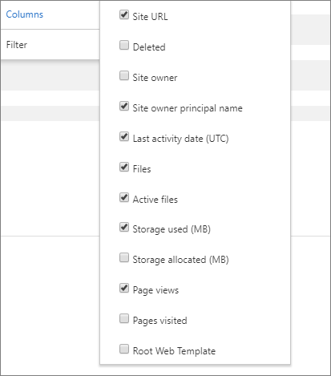

# Report di Microsoft 365 nell'interfaccia di amministrazione-utilizzo del sito di SharePoint

In qualità di amministratore Microsoft 365, nel dashboard dei **report** viene illustrata la panoramica delle attività in vari prodotti dell'organizzazione. Consente di eseguire il drill-down per ottenere informazioni più dettagliate sulle attività specifiche di ogni prodotto. È possibile, ad esempio, ottenere una visualizzazione generale del valore ricavato da SharePoint in termini di numero totale di file archiviati dagli utenti nei siti di SharePoint, numero di file attivamente in uso e spazio di archiviazione utilizzato in tutti questi siti. È quindi possibile eseguire il drill-down del report sull'utilizzo dei siti di SharePoint per conoscere le tendenze e i dettagli a livello di sito. 
  
> [!NOTE]
> È necessario essere un amministratore globale, un lettore globale o un lettore di report in Microsoft 365 o un amministratore di Exchange, SharePoint, teams, Communications o Skype for business per visualizzare i report.
I rapporti Microsoft 365 nell'interfaccia di amministrazione non sono supportati per i tenant GCC High e DoD.
 
## Come ottenere il report sull'utilizzo del sito di SharePoint

1. Nell'interfaccia di amministrazione passare a **report** \> <a href="https://go.microsoft.com/fwlink/p/?linkid=2074756" target="_blank">Usage</a>.

    
2. Nell'elenco **a discesa selezionare un report** selezionare **SharePoint** \> **utilizzo sito**di SharePoint.
  
## Interpretazione del report sull'utilizzo del sito di SharePoint

  
|Elemento|Descrizione|
|:-----|:-----|
|1.    |Il report **Uso del sito di SharePoint** può essere visualizzato per le tendenze degli ultimi 7, 30, 90 o 180 giorni. Tuttavia, se si seleziona un giorno specifico nel report, la tabella (7) visualizzerà i dati per un massimo di 28 giorni dalla data corrente (non la data in cui è stato generato il report).    |
|2.    |In genere, i dati di ogni report coprono fino alle ultime 24-48 ore.   |
|3.    |Il grafico dei **siti** Visualizza il numero di siti totali e attivi, incluso qualsiasi sito in cui gli utenti hanno visualizzato, modificato, caricato, scaricato, condiviso o sincronizzato un file o visualizzato una pagina all'interno del periodo di riferimento.    |
|4.    |Il grafico **File** mostra il numero totale di file in tutti i siti e il numero di file attivi. Il numero totale di file include sia i file dell'utente che quelli di sistema. Un file viene considerato attivo se è stato salvato, sincronizzato, modificato o condiviso entro il periodo di tempo specifico.  |
|5.    |Il grafico **Spazio di archiviazione** mostra la tendenza dello spazio di archiviazione allocato e utilizzato durante il periodo di riferimento del report.    |
|6.    |Il grafico **Pagine** mostra il numero di pagine visualizzate in tutti i siti.    |
|7.    |È possibile filtrare i grafici visualizzati selezionando un elemento nella legenda. Ad esempio, nel grafico **file** selezionare **file** o **file attivi**. Nel grafico **siti** è possibile selezionare il **numero totale di siti** o **siti attivi**. Nel grafico di **archiviazione** , è possibile selezionare l' **archiviazione allocata** o l' **archiviazione utilizzata.** La modifica di questa selezione non cambia le informazioni nella tabella della griglia.    |
|8.    | La tabella mostra un'analisi delle attività a livello di sito.                 **URL sito** è l'URL completo del sito.    **Eliminato** indica lo stato di eliminazione del sito. Occorrono almeno sette giorni affinché un account sia contrassegnato come eliminato.    **Proprietario del sito** è il nome utente del proprietario principale del sito.   Il **nome principale del proprietario del sito** è l'indirizzo di posta elettronica del proprietario del sito.    **Data ultima attività (UTC)** si riferisce alla data in cui è stata rilevata per l'ultima volta attività sui file nel sito.    **File** indica il numero di file nel sito.    **File attivi** è il numero di file attivi nel sito.  Nota: se i file sono stati rimossi durante il periodo di tempo specificato per il report, il numero di file attivi visualizzati nel report potrebbe essere superiore al numero corrente di file nel sito. **Spazio di archiviazione utilizzato (MB)** è la quantità di spazio di archiviazione attualmente usato nel sito.    **Spazio di archiviazione allocato (MB)** è la quantità massima di spazio di archiviazione allocato per il sito.    **Visualizzazioni pagine** indica il numero di volte in cui sono state visualizzate le pagine del sito.    **Pagine visitate** indica il numero di volte in cui sono state visitate le pagine del sito.    **Modello sito Web radice** è il modello usato per creare il sito.    Nota: se si desidera filtrare i dati in base a diversi tipi di sito, esportare i dati e utilizzare la colonna modello Web radice.  Se i criteri dell'organizzazione impediscono la visualizzazione dei report in cui le informazioni degli utenti sono identificabili, è possibile modificare l'impostazione della privacy per tutti questi report. Vedere la sezione **come nascondere i dettagli a livello di utente** nei [rapporti attività nell'interfaccia di amministrazione di Microsoft 365](activity-reports.md).    |
|9.    |Selezionare **Gestisci**colonne  per aggiungere o rimuovere colonne dal report.      |
|10.    |È inoltre possibile esportare i dati del report in un file CSV di Excel selezionando il collegamento **Esporta**  . Vengono esportati i dati per tutti i siti, che possono poi essere ordinati e filtrati per ulteriore analisi. Se i siti sono meno di 2000, è possibile ordinarli e filtrarli direttamente nella tabella del report. Se invece i siti sono più di 2000, per ordinarli e filtrarli occorre esportare i dati.    Nota: quando i dati vengono esportati in un file di Excel, si noti che la data in cui è stato generato il rapporto di contenuto viene riflessa nel file dei **dati** di colonna.          |
|||
