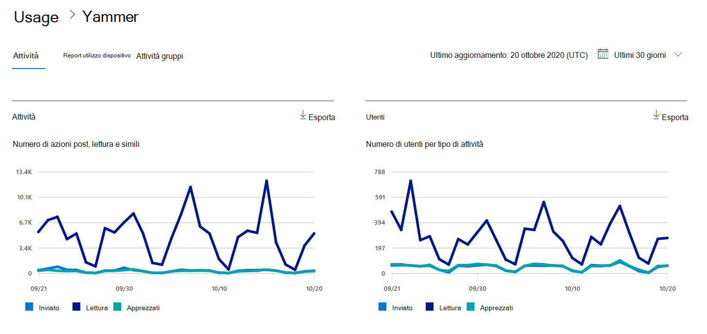

# Report di Microsoft 365 nell'interfaccia di amministrazione - Report attività di Yammer

In qualità di amministratore di Microsoft 365, il dashboard **Report** mostra i dati sull'utilizzo dei prodotti all'interno dell'organizzazione. Consultare i [report attività nell'interfaccia di amministrazione.](activity-reports.md) Il **report Attività su Yammer** consente di capire il livello di utilizzo di Yammer nell'organizzazione calcolando il numero di utenti che usano Yammer per pubblicare, aggiungere Mi piace o leggere un messaggio e la quantità di attività generata nell'intera organizzazione. 
  
> [!NOTE]
> Per visualizzare i report, è necessario essere un amministratore globale, un lettore globale o un lettore di report in Microsoft 365 o un amministratore di Exchange, SharePoint, Teams Service, Teams Communications o Skype for Business.  
 
## Come è possibile accedere al report attività di Yammer?

1. Nell'interfaccia di amministrazione passare alla pagina **Report** \> <a href="https://go.microsoft.com/fwlink/p/?linkid=2074756" target="_blank">Utilizzo</a>. 
2. Nella home page del dashboard, fare clic sul **pulsante Visualizza** altro nella scheda Yammer.

  
## Interpretare il report Attività in Yammer

È possibile visualizzare le attività nel report yammer scegliendo la **scheda** Attività. 

Selezionare **Scegli colonne** per aggiungere o rimuovere colonne dal report.    

È inoltre possibile esportare i dati del report in un file CSV di Excel selezionando il **collegamento Esporta.** Vengono esportati i dati di tutti gli utenti, che possono poi essere ordinati e filtrati per ulteriore analisi. Se gli utenti sono meno di 2000, è possibile ordinarli e filtrarli direttamente nella tabella del report. Se invece gli utenti sono più di 2000, per ordinarli e filtrarli occorre esportare i dati. 
  
|Elemento|Descrizione|
|:-----|:-----|
|**Metrica**|**Definizione**|
|Nome utente    |Indirizzo di posta elettronica dell'utente. È possibile visualizzare il nome effettivo o rendere questo campo anonimo. Questa griglia mostra gli utenti che hanno effettuato l'accesso a Yammer utilizzando l'account Microsoft 365 o che hanno effettuato l'accesso alla rete con single sign-on.   |
|Nome visualizzato    |Nome completo dell'utente. È possibile visualizzare il nome effettivo o rendere questo campo anonimo.    |
|Stato dell'utente    |Uno dei tre valori seguenti: Activated, Deleted o Suspended. Questi report mostrano i dati relativi agli utenti attivi, sospesi ed eliminati. Gli utenti in sospeso sono esclusi, in quanto non possono pubblicare, leggere o aggiungere Mi piace a un messaggio.    |
|Data modifica stato (UTC)    |Data in cui lo stato dell'utente è stato modificato in Yammer.    |
|Data ultima attività (UTC)    | Data dell'ultima pubblicazione, lettura o mi piace di un messaggio da parte dell'utente.    |
|Pubblicato    |Numero di messaggi che l'utente ha pubblicato durante il periodo di tempo specificato.  |
|Lettura    |Numero di conversazioni lette dall'utente durante il periodo di tempo specificato.    |
|Mi è piaci    |Numero di messaggi apprezzati dall'utente durante il periodo di tempo specificato.   |
|Prodotto assegnato    |Prodotti assegnati a questo utente.|
|||