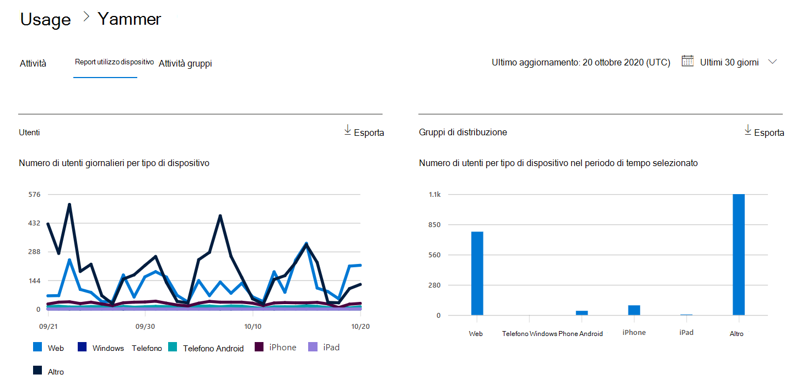
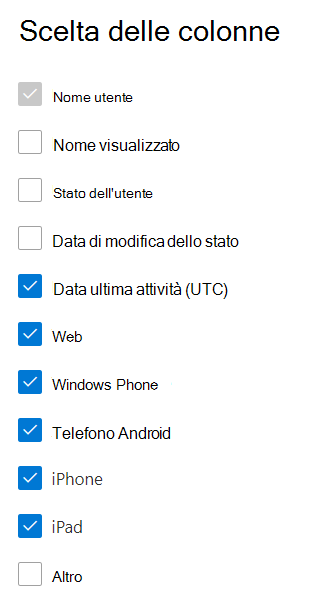

# Report di Microsoft 365 nell'interfaccia di amministrazione-report sull'utilizzo di dispositivi YammerMicrosoft 365 Reports in the admin center - Yammer device usage report

Il Dashboard Microsoft 365 **Reports** illustra la panoramica delle attività tra i prodotti dell'organizzazione.The Microsoft 365 **Reports** dashboard shows you the activity overview across the products in your organization. Consente di eseguire il drill-down fino a visualizzare report a livello di singolo prodotto, per ottenere informazioni più dettagliate sulle attività in ogni prodotto.It enables you to drill in to individual product level reports to give you more granular insight about the activities within each product. Vedere l' [argomento di panoramica sui report](activity-reports.md).Check out [the Reports overview topic](activity-reports.md).
  
I report sull'utilizzo di dispositivi Yammer forniscono informazioni sui dispositivi su cui gli utenti usano Yammer. È possibile visualizzare il numero di utenti giornalieri per tipo di dispositivo e il numero di utenti per il tipo di dispositivo in un periodo di tempo selezionato. È anche possibile visualizzare i dettagli per ogni utente.The Yammer device usage reports give you information about which devices your users are using Yammer on. You can view the number of daily users by device type, and number of users by device type. You can view both over a selected time period. You can also view details per user.
  
> [!NOTE]
> È necessario essere un amministratore globale, un lettore globale o un lettore di report in Microsoft 365 o un amministratore di Exchange, SharePoint, teams, Communications o Skype for business per visualizzare i report.You must be a global administrator, global reader or reports reader in Microsoft 365 or an Exchange, SharePoint, Teams Service, Teams Communications, or Skype for Business administrator to see reports.  
 
## Come si ottiene il report sull'utilizzo di dispositivi Yammer?How do I get to the Yammer device usage report?

1. Nell'interfaccia di amministrazione passare alla pagina **Report** \> <a href="https://go.microsoft.com/fwlink/p/?linkid=2074756" target="_blank">Utilizzo</a>.In the admin center, go to the **Reports** \> <a href="https://go.microsoft.com/fwlink/p/?linkid=2074756" target="_blank">Usage</a> page. 
2. Nella Home page del dashboard, fare clic sul pulsante **Visualizza altro** sulla scheda Yammer.From the dashboard homepage, click on the **View more** button on the Yammer card.
  
## Interpretare il report sull'utilizzo di dispositivi YammerInterpret the Yammer device usage report

È possibile visualizzare l'utilizzo nel report OneDrive scegliendo la scheda **utilizzo dispositivo** .You can view the usage in the OneDrive report by choosing the **Device usage** tab. 

Selezionare **Scegli colonne** per aggiungere o rimuovere colonne dal report.Select **Choose columns** to add or remove columns from the report.    

È inoltre possibile esportare i dati del report in un file CSV di Excel selezionando il collegamento **Esporta** .You can also export the report data into an Excel .csv file by selecting the **Export** link. Vengono esportati i dati di tutti gli utenti, che possono poi essere ordinati e filtrati per ulteriore analisi.This exports data of all users and enables you to do simple sorting and filtering for further analysis. Se gli utenti sono meno di 2000, è possibile ordinarli e filtrarli direttamente nella tabella del report.If you have less than 2000 users, you can sort and filter within the table in the report itself. Se invece gli utenti sono più di 2000, per ordinarli e filtrarli occorre esportare i dati.If you have more than 2000 users, in order to filter and sort, you will need to export the data. 
  
|ElementoItem|DescrizioneDescription|
|:-----|:-----|
|**Metrica****Metric**|**Definizione****Definition**|
|Nome utenteUsername    |L'indirizzo di posta elettronica dell'utente.The email address of the user. È possibile visualizzare il nome effettivo o rendere questo campo anonimo.You can display the actual email address or make this field anonymous. Questa griglia consente di visualizzare gli utenti che hanno effettuato l'accesso a Yammer utilizzando l'account Microsoft 365 o che hanno effettuato l'accesso alla rete tramite Single Sign-on.This grid shows users who logged into Yammer using the Microsoft 365 account or who logged into the network using single sign-on.   |
|Nome visualizzatoDisplay name    |Nome completo dell'utente.The full name of the user. È possibile visualizzare il nome effettivo o rendere questo campo anonimo.You can display the actual email address or make this field anonymous.    |
|Stato dell'utenteUser state    |Uno dei tre valori seguenti: attivo, eliminato o sospeso.One of three values: Active, Deleted, or Suspended. Questi report mostrano i dati relativi agli utenti attivi, sospesi ed eliminati.These reports show data for active, suspended, and deleted users. Gli utenti in sospeso sono esclusi, in quanto non possono pubblicare, leggere o aggiungere Mi piace a un messaggio.They do not reflect pending users, because pending users cannot post, read, or like a message.     |
|Data modifica stato (UTC)State change date (UTC)    |La data in cui lo stato dell'utente è stato modificato in Yammer.The date on which the user's state was changed in Yammer.    |
|Data ultima attività (UTC)Last activity date (UTC)    |Data e ora UTC in cui l'utente ha partecipato a un'attività di Yammer.The last date (UTC) that the user participated in an Yammer activity.    |
|WebWeb    |Indica se l'utente ha utilizzato Yammer sul Web.Indicates if the user has used Yammer on the web.    |
|Windows PhoneWindows phone    | Indica se l'utente ha utilizzato Yammer in un Windows Phone.Indicates if the user has used Yammer on a Windows phone.    |
|Telefono AndroidAndroid phone    |Indica se l'utente ha usato Yammer in un telefono Android.Indicates if the user has used Yammer on an Android phone.  |
|iPhoneiphone   | Indica se l'utente ha utilizzato Yammer su un iPhone.Indicates if the user has used Yammer on an iPhone.    |
|iPadipad    |Indica se l'utente ha utilizzato Yammer su un iPad.Indicates if the user has used Yammer on an iPad.  |
|altriother    |Indica se l'utente ha utilizzato Yammer in un altro dispositivo, non elencato in precedenza.Indicates if the user has used Yammer on another device, not listed previously.  |
|||