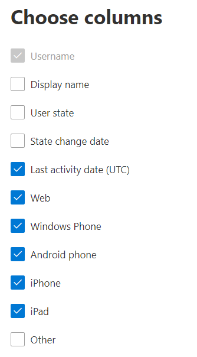

# Microsoft 365 Report nell'interfaccia di amministrazione - report sull Yammer di utilizzo dei dispositivi

Il dashboard Microsoft 365 **report mostra** la panoramica dell'attività tra i prodotti dell'organizzazione. Consente di eseguire il drill-down fino a visualizzare report a livello di singolo prodotto, per ottenere informazioni più dettagliate sulle attività in ogni prodotto. Vedere l' [argomento di panoramica sui report](activity-reports.md).
  
I report sull'utilizzo di dispositivi Yammer forniscono informazioni sui dispositivi su cui gli utenti usano Yammer. È possibile visualizzare il numero di utenti giornalieri per tipo di dispositivo e il numero di utenti per il tipo di dispositivo in un periodo di tempo selezionato. È anche possibile visualizzare i dettagli per ogni utente.
  
> [!NOTE]
> Per visualizzare i report, è necessario essere un amministratore globale, un lettore globale o un lettore di report in Microsoft 365 o un amministratore di Exchange, SharePoint, Teams Service, Teams Communications o Skype for Business.  
 
## Come si ottiene il report sull'utilizzo di dispositivi Yammer?

1. Nell'interfaccia di amministrazione passare alla pagina **Report** \> <a href="https://go.microsoft.com/fwlink/p/?linkid=2074756" target="_blank">Utilizzo</a>. 
2. Nella home page del dashboard fai clic sul **pulsante** Visualizza altro nella scheda Yammer dashboard.
  
## Interpretare il report Yammer utilizzo dei dispositivi

Puoi visualizzare l'utilizzo nel report OneDrive selezionando la **scheda Uso del** dispositivo. 

Selezionare **Scegli colonne** per aggiungere o rimuovere colonne dal report.    

È inoltre possibile esportare i dati del report in Excel .csv file selezionando il **collegamento Esporta.** Vengono esportati i dati di tutti gli utenti, che possono poi essere ordinati e filtrati per ulteriore analisi. Se gli utenti sono meno di 2000, è possibile ordinarli e filtrarli direttamente nella tabella del report. Se invece gli utenti sono più di 2000, per ordinarli e filtrarli occorre esportare i dati. 
  
|Elemento|Descrizione|
|:-----|:-----|
|**Metrica**|**Definizione**|
|Username    |Indirizzo di posta elettronica dell'utente. È possibile visualizzare il nome effettivo o rendere questo campo anonimo. Questa griglia mostra gli utenti che hanno effettuato l'Yammer utilizzando l'account Microsoft 365 o che hanno effettuato l'accesso alla rete con single sign-on.   |
|Nome visualizzato    |Nome completo dell'utente. È possibile visualizzare il nome effettivo o rendere questo campo anonimo.    |
|Stato dell'utente    |Uno dei tre valori seguenti: Active, Deleted o Suspended. Questi report mostrano i dati relativi agli utenti attivi, sospesi ed eliminati. Gli utenti in sospeso sono esclusi, in quanto non possono pubblicare, leggere o aggiungere Mi piace a un messaggio.     |
|Data modifica stato (UTC)    |Data in cui lo stato dell'utente è stato modificato in Yammer.    |
|Data ultima attività (UTC)    |Data dell'ultima data (UTC) a cui l'utente ha partecipato a un'Yammer attività.    |
|Web    |Indica se l'utente ha utilizzato Yammer sul Web.    |
|Windows telefono    | Indica se l'utente ha usato Yammer telefono Windows telefono.    |
|Telefono Android    |Indica se l'utente ha usato Yammer su un telefono Android.  |
|iphone   | Indica se l'utente ha usato Yammer su un iPhone.    |
|ipad    |Indica se l'utente ha utilizzato Yammer su un iPad.  |
|other    |Indica se l'utente ha usato Yammer su un altro dispositivo, non elencato in precedenza.  |
|||