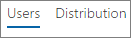
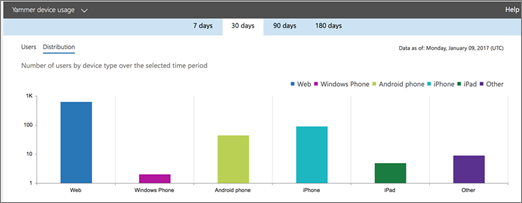

# Report di Microsoft 365 nell'interfaccia di amministrazione - Report utilizzo dispositivi YammerMicrosoft 365 Reports in the admin center - Yammer device usage report

Il **dashboard** dei report di Microsoft 365 mostra la panoramica delle attività tra i prodotti dell'organizzazione.The Microsoft 365 **Reports** dashboard shows you the activity overview across the products in your organization. Consente di eseguire il drill-down fino a visualizzare report a livello di singolo prodotto, per ottenere informazioni più dettagliate sulle attività in ogni prodotto.It enables you to drill in to individual product level reports to give you more granular insight about the activities within each product. Vedere l' [argomento di panoramica sui report](activity-reports.md).Check out [the Reports overview topic](activity-reports.md).
  
I report sull'utilizzo di dispositivi Yammer forniscono informazioni sui dispositivi su cui gli utenti usano Yammer. È possibile visualizzare il numero di utenti giornalieri per tipo di dispositivo e il numero di utenti per il tipo di dispositivo in un periodo di tempo selezionato. È anche possibile visualizzare i dettagli per ogni utente.The Yammer device usage reports give you information about which devices your users are using Yammer on. You can view the number of daily users by device type, and number of users by device type. You can view both over a selected time period. You can also view details per user.
  
> [!NOTE]
> Per visualizzare i report, è necessario essere un amministratore globale, un lettore globale o un lettore di report in Microsoft 365 o un amministratore di Exchange, SharePoint, Teams Service, Teams Communications o Skype for Business.You must be a global administrator, global reader or reports reader in Microsoft 365 or an Exchange, SharePoint, Teams Service, Teams Communications, or Skype for Business administrator to see reports. 
  
## Come si ottiene il report sull'utilizzo di dispositivi Yammer?How do I get to the Yammer device usage report?

1. Nell'interfaccia di amministrazione passare alla pagina **Report** \> <a href="https://go.microsoft.com/fwlink/p/?linkid=2074756" target="_blank">Utilizzo</a>.In the admin center, go to the **Reports** \> <a href="https://go.microsoft.com/fwlink/p/?linkid=2074756" target="_blank">Usage</a> page.

    
2. **Nell'elenco a discesa Select a report** selezionare **Yammer** \> **Device usage**.From the **Select a report** drop-down, select **Yammer** \> **Device usage**.
  
## Interpretare il report Attività in YammerInterpret the Yammer activity report

Per avere una visuale dell'utilizzo di dispositivi Yammer da parte degli utenti è possibile esaminare le visualizzazioni **Utenti** e **Distribuzione**.You can get a view into your users' Yammer device usage by looking at the **Users** and **Distribution** charts. 
  
Il report sull'utilizzo di dispositivi contiene le informazioni seguenti.The device usage report contains the following information.
  
- Utilizzare le schede giorno per visualizzare le tendenze del report attività di utilizzo dei dispositivi **Yammer** negli ultimi 7, 30, 90 o 180 giorni.Use the day tabs to view the **Yammer device usage** activity report trends over the last 7 days, 30 days, 90 days, or 180 days. Tuttavia, se si seleziona un giorno specifico nel report, nella tabella verranno visualizzati i dati per un massimo di 28 giorni dalla data corrente (non la data in cui è stato generato il report).However, if you select a particular day in the report, the table will show data for up to 28 days from the current date (not the date the report was generated). 
    
- Ogni report include la data in cui è stato generato. In genere, i report presentano una latenza di 24-48 ore dal momento dell'attività.Each report has a date for when the report was generated. The reports usually reflect a 24 to 48 hour latency from time of activity.
    
- Il grafico **Utenti** mostra il numero di utenti giornalieri per tipo di dispositivo.You can view the **Users** chart to see the number of daily users by device type.  
  
- Il grafico **Distribuzione** mostra il numero di utenti per tipo di dispositivo.You can view the **Distribution** chart to see the number of users by device type.  
  
- La tabella **Dettagli** sotto il grafico mostra un'analisi dell'utilizzo di dispositivi Yammer a livello di utente.The **Details** table under the graph shows you a breakdown of the Yammer device usage at the per-user level. 
    
    È anche possibile aggiungere e rimuovere le colonne. Le colonne disponibili sono:You can also add and remove columns. The available columns are:
    
  - **Nome utente** è l'indirizzo di posta elettronica dell'utente.**Username** is the email address of the user. È possibile visualizzare l'indirizzo di posta elettronica effettivo o rendere questo campo anonimo.You can display the actual email address or make this field anonymous. 
    
    Questa griglia mostra gli utenti che hanno effettuato l'accesso a Yammer utilizzando l'account Microsoft 365 o che hanno effettuato l'accesso alla rete con single sign-on.This grid shows users who logged into Yammer using the Microsoft 365 account or who logged into the network using single sign-on.
    
  - **Nome visualizzato** è il nome completo dell'utente. È possibile visualizzare il nome effettivo o rendere questo campo anonimo.**Display name** is the full name of the user. You can display the actual email address or make this field anonymous. 
    
  - **Stato utente** corrisponde a uno di questi tre valori: Attivo, Eliminato o Sospeso.**User state** is one of three values: Active, Deleted, or Suspended. 
    
    Questi report mostrano i dati relativi agli utenti attivi, sospesi ed eliminati. Gli utenti in sospeso sono esclusi, in quanto non possono pubblicare, leggere o aggiungere Mi piace a un messaggio.These reports show data for active, suspended, and deleted users. They do not reflect pending users, because pending users cannot post, read, or like a message.
    
  - **Web** indica se l'utente ha usato Yammer sul web.**Web** indicates if the user has used Yammer on the web. 
    
  - **Telefono Windows** indica se l'utente ha usato Yammer in un telefono Windows.**Windows phone** indicates if the user has used Yammer on a Windows phone 
    
  - **Telefono Android** indica se l'utente ha usato Yammer in un telefono Android.**Android phone** indicates if the user has used Yammer on an Android phone. 
    
  - **iPhone** indicates if the user has used Yammer on an iPhone.**iPhone** indicates if the user has used Yammer on an iPhone. 
    
  - **iPad** indica se l'utente ha usato Yammer in un iPad.**iPad** indicates if the user has used Yammer on an iPad. 
    
  - **Altro** indica se l'utente ha usato Yammer in un altro dispositivo non elencato in precedenza.**Other** indicates if the user has used Yammer on another device, not listed previously. 
    
    Se i criteri dell'organizzazione impediscono la visualizzazione dei report in cui le informazioni degli utenti sono identificabili, è possibile modificare l'impostazione della privacy per tutti questi report.If your organization's policies prevents you from viewing reports where user information is identifiable, you can change the privacy setting for all these reports. Vedere la **sezione Come nascondere i dettagli a livello di utente nelle** relazioni attività nell'interfaccia di amministrazione di Microsoft [365.](activity-reports.md)Check out the **How do I hide user level details?** section in the [Activity Reports in the Microsoft 365 admin center](activity-reports.md).
    
- È inoltre possibile esportare i dati del report in un file CSV di Excel selezionando il **collegamento Esporta.**You can also export the report data into an Excel .csv file, by selecting the **Export** link. Vengono esportati i dati di tutti gli utenti, che possono poi essere ordinati e filtrati per ulteriore analisi.This exports data of all users and enables you to do simple sorting and filtering for further analysis. Se gli utenti sono meno di 2000, è possibile ordinarli e filtrarli direttamente nella tabella del report.If you have less than 2000 users, you can sort and filter within the table in the report itself. Se invece gli utenti sono più di 2000, per ordinarli e filtrarli occorre esportare i dati.If you have more than 2000 users, in order to filter and sort, you will need to export the data. 
    

