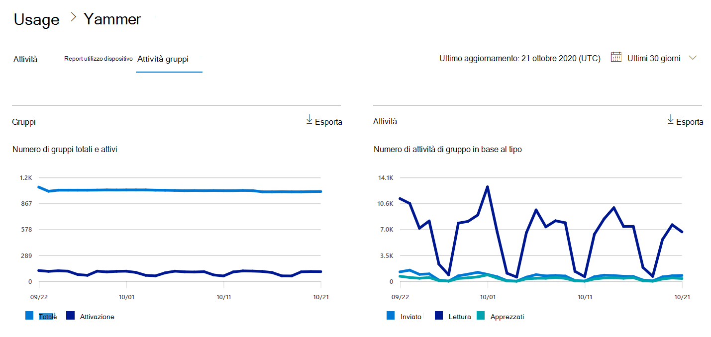
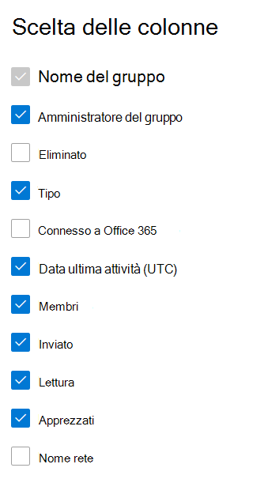

# Report di Microsoft 365 nell'interfaccia di amministrazione-report attività gruppi di Yammer

Il Dashboard Microsoft 365 **Reports** illustra la panoramica delle attività tra i prodotti dell'organizzazione. Consente di eseguire il drill-down fino a visualizzare report a livello di singolo prodotto, per ottenere informazioni più dettagliate sulle attività in ogni prodotto. Vedere l' [argomento introduttivo sui report](activity-reports.md). Nel report Attività dei gruppi di Yammer, è possibile ottenere informazioni approfondite sull'attività dei gruppi di Yammer nell'organizzazione e vedere quanti gruppi di Yammer vengono creati e usati.
  
> [!NOTE]
> È necessario essere un amministratore globale, un lettore globale o un lettore di report in Microsoft 365 o un amministratore di Exchange, SharePoint, teams, Communications o Skype for business per visualizzare i report.  
 
## Come si ottiene il report attività dei gruppi di Yammer?

1. Nell'interfaccia di amministrazione passare alla pagina **Report** \> <a href="https://go.microsoft.com/fwlink/p/?linkid=2074756" target="_blank">Utilizzo</a>. 
2. Nella Home page del dashboard, fare clic sul pulsante **Visualizza altro** sulla scheda Yammer.

  
## Interpretare il report Attività dei gruppi di Yammer

È possibile visualizzare le attività dei gruppi nel report Yammer scegliendo la scheda **attività gruppi** . 

Selezionare **Scegli colonne** per aggiungere o rimuovere colonne dal report.    

È inoltre possibile esportare i dati del report in un file CSV di Excel selezionando il collegamento **Esporta** . Vengono esportati i dati di tutti gli utenti, che possono poi essere ordinati e filtrati per ulteriore analisi. Se gli utenti sono meno di 2000, è possibile ordinarli e filtrarli direttamente nella tabella del report. Se invece gli utenti sono più di 2000, per ordinarli e filtrarli occorre esportare i dati. 
  
|Elemento|Descrizione|
|:-----|:-----|
|**Metrica**|**Definizione**|
|Nome del gruppo    |Nome del gruppo.   |
|Amministratore del gruppo    |Nome dell'amministratore del gruppo o del proprietario.    |
|Eliminato    |Numero di gruppi di Yammer eliminati. Se il gruppo viene eliminato, ma c'è stata attività nel periodo della relazione, verrà visualizzato nella griglia con questo flag impostato su true.    |
|Tipo    |Tipo di gruppo, pubblico o privato.   |
|Connesso a Office 365    |Indica se il gruppo Yammer è anche un gruppo di Microsoft 365.   |
|Data ultima attività (UTC)    | La data più recente in cui un messaggio è stato letto, pubblicato o apprezzato dal gruppo.    |
|Membri    | Il numero di membri del gruppo.    |
|Inviato    |Il numero di messaggi inseriti nel gruppo di Yammer nel periodo di riferimento.  |
|Lettura    |Il numero di conversazioni lette nel gruppo Yammer nel periodo di riferimento.    |
|Apprezzati    |Il numero di messaggi graditi nel gruppo Yammer nel periodo di riferimento.  |
|Nome rete    |Nome completo della rete a cui appartiene il gruppo. |
|||