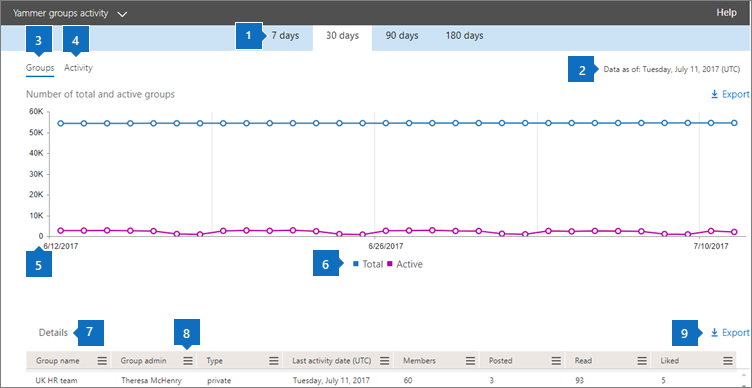
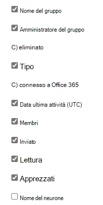

# Report di Microsoft 365 nell'interfaccia di amministrazione - Report attività dei gruppi di Yammer

Il **dashboard** report di Microsoft 365 mostra la panoramica delle attività tra i prodotti dell'organizzazione. Consente di eseguire il drill-down fino a visualizzare report a livello di singolo prodotto, per ottenere informazioni più dettagliate sulle attività in ogni prodotto. Vedere l' [argomento introduttivo sui report](activity-reports.md). Nel report Attività dei gruppi di Yammer, è possibile ottenere informazioni approfondite sull'attività dei gruppi di Yammer nell'organizzazione e vedere quanti gruppi di Yammer vengono creati e usati.
  
> [!NOTE]
> Per visualizzare i report, è necessario essere un amministratore globale, un lettore globale o un lettore di report in Microsoft 365 o un amministratore di Exchange, SharePoint, Teams Service, Teams Communications o Skype for Business.  

## Come accedere al report Attività dei gruppi di Yammer

1. Nell'interfaccia di amministrazione passare alla pagina **Report** \> <a href="https://go.microsoft.com/fwlink/p/?linkid=2074756" target="_blank">Utilizzo</a>.

    
2. **Nell'elenco a discesa Selezionare un report** selezionare Attività gruppi **di Yammer.** \> 
  
## Interpretare il report Attività dei gruppi di Yammer

Per avere una visuale delle attività dei gruppi di Yammer, è possibile osservare i grafici **Gruppi** e **Attività**. 
  
|Elemento|Descrizione|
|:-----|:-----|
|1.    |Il report **Attività dei gruppi di Yammer** può essere visualizzato per le tendenze degli ultimi 7, 30, 90 o 180 giorni. Tuttavia, se si seleziona un giorno specifico nel report, la tabella (7) mostrerà i dati per un massimo di 28 giorni dalla data corrente (non la data in cui è stato generato il report).    |
|2.    |I dati in ogni report in genere riguardano fino alle ultime 24-48 ore.   |
|3.    |La visualizzazione **Gruppi** mostra il numero totale di gruppi esistenti e quanti di essi hanno eseguito attività di conversazione di gruppo.    |
|4.    |La visualizzazione **Attività** mostra il numero di messaggi di Yammer pubblicati, letti e con Mi piace nei gruppi.    |
|5.    | Nel grafico **Gruppi** l'asse Y rappresenta il numero dei gruppi totali o attivi.     Nel grafico **Attività** l'asse Y rappresenta il numero delle attività specificate per i gruppi di Yammer.     L'asse X in tutti e tre i grafici rappresenta l'intervallo di date selezionato per il report specifico.    |
|6.    |È possibile filtrare la serie visualizzata nel grafico selezionando un elemento nella legenda. Nel grafico Gruppi, **ad**  esempio, selezionare Le icone Totale o Totale attivo e Attivo per visualizzare solo le informazioni correlate a   ognuna.   La modifica di questa selezione non modifica le informazioni nella tabella della griglia.    |
|7.    | L'elenco dei gruppi da mostrare dipende dal set di tutti i gruppi che erano presenti (che non sono stati eliminati) nel periodo della relazione più ampio (180 giorni). Il numero di attività (i messaggi ricevuti) varia in base alla data selezionata.    NOTA: potresti non vedere tutti gli elementi nell'elenco seguente nelle colonne finché non li aggiungi. **Nome gruppo** è il nome del gruppo.    **Amministratore gruppo** è il nome dell'amministratore del gruppo o del proprietario.    **Eliminati** è il numero di gruppi di Yammer eliminati. Se il gruppo viene eliminato, ma c'è stata attività nel periodo della relazione, verrà visualizzato nella griglia con questo flag impostato su true.    **Tipo** indica il tipo di gruppo, ad esempio pubblico o privato.    **Connesso a Office 365** indica se il gruppo di Yammer è anche un gruppo di Microsoft 365.    **La data dell'ultima** attività è l'ultima data in cui un messaggio è stato letto, pubblicato o mi piace dal gruppo.    **Membri** è il numero di membri del gruppo.    **Pubblicati** è il numero dei messaggi pubblicati nel gruppo di Yammer nel periodo di riferimento.    **Letti** è il numero delle conversazioni lette nel gruppo di Yammer nel periodo di riferimento.    **Apprezzati** è il numero dei messaggi con Mi piace nel gruppo di Yammer nel periodo di riferimento.   **Il nome** di rete è il nome completo della rete a cui appartiene il gruppo.    Se i criteri dell'organizzazione impediscono la visualizzazione dei report in cui le informazioni degli utenti sono identificabili, è possibile modificare l'impostazione della privacy per tutti questi report. Vedere la sezione **Come nascondere i dettagli** a livello di utente in Report attività nell'interfaccia di amministrazione di Microsoft [365.](activity-reports.md)    |
|8.    |Selezionare **Colonne** per aggiungere o rimuovere colonne dal report.    |
|9.    |È inoltre possibile esportare i dati del report in un file CSV di Excel selezionando il **collegamento Esporta.** Vengono esportati i dati di tutti gli utenti, che possono poi essere ordinati e filtrati per ulteriore analisi. Se gli utenti sono meno di 2000, è possibile ordinarli e filtrarli direttamente nella tabella del report. Se invece gli utenti sono più di 2000, per ordinarli e filtrarli occorre esportare i dati.    |
|||
   

