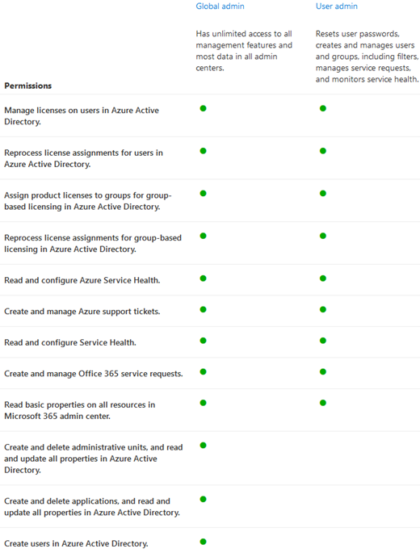

# Introduzione alla pagina dei ruoliGet started with the roles page

Nella pagina Ruoli è possibile concedere agli utenti le autorizzazioni per eseguire attività nelle centri di amministrazione.On the Roles page, you can give users permissions to do tasks in the admin centers. Ciò consente all'organizzazione di distribuire le attività alle persone appropriate e di proteggere i dati.This helps your organization spread tasks to the appropriate people and helps keep your data secure.

> [!TIP]
> Per le descrizioni dettagliate dei ruoli,Looking for the detailed role descriptions? Vedere [Autorizzazioni del ruolo amministratore in Azure Active Directory](/azure/active-directory/users-groups-roles/directory-assign-admin-roles#available-roles) e Informazioni sui ruoli di [amministratore](/microsoft-365/admin/add-users/about-admin-roles).Check out [Administrator role permissions in Azure Active Directory](/azure/active-directory/users-groups-roles/directory-assign-admin-roles#available-roles) and [About admin roles](/microsoft-365/admin/add-users/about-admin-roles).

## Informazioni sulla pagina dei ruoli di amministratoreAbout the admin roles page

È possibile esportare l'elenco di amministratori, nonché cercare e filtrare in base al ruolo.You can export the admin list as well as search and filter by role.

|||
|:-----|:-----|
|    |Usare **Esporta elenco di amministratori** per ottenere un elenco completo di tutti gli utenti amministratori nell'organizzazione.Use **Export admin list** to get a full list of all the admin users in your organization. L'elenco viene archiviato in un Excel .csv file.The list is stored in an Excel .csv file.     |
|    |Utilizzare **la** ricerca per cercare un ruolo di amministratore e visualizzare gli utenti assegnati a tale ruolo.Use **Search** to search for an admin role and see your users who are assigned to that role.     |
|    |Usa **Filtro** per modificare la visualizzazione dei ruoli di amministratore visualizzati.Use **Filter** to change your view of displayed admin roles.     |

## Ottenere il massimo dei ruoliGet the most out of the roles

Leggere il contenuto seguente per informazioni sui diversi ruoli di amministratore e sulle attività che i ruoli possono eseguire nell'organizzazione.Read the content below to learn about the different admin roles and what tasks the roles can perform in your organization.

> [!NOTE]
Questo non è un elenco esaustivo di tutte le autorizzazioni di questi ruoli.This isn't an exhaustive list of all the permissions that these roles have. Selezionare il **collegamento Ulteriori** informazioni per ulteriori informazioni su ogni ruolo.Select the **Learn more** link for more information about each role.

### Amministratore di ExchangeExchange admin

Assegnare il Exchange di amministratore agli utenti che devono visualizzare e gestire le cassette postali di posta elettronica dell'utente, Microsoft 365 gruppi e Exchange Online.Assign the Exchange admin role to users who need to view and manage your user's email mailboxes, Microsoft 365 groups and Exchange Online. Possono inoltre aprire e gestire le richieste di servizio al supporto tecnico Microsoft.They can also open and manage service requests to Microsoft support. [Altre informazioniLearn more](/microsoft-365/admin/add-users/about-exchange-online-admin-role)

### Amministratore globaleGlobal admin

Assegnare il ruolo di amministratore globale agli utenti che necessitano dell'accesso globale alla maggior parte delle funzionalità e dei dati di gestione nei servizi online Microsoft.Assign the global admin role to users who need global access to most management features and data across Microsoft online services. Concedere l'accesso globale a troppi utenti costituisce un rischio per la sicurezza; si consiglia di configurare tra 2 e 4 amministratori globali.Giving too many users global access is a security risk and we recommend that you have between 2 and 4 Global admins. Solo gli amministratori globali possono reimpostare le password per tutti gli utenti e aggiungere e gestire domini.Only global admins can reset passwords for all user and add and manage domains. Possono inoltre aprire e gestire le richieste di servizio al supporto tecnico Microsoft.They can also open and manage service requests to Microsoft support . La persona che ha effettuato l'accesso ai servizi online Microsoft diventa automaticamente un amministratore [globale. Ulteriori informazioni](/microsoft-365/admin/add-users/about-admin-roles#roles-available-in-the-microsoft-365-admin-center)The person who signed up for Microsoft online services automatically becomes a global admin. [Learn more](/microsoft-365/admin/add-users/about-admin-roles#roles-available-in-the-microsoft-365-admin-center)

### Ruolo con autorizzazioni di lettura globaliGlobal reader

Assegnare il ruolo di amministratore lettore globale agli utenti che devono visualizzare le funzionalità e le impostazioni di amministrazione in tutte le centri di amministrazione che l'amministratore globale può visualizzare.Assign the global reader admin role to user's who need to view admin features and settings in all admin centers that the global admin can view. Il ruolo di amministratore del lettore globale non può modificare alcuna impostazione.The global reader admin role can't edit any settings. [Altre informazioniLearn more](/microsoft-365/admin/add-users/about-admin-roles#roles-available-in-the-microsoft-365-admin-center)

### Amministratore di supporto tecnicoHelpdesk admin

Assegnare il ruolo di amministratore dell'helpdesk agli utenti che desiderano reimpostare le password, forzare la disconnessione degli utenti per eventuali problemi di sicurezza.Assign the Helpdesk admin role to users who want to reset passwords, force users to sign out for any security issues. Possono inoltre aprire e gestire le richieste di servizio al supporto tecnico Microsoft.They can also open and manage service requests to Microsoft support. L'amministratore del supporto tecnico può aiutare solo gli utenti non amministratori e gli utenti assegnati a questi ruoli: lettore di directory, invitatore guest, amministratore dell'helpdesk, lettore del Centro messaggi e lettore report.The Helpdesk admin can only help non-admin users and users assigned these roles: Directory reader, Guest inviter, Helpdesk admin, Message center reader, and Reports reader. [Altre informazioniLearn more](/microsoft-365/admin/add-users/about-admin-roles#roles-available-in-the-microsoft-365-admin-center)

### Amministratore del servizioService admin

Assegnare il ruolo di amministratore del servizio agli utenti che devono creare richieste di servizio per Azure, Microsoft 365 e Office 365 servizi.Assign the service admin role to users who need to create service requests for Azure, Microsoft 365, and Office 365 services. [Altre informazioniLearn more](/microsoft-365/admin/add-users/about-admin-roles#roles-available-in-the-microsoft-365-admin-center)

### Amministratore di SharePointSharePoint admin

Quando si acquista una sottoscrizione Microsoft 365, viene creato automaticamente un sito del team e l'amministratore globale viene impostato come amministratore principale della raccolta siti.When you purchase a Microsoft 365 subscription, a team site is automatically created, and the global admin is set as the primary site collection administrator. Assegnare SharePoint ruolo di amministratore agli utenti a cui si desidera accedere all'SharePoint di amministrazione.Assign the SharePoint admin role to users who you want to access to the SharePoint admin center. Gli utenti con il SharePoint amministratore possono creare e gestire raccolte siti, designare gli amministratori delle raccolte siti e gestire i profili utente.Users with the SharePoint admin role can create and manage site collections, designate site collection administrators and manage user profiles. Gli utenti con il SharePoint amministratore possono anche gestire Microsoft 365 e aprire le richieste di servizio tramite il supporto Microsoft.Users with the SharePoint admin role can also manage Microsoft 365 groups and open service requests through Microsoft support. [Altre informazioniLearn more](/sharepoint/sharepoint-admin-role)

### Amministratore del servizio TeamsTeams service admin

Assegnare Teams ruolo di amministratore agli utenti a cui si desidera accedere e gestire l'Teams & Skype di amministrazione.Assign the Teams admin role to users who you want to access and manage the Teams & Skype admin center. Gli utenti con il Teams amministratore possono anche gestire Microsoft 365 e aprire le richieste di servizio tramite il supporto Microsoft.Users with the Teams admin role can also manage Microsoft 365 groups and open service requests through Microsoft support. [Altre informazioniLearn more](/MicrosoftTeams/using-admin-roles)

### Amministratore utentiUser admin

Assegnare il ruolo di amministratore utente agli utenti a cui si desidera accedere e gestire le reimpostazioni della password utente e gestire utenti e gruppi.Assign the user admin role to users who you want to access and manage user password resets and manage users and groups. Possono inoltre aprire e gestire le richieste di servizio al supporto tecnico Microsoft.They can also open and manage service requests to Microsoft support. [Altre informazioniLearn more](/microsoft-365/admin/add-users/about-admin-roles#roles-available-in-the-microsoft-365-admin-center)

## Confrontare i ruoliCompare roles

È ora possibile confrontare le autorizzazioni per un massimo di 3 ruoli alla volta, in modo da trovare il ruolo meno permissivo da assegnare.You can now compare permissions for up to 3 roles at a time so you can find the least permissive role to assign.

Nell'interfaccia di amministrazione:In the admin center:

- Selezionare fino a 3 ruoli e scegliere **Confronta ruoli** per visualizzare le autorizzazioni di ogni ruolo.Select up to 3 roles and choose **Compare roles** to see the permissions each role has.

## Contenuto correlatoRelated content

[Informazioni Microsoft 365 ruoli di amministratore](about-admin-roles.md) (articolo)[About Microsoft 365 admin roles](about-admin-roles.md) (article)\
[Assegnare ruoli di amministratore](assign-admin-roles.md) (articolo)[Assign admin roles](assign-admin-roles.md) (article)