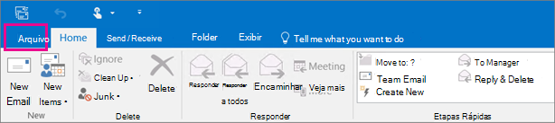

# Passaggio 4 - Concedere a un altro dipendente l'accesso OneDrive e Outlook datiStep 4 - Give another employee access to OneDrive and Outlook data

Quando un dipendente lascia l'organizzazione, è necessario accedere ai dati OneDrive e Outlook, eseguire il backup e scegliere se assegnarlo a un altro dipendente.When an employee leaves your organization, you'll want to access their OneDrive and Outlook data, back it up, and choose whether to give it to another employee.
  
## Accedere ai documenti di un OneDrive precedenteAccess a former user's OneDrive documents

Se si rimuove la licenza di un utente ma non si elimina l'account, è possibile concedere a se stessi l'accesso al contenuto nel OneDrive.If you remove a user's license but don't delete the account, you can give yourself access to the content in the user's OneDrive. Se elimini l'account dell'utente, per impostazione predefinita hai 30 giorni per accedere ai dati OneDrive'utente precedente.If you delete the user's account, you have 30 days by default to access the former user's OneDrive data. [Informazioni su come impostare la conservazione OneDrive per gli utenti eliminati.](/onedrive/set-retention)[Learn how to set the OneDrive retention for deleted users](/onedrive/set-retention). Se non si ripristina [un account utente entro](/office365/admin/add-users/restore-user) questo periodo di tempo, il relativo OneDrive viene eliminato.If you don't [restore a user account](/office365/admin/add-users/restore-user) within this time, their OneDrive content is deleted.

Per conservare i file di OneDrive di un utente precedente, concedere innanzitutto l'accesso al OneDrive e quindi spostare i file che si desidera mantenere.To preserve a former user's OneDrive files, first give yourself access to their OneDrive, and then move the files you want to keep.

1. Nell'interfaccia di amministrazione passare alla pagina **Utenti** \> <a href="https://go.microsoft.com/fwlink/p/?linkid=834822" target="_blank">Utenti attivi</a>.In the admin center, go to the **Users** \> <a href="https://go.microsoft.com/fwlink/p/?linkid=834822" target="_blank">Active users</a> page.  

2. Selezionare un utente.Select a user.

3. Nel riquadro destro selezionare **OneDrive**.In the right pane, select **OneDrive**. In **Ottieni accesso ai file** seleziona Crea collegamento ai **file**.Under **Get access to files**, select **Create link to files**.

4. Selezionare il collegamento per aprire il percorso del file.Select the link to open the file location. Scaricare i file nel computer oppure  selezionare Sposta **in** o Copia in per spostarli o copiarli nel proprio OneDrive o in una raccolta condivisa.Download the files to your computer, or select **Move to** or **Copy to** to move or copy them to your own OneDrive or to a shared library.

> [!NOTE]
> È possibile spostare o copiare fino a 500 MB di file e cartelle alla volta.You can move or copy up to 500 MB of files and folders at a time. 
> Quando si spostano o copiano documenti con cronologia delle versioni, viene spostata solo la versione più recente.When you move or copy documents that have version history, only the latest version is moved.  

### Revocare l'accesso dell'amministratore alla OneDriveRevoke admin access to a user's OneDrive

È possibile concedere l'accesso al contenuto nel OneDrive di un utente, ma è possibile rimuovere l'accesso quando non è più necessario.You can give yourself access to the content in a user's OneDrive, but you may want to remove your access when you no longer need it.

1. Accedi <a href="https://go.microsoft.com/fwlink/p/?linkid=2024339" target="_blank">all'interfaccia di amministrazione</a> come amministratore globale o amministratore SharePoint amministratore.Sign in to the <a href="https://go.microsoft.com/fwlink/p/?linkid=2024339" target="_blank">admin center</a> as a global admin or SharePoint admin.

    Se viene visualizzato un messaggio che indica che non si dispone dell'autorizzazione per accedere all'interfaccia di amministrazione, non si dispone delle autorizzazioni di amministratore nell'organizzazione.If you get a message that you don't have permission to access the admin center, then you don't have administrator permissions in your organization.

2. Nel riquadro sinistro selezionare **Interfaccia di amministrazione** \> **SharePoint**.In the left pane, select **Admin centers** \> **SharePoint**. Potrebbe essere necessario selezionare **Mostra tutto** per vedere l'elenco di interfacce di amministrazione.(You might need to select **Show all** to see the list of admin centers.)

3. Se viene visualizzata SharePoint'interfaccia di  amministrazione classica, selezionare Apri ora nella parte superiore della pagina per aprire l'SharePoint di amministrazione.If the classic SharePoint admin center appears, select **Open it now** at the top of the page to open the SharePoint admin center.

4. Nel riquadro sinistro selezionare **Altre funzionalità.**In the left pane, select **More features**.

5. In **Profili utente** selezionare **Apri.**Under **User profiles**, select **Open**.

6. In **Utenti** selezionare **Gestisci profili utente.**Under **People**, select **Manage User Profiles**.

7. Immettere il nome dell'utente e selezionare **Trova**.Enter the user's name and select **Find**.

8. Fare clic con il pulsante destro del mouse sull'utente e quindi **scegliere Gestisci proprietari raccolta siti**.Right-click the user, and then choose **Manage site collection owners**.

9. Rimuovere la persona che non ha più bisogno di accedere ai dati dell'utente e quindi selezionare **OK.**Remove the person who no longer needs access to the user's data, and then select **OK**.

## Accedere ai Outlook di un ex utenteAccess the Outlook data of a former user

Per salvare i messaggi di posta elettronica, il calendario, le attività e i contatti dell'ex dipendente, è possibile esportare le informazioni in un file di dati di Outlook (con estensione pst).To save the email messages, calendar, tasks, and contacts of the former employee, export the information to an Outlook Data File (.pst).
  
1. Aggiungere il messaggio di posta elettronica [dell'ex](https://support.microsoft.com/office/6e27792a-9267-4aa4-8bb6-c84ef146101b) dipendente al Outlook (se si reimposta la [password dell'utente,](reset-passwords.md)è possibile impostarlo su qualcosa che solo tu conosci).[Add the former employee's email](https://support.microsoft.com/office/6e27792a-9267-4aa4-8bb6-c84ef146101b) to your Outlook (If you [reset the user's password](reset-passwords.md), you can set it to something only you know.)

2. In Outlook selezionare **File**.In Outlook, select **File**.

    
  
3. Selezionare **Apri &amp; esporta** \> **Importazione/Esportazione**.Select **Open &amp; Export** \> **Import/Export**.

    
  
4. Selezionare **Esporta in un file** e quindi fare clic su **Avanti.**Select **Export to a file**, and then select **Next**.

    
  
5. Selezionare **Outlook file di dati (.pst)** e quindi selezionare **Avanti.**Select **Outlook Data File (.pst)**, and then select **Next**.

6. Selezionare l'account che si desidera esportare selezionando il nome o l'indirizzo di posta elettronica, ad esempio Cassetta postale - Anne Weiler o anne@contoso.com.Select the account you want to export by selecting the name or email address, such as Mailbox - Anne Weiler or anne@contoso.com. Se si vuole esportare tutto il contenuto dell'account, inclusi i messaggi di posta elettronica, il calendario, i contatti, le attività e le note, verificare che sia selezionata la casella di controllo **Includi sottocartelle**.If you want to export everything in your account, including mail, calendar, contacts, tasks, and notes, make sure the **Include subfolders** check box is selected.

    > [!NOTE]
    > È possibile esportare un solo account alla volta. Se si desidera esportare più account, ripetere questi passaggi per ognuno di essi.You can export one account at a time. If you want to export multiple accounts, after one account is exported, repeat these steps.
  
    
  
7. Selezionare **Avanti**.Select **Next**.

8. Selezionare **Sfoglia** per selezionare la posizione in cui salvare Outlook file di dati (pst).Select **Browse** to select where to save the Outlook Data File (.pst). Digitare un  *nome di file* e quindi scegliere **OK** per continuare.Type a  *file name*, and then select **OK** to continue.

    > [!NOTE]
    > Se l'esportazione è già stata usata, verranno visualizzati il nome del file e il percorso della cartella precedenti.If you've used export before, the previous folder location and file name appear. Digitare un *nome di file diverso* prima di selezionare **OK.**Type a  *different file name*  before selecting **OK**.
  
9. Se si esegue l'esportazione in un File di dati di Outlook (.pst) esistente, in **Opzioni** specificare come procedere per l'esportazione di elementi già esistenti nel file.If you are exporting to an existing Outlook Data File (.pst), under **Options**, specify what to do when exporting items that already exist in the file.

10. Seleziona **Fine**.Select **Finish**.

Outlook avvia immediatamente l'esportazione, a meno che non venga creato un nuovo File di dati di Outlook (pst) o non venga usato un file protetto da password.Outlook begins the export immediately unless a new Outlook Data File (.pst) is created or a password-protected file is used.
  
- Se si crea un nuovo File di dati di Outlook (pst), è possibile impostare una password facoltativa per proteggerlo.If you're creating an Outlook Data File (.pst), an optional password can help protect the file. Quando viene visualizzata Outlook finestra di **dialogo Crea file** di dati, digitare la *password* nelle caselle **Password** e Verifica **password** e quindi selezionare **OK.**When the **Create Outlook Data File** dialog box appears, type the  *password*  in the **Password** and **Verify Password** boxes, and then select **OK**. Nella finestra **Outlook password del file** di dati digitare la *password* e quindi selezionare **OK.**In the **Outlook Data File Password** dialog box, type the  *password*, and then select **OK**.

- Se si sta esportando in un file di dati di Outlook esistente (pst) protetto da password, nella finestra di dialogo **Password file** di dati di Outlook digitare la *password* e quindi fare clic su **OK.**If you're exporting to an existing Outlook Data File (.pst) that is password protected, in the **Outlook Data File Password** dialog box, type the  *password*, and then select **OK**.

Vedere come [esportare o eseguire il backup](https://support.microsoft.com/office/14252b52-3075-4e9b-be4e-ff9ef1068f91) di posta elettronica, contatti e calendario in Outlook file pst in Outlook 2010.See how to [Export or backup email, contacts, and calendar to an Outlook .pst file](https://support.microsoft.com/office/14252b52-3075-4e9b-be4e-ff9ef1068f91) in Outlook 2010.

  > [!NOTE]
  > Per impostazione predefinita, la posta elettronica è disponibile offline per un periodo di 12 mesi.By default, your email is available offline for a period of 12 months. Se necessario, vedere come aumentare [i dati disponibili offline.](/outlook/troubleshoot/mailboxes/only-subset-items-synchronized)If required, see how to [increase the data available offline](/outlook/troubleshoot/mailboxes/only-subset-items-synchronized).

### Concedere a un altro utente l'accesso alla posta elettronica di un ex utenteGive another user access to a former user's email

Per concedere l'accesso ai messaggi di posta elettronica, al calendario, alle attività e ai contatti dell'ex dipendente a un altro dipendente, importare le informazioni nella posta in arrivo di un altro Outlook dipendente.To give access to the email messages, calendar, tasks, and contacts of the former employee to another employee, import the information to another employee's Outlook inbox.

> [!NOTE]
> È inoltre possibile [convertire la cassetta postale dell'ex](/office365/admin/email/convert-user-mailbox-to-shared-mailbox) utente in una cassetta postale condivisa o inoltrare la posta elettronica di un ex dipendente a un altro [dipendente.](/office365/admin/add-users/remove-former-employee#forward-a-former-employees-email-to-another-employee-or-convert-to-a-shared-mailbox)You can also [convert the former user's mailbox to a shared mailbox](/office365/admin/email/convert-user-mailbox-to-shared-mailbox) or [forward a former employee's email to another employee](/office365/admin/add-users/remove-former-employee#forward-a-former-employees-email-to-another-employee-or-convert-to-a-shared-mailbox).

1. In Outlook, andare a **Apri file** \> **&amp; Esporta** \> **Importazione/Esportazione**.In Outlook, go to **File** \> **Open &amp; Export** \> **Import/Export**.

    Viene avviata l'Importazione/Esportazione guidata.This starts the Import and Export Wizard.

2. Selezionare **Importa da un altro programma o file** e quindi fare clic su **Avanti.**Select **Import from another program or file**, and then select **Next**.

    
  
3. Selezionare **Outlook file di dati (.pst)** e selezionare **Avanti.**Select **Outlook Data File (.pst)**, and select **Next**.

4. Passare al file PST che si vuole importare.Browse to the .pst file you want to import.

5. In **Opzioni** scegliere come si vuole gestire i duplicati.Under **Options**, choose how you want to deal with duplicates

6. Selezionare **Avanti**.Select **Next**.

7. Se al file di dati Outlook (.pst) è stata assegnata una password, immettere la password e quindi selezionare **OK.**If a password was assigned to the Outlook Data File (.pst), enter the password, and then select **OK**.

8. Impostare le opzioni per l'importazione degli elementi. Solitamente, non è necessario modificare le impostazioni predefinite.Set the options for importing items. The default settings usually don't need to be changed.

9. Seleziona **Fine**.Select **Finish**.

> [!NOTE]
> I passaggi rimangono gli stessi per accedere ai dati di posta elettronica e OneDrive di un utente esistente.The steps remain the same for accessing an existing user's OneDrive and email data.

> [!TIP]
> Se si desidera importare o ripristinare solo alcuni elementi da un file di dati di Outlook (.pst), è possibile aprire il Outlook File di dati.If you want to import or restore only a few items from an Outlook Data File (.pst), you can open the Outlook Data File. Nel riquadro di spostamento trascinare quindi gli elementi dalle Outlook file di dati alle cartelle Outlook esistenti.Then, in the navigation pane, drag the items from Outlook Data File folders to your existing Outlook folders. 

## Contenuto correlatoRelated content

[Aggiungere e rimuovere amministratori in un account OneDrive](/sharepoint/manage-user-profiles#add-and-remove-admins-for-a-users-onedrive) (articolo)[Add and remove admins on a OneDrive account](/sharepoint/manage-user-profiles#add-and-remove-admins-for-a-users-onedrive) (article)

[Ripristinare un'OneDrive](/onedrive/restore-deleted-onedrive) eliminata (articolo)[Restore a deleted OneDrive](/onedrive/restore-deleted-onedrive) (article)
  
[OneDrive conservazione ed eliminazione (articolo)](/onedrive/retention-and-deletion)[OneDrive retention and deletion](/onedrive/retention-and-deletion) (article)
