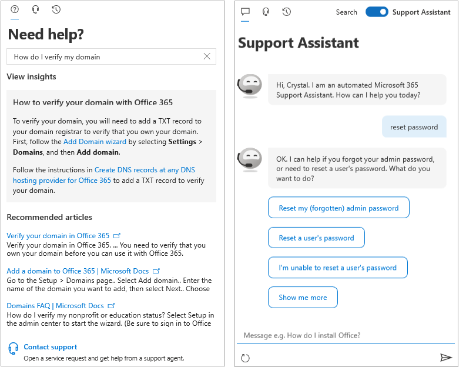

<!-- The following is just placeholder text from Madhura's mail. We need to add images/examples of each -->

# Informazioni su come ottenere assistenza nell'interfaccia di amministrazione di Microsoft 365How to get help in the Microsoft 365 admin center

Se sei un amministratore, [admin.Microsoft.com](https://admin.microsoft.com) è il tuo luogo di go-to per gestire e sfruttare al meglio la sottoscrizione Microsoft 365.If you're an admin, [admin.microsoft.com](https://admin.microsoft.com) is your go-to place to manage and make the most of your Microsoft 365 subscription. A volte non è possibile trovare l'attività corretta, è necessario un contesto maggiore prima di avviare un flusso di attività o semplicemente potrebbe non essere sicuro dell'ambito e dell'impatto delle azioni come amministratore. Per coprire tali situazioni, è possibile fornire assistenza moderna e supporto intelligente all'interno dell'interfaccia di amministrazione di Microsoft 365 in questi modi:Sometimes you might not find the right task, need more context before embarking on a task flow, or simply might not be sure of the scope and impact of your actions as an admin. To cover those situations, we provide modern help and intelligent assistance throughout the Microsoft 365 admin center in these ways:

* **Guida integrata** -guida nell'interfaccia di amministrazione**Integrated help** - help in the admin center

* **Intelligent Assistance** -self-help Powered by ai**Intelligent assistance** - self-help powered by AI

* **Guide e articoli** -contenuto completo sul Web**Guides and articles** - comprehensive content on the web

## Guida integrataIntegrated help

La guida è integrata in tutto l'interfaccia di amministrazione, quindi è proprio lì quando ne hai bisogno.Help is integrated throughout the admin center, so it's right there when you need it. Nella parte superiore di molte pagine, è possibile trovare il testo della Guida in linea che fornisce una panoramica delle informazioni sull'attività a portata di mano, oltre a collegamenti ad articoli che consentono di trovare rapidamente documentazione ufficiale per un apprendimento più approfondito.At the top of many pages, you'll find inline help text that provides an informational overview of the task at hand, as well as links to articles that let you quickly find official documentation for more in-depth learning.

## Moderni self-help Powered by AIModern self-help powered by AI

Per aprire la nostra moderna esperienza di self-help che è alimentata dall'intelligenza artificiale, seleziona il pulsante **serve aiuto** nell'interfaccia di amministrazione di Microsoft 365.To open our modern self-help experience that’s powered by artificial intelligence, select the **Need Help** button in the Microsoft 365 admin center. Ad esempio, se si cerca "verifica il mio dominio", verranno riportate le operazioni più alcuni articoli che riteniamo utili.For example, if you search for "verify my domain", you'll get the steps plus a few articles that we think will help you. L'apprendimento automatico viene utilizzato per visualizzare la soluzione più vicina che ha aiutato altri amministratori che hanno immesso query simili.We use machine learning to surface the closest solution that has helped other admins who have entered similar queries.

In alternativa, se non si conosce bene come fare qualcosa nella propria situazione specifica, utilizzare l'Assistente di supporto.Or, for those times when you don't quite know how to get something done in your specific situation, use the Support Assistant. Attualmente, questa esperienza è disponibile solo in inglese.Currently, this experience is available only in English. Per attivare assistente supporto tecnico, è sufficiente utilizzare l'interruttore nella parte superiore del riquadro della **Guida necessario** .To turn on Support Assistant, just use the toggle at the top of the **Need Help** pane. L'assistente del supporto tecnico fornisce un'interfaccia di conversazione per aiutarti.The Support Assistant provides a conversational interface to help you. Dopo aver immesso la query, il chatbot chiede chiarimenti per ottenere la risposta corretta per la situazione specifica.After you enter your query, the chatbot asks clarifying questions to get you to the right answer for your specific situation. È possibile considerarlo come helper virtuale per individuare soluzioni e completare le attività.Think of it as your virtual helper to discover solutions and complete tasks.

Naturalmente, a volte le domande sono le migliori risposte degli esseri umani.Of course, sometimes questions are best answered by humans. Se la risposta alla nostra moderna auto-assistenza non è disponibile, è sempre possibile contattare gli agenti di supporto.If our modern self-help doesn't have the answer, you always have the option to contact our support agents.

## Guide e articoliGuides and articles

Inoltre, se si cercano guide di distribuzione complete, procedure dettagliate o cmdlet di PowerShell, è possibile cercare sul Web.Additionally, if you're looking for comprehensive deployment guides, quick step-by-step procedures, or PowerShell cmdlets, look us up on the web. È possibile aggiornare i contenuti di frequente e provare a fornire le informazioni più recenti.We update content frequently and try to provide you with the latest information. Consultare gli articoli e le guide disponibili nel sito [documentazione di Microsoft 365](https://docs.microsoft.com/microsoft-365/) .Check out our articles and guides on the [Microsoft 365 Documentation](https://docs.microsoft.com/microsoft-365/) site.
