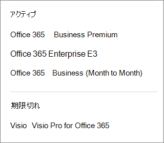

# Qual è l’abbonamento corrente?What subscription do I have?

Se si è un amministratore, è possibile verificare quali abbonamenti ha l'organizzazione accedendo all'interfaccia di amministrazione.If you're an admin, you can verify which subscriptions your organization has by going to the admin center.
  
 **Se non si è un amministratore****Not an admin?** Vedere [Qual è il prodotto commerciale o la licenza di Office 365?](https://support.office.com/article/f8ab5e25-bf3f-4a47-b264-174b1ee925fd.aspx)See [What Office 365 business product or license do I have?](https://support.office.com/article/f8ab5e25-bf3f-4a47-b264-174b1ee925fd.aspx)

::: moniker range="o365-worldwide"

> [!NOTE]
> Se non si usa la nuova interfaccia di amministrazione di Microsoft 365, è possibile attivarla selezionando l'opzione **Prova la nuova interfaccia di amministrazione** che si trova nella parte superiore della home page.If you're not using the new Microsoft 365 admin center, you can turn it on by selecting the **Try the new admin center** toggle located at the top of the Home page.

1. Nell'interfaccia di amministrazione passare alla pagina **Fatturazione** \> <a href="https://go.microsoft.com/fwlink/p/?linkid=842054" target="_blank">Prodotti e servizi</a>.In the admin center, go to the **Billing** \> <a href="https://go.microsoft.com/fwlink/p/?linkid=842054" target="_blank">Products & services</a> page.

2. Gli abbonamenti vengono visualizzati nella pagina **prodotti & Services** , insieme al nome della sottoscrizione, alle informazioni sull'abbonamento e al relativo stato.Your subscriptions are displayed on the **Products & services** page, together with the subscription name, information about the subscription, and its status. Per visualizzare una visualizzazione ridotta, selezionare **visualizzazione tabella**.To see a condensed view, select **Table view**.

::: moniker-end
  
::: moniker range="o365-germany"

1. Nell'interfaccia di amministrazione, andare alla pagina \*\*\*\* \> <a href="https://go.microsoft.com/fwlink/p/?linkid=847745" target="_blank">abbonamenti</a> di fatturazione.  In the admin center, go to the **Billing** \>  <a href="https://go.microsoft.com/fwlink/p/?linkid=847745" target="_blank">Subscriptions</a> page.

2. Se si ha solo un abbonamento, la pagina **Abbonamenti** ne indicherà il nome, insieme alle relative informazioni e lo stato. Lo screenshot seguente mostra un abbonamento a Office 365 Business.If you have only one subscription, it will be displayed on the **Subscriptions** page, along with the subscription name, information about the subscription, and its status. In the following screenshot, you can see that I have an Office 365 Business subscription.

    
  
3. Se si hanno più abbonamenti, accanto alle informazioni dettagliate sull'abbonamento verrà visualizzata una colonna con l'elenco degli abbonamenti acquistati e degli eventuali abbonamenti di valutazione. Per impostazione predefinita, l'abbonamento all'inizio dell'elenco è selezionato automaticamente e sono visualizzate le informazioni dettagliate sull'abbonamento.If you have multiple subscriptions, you'll see a column next to the detailed subscription information that lists the subscriptions that have been purchased, as well as any trial subscriptions. By default, the subscription at the top of the list is automatically selected, and the detailed information for that subscription is shown.

    Se si dispone di più sottoscrizioni, scegliere quella per la quale si desidera visualizzare informazioni dettagliate.If you have multiple subscriptions, choose the one for which you want to see detailed information. La visualizzazione verrà aggiornata con le informazioni su quell'abbonamento.The subscription card will update with information about that subscription.

    
  
    > [!NOTE]
    > Se sono presenti abbonamenti scaduti o disabilitati, saranno elencati in base allo stato corrente.If you have subscriptions that have expired or have been disabled, they'll be listed based on their current state.

::: moniker-end

::: moniker range="o365-21vianet"

1. Nell'interfaccia di amministrazione, andare alla pagina \*\*\*\* \> <a href="https://go.microsoft.com/fwlink/p/?linkid=850626" target="_blank">abbonamenti</a> di fatturazione.  In the admin center, go to the **Billing** \>  <a href="https://go.microsoft.com/fwlink/p/?linkid=850626" target="_blank">Subscriptions</a> page.

2. Se si ha solo un abbonamento, la pagina **Abbonamenti** ne indicherà il nome, insieme alle relative informazioni e lo stato. Lo screenshot seguente mostra un abbonamento a Office 365 Business.If you have only one subscription, it will be displayed on the **Subscriptions** page, along with the subscription name, information about the subscription, and its status. In the following screenshot, you can see that I have an Office 365 Business subscription.

    
  
3. Se si hanno più abbonamenti, accanto alle informazioni dettagliate sull'abbonamento verrà visualizzata una colonna con l'elenco degli abbonamenti acquistati e degli eventuali abbonamenti di valutazione. Per impostazione predefinita, l'abbonamento all'inizio dell'elenco è selezionato automaticamente e sono visualizzate le informazioni dettagliate sull'abbonamento.If you have multiple subscriptions, you'll see a column next to the detailed subscription information that lists the subscriptions that have been purchased, as well as any trial subscriptions. By default, the subscription at the top of the list is automatically selected, and the detailed information for that subscription is shown.

    Se si dispone di più sottoscrizioni, scegliere quella per la quale si desidera visualizzare informazioni dettagliate.If you have multiple subscriptions, choose the one for which you want to see detailed information. La visualizzazione verrà aggiornata con le informazioni su quell'abbonamento.The subscription card will update with information about that subscription.

    
  
    > [!NOTE]
    > Se sono presenti abbonamenti scaduti o disabilitati, saranno elencati in base allo stato corrente.If you have subscriptions that have expired or have been disabled, they'll be listed based on their current state.

::: moniker-end

## Articoli correlatiRelated articles
  
[Abbonamenti e fatturazioneSubscriptions and billing](../../commerce/subscriptions-and-billing.md)
