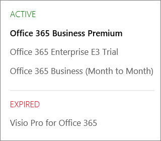

# Qual è l'abbonamento corrente?What subscription do I have?

Se si è un amministratore, è possibile verificare quali abbonamenti ha l'organizzazione accedendo all'interfaccia di amministrazione.If you're an admin, you can verify which subscriptions your organization has by going to the admin center.
  
 **Se non si è un amministratore****Not an admin?** Per informazioni sul [prodotto o sulla licenza di Microsoft 365 for business?](https://support.microsoft.com/office/f8ab5e25-bf3f-4a47-b264-174b1ee925fd)See [What Microsoft 365 for business product or license do I have?](https://support.microsoft.com/office/f8ab5e25-bf3f-4a47-b264-174b1ee925fd)

::: moniker range="o365-worldwide"

1. Nell'interfaccia di amministrazione passare alla pagina **Fatturazione** \> <a href="https://go.microsoft.com/fwlink/p/?linkid=842054" target="_blank">I tuoi prodotti</a>.In the admin center, go to the **Billing** \> <a href="https://go.microsoft.com/fwlink/p/?linkid=842054" target="_blank">Your products</a> page.

2. Gli abbonamenti vengono visualizzati nella pagina dei **prodotti** , insieme al nome della sottoscrizione, alle informazioni sull'abbonamento e al relativo stato.Your subscriptions are displayed on the **Your products** page, together with the subscription name, information about the subscription, and its status. Per visualizzare una visualizzazione ridotta, selezionare **visualizzazione tabella**.To see a condensed view, select **Table view**.

::: moniker-end
  
::: moniker range="o365-germany"

1. Nell'interfaccia di amministrazione, andare alla pagina **Billing** \> <a href="https://go.microsoft.com/fwlink/p/?linkid=847745" target="_blank">abbonamenti</a> di fatturazione.  In the admin center, go to the **Billing** \>  <a href="https://go.microsoft.com/fwlink/p/?linkid=847745" target="_blank">Subscriptions</a> page.

2. Se si ha solo un abbonamento, la pagina **Abbonamenti** ne indicherà il nome, insieme alle relative informazioni e lo stato.If you have only one subscription, it will be displayed on the **Subscriptions** page, along with the subscription name, information about the subscription, and its status. Nello screenshot seguente, è possibile vedere che ho un abbonamento a Microsoft 365 Apps for business.In the following screenshot, you can see that I have an Microsoft 365 Apps for business subscription.

    
  
3. Se si hanno più abbonamenti, accanto alle informazioni dettagliate sull'abbonamento verrà visualizzata una colonna con l'elenco degli abbonamenti acquistati e degli eventuali abbonamenti di valutazione. Per impostazione predefinita, l'abbonamento all'inizio dell'elenco è selezionato automaticamente e sono visualizzate le informazioni dettagliate sull'abbonamento.If you have multiple subscriptions, you'll see a column next to the detailed subscription information that lists the subscriptions that have been purchased, as well as any trial subscriptions. By default, the subscription at the top of the list is automatically selected, and the detailed information for that subscription is shown.

    Se si dispone di più sottoscrizioni, scegliere quella per la quale si desidera visualizzare informazioni dettagliate.If you have multiple subscriptions, choose the one for which you want to see detailed information. La visualizzazione verrà aggiornata con le informazioni su quell'abbonamento.The subscription card will update with information about that subscription.

    
  
    > [!NOTE]
    > Se sono presenti abbonamenti scaduti o disabilitati, saranno elencati in base allo stato corrente.If you have subscriptions that have expired or have been disabled, they'll be listed based on their current state.

::: moniker-end

::: moniker range="o365-21vianet"

1. Nell'interfaccia di amministrazione, andare alla pagina **Billing** \> <a href="https://go.microsoft.com/fwlink/p/?linkid=850626" target="_blank">abbonamenti</a> di fatturazione.  In the admin center, go to the **Billing** \>  <a href="https://go.microsoft.com/fwlink/p/?linkid=850626" target="_blank">Subscriptions</a> page.

2. Se si ha solo un abbonamento, la pagina **Abbonamenti** ne indicherà il nome, insieme alle relative informazioni e lo stato.If you have only one subscription, it will be displayed on the **Subscriptions** page, along with the subscription name, information about the subscription, and its status. Nello screenshot seguente, è possibile vedere che ho un abbonamento a Microsoft 365 Apps for business.In the following screenshot, you can see that I have an Microsoft 365 Apps for business subscription.

    
  
3. Se si hanno più abbonamenti, accanto alle informazioni dettagliate sull'abbonamento verrà visualizzata una colonna con l'elenco degli abbonamenti acquistati e degli eventuali abbonamenti di valutazione. Per impostazione predefinita, l'abbonamento all'inizio dell'elenco è selezionato automaticamente e sono visualizzate le informazioni dettagliate sull'abbonamento.If you have multiple subscriptions, you'll see a column next to the detailed subscription information that lists the subscriptions that have been purchased, as well as any trial subscriptions. By default, the subscription at the top of the list is automatically selected, and the detailed information for that subscription is shown.

    Se si dispone di più sottoscrizioni, scegliere quella per la quale si desidera visualizzare informazioni dettagliate.If you have multiple subscriptions, choose the one for which you want to see detailed information. La visualizzazione verrà aggiornata con le informazioni su quell'abbonamento.The subscription card will update with information about that subscription.

    
  
    > [!NOTE]
    > Se sono presenti abbonamenti scaduti o disabilitati, saranno elencati in base allo stato corrente.If you have subscriptions that have expired or have been disabled, they'll be listed based on their current state.

::: moniker-end

## Articoli correlatiRelated articles
  
[Abbonamenti e fatturazioneSubscriptions and billing](../../commerce/index.yml)