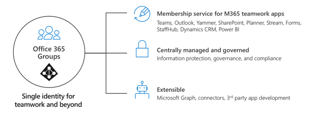

# Pianificare la governance nei gruppi

I gruppi di Microsoft 365 dispongono di un set completo di strumenti per implementare le funzionalità di governance che l'organizzazione potrebbe richiedere. In questo articolo vengono illustrati i professionisti IT per porre le domande giuste per determinare i propri requisiti per la governance e come soddisfarli in base al profilo dell'organizzazione.

## Perché i gruppi di Microsoft 365?

Sappiamo che oggi le organizzazioni utilizzano un set di strumenti diversificato. C'è il team di sviluppatori che utilizza Team Chat, i dirigenti che inviano messaggi di posta elettronica e l'intera organizzazione che si connette a Enterprise Social. Gli strumenti di collaborazione multipli sono in uso perché ogni gruppo è univoco e ha le proprie esigenze funzionali e Workstyle. Alcuni utilizzeranno solo messaggi di posta elettronica, mentre altri vivranno principalmente in chat. 

Se gli utenti avvertono che gli strumenti forniti da IT non soddisfano le proprie esigenze, è probabile che scaricheranno l'app consumer preferita che supporta gli scenari. Sebbene questo processo consenta agli utenti di iniziare rapidamente, comporta una frustrante esperienza utente all'interno dell'organizzazione con più accessi, difficoltà di condivisione e nessun singolo luogo per la visualizzazione del contenuto. Questo concetto è denominato "Shadow IT" e rappresenta un rischio significativo per le organizzazioni. Riduce la possibilità di gestire in modo uniforme l'accesso degli utenti, garantire la sicurezza e le esigenze di conformità dei servizi.

Microsoft 365 groups autorizza gli utenti e riduce il rischio di ombreggiarlo fornendo in un unico passaggio molti degli strumenti necessari per collaborare. I gruppi di Microsoft 365 consentono di scegliere un insieme di persone con cui si desidera collaborare e di configurare facilmente una raccolta di risorse per la condivisione di tali utenti. L'assegnazione manuale delle autorizzazioni alle risorse è una cosa del passato, in quanto l'aggiunta di membri al gruppo garantisce automaticamente le autorizzazioni necessarie a tutte le risorse fornite dal gruppo.

## Architettura tecnica

Sono disponibili tre metodi di comunicazione principali supportati dai gruppi di Microsoft 365. È possibile creare gruppi all'interno di queste esperienze e utilizzarli in Microsoft 365:
- Outlook: collaborazione tramite posta elettronica con un gruppo condiviso posta in arrivo e calendario
- Microsoft teams: un'area di lavoro basata su Chat persistente in cui è possibile avere conversazioni informali e in tempo reale su una serie di argomenti, organizzati da sottogruppi specifici
- Yammer: Enterprise Social Experience for Collaboration

> [!NOTE]
> La creazione di un nuovo gruppo tramite altre applicazioni di teamwork, ad esempio SharePoint, planner o stream, creerà un gruppo con una casella di posta in arrivo di Outlook e la possibilità di connettersi a Microsoft teams.

A seconda della posizione in cui viene creato un gruppo, vengono automaticamente provisionate alcune risorse, ad esempio:
- [Posta in arrivo](https://support.microsoft.com/en-us/office/have-a-group-conversation-in-outlook-a0482e24-a769-4e39-a5ba-a7c56e828b22) -per le conversazioni di posta elettronica tra i membri del gruppo. La posta in arrivo ha un indirizzo di posta elettronica e può essere impostata in modo da accettare i messaggi provenienti da utenti esterni al gruppo e persino all'esterno dell'organizzazione, analogamente a una lista di distribuzione tradizionale.
 - [Calendario](https://support.office.com/article/schedule-a-meeting-on-a-group-calendar-in-outlook-0cf1ad68-1034-4306-b367-d75e9818376a) – per la pianificazione degli eventi relativi al gruppo
- [Sito del team di SharePoint](https://support.office.com/article/what-is-a-sharepoint-team-site-75545757-36c3-46a7-beed-0aaa74f0401e) – archivio centrale per informazioni, collegamenti e contenuti relativi al gruppo
- [Raccolta documenti di SharePoint](https://support.microsoft.com/en-us/office/share-group-files-in-outlook-749bc73b-90c9-4760-9b6f-9aa1cf01b403) – una posizione centrale per il gruppo per l'archiviazione e la condivisione dei file
- [Blocco appunti di OneNote](https://support.office.com/article/get-started-with-onenote-e768fafa-8f9b-4eac-8600-65aa10b2fe97) – per raccogliere idee, ricerche e informazioni
- [Planner](https://support.office.com/article/microsoft-planner-help-4a9a13c6-3adf-4a60-a6fc-15c0b15e16fc) – per l'assegnazione e la gestione delle attività del progetto tra i membri del gruppo
- [Yammer Group](https://support.office.com/article/Learn-about-Office-365-groups-b565caa1-5c40-40ef-9915-60fdb2d97fa2) – un luogo comune per avere conversazioni e condividere informazioni
- Microsoft teams-un'area di lavoro basata su chat in Microsoft 365

Per ulteriori informazioni sulle risorse create per ogni gruppo, visitare informazioni [sui gruppi di Microsoft 365](https://support.office.com/article/learn-about-office-365-groups-b565caa1-5c40-40ef-9915-60fdb2d97fa2).

> [!NOTE]
> Quando viene creato un nuovo gruppo di Microsoft 365 tramite Yammer o teams, il gruppo non è visibile in Outlook o nella rubrica perché la comunicazione principale tra gli utenti avviene nei rispettivi client. I gruppi di Yammer non possono essere connessi a Microsoft teams.

## Dove avviare una conversazione
Sono disponibili più posizioni per una conversazione all'interno di Microsoft 365. La comprensione del punto in cui avviare una conversazione può consentire alle organizzazioni di definire una strategia per la comunicazione.

- Teams: area di lavoro basata su chat (collaborazione ad alta velocità) – ciclo interno
   - Creato per la collaborazione con le persone con cui lavori ogni giorno
  - Inserisce informazioni a portata di mano degli utenti in una singola esperienza
  - Aggiungere schede, connettori e bot
  - Chat dal vivo, conferenze audio/video, riunioni registrate

- Yammer: Connect across the org (Enterprise Social) – ciclo esterno
  - Community of practice-gruppi interfunzionali di persone che condividono un interesse o un'esperienza comune ma non lavorano necessariamente insieme in base alla giornata.
  - Connessione di leadership, community di apprendimento, community basate sui ruoli

- Gruppi di Outlook: Modern DL (collaborazione basata su posta elettronica)
  - Onnipresente per le comunicazioni mirate
  - Aggiornare DLs ai gruppi di Microsoft 365 – [perché è consigliabile eseguire l'aggiornamento?](https://support.microsoft.com/office/why-you-should-upgrade-your-distribution-lists-to-groups-in-outlook-7fb3d880-593b-4909-aafa-950dd50ce188)

- SharePoint – esperienza di collaborazione con i contenuti di base per tutti i gruppi di Microsoft 365
  - Ogni gruppo ottiene un sito del team di SharePoint connesso
  - Condivisione di contenuto, creazione di pagine personalizzate e notizie sull'autore
  - [Connettere](https://docs.microsoft.com/sharepoint/dev/features/groupify/groupify-overview) i siti del team di SharePoint esistenti ai nuovi gruppi di Microsoft 365

##  Gestione e governance di Microsoft 365 in scala

I gruppi di Microsoft 365 dispongono di un set completo di strumenti per implementare le funzionalità di governance che l'organizzazione potrebbe richiedere. Nella sezione seguente vengono descritte le funzionalità, vengono consigliate le procedure consigliate e vengono fornite indicazioni per porre le domande giuste per determinare i requisiti per la governance e come soddisfarli.

**In questa sezione**:
- [Controllare chi può creare gruppi di Microsoft 365](https://docs.microsoft.com/office365/admin/create-groups/plan-for-groups-governance#control-who-can-create-office-365-groups)
- [Eliminazione e ripristino soft del gruppo](https://docs.microsoft.com/office365/admin/create-groups/plan-for-groups-governance#group-soft-delete-and-restore)
- [Criteri di denominazione dei gruppi](https://docs.microsoft.com/office365/admin/create-groups/plan-for-groups-governance#group-naming-policy)
- [Criteri di scadenza del gruppo](https://docs.microsoft.com/office365/admin/create-groups/plan-for-groups-governance#group-expiration-policy)
- [Accesso Guest del gruppo](https://docs.microsoft.com/office365/admin/create-groups/plan-for-groups-governance#group-guest-access)
- [Criteri di gruppo & protezione delle informazioni](https://docs.microsoft.com/office365/admin/create-groups/plan-for-groups-governance#group-policies--information-protection)
- [Aggiornare gli strumenti di collaborazione tradizionali](https://docs.microsoft.com/office365/admin/create-groups/plan-for-groups-governance#upgrade-traditional-collaboration-tools)
- [Reporting dei gruppi](https://docs.microsoft.com/office365/admin/create-groups/plan-for-groups-governance#groups-reporting)

### Controllare chi può creare gruppi di Microsoft 365
I gruppi possono essere creati dagli utenti finali provenienti da più punti finali, tra cui Outlook, SharePoint, teams e altri ambienti.

> [!Tip]
>- Considerare fortemente self-service per consentire ai proprietari del gruppo.
>- Documentare e comunicare come richiedere un gruppo.
>- Rivisitare gli utenti che possono creare gruppi durante il viaggio nel cloud.
>- È consigliabile utilizzare l'appartenenza dinamica per configurare i membri del gruppo di sicurezza per controllare la creazione del gruppo.
>- Valutare gli scenari di gruppi che possono essere gestiti tramite un'appartenenza dinamica e consentire il servizio self-service per il resto.

Sono disponibili tre modelli principali di provisioning in gruppi: aperto, guidato da IT e controllato. Nella tabella seguente vengono descritti i vantaggi di ogni modello.

| Modello          | Vantaggi                                                   |
| -------------- | ------------------------------------------------------------ |
| Apri (impostazione predefinita) | Gli utenti possono creare i propri gruppi in base alle esigenze, senza dover attendere o preoccuparsi. |
| LED IT         | Gli utenti ne richiedono un gruppo. È in grado di guidarli nella scelta dei migliori strumenti di collaborazione per le proprie esigenze. |
| Controllato     | Creazione di gruppi riservata a utenti, team o servizi specifici. Per ulteriori informazioni, vedere [gestire gli utenti che possono creare gruppi di Microsoft 365](https://docs.microsoft.com/microsoft-365/admin/create-groups/manage-creation-of-groups). |

È possibile che l'organizzazione disponga di requisiti specifici per implementare controlli rigorosi su chi può creare gruppi. Utilizzare la tabella seguente per semplificare la scelta del modello di provisioning per l'organizzazione.

|         |         |         |
|---------|---------|---------|
||Punti decisionali|<ul><li>Quali modelli di provisioning sono adatti ai requisiti dell'organizzazione?</li><li>L'organizzazione richiede la limitazione della creazione di un gruppo agli amministratori?</li><li>L'organizzazione richiede la limitazione della creazione dei gruppi ai membri del gruppo di sicurezza?</li><li>L'organizzazione richiede che alcuni gruppi vengano creati in modo dinamico in base agli attributi degli utenti, ad esempio il reparto?</li></ul>|
||Passaggi successivi|<ul><li>Documentare i requisiti dell'organizzazione per la creazione di gruppi e team.</li><li>Pianificare l'implementazione di tali requisiti come parte dell'implementazione dei gruppi.</li><li>Comunicare e pubblicare i criteri per informare gli utenti del comportamento che possono essere previsti</li><li>Pianificare l'implementazione dell'appartenenza dinamica, se applicabile.</li></ul>|

> [!Important]
> La limitazione della creazione di gruppi e team può rallentare la produttività degli utenti perché molti servizi Microsoft 365 richiedono la creazione di gruppi per il servizio. Per ulteriori informazioni, vedere [perché controllare chi crea i gruppi di Microsoft 365?](https://docs.microsoft.com/office365/admin/create-groups/manage-creation-of-groups?view=o365-worldwide%23why-control-who-creates-office-365-groups)

#### *Risorse*
- [Gestire gli utenti autorizzati a creare i gruppi di Microsoft 365](https://docs.microsoft.com/office365/admin/create-groups/manage-creation-of-groups?view=o365-worldwide)
- [Popolare i gruppi in modo dinamico in base agli attributi degli oggetti](https://docs.microsoft.com/azure/active-directory/active-directory-accessmanagement-groups-with-advanced-rules)
- [Informazioni su come modificare l'impostazione predefinita dei gruppi di Microsoft 365 per Outlook, su pubblico o privato](https://support.office.com/article/office-365-groups-in-outlook-private-by-default-36236e39-26d3-420b-b0ac-8072d2d2bedc)
- [Sincronizzazione dei gruppi di sicurezza con l'appartenenza al team](https://techcommunity.microsoft.com/t5/Microsoft-Teams-Blog/Syncing-Security-Groups-with-team-membership/ba-p/241959)

### Eliminazione e ripristino soft del gruppo
Se è stato eliminato un gruppo di Microsoft 365, per impostazione predefinita viene conservato per 30 giorni. Questo periodo di 30 giorni è definito di "eliminazione temporanea", perché è ancora possibile ripristinare il gruppo. Dopo 30 giorni, il gruppo e i contenuti associati vengono eliminati definitivamente e non possono essere ripristinati.

> [!Tip]
>- Comunicare il processo di ripristino agli utenti.
>- Addestrare il team del supporto tecnico.
>- Tenere presenti i gruppi imminenti che verranno eliminati utilizzando lo script di PowerShell.

|         |         |         |
|---------|---------|---------|
||Punti decisionali|<ul><li>È necessario che determinate risorse vengano archiviate per l'archiviazione a lungo termine?</li><li>Si dispone di determinati requisiti di conservazione per l'organizzazione?</li></ul>|
||Passaggi successivi|<ul><li>Comunicare e pubblicare i criteri di eliminazione e ripristino per informare gli utenti del comportamento che possono essere previsti </li><li> Documentare i requisiti delle organizzazioni per il monitoraggio dei gruppi eliminati.</li><li>Pianificare l'implementazione di questi requisiti come parte dell'implementazione dei gruppi.</li></ul>|

> [!Important]
>Se durante il periodo di "eliminazione temporanea" un utente prova ad accedere al sito riceve l'errore 403 Accesso negato. Se prova ad accedere successivamente a questo periodo, riceve l'errore 404 Pagina non trovata.

#### *Risorse*
- [Ripristinare un gruppo di Microsoft 365 eliminato](https://docs.microsoft.com/microsoft-365/admin/create-groups/restore-deleted-group?ui=en-US&rs=en-001&ad=US)
- [Ripristinare un gruppo di Microsoft 365 eliminato in Azure Active Directory](https://docs.microsoft.com/azure/active-directory/users-groups-roles/groups-restore-deleted)
- [Eliminare gruppi usando il cmdlet Remove-UnifiedGroup](https://technet.microsoft.com/library/mt238270%28v=exchg.160%29.aspx)

### Criteri di denominazione dei gruppi
I criteri di denominazione consentono all'utente e agli utenti di identificare la funzione del gruppo, dell'appartenenza, dell'area geografica o di chi ha creato il gruppo. Il criterio di denominazione può anche contribuire alla categorizzazione dei gruppi nella rubrica. È possibile utilizzare il criterio per bloccare le parole specifiche che vengono utilizzate nei nomi e negli alias di gruppo.

> [!Tip]
> - Utilizzare le stringhe brevi come suffisso.
> - Utilizzare gli attributi con valori.
> - Non è troppo creativo, la lunghezza totale del nome ha un massimo di 264 caratteri.
> - Caricare le parole bloccate specifiche dell'organizzazione per limitare l'utilizzo.

|         |         |         |
|---------|---------|---------|
||Punti decisionali|<ul><li>L'organizzazione richiede una convenzione di denominazione specifica per i gruppi?</li><li>L'organizzazione richiede la convenzione di denominazione tra tutti i carichi di lavoro?</li><li>L'organizzazione dispone di parole specifiche che si desidera impedire agli utenti di utilizzare?</li></ul>|
||Passaggi successivi|<ul><li>Documentare i requisiti dell'organizzazione per i gruppi di denominazione. </li><li> Pianificare l'implementazione di questi requisiti come parte dell'implementazione dei gruppi.</li><li> Comunicare e pubblicare i criteri di denominazione e gli standard per informare gli utenti.</li></ul>|

> [!Important]
>I criteri di denominazione vengono applicati ai gruppi creati in tutti i carichi di lavoro dei gruppi (come Outlook, Microsoft teams, SharePoint, planner, Yammer e così via). Viene applicato sia al nome del gruppo sia all'alias di gruppo. Viene applicato quando un utente crea un gruppo e quando viene modificato il nome o l'alias del gruppo per un gruppo esistente.

#### *Risorse*
- [Criteri di denominazione dei gruppi Microsoft 365](https://docs.microsoft.com/office365/admin/create-groups/groups-naming-policy)
- [Applicazione di un criterio di denominazione per i gruppi di Microsoft 365 in Azure Active Directory](https://go.microsoft.com/fwlink/?linkid=868340)
- [Cmdlet di Azure Active Directory per la configurazione delle impostazioni di gruppo](https://go.microsoft.com/fwlink/?linkid=868341)
- [Funzionalità di anteprima per la denominazione dei gruppi](https://portal.azure.com/#blade/Microsoft_AAD_IAM/GroupsManagementMenuBlade/NamingPolicy)

### Criteri di scadenza del gruppo
Gli amministratori possono specificare un periodo di scadenza e qualsiasi gruppo che raggiunge la fine di quel periodo e non viene rinnovato, verrà eliminato. Il periodo di scadenza inizia quando viene creato il gruppo oppure alla data in cui è stato rinnovato per ultimo. I proprietari del gruppo invieranno automaticamente un messaggio di posta elettronica prima della scadenza che consente loro di rinnovare il gruppo per un altro intervallo di scadenza. I gruppi attivi vengono rinnovati automaticamente.

Dopo aver impostato la scadenza di un gruppo:
- I proprietari del gruppo ricevono una notifica per il rinnovo del gruppo come scadenza vicinanze
- Qualsiasi gruppo che non è stato rinnovato viene eliminato
- Qualsiasi gruppo eliminato può essere ripristinato entro 30 giorni dai proprietari del gruppo o dall'amministratore

> [!Tip]
> - Pilota con gruppi specifici inizialmente.
> - Scegliere gruppi inattivi in base al rapporto attività nell'interfaccia di amministrazione di Microsoft 365.
> - Comunicare il processo di rinnovo ai proprietari del gruppo.
> - Onboard del team del supporto tecnico.
> - Verificare che i gruppi abbiano più proprietari e configurino la posta elettronica per i gruppi orfani

|         |         |         |
|---------|---------|---------|
||Punti decisionali|<ul><li>L'organizzazione richiede di specificare una data di scadenza per i team?</li><li>Determinare la strategia per la gestione dei gruppi orfani.</li></ul>|
||Passaggi successivi|<ul><li>Documentare i requisiti dell'organizzazione per la scadenza del gruppo, la conservazione dei dati e l'archiviazione.</li><li>Pianificare l'implementazione di questi requisiti come parte dell'implementazione dei gruppi.</li><li>Pianificare l'implementazione di un processo personalizzato per il report su gruppi che dispongono di singoli proprietari o che non dispongono di un proprietario. </li></ul>|

> [!Important]
>Quando si modifica il criterio di scadenza, il servizio ricalcola la data di scadenza per ogni gruppo. Inizia sempre a contare dalla data in cui è stato creato il gruppo e quindi applica il nuovo criterio di scadenza.

#### *Risorse*
- [Criteri di scadenza dei gruppi di Microsoft 365](https://support.office.com/article/Office-365-Group-Expiration-Policy-8d253fe5-0e09-4b3c-8b5e-f48def064733?ui=en-US&rs=en-US&ad=US)
- [Configurare il criterio di scadenza per i gruppi di Microsoft 365](https://docs.microsoft.com/azure/active-directory/users-groups-roles/groups-lifecycle)

### Accesso Guest del gruppo
Gli amministratori possono controllare se consentire l'accesso Guest ai gruppi di Microsoft 365 per l'intera organizzazione o per i singoli gruppi di Microsoft 365. Inoltre, possono controllare chi può consentire l'aggiunta di guest ai gruppi.
>[!Tip]
>- Abilitare l'accesso Guest a livello di tenant. Se necessario, blocca per gruppi specifici.
>- Regola l'utilizzo dei domini Guest Consenti/blocca, del ruolo degli invitati, delle recensioni, delle condizioni di utilizzo.
>- Monitorare l'attività degli utenti guest tramite i registri di controllo.

|         |         |         |
|---------|---------|---------|
||Punti decisionali|<ul><li>È necessario limitare la possibilità di aggiungere gli ospiti ai team per ogni singolo gruppo?</li><li> L'organizzazione ha bisogno di presentare dichiarazioni di non responsabilità per i requisiti legali o di conformità?</li><li>L'organizzazione ha la necessità di ridurre le spese amministrative di aggiunta e rimozione degli utenti?</li><li>L'organizzazione prevede controlli di controllo per l'accesso Guest/External?</li></ul>|
||Passaggi successivi|<ul><li>Requisiti del documento per l'accesso Guest/External per alcuni gruppi classificati, tra cui il periodo di conservazione e l'occorrenza.</li><li>Requisiti dell'organizzazione del documento per i quali i gruppi richiederanno termini di utilizzo e revisione dell'accesso. </li><li>Eseguire le recensioni per gestire in modo efficiente le appartenenze ai gruppi sia per gli utenti interni che per quelli Guest.</li></ul>|

#### *Risorse*
- [Collaborare con utenti esterni all'organizzazione](https://docs.microsoft.com/microsoft-365/solutions/collaborate-with-people-outside-your-organization)
- [Gestire l'accesso guest nei gruppi di Microsoft 365](https://docs.microsoft.com/office365/admin/create-groups/manage-guest-access-in-groups)
- [Accesso guest nei gruppi di Microsoft 365](https://support.office.com/article/Guest-access-in-Office-365-Groups-bfc7a840-868f-4fd6-a390-f347bf51aff6)
- [Verifiche di accesso di Azure AD](https://docs.microsoft.com/azure/active-directory/active-directory-azure-ad-controls-perform-access-review)
- [Caratteristica dei termini di utilizzo di Azure Active Directory](https://docs.microsoft.com/azure/active-directory/active-directory-tou)
- [Federazione di Google](https://docs.microsoft.com/azure/active-directory/b2b/google-federation)

### Criteri di gruppo & protezione delle informazioni
I gruppi Microsoft 365 si basano sulle funzionalità avanzate di sicurezza e conformità di Microsoft 365 e supportano la classificazione, il controllo e la creazione di report, la ricerca di contenuti di conformità, l'e-Discovery, il blocco legale e i criteri di conservazione.
>[!Tip]
>- Configurare la classificazione, le linee guida di utilizzo e le etichette in base alle esigenze dell'organizzazione.
>- I criteri di conservazione possono essere definiti indipendentemente dalle etichette.
>- Attività dei gruppi di controllo: creazione, eliminazione e così via.
>- Gestire la privacy di gruppo e l'accesso guest in base alla classificazione.

|         |         |         |
|---------|---------|---------|
||Punti decisionali|<ul><li>L'organizzazione dispone di requisiti di utilizzo specifici che devono essere comunicati a tutti gli utenti?</li><li>L'organizzazione richiede la classificazione di tutto il contenuto?</li><li>L'organizzazione richiede che il contenuto venga conservato per un periodo di tempo specifico?</li><li>L'organizzazione richiede criteri specifici per il mantenimento dei dati da applicare ai gruppi?</li><li>L'organizzazione prevede di richiedere la possibilità di archiviare i gruppi inattivi per preservare il contenuto?</li><li>I creatori di gruppo hanno la possibilità di assegnare classificazioni specifiche dell'organizzazione ai team?</li></ul>|
||Passaggi successivi|<ul><li>Documentare le linee guida per l'utilizzo dell'organizzazione per i gruppi</li><li>Documentare i requisiti dell'organizzazione per la classificazione.</li><li>Determinare i criteri da applicare in base alla classificazione, ad esempio la sensibilità, la conservazione e l'accesso guest.</li><li>Definire le etichette di riservatezza per l'organizzazione e le impostazioni di protezione desiderate associate.</li><li>Definire un criterio di etichetta per controllare gli utenti e i gruppi che visualizzano tali etichette.</li><li>Configurare l' [anteprima dell'etichetta di riservatezza dei gruppi](https://docs.microsoft.com/microsoft-365/compliance/sensitivity-labels-teams-groups-sites) e iniziare a classificare i gruppi nell'organizzazione.</li><li>Pianificare l'implementazione di tali requisiti come parte dell'implementazione dei gruppi.</li></ul>|

#### *Risorse*
- [Collegamento alle linee guida per l'utilizzo dei gruppi di Microsoft 365](https://docs.microsoft.com/office365/enterprise/manage-office-365-groups-with-powershell#link-to-your-office-365-groups-usage-guidelines)
- [Creare classificazioni per i gruppi di Office nell'organizzazione](https://docs.microsoft.com/office365/enterprise/manage-office-365-groups-with-powershell#create-classifications-for-office-groups-in-your-organization)
- [Configurare le impostazioni di gruppo](https://docs.microsoft.com/azure/active-directory/active-directory-accessmanagement-groups-settings-cmdlets)
- [Panoramica dei criteri di conservazione](https://docs.microsoft.com/microsoft-365/compliance/retention-policies)
- [Panoramica delle etichette di riservatezza](https://docs.microsoft.com/microsoft-365/compliance/sensitivity-labels)
- [Panoramica delle etichette](https://docs.microsoft.com/microsoft-365/compliance/labels)
- [Eseguire ricerche nel log di controllo](https://docs.microsoft.com/microsoft-365/compliance/search-the-audit-log-in-security-and-compliance)
- [Creare o rimuovere un blocco legale sul posto](https://docs.microsoft.com/exchange/security-and-compliance/create-or-remove-in-place-holds)
- [Creare criteri di conservazione](https://docs.microsoft.com/microsoft-365/compliance/retention-policies)
- [Eseguire una ricerca contenuto nel centro sicurezza & Compliance](https://docs.microsoft.com/microsoft-365/compliance/content-search)
- [Creare e pubblicare in blocco etichette di conservazione tramite PowerShell](https://docs.microsoft.com/microsoft-365/compliance/bulk-create-publish-labels-using-powershell)

### Aggiornare gli strumenti di collaborazione tradizionali
Per anni le organizzazioni hanno fatto affidamento su gruppi di distribuzione per comunicare e collaborare con gruppi di persone sia all'interno che all'esterno dell'azienda. A questo punto, tuttavia, i gruppi di Microsoft 365 in Outlook offrono una soluzione più potente per la collaborazione. Inoltre, la possibilità di connettere un gruppo di Microsoft 365 a un sito di SharePoint esistente è importante se si vuole modernizzare il sito.

>[!Tip]
>- Aggiornare facilmente tutte le liste di distribuzione idonee in pochi secondi tramite l'interfaccia di amministrazione di Exchange o utilizzando i cmdlet di PowerShell.
>- Connettere i siti del team di SharePoint esistenti ai nuovi gruppi di Microsoft 365.

|         |         |         |
|---------|---------|---------|
||Punti decisionali|<ul><li>L'organizzazione dispone di liste di distribuzione che [non sono idonee](https://docs.microsoft.com/office365/admin/manage/upgrade-distribution-lists#how-do-i-check-which-dls-are-eligible-for-upgrade) per l'aggiornamento?<li>Determinare il tipo di gruppo in cui è la lista di distribuzione di cui è stata eseguita la migrazione.</li></ul>|
||Passaggi successivi|<ul><li>Identificare le liste di distribuzione che sono candidate all'aggiornamento ai gruppi di Microsoft 365.</li><li>Analizzare i siti del team di SharePoint esistenti per vedere quali siti sono pronti per essere connessi al gruppo.</li><li>Consentire ad altri team della società di sapere che è stato aggiornato il gruppo di distribuzione e quali operazioni sono state eseguite per ottenere un esito positivo.</li></ul>|

#### *Risorse*
- [Aggiornare le liste di distribuzione (DL) ai gruppi in Outlook](https://aka.ms/whyupgradedls)
- Eseguire l'aggiornamento con un solo clic tramite l'interfaccia di amministrazione di Exchange o tramite [script di PowerShell](https://docs.microsoft.com/microsoft-365/admin/manage/upgrade-distribution-lists)
- [Eseguire la migrazione delle liste di distribuzione ai gruppi di Microsoft 365-Guida per gli amministratori](https://docs.microsoft.com/office365/admin/manage/upgrade-distribution-lists)
- [Connettere i siti di SharePoint esistenti ai gruppi di Microsoft 365:](https://docs.microsoft.com/sharepoint/dev/transform/modernize-connect-to-office365-group)
- [Analizzare e utilizzare i dati dello scanner](https://docs.microsoft.com/sharepoint/dev/transform/modernize-connect-to-office365-group-scanner)
- [Scanner di modernizzazione di SharePoint](https://github.com/SharePoint/sp-dev-modernization/tree/master/Tools/SharePoint.Modernization) (uno strumento che si trova su GitHub)

### Reporting dei gruppi
Il Dashboard Microsoft 365 Reports illustra la panoramica delle attività nei prodotti Microsoft nell'organizzazione. Consente di eseguire il drill-down fino a visualizzare report a livello di singolo prodotto, per ottenere informazioni più dettagliate sulle attività in ogni prodotto.
> [!TIP]
>- È possibile utilizzare i report sui gruppi per ottenere informazioni dettagliate sull'attività dei gruppi di Microsoft 365 nell'organizzazione e vedere quanti gruppi vengono creati e utilizzati.
>-Il rapporto sui gruppi di Microsoft 365 può essere visualizzato per le tendenze degli ultimi 7, 30, 90 o 180 giorni.
>- Monitorare l'attività di gruppo nelle conversazioni delle cassette postali del gruppo, attività dei siti/file di gruppo, dettagli sull'appartenenza ai gruppi, inclusi i conteggi dei membri
>- Monitorare regolarmente per raggiungere i proprietari dei gruppi attivi per imparare a utilizzare i casi e amplificarli internamente.
>- Sfruttare i pacchetti di contenuto Power BI per ulteriori informazioni.

|         |         |         |
|---------|---------|---------|
||Punti decisionali|<ul><li>L'organizzazione richiede rapporti periodici per comprendere l'utilizzo dei gruppi di Microsoft 365?<li>L'organizzazione richiede la creazione di report su tutti i gruppi che dispongono di membri esterni?</li></ul>|
||Passaggi successivi|<ul><li>Documentare i requisiti dell'organizzazione per esaminare periodicamente i report attività dei gruppi.</li></ul>|

#### *Risorse*
- [Report di Microsoft 365 nell'interfaccia di amministrazione](https://docs.microsoft.com/microsoft-365/admin/activity-reports/office-365-groups)
- [Pacchetto di contenuto Office 365 adoption](https://docs.microsoft.com/microsoft-365/admin/usage-analytics/usage-analytics)
- [Pacchetto di contenuto di Azure AD](https://docs.microsoft.com/azure/active-directory/active-directory-reporting-power-bi-content-pack-how-to)
- [API attività gruppi di Microsoft Graph](https://developer.microsoft.com/graph/docs/api-reference/v1.0/resources/office_365_groups_activity_reports)
- [Relazione sui gruppi di Microsoft 365 (gruppi unificati)](https://gallery.technet.microsoft.com/office/Office-365-Groups-Report-7e3e161b)
- [Rapporti attività di controllo nel portale di Azure Active Directory](https://docs.microsoft.com/azure/active-directory/reports-monitoring/concept-audit-logs)
- [Microsoft Graph-utilizzare la query Delta per tracciare le modifiche](https://docs.microsoft.com/graph/delta-query-overview)

## Guida introduttiva basata sul viaggio di adozione del cloud

I gruppi di Microsoft 365 offrono una vasta gamma di funzionalità di governance che l'organizzazione potrebbe richiedere. Si consideri i seguenti profili dell'organizzazione come linee guida per comprendere le procedure consigliate, porre le domande giuste per determinare i requisiti per la governance e come raggiungerli.

**Si consideri i profili dell'organizzazione seguenti:**
- Azienda di piccole dimensioni
- Azienda di medie dimensioni
- Regolamentati o Enterprise

### Azienda di piccole dimensioni
Si consideri un'organizzazione che ha distribuito Microsoft 365 con almeno licenze di Exchange Online e SharePoint Online che include i piani Business Essentials e Business Premium, nonché i piani Enterprise E1, E3 ed E5 con nessuna licenza di Azure Active Director Premium.

| Fase | Descrizione |
| --------------- | ------------------------------------------------------------ |
| Linee guida |<ul><li>Si consideri un modello di provisioning self-service.</li><li> I gruppi in Outlook & i siti [di SharePoint sono privati per impostazione predefinita](https://techcommunity.microsoft.com/t5/Office-365-Groups/Groups-in-Outlook-and-Group-connected-team-sites-are-now-private/m-p/186395).</li><li> I gruppi possono essere creati mediante l'aggiornamento delle liste di distribuzione esistenti (DLs, One-by-One o bulk) tramite PowerShell. Vedere [aggiornare le liste di distribuzione ai gruppi di Microsoft 365](https://docs.microsoft.com/microsoft-365/admin/manage/upgrade-distribution-lists).</li><li> Abilitare l'accesso guest ma governare utilizzando i domini Guest Consenti/blocca.</li><li> Utilizzare i report di gruppo per ottenere informazioni su come gli utenti utilizzano i gruppi.</li><li> Valutare la possibilità di creare un team di Microsoft Teams a livello di organizzazione per tutti di essere parte di un singolo team per la collaborazione. </li></ul>|
| Operazioni successive      |<ul><li>È consigliabile utilizzare le [progettazioni siti e gli script dei siti](https://docs.microsoft.com/sharepoint/dev/declarative-customization/site-design-overview) per definire la struttura predefinita per i controlli utilizzando le azioni definite all'interno della Guida di [riferimento allo schema JSON](https://docs.microsoft.com/sharepoint/dev/declarative-customization/site-design-json-schema).</li><li>Esaminare i [report dei gruppi](https://docs.microsoft.com/microsoft-365/admin/activity-reports/office-365-groups).</li><li>Monitorare i gruppi totali e i gruppi inattivi/attivi.</li><li>Monitorare sia lo spazio di archiviazione di Exchange che quello di SharePoint utilizzato.</li><li>Visualizzare le attività di gruppo nelle conversazioni delle cassette postali del gruppo, attività dei siti/file di gruppo, ecc.</li></ul> |

### Azienda di medie dimensioni
Oltre ai consigli riportati sopra, prendere in considerazione quanto segue per le aziende di medie dimensioni che hanno distribuito Microsoft 365 con almeno un Enterprise E3/E5 con le licenze di Azure Active Directory Premium P1.

| Fase | Descrizione |
| --------------- | ------------------------------------------------------------ |
| Linee guida |<ul><li>Decidere su un modello di provisioning aperto o guidato da IT.</li><li> Valutare la possibilità di creare alcuni gruppi associati a [regole di appartenenza dinamiche](https://docs.microsoft.com/azure/active-directory/users-groups-roles/groups-dynamic-membership) basate su attributi di Azure ad come Department</li><li> Definire le classificazioni all'interno dell'organizzazione, ad esempio, estremamente riservate, riservate (impostazione predefinita), generale.</li><li>  Definire i criteri in base alla classificazione, ad esempio la conservazione e la sensibilità.</li><li> SharePoint è il servizio di contenuto per ogni gruppo di Microsoft 365. Valutare la possibilità [di progettare e distribuire siti di SharePoint Online per tre livelli di protezione (di](https://docs.microsoft.com/office365/enterprise/deploy-sharepoint-online-sites-for-three-tiers-of-protection) base, sensibili e altamente riservati). Per altre informazioni su questi tre livelli di protezione, vedere [Proteggere siti e file di SharePoint Online](https://docs.microsoft.com/office365/enterprise/secure-sharepoint-online-sites-and-files).</li><li> Per impostazione predefinita, entrambi i gruppi pubblici e privati sono elencati nell'elenco indirizzi globale. Determinare i gruppi che si desidera visualizzare nell'elenco indirizzi globale, in particolare i gruppi creati all'esterno di Microsoft teams.  Utilizzare il cmdlet [set-UnifiedGroup](https://technet.microsoft.com/library/mt238274(v=exchg.160).aspx) "HiddenFromAddressListsEnabled" o "HidefromExchangeClients" per nascondere gruppi specifici.</li></ul> |
| Operazioni successive      |<ul><li>Definire le [linee guida](https://docs.microsoft.com/azure/active-directory/active-directory-accessmanagement-groups-settings-cmdlets) per l'utilizzo per informare gli utenti sulle procedure consigliate che consentono di mantenere i propri gruppi in modo efficace ed educarli sui criteri di contenuto interno. Ad esempio, informazioni sulle classificazioni, i criteri e le procedure. </li><li>Definire il periodo del ciclo di vita del gruppo che i gruppi devono essere rinnovati o verranno eliminati-criterio di scadenza.</li><li>Valutare la possibilità di creare i processi personalizzati seguenti per implementare i criteri in base alle classificazioni.</li><li>Impostare la privacy su privato.</li><li>Disabilitare l'appartenenza/condivisione esterna. </li><li>Messaggi di posta elettronica per informare i membri del gruppo per i gruppi [senza proprietario](https://support.office.com/article/Assign-a-new-owner-to-an-orphaned-group-86bb3db6-8857-45d1-95c8-f6d540e45732).</li><li>Applicare i criteri di proprietà (min. 2 proprietari).</li><li> Definire i criteri di conservazione per i gruppi in base alla classificazione. </li><li>Panoramica dei criteri di conservazione.</li><li>Utilizzo di PowerShell per identificare i gruppi con una classificazione e [set-RetentionCompliancePolicy](https://docs.microsoft.com/powershell/module/exchange/set-retentioncompliancepolicy?view=exchange-ps).</li><li>È consigliabile utilizzare le progettazioni siti e gli script dei siti per definire i controlli utilizzando le azioni definite all'interno della Guida di [riferimento allo schema JSON](https://docs.microsoft.com/sharepoint/dev/declarative-customization/site-design-json-schema).</li><li>Valutare la possibilità di creare [una directory di sito semplice utilizzando una struttura di sito](https://docs.microsoft.com/sharepoint/dev/declarative-customization/site-design-trigger-flow-tutorial) e Microsoft Flow. Ogni volta che si crea un sito utilizzando la struttura del sito, i dettagli del sito vengono acquisiti e scritti in un elenco. </li></ul>|

### Regolamentati o Enterprise
Oltre ai consigli riportati sopra, tenere conto di quanto segue per le aziende di invio estremamente regolamentate o di grandi dimensioni, ad esempio il governo, i servizi finanziari o l'assistenza sanitaria che ha distribuito Office 365 con almeno un'Enterprise E3/E5 con le licenze P1/P2 di Azure Active Directory Premium.

| Fase | Descrizione |
| --------------- | ------------------------------------------------------------ |
| Linee guida |<ul><li> Definire i criteri per la governance dei dati del sito di SharePoint associato al gruppo in base alla classificazione.</li><li>[Proteggere i file di SharePoint Online con etichette e DLP](https://docs.microsoft.com/office365/enterprise/protect-sharepoint-online-files-with-office-365-labels-and-dlp).</li><li>[Proteggere i file di SharePoint Online con Azure Information Protection](https://docs.microsoft.com/office365/enterprise/protect-sharepoint-online-files-with-azure-information-protection).</li><li> Sito del gruppo di cui è stato effettuato il provisioning in un'area geografica associata alla posizione dati preferita dell'utente ([multi-Geo](https://docs.microsoft.com/office365/enterprise/multi-geo-capabilities-in-onedrive-and-sharepoint-online-in-office-365)).</li><li> Recensioni di appartenenza per gruppi con membri esterni ([Access reviews](https://docs.microsoft.com/azure/active-directory/active-directory-azure-ad-controls-access-reviews-overview)).</li><li>Verificare che i dipendenti o gli utenti Guest visualizzino le dichiarazioni di non responsabilità per i requisiti legali o di conformità prima di ottenere l'accesso. ([condizioni di utilizzo](https://docs.microsoft.com/azure/active-directory/governance/active-directory-tou)).</li><li>Identificare e segnalare i gruppi di Microsoft 365 con una determinata [classificazione che dispone anche di utenti esterni](https://techcommunity.microsoft.com/t5/Office-365-Groups/Sample-Powershell-to-identify-groups-with-HBI-classification-and/m-p/215561).</li><li>I gruppi segreti in cui è necessario nascondere le appartenenze devono essere creati utilizzando il cmdlet [New-UnifiedGroup](https://technet.microsoft.com/library/mt219359(v=exchg.160).aspx) (utilizzando l'opzione HiddenGroup-MembershipEnabled) per la creazione di gruppi.</li><li>Definire le [etichette di riservatezza](https://docs.microsoft.com/microsoft-365/compliance/sensitivity-labels) per l'organizzazione per [limitare l'accesso al contenuto utilizzando la crittografia](https://docs.microsoft.com/microsoft-365/compliance/encryption-sensitivity-labels) e la pubblicazione su specifici gruppi di Microsoft 365.</li><li>Impedire ai contenuti sensibili di lasciare l'organizzazione nei dispositivi che eseguono Windows utilizzando le [etichette di riservatezza con Windows Information Protection](https://docs.microsoft.com/windows/security/information-protection/windows-information-protection/how-wip-works-with-labels?branch=vsts17546553). |
| Operazioni successive      | <ul><li> Utilizzare la struttura del sito e gli script dei siti per definire le [azioni](https://developer.microsoft.com/office/blogs/site-scripts-site-designs-summer-2018-update/) predefinite che si verificano quando viene creato un nuovo sito. Ad esempio, [configurare l'impostazione di condivisione esterna](https://github.com/SharePoint/sp-dev-site-scripts/tree/master/samples/site-apply-external-sharing-setting) o [attivare un flusso di Microsoft per chiamare una funzione di Azure](https://github.com/SharePoint/sp-dev-site-scripts/tree/master/samples/site-azure-function) per applicare configurazioni non supportate in modalità nativa. </li><li> Requisiti dei documenti per [proteggere i file di SharePoint Online con etichette e DLP nei](https://docs.microsoft.com/office365/enterprise/protect-sharepoint-online-files-with-office-365-labels-and-dlp) siti associati ai gruppi di Microsoft 365.</li><li>Requisiti dell'organizzazione del documento per [proteggere i siti e i file di SharePoint Online](https://docs.microsoft.com/microsoft-365/security/office-365-security/secure-sharepoint-online-sites-and-files) connessi ai gruppi di Microsoft 365. </li><li>Requisiti dell'organizzazione del documento per pubblicare le [etichette di riservatezza](hhttps://docs.microsoft.com/microsoft-365/compliance/sensitivity-labels) su utenti o gruppi specifici per proteggere il contenuto.</li></ul> |

## Elenco di controllo di pianificazione delle funzionalità di gestione dei gruppi

È possibile amministrare un certo numero di controlli correlati a gruppi tramite Azure Active Directory. Per ulteriori informazioni sulla configurazione delle impostazioni di gruppo, vedere [cmdlet di Azure Active Directory per la configurazione delle impostazioni di gruppo](https://docs.microsoft.com/azure/active-directory/users-groups-roles/groups-settings-cmdlets).

Utilizzare la tabella seguente per determinare le funzionalità necessarie per la distribuzione dei requisiti delle organizzazioni. Consente di determinare le licenze necessarie per poter pianificare in anticipo.

| **Funzionalità**      | **Dettagli**                                    | **Licenza Premium di Azure AD** | **Decisione** |
| ------------------- | ---------------------------------------------- | ------------------------------------- | ------------ |
| Criteri di denominazione dei gruppi | Utilizzo di parole bloccate personalizzate con suffisso prefix. | P1                                    |      TBD     |
| Classificazione del gruppo | Assegnare le classificazioni ai team. | P1                                    |   TBD        |
| Accesso Guest del gruppo | Consentire o impedire agli utenti di essere aggiunti ai gruppi. | No                                    |  TBD        |
| Creazione di gruppi | Limitare la creazione del team agli amministratori. | No                                    |   TBD        |
| Creazione di gruppi | Limitare la creazione del team ai membri del gruppo di sicurezza. | P1                                    |     TBD      |
| Linee guida per l'utilizzo di gruppi | Impostare un collegamento le linee guida per l'utilizzo dei gruppi che saranno visibili su tutti gli endpoint di creazione del gruppo. | P1                                    |   TBD        |
| Appartenenza nascosta | Nascondere i membri del gruppo Microsoft 365 dagli utenti che non sono membri del gruppo | No                                    |   TBD        |
| Criteri di scadenza | Gestire il ciclo di vita dei gruppi di Microsoft 365 impostando un criterio di scadenza. | P1                                    |  TBD        |
| Rapporti attività di gruppo | Ottenere informazioni dettagliate sull'attività dei gruppi di Microsoft 365 nell'organizzazione e vedere quanti gruppi di Microsoft 365 vengono creati e utilizzati. | No                                    |    TBD       |
| Criterio di conservazione | Mantenere o eliminare i dati per un periodo di tempo specifico impostando i criteri di conservazione per i gruppi di Microsoft 365 nel centro sicurezza & Compliance. **Nota:** L'utilizzo di questa funzionalità richiede la gestione delle licenze di Office 365 Enterprise E3 o superiori. | No                                    |    TBD       |
| Criteri di prevenzione della perdita di dati | Identificare le informazioni riservate tra i siti connessi a Microsoft 365 Group e impedire la condivisione accidentale. **Nota:** L'utilizzo di questa funzionalità richiede la gestione delle licenze di Office 365 Enterprise E3 o superiori. | No                                    |     TBD      |
| Archiviazione e ripristino | Archiviare un team quando non è più attivo, ma si desidera conservarlo per informazioni di riferimento o per riattivarlo in futuro. | No                                    |   TBD        |
| Recensioni di Access | Eseguire le recensioni per gestire in modo efficiente le appartenenze ai gruppi sia per gli utenti interni che per quelli Guest | P2                                    |   TBD       |
| Condizioni per l'utilizzo | Metodo semplice che le organizzazioni possono utilizzare per presentare le informazioni agli utenti finali. Questa presentazione consente agli utenti di visualizzare le dichiarazioni di non responsabilità rilevanti per i requisiti legali o di conformità. | P1                                    |         TBD  |

