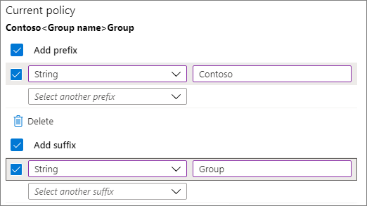
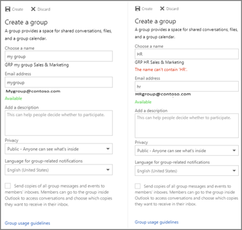

# Criteri di denominazione dei gruppi di Office 365Office 365 Groups naming policy

Per applicare una strategia di denominazione coerente per i gruppi creati dagli utenti dell'organizzazione, è possibile utilizzare un criterio di denominazione del gruppo.You use a group naming policy to enforce a consistent naming strategy for groups created by users in your organization. I criteri di denominazione consentono all'utente e agli utenti di identificare la funzione del gruppo, dell'appartenenza, dell'area geografica o di chi ha creato il gruppo.A naming policy can help you and your users identify the function of the group, membership, geographic region, or who created the group. Il criterio di denominazione può anche contribuire alla categorizzazione dei gruppi nella rubrica.The naming policy can also help categorize groups in the address book. È possibile utilizzare il criterio per bloccare le parole specifiche che vengono utilizzate nei nomi e negli alias di gruppo.You can use the policy to block specific words from being used in group names and aliases.

I criteri di denominazione vengono applicati ai gruppi creati in tutti i carichi di lavoro dei gruppi (come Outlook, Microsoft teams, SharePoint, planner, Yammer e così via).The naming policy is applied to groups that are created across all groups workloads (like Outlook, Microsoft Teams, SharePoint, Planner, Yammer, etc). Viene applicato sia al nome del gruppo sia all'alias di gruppo.It gets applied to both the group name and group alias. Viene applicato quando un utente crea un gruppo e quando viene modificato il nome o l'alias del gruppo per un gruppo esistente.It gets applied when a user creates a group and when group name or alias is edited for an existing group.

> [!TIP]
> I criteri di denominazione del gruppo di Office 365 si applicano solo ai gruppi di Office 365.An Office 365 group naming policy only applies to Office 365 Groups. Non si applica ai gruppi di distribuzione creati in Exchange Online.It doesn't apply to distribution groups created in Exchange Online. Per creare un criterio di denominazione per i gruppi di distribuzione, vedere [Create a Distribution Group Naming Policy](https://docs.microsoft.com/exchange/recipients-in-exchange-online/manage-distribution-groups/create-group-naming-policy).To create a naming policy for distribution groups, see [Create a distribution group naming policy](https://docs.microsoft.com/exchange/recipients-in-exchange-online/manage-distribution-groups/create-group-naming-policy).

I criteri di denominazione del gruppo sono composti dalle funzionalità seguenti:The group naming policy consists of the following features:

- **Criteri di denominazione dei suffissi**: è possibile utilizzare prefissi o suffissi per definire la convenzione di denominazione di gruppi (ad esempio,\_"\_GRP US\_My Group Engineering").**Prefix-Suffix naming policy**: You can use prefixes or suffixes to define the naming convention of groups (for example: "GRP\_US\_My Group\_Engineering"). I prefissi o suffissi possono essere stringhe fisse o attributi utente come [Department] che verranno sostituiti in base all'utente che crea il gruppo.The prefixes/suffixes can either be fixed strings or user attributes like [Department] that will get substituted based on the user who is creating the group.

- **Parole bloccate personalizzate**: è possibile caricare una serie di parole bloccate specifiche per la propria organizzazione che verrebbero bloccate nei gruppi creati dagli utenti.**Custom Blocked Words**: You can upload a set of blocked words specific to their organization that would be blocked in groups created by users. Ad esempio: ""CEO, Payroll, HR" (CEO, Buste paga, RU)".(For example: "CEO, Payroll, HR").

## Requisiti per la licenzaLicensing requirements

L'utilizzo dei criteri di denominazione di Azure AD per i gruppi di Office 365 richiede che siano in possesso, ma non necessariamente, di una licenza di Azure Active Directory Premium P1 o di una licenza di Azure AD Basic EDU per ogni utente univoco (compresi gli ospiti) che sia membro di uno o più gruppi di Office 365.Using Azure AD naming policy for Office 365 groups requires that you possess but not necessarily assign an Azure Active Directory Premium P1 license or Azure AD Basic EDU license for each unique user (including guests) that is a member of one or more Office 365 groups.
Questa operazione è necessaria anche per l'amministratore che crea i criteri di denominazione dei gruppi.This is also required for the administrator that creates the Groups naming policy.

## Prefisso-suffisso Naming PolicyPrefix-Suffix naming policy

I prefissi e i suffissi possono essere stringhe fisse o attributi utente.Prefixes and suffixes can either be fixed strings or user attributes.

### Stringhe fisseFixed strings

È possibile utilizzare stringhe brevi che consentono di differenziare i gruppi nell'elenco indirizzi globale e nel NAV sinistro dei carichi di lavoro di gruppo.You can use short strings that can help you differentiate groups in the GAL and Left nav of the group workloads. Alcuni dei suffissi comuni prefissi sono parole chiave come "GRP\_Name", "\#Name", "\_Name"Some of the common prefixes suffixes are Keywords like 'Grp\_Name' , '\#Name', '\_Name'

### AttributiAttributes

È possibile utilizzare gli attributi che consentono di identificare chi ha creato il gruppo come [Department] e dove è stato creato da like [Country].You can use attributes that can help identify who created the group like [Department] and where it was created from like [Country].

|||
|:-----|:-----|
|**Esempi****Examples**|Criterio = "GRP [GroupName] [Department]"Policy = "GRP [GroupName] [Department]"|
||Reparto dell'utente = ProgettazioneUser's department = Engineering|
||Nome del gruppo creato = "GRP Mio gruppo Progettazione"Created group name = "GRP My Group Engineering"|

Gli attributi di Azure Active Directory (Azure AD) supportati sono [Department], [Company], [Office], [StateOrProvince], [CountryOrRegion], [title]Supported Azure Active Directory (Azure AD) attributes are [Department], [Company], [Office], [StateOrProvince], [CountryOrRegion], [Title]

- Gli attributi utente non supportati sono considerati stringhe fisse. Ad esempio, [Codicepostale]"Unsupported user attributes are considered as fixed strings. E.g. "[postalCode]"

- Gli attributi di estensione e gli attributi personalizzati non sono supportati.Extension attributes and custom attributes aren't supported.

È consigliabile usare attributi contenenti valori compilati per tutti gli utenti dell'organizzazione e non usare attributi con valori lunghi.It's recommended that you use attributes that have values filled in for all users in your organization and don't use attributes that have longer values.

### Elementi di cui eseguire la ricercaThings to look out for

- Durante la creazione dei criteri, la lunghezza totale delle stringhe di prefisso e suffisso è limitata a 53 caratteri.During policy creation, the total prefixes and suffixes string length is restricted to 53 characters.

- Prefissi e suffissi possono contenere caratteri speciali supportati nel nome e nell'alias del gruppo. Quando i prefissi e suffissi contengono caratteri speciali non consentiti nell'alias del gruppo, questi vengono rimossi e applicati all'alias del gruppo. In questo caso, quindi, i prefissi e suffissi applicati al nome del gruppo sarebbero diversi da quelli applicati all'alias del gruppo.Prefixes and suffixes can contain special characters supported in group name and group alias. When the prefixes and suffixes contain special characters that are not allowed in the group alias, they are removed and applied to the group alias. So in this case, the prefixes and suffixes applied to group name would be different from the ones applied to the group alias.

- Se si utilizzano i gruppi connessi di Yammer Office 365, evitare di usare i seguenti caratteri nei criteri di denominazione: \#@ \[, \], \<,, \>e.If you are using Yammer Office 365 connected groups, avoid using the following characters in your naming policy: @, \#, \[, \], \<, and \>. Se questi caratteri sono inclusi nei criteri di denominazione, gli utenti di Yammer regolari non potranno creare gruppi.If these characters are in the naming policy, regular Yammer users will not be able to create groups.

## Parole bloccate personalizzateCustom blocked words

È possibile immettere un elenco separato da virgole di parole bloccate che verranno bloccate nei nomi e negli alias di gruppo.You can enter a comma separated list of blocked words that will be blocked in group names and aliases.

Il controllo delle parole bloccate viene effettuato sul nome del gruppo immesso dall'utente.The blocked words check is done on the user entered group name. Pertanto, se l'utente immette ' darnit ' e\_' prefix ' è il criterio di denominazione\_,' prefix darnit ' avrà esito negativo.So if user enters 'darnit' and 'Prefix\_' is the naming policy, 'Prefix\_darnit' will fail.

Non vengono eseguite ricerche in una stringa secondaria. in particolare, è necessaria una corrispondenza esatta tra il nome immesso dall'utente e le parole bloccate personalizzate per attivare un errore.No sub-string searches are carried out; specifically, an exact match between the user entered name and the custom blocked words is required to trigger a failure. La ricerca di sottostringhe non viene eseguita in modo che gli utenti possono usare parole normali come "rinculo" anche se "culo" è una parola bloccata.Sub-string search isn't done so that users can use some of the common words like 'Class' even if 'ass' is a blocked word.

**Aspetti da cercare**:**Things to look out for**:

- Per le parole bloccate non viene fatta distinzione tra maiuscole e minuscole.The blocked words are case-insensitive.

- Quando si immette una parola bloccata, il client del gruppo mostrerà un messaggio di errore con la parola bloccata.When a user enters a blocked word, the group client will show an error message with the blocked word.

- Per le parole bloccate usate non sono previste limitazioni sul limite di caratteri.There are no character restrictions in the blocked words used.

- Vi è un limite superiore di 5000 parole che possono essere impostate come parole bloccate.There is an upper limit of 5000 words that can be set as blocked words.

## Override per gli amministratoriAdmin override

Alcuni amministratori non sono soggetti a questi criteri in tutti gli endpoint e i carichi di lavoro di gruppo, possono quindi creare gruppi con le parole bloccate e con le convenzioni di denominazione che preferiscono. L'elenco seguente contiene i ruoli di amministratore non soggetti ai criteri di denominazione del gruppo.Selective administrators are exempted from these policies, across all group workloads and endpoints, so that they can create groups with these blocked words and with their desired naming conventions. The following are the list of administrator roles exempted from the group naming policy.

- Amministratore globaleGlobal admin

- Supporto partner - Livello 1Partner Tier 1 Support

- Supporto partner - Livello 2Partner Tier 2 Support

- Amministratore degli account utenteUser account admin

- Ruoli con autorizzazioni di scrittura nella directoryDirectory writers

## Come configurare i criteri di denominazioneHow to set up the naming policy

Per impostare i criteri di denominazione:To set up a naming policy:

1. In [Azure Active Directory](https://aad.portal.azure.com), in **gestione**, fare clic su **gruppi**.In [Azure Active Directory](https://aad.portal.azure.com), under **Manage**, click **Groups**.
2. In **Impostazioni**fare clic su **criteri di denominazione**.Under **Settings**, click **Naming policy**.
3. Scegliere la scheda **criteri di denominazione dei gruppi** .Choose the **Group naming policy** tab.
4. In **criterio corrente**scegliere se si desidera richiedere un prefisso o un suffisso o entrambi, quindi selezionare le caselle di controllo appropriate.Under **Current policy**, choose if you want to require a prefix or suffix or both, and select the appropriate check boxes.
5. Scegliere tra l' **attributo** e la **stringa** per ogni riga e quindi specificare l'attributo o la stringa.Choose between **Attribute** and **String** for each line and then specify the attribute or string.
6. Dopo aver aggiunto i prefissi e i suffissi necessari, fare clic su **Salva**.When you have added the prefixes and suffixes that you need, click **Save**.

## Esperienza dei criteri di denominazione nelle app di Office 365Naming policy experiences across Office 365 apps

Le app di Office 365 sono state aggiornate in modo da mostrare un'anteprima del nome di gruppo in base ai criteri di denominazione (con prefissi e suffissi) quando un utente digita il nome e l'alias di gruppo. Quando l'utente immette parole bloccate visualizza un messaggio di errore e può rimuoverle.The Office 365 apps have been updated to show a preview of the naming policy group name (with prefixes and suffixes) when the user types in the group name and alias. When the user enters blocked words, they'll see an error message so they can remove the blocked words.

## Outlook sul webOutlook on the web

Outlook sul Web (in precedenza noto come Outlook Web App o OWA) Visualizza il nome decorato dei criteri di denominazione quando l'utente digita un nome di gruppo o un alias di gruppo.Outlook on the web (formerly known as Outlook Web App or OWA) shows the naming policy decorated name when the user types a group name or group alias. Quando un utente immette una parola bloccata personalizzata, nell'interfaccia utente viene visualizzato un messaggio di errore insieme alla parola, in modo che l'utente possa rimuoverla.When an user enters a custom blocked word, an error message is shown in the UI along with the blocked word so that the user can remove it. Di seguito sono illustrati gli snapshot di Outlook sul Web.Outlook on the web experience snapshots are shown below.

## Outlook desktopOutlook Desktop

I gruppi creati in Outlook desktop sono conformi ai criteri di denominazione.Groups created in Outlook desktop are compliant with naming policy. L'app desktop Outlook non mostra ancora l'anteprima dei criteri di denominazione e non restituisce errori relativi alle parole bloccate personalizzate quando l'utente immette il nome del gruppo.Outlook desktop app doesn't yet show the preview of the naming policy and doesn't return the custom blocked word errors, when the user enters the group name. Tuttavia, i criteri di denominazione verranno applicati automaticamente alla selezione di creazione/modifica e gli utenti verranno presentati con errori se sono presenti parole bloccate personalizzate nel nome o nell'alias del gruppo.However, naming policy will be automatically applied on selecting create/edit and users will be presented with errors if there are custom blocked words in the group name or alias.

## Microsoft TeamsMicrosoft Teams

Microsoft teams Visualizza il nome decorato dei criteri di denominazione quando l'utente digita il nome di un team.Microsoft Teams shows the naming policy decorated name when the user types a team name. Quando un utente immette una parola bloccata personalizzata, viene visualizzato un messaggio di errore insieme alla parola bloccata in modo che l'utente possa rimuoverla.When a user enters a custom blocked word, an error message is shown along with the blocked word so that the user can remove it.

## SharePointSharePoint

SharePoint Visualizza il nome dei criteri di denominazione quando l'utente digita un nome di sito o un indirizzo di posta elettronica di gruppo.SharePoint shows the naming policy name when the user types a site name or group email address. Quando un utente immette una parola bloccata personalizzata, viene visualizzato un messaggio di errore insieme alla parola, in modo che l'utente possa rimuoverla.When an user enters a custom blocked word, an error message is shown, along with the blocked word so that the user can remove it.

## Microsoft StreamMicrosoft Stream

Microsoft Stream mostra il nome decorato dei criteri di denominazione quando l'utente digita il nome o l'alias di posta elettronica di un gruppo. Quando un utente immette una parola bloccata personalizzata, viene visualizzato un messaggio di errore con la parola, in modo che l'utente possa rimuoverla.Microsoft Stream shows the naming policy decorated name when the user types a group name or group email alias. When an user enters a custom blocked word, an error message is shown with the blocked word so the user can remove it.

## App Outlook per iOS e AndroidOutlook iOS and Android App

I gruppi creati nelle app Outlook sono conformi ai criteri di denominazione.Groups created in Outlook apps are compliant with naming policy. Outlook Mobile Visualizza l'anteprima dei criteri di denominazione quando si immette il nome del gruppo.Outlook mobile shows the naming policy preview when entering the Group name. Quando un utente immette una parola bloccata personalizzata, viene visualizzato un messaggio di errore per la creazione del gruppo, in modo che l'utente possa rimuovere la parola bloccata.When a user enters a custom blocked word, an error message is shown on creating the group, so the user can remove the blocked word.

## PlannerPlanner

Planner è conforme ai criteri di denominazione.Planner is compliant with naming policy. Planner Visualizza l'anteprima dei criteri di denominazione quando si immette il nome del piano.Planner shows the naming policy preview when entering the Plan name. Quando un utente immette una parola bloccata personalizzata, viene visualizzato un messaggio di errore per la creazione del piano, in modo che l'utente possa rimuovere la parola bloccata.When a user enters a custom blocked word, an error message is shown on creating the plan, so the user can remove the blocked word.

## Dynamics 365 per l'impegno dei clientiDynamics 365 for Customer Engagement

Dynamics 365 per l'impegno dei clienti è conforme ai criteri di denominazione.Dynamics 365 for Customer Engagement is compliant with naming policy. Dynamics 365 Visualizza il nome decorato dei criteri di denominazione quando l'utente digita un nome di gruppo o un alias di posta elettronica di gruppo.Dynamics 365 shows the naming policy decorated name when the user types a group name or group email alias. Quando l'utente immette una parola bloccata personalizzata, viene visualizzato un messaggio di errore con la parola bloccata in modo che l'utente possa rimuoverla.When the user enters a custom blocked word, an error message is shown with the blocked word so the user can remove it.

## School Data Sync (SDS)School Data Sync (SDS)

I gruppi creati tramite SDS sono conformi ai criteri di denominazione, ma i criteri non vengono applicati automaticamente. Gli amministratori di SDS devono aggiungere i prefissi e suffissi ai nomi delle classi per cui occorre creare gruppi e quindi caricarli in SDS. In caso contrario, la creazione o modifica di gruppi avrà esito negativo.Groups created through SDS comply with naming policy, but the naming policy isn't applied automatically. SDS administrators have to append the prefixes and suffixes to class names for which groups need to be created and then upload to SDS. Groups creation/edit would fail otherwise.

## Gestione dei clienti di Outlook (OCM)Outlook Customer Manager (OCM)

Outlook Customer Manager è conforme ai criteri di denominazione.Outlook Customer Manager is compliant with naming policy. I criteri di denominazione vengono applicati automaticamente al gruppo creato in gestione clienti di Outlook.The naming policy gets automatically applied to the group created in Outlook Customer Manager. Se una qualsiasi delle parole all'interno di "All Sales Team" è definita come una parola bloccata personalizzata, la creazione del gruppo in OCM verrà bloccata.If any of the words within "All Sales Team" is defined as a custom blocked word, the group creation in OCM will be blocked. L'utente non sarà in grado di creare il gruppo OCM e verrà bloccato utilizzando l'app OCM. "The user will not be able to create the OCM group and will be blocked from using the OCM app."

## App ClassroomClassroom App

I gruppi creati nell'app Classroom sono compatibili con i criteri di denominazione, ma i criteri non vengono applicati automaticamente e non viene mostrata un'anteprima dei criteri di denominazione quando gli utenti inseriscono il nome di un gruppo di classe. Gli utenti devono quindi immettere il nome decorato del gruppo di classe con prefissi e suffissi. In caso contrario, la creazione o modifica del gruppo di classe avrà esito negativo con errori.Groups created in classroom app comply with naming policy, but the naming policy isn't applied automatically, and the naming policy preview isn't shown to the users while entering a classroom group name. So users would have to enter the decorated classroom group name with prefixes and suffixes. Otherwise the classroom group create or edit will fail with errors.

## Power BIPower BI

I gruppi creati nelle aree di lavoro di Power BI sono conformi ai criteri di denominazione, ma il criterio di denominazione non viene applicato automaticamente.Groups created in Power BI workspaces comply with the naming policy, but the naming policy isn't applied automatically. L'anteprima dei criteri di denominazione non viene visualizzata agli utenti quando si immette un nome dell'area di lavoro di Power BI.And, the naming policy preview isn't shown to users when they enter a Power BI workspace name.

Il nome consigliato, con il criterio di denominazione applicato, viene visualizzato nei dettagli dell'errore su Crea o modifica aree di lavoro.The recommended name - with the naming policy applied - is shown in the error details on create or edit workspaces. Questo significa che gli utenti devono immettere il nome dell'area di lavoro decorata con prefissi e suffissi.This means users have to enter the decorated workspace name with prefixes and suffixes. In caso contrario, l'area di lavoro creare o modificare avrà esito negativo con errori.Otherwise the workspace create or edit will fail with errors.

## YammerYammer

Quando un utente ha eseguito l'accesso a Yammer con il proprio account di Azure Active Directory crea un gruppo o modifica un nome di gruppo, il nome del gruppo sarà conforme ai criteri di denominazione.When a user signed in to Yammer with their Azure Active Directory account creates a group or edits a group name, the group name will comply with naming policy. Ciò vale sia per i gruppi di Office 365 connessi che per tutti gli altri gruppi di Yammer.This applies both to Office 365 connected groups and all other Yammer groups.

Se è stato creato un gruppo di Office 365 connesso prima che il criterio di denominazione sia sul posto, il nome del gruppo non seguirà automaticamente i criteri di denominazione.If an Office 365 connected group was created before the naming policy is in place, the group name will not automatically follow the naming policies. Quando un utente modifica il nome del gruppo, viene richiesto di aggiungere il prefisso e il suffisso.When a user edits the group name, they will be prompted to add the prefix and suffix.

Se i criteri di denominazione includono caratteri che non possono essere inclusi nei nomi dei gruppi di Yammer, solo gli amministratori saranno in grado di creare un gruppo connesso in Yammer.If the naming policy includes characters that can't be in Yammer group names, only admins will be able to create a connected group in Yammer.

## StaffHubStaffHub

I team di StaffHub non seguono i criteri di denominazione, ma il gruppo di Office 365 sottostante.StaffHub teams do not follow the naming policy, but the underlying Office 365 group does. Al nome del team StaffHub non si applicano prefissi e suffissi e le parole bloccate personalizzate non vengono controllate.StaffHub team name does not apply the prefixes and suffixes and does not check for custom blocked words. Tuttavia, StaffHub applica i prefissi e i suffissi e rimuove le parole bloccate dal gruppo di Office 365 sottostante.But StaffHub does apply the prefixes and suffixes and removes blocked words from the underlying Office 365 group.

## PowerShell di ExchangeExchange PowerShell

I cmdlet di Exchange PowerShell sono conformi ai criteri di denominazione. Se nei nomi e negli alias di gruppo non viene seguita la convenzione di denominazione, gli utenti ricevono messaggi di errore con i suffissi e prefissi suggeriti e per le parole bloccate personalizzate.Exchange PowerShell cmdlets are compliant with naming policy. Users will get appropriate error messages with suggested prefixes and suffixes and for custom blocked words if naming convention isn't used in the group names and group alias.

## Cmdlet di Azure Active Directory PowerShellAzure Active Directory PowerShell cmdlets

I cmdlet di Azure Active Directory PowerShell sono conformi ai criteri di denominazione.Azure Active Directory PowerShell cmdlets are compliant with naming policy. Se nei nomi e negli alias di gruppo non viene seguita la convenzione di denominazione, gli utenti ricevono messaggi di errore con i suffissi e prefissi suggeriti e per le parole bloccate personalizzate.Users will get appropriate error messages with suggested prefixes and suffixes and for custom blocked words if naming convention isn't used in the group names and group alias.

## Interfaccia di amministrazione di ExchangeExchange admin center

L'interfaccia di amministrazione di Exchange (EAC) è conforme ai criteri di denominazione.The Exchange admin center (EAC) is compliant with naming policy. Durante le azioni di creazione e modifica, se nei nomi e negli alias di gruppo non viene seguita la convenzione di denominazione, gli utenti ricevono messaggi di errore con i suffissi e prefissi suggeriti e per le parole bloccate personalizzate.On create or edit actions, users will get appropriate error messages with suggested prefixes and suffixes and for custom blocked words if naming convention isn't used in the group names and group alias.

## Interfaccia di amministrazione di Microsoft 365Microsoft 365 admin center

L'interfaccia di amministrazione di Microsoft 365 è conforme ai criteri di denominazione.The Microsoft 365 admin center is compliant with naming policy. Durante le azioni di creazione e modifica, i criteri di denominazione vengono applicati automaticamente.On create or edit actions, naming policy will automatically get applied. Se gli utenti immettono parole bloccate personalizzate, ricevono errori appropriati.Users will get appropriate errors when they enter custom blocked words. L'interfaccia di amministrazione di Microsoft 365 non mostra ancora l'anteprima dei criteri di denominazione e non restituisce gli errori di Word bloccati personalizzati, quando l'utente immette il nome del gruppo.The Microsoft 365 admin center doesn't yet show the preview of the naming policy and doesn't return the custom blocked word errors, when the user enters the group name.

## Portale di Azure Active DirectoryAzure Active Directory portal

Il portale di Azure Active Directory è conforme ai criteri di denominazione.The Azure Active Directory portal is compliant with naming policy. Il portale di Azure Active Directory Visualizza l'anteprima dei criteri di denominazione quando si immette il nome del gruppo.Azure Active Directory portal shows the naming policy preview when entering the Group name. Quando un utente immette una parola bloccata personalizzata, viene visualizzato un messaggio di errore per la creazione del gruppo, in modo che l'utente possa rimuovere la parola bloccata.When a user enters a custom blocked word, an error message is shown on creating the group, so the user can remove the blocked word.

## Altri articoli sui criteri di denominazioneMore articles on naming policy

[Applicazione di un criterio di denominazione per i gruppi di Office 365 in Azure Active DirectoryEnforce a naming policy for Office 365 groups in Azure Active Directory](https://go.microsoft.com/fwlink/?linkid=868340)

[Cmdlet di Azure Active Directory per la configurazione delle impostazioni di gruppoAzure Active Directory cmdlets for configuring group settings](https://go.microsoft.com/fwlink/?linkid=868341)
