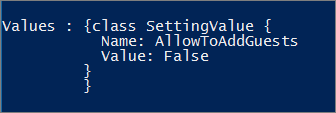

# <a name="manage-guest-access-in-office-365-groups"></a><span data-ttu-id="f65ed-103">Gestire l'accesso guest nei gruppi di Office 365</span><span class="sxs-lookup"><span data-stu-id="f65ed-103">Manage guest access in Office 365 Groups</span></span>

<span data-ttu-id="f65ed-104">Per impostazione predefinita, l'accesso guest per i gruppi di Office 365 è attivato per l'organizzazione.</span><span class="sxs-lookup"><span data-stu-id="f65ed-104">By default, guest access for Office 365 groups is turned on for your organization.</span></span> <span data-ttu-id="f65ed-105">Gli amministratori possono controllare se consentire l'accesso Guest ai gruppi per l'intera organizzazione o per i singoli gruppi.</span><span class="sxs-lookup"><span data-stu-id="f65ed-105">Admins can control whether to allow guest access to groups for their whole organization or for individual groups.</span></span>

<span data-ttu-id="f65ed-106">Quando è attivata, i membri del gruppo possono invitare gli utenti Guest a un gruppo di Office 365 tramite Outlook sul Web.</span><span class="sxs-lookup"><span data-stu-id="f65ed-106">When it's turned on, group members can invite guest users to an Office 365 group through Outlook on Web.</span></span> <span data-ttu-id="f65ed-107">Gli inviti vengono inviati al proprietario del gruppo per l'approvazione.</span><span class="sxs-lookup"><span data-stu-id="f65ed-107">Invitations are sent to the group owner for approval.</span></span>

> [!Note]
> <span data-ttu-id="f65ed-108">Le reti aziendali di Yammer che si trovano in modalità nativa o l' [eu Geo](https://go.microsoft.com/fwlink/?linkid=2107357) non supportano gli utenti della rete.</span><span class="sxs-lookup"><span data-stu-id="f65ed-108">Yammer Enterprise networks that are in Native Mode or the [EU Geo](https://go.microsoft.com/fwlink/?linkid=2107357) do not support network guests.</span></span>
> <span data-ttu-id="f65ed-109">I gruppi di Yammer connessi a Office 365 non supportano attualmente l'accesso guest, ma è possibile creare gruppi esterni non connessi nella rete Yammer.</span><span class="sxs-lookup"><span data-stu-id="f65ed-109">Office 365 Connected Yammer groups do not currently support guest access, but you can create non-connected, external groups in your Yammer network.</span></span> <span data-ttu-id="f65ed-110">Per istruzioni, vedere [creare e gestire gruppi esterni in Yammer](https://support.office.com/article/9ccd15ce-0efc-4dc1-81bc-4a424ab6f92a.aspx) .</span><span class="sxs-lookup"><span data-stu-id="f65ed-110">See [Create and manage external groups in Yammer](https://support.office.com/article/9ccd15ce-0efc-4dc1-81bc-4a424ab6f92a.aspx) for instructions.</span></span>

### <a name="edit-guest-information"></a><span data-ttu-id="f65ed-111">Modificare le informazioni Guest</span><span class="sxs-lookup"><span data-stu-id="f65ed-111">Edit guest information</span></span>

<span data-ttu-id="f65ed-112">Una volta approvato, l'utente ospite viene aggiunto alla directory e al gruppo.</span><span class="sxs-lookup"><span data-stu-id="f65ed-112">Once approved, the guest user is added to the directory and the group.</span></span>

<span data-ttu-id="f65ed-113">L'accesso guest nei gruppi è spesso utilizzato come parte di uno scenario più ampio che include SharePoint o teams.</span><span class="sxs-lookup"><span data-stu-id="f65ed-113">Guest access in groups is often used as part of a broader scenario that includes SharePoint or Teams.</span></span> <span data-ttu-id="f65ed-114">Tali servizi dispongono di impostazioni di condivisione Guest.</span><span class="sxs-lookup"><span data-stu-id="f65ed-114">These services have their own guest sharing settings.</span></span> <span data-ttu-id="f65ed-115">Per istruzioni complete su come configurare la condivisione Guest tra gruppi, SharePoint e team, vedere:</span><span class="sxs-lookup"><span data-stu-id="f65ed-115">For complete instructions for setting up guest sharing across groups, SharePoint, and Teams, see:</span></span>

- [<span data-ttu-id="f65ed-116">Collaborare con gli utenti guest a un sito</span><span class="sxs-lookup"><span data-stu-id="f65ed-116">Collaborate with guests in a site</span></span>](../../solutions/collaborate-in-site.md)
- [<span data-ttu-id="f65ed-117">Collaborare con gli utenti guest in un team</span><span class="sxs-lookup"><span data-stu-id="f65ed-117">Collaborate with guests in a team</span></span>](../../solutions/collaborate-as-team.md)

## <a name="manage-groups-guest-access"></a><span data-ttu-id="f65ed-118">Gestione degli accessi ai gruppi</span><span class="sxs-lookup"><span data-stu-id="f65ed-118">Manage groups guest access</span></span>

<span data-ttu-id="f65ed-119">Se si desidera abilitare o disabilitare l'accesso guest nei gruppi, è possibile farlo nell'interfaccia di amministrazione di Microsoft 365.</span><span class="sxs-lookup"><span data-stu-id="f65ed-119">If you want to enable or disable guest access in groups, you can do so in the Microsoft 365 admin center.</span></span>

1. <span data-ttu-id="f65ed-120">Nell'interfaccia di amministrazione, passare alle impostazioni delle **Impostazioni** \> **e selezionare** i gruppi di **Office 365**.</span><span class="sxs-lookup"><span data-stu-id="f65ed-120">In the admin center, go to the **Settings** \> **Settings** and select **Office 365 Groups**.</span></span>
  
2. <span data-ttu-id="f65ed-121">Nella pagina **gruppi di Office 365** , scegliere se si desidera consentire agli utenti esterni all'organizzazione di accedere alle risorse del gruppo o lasciare che i proprietari del gruppo aggiungano persone esterne all'organizzazione ai gruppi.</span><span class="sxs-lookup"><span data-stu-id="f65ed-121">On the **Office 365 Groups** page, choose whether you want to let people outside your organization access group resources or let group owners add people outside your organization to groups.</span></span>

## <a name="add-guests-to-an-office-365-group-from-the-admin-center"></a><span data-ttu-id="f65ed-122">Aggiungere gli utenti a un gruppo di Office 365 dall'interfaccia di amministrazione</span><span class="sxs-lookup"><span data-stu-id="f65ed-122">Add guests to an Office 365 group from the admin center</span></span>

<span data-ttu-id="f65ed-123">Se l'ospite è già presente nella directory, è possibile aggiungerli ai gruppi dall'interfaccia di amministrazione di Microsoft 365.</span><span class="sxs-lookup"><span data-stu-id="f65ed-123">If the guest already exists in your directory, you can add them to your groups from the Microsoft 365 admin center.</span></span>
  
1. <span data-ttu-id="f65ed-124">Nell'interfaccia di amministrazione, andare alla**Groups**  > pagina **gruppi.**</span><span class="sxs-lookup"><span data-stu-id="f65ed-124">In the admin center, go to the **Groups** > **Groups** page.</span></span>
  
2. <span data-ttu-id="f65ed-125">Fare clic sul gruppo a cui si desidera aggiungere l'ospite e selezionare **Visualizza tutti e Gestisci membri** nella scheda **membri** .</span><span class="sxs-lookup"><span data-stu-id="f65ed-125">Click the group you want to add the guest to, and select **View all and manage members** on the **Members** tab.</span></span> 
  
4. <span data-ttu-id="f65ed-126">Selezionare **Aggiungi membri**e scegliere il nome del Guest che si desidera aggiungere.</span><span class="sxs-lookup"><span data-stu-id="f65ed-126">Select **Add members**, and choose the name of the guest you want to add.</span></span>
    
5. <span data-ttu-id="f65ed-127">Selezionare **Salva**.</span><span class="sxs-lookup"><span data-stu-id="f65ed-127">Select **Save**.</span></span>

<span data-ttu-id="f65ed-128">Se si desidera aggiungere direttamente un guest alla directory, è possibile [aggiungere gli utenti di collaborazione B2B di Azure Active Directory nel portale di Azure](https://docs.microsoft.com/azure/active-directory/b2b/add-users-administrator).</span><span class="sxs-lookup"><span data-stu-id="f65ed-128">If you want to add a guest to the directory directly, you can [Add Azure Active Directory B2B collaboration users in the Azure portal](https://docs.microsoft.com/azure/active-directory/b2b/add-users-administrator).</span></span>

<span data-ttu-id="f65ed-129">Se si desidera modificare le informazioni di un ospite, è possibile [aggiungere o aggiornare le informazioni del profilo di un utente utilizzando Azure Active Directory](https://docs.microsoft.com/azure/active-directory/fundamentals/active-directory-users-profile-azure-portal).</span><span class="sxs-lookup"><span data-stu-id="f65ed-129">If you want to edit any of a guest's information, you can [Add or update a user's profile information using Azure Active Directory](https://docs.microsoft.com/azure/active-directory/fundamentals/active-directory-users-profile-azure-portal).</span></span>
  
## <a name="block-guest-users-from-a-specific-group"></a><span data-ttu-id="f65ed-130">Bloccare gli utenti Guest da un gruppo specifico</span><span class="sxs-lookup"><span data-stu-id="f65ed-130">Block guest users from a specific group</span></span>

<span data-ttu-id="f65ed-131">Se si desidera consentire l'accesso guest alla maggior parte dei gruppi, ma si desidera impedire l'accesso guest, è possibile bloccare l'accesso guest per i singoli gruppi tramite Microsoft PowerShell.</span><span class="sxs-lookup"><span data-stu-id="f65ed-131">If you want to allow guest access to most groups, but have some where you want to prevent guest access, you can block guest access for individual groups by using Microsoft PowerShell.</span></span>

<span data-ttu-id="f65ed-132">È necessario utilizzare la versione di anteprima di [Azure Active Directory PowerShell per Graph](https://docs.microsoft.com/powershell/azure/active-directory/install-adv2) (Module Name **AzureADPreview**) per modificare l'impostazione di accesso Guest a livello di gruppo:</span><span class="sxs-lookup"><span data-stu-id="f65ed-132">You must use the preview version of [Azure Active Directory PowerShell for Graph](https://docs.microsoft.com/powershell/azure/active-directory/install-adv2) (module name **AzureADPreview**) to change the group-level guest access setting:</span></span>

- <span data-ttu-id="f65ed-133">Se non è ancora stata installata una versione del modulo PowerShell di Azure AD, vedere [installare il modulo Azure AD](https://docs.microsoft.com/powershell/azure/active-directory/install-adv2?view=azureadps-2.0-preview#installing-the-azure-ad-module) e seguire le istruzioni per installare la versione di anteprima pubblica.</span><span class="sxs-lookup"><span data-stu-id="f65ed-133">If you haven't installed any version of the Azure AD PowerShell module before, see [Installing the Azure AD Module](https://docs.microsoft.com/powershell/azure/active-directory/install-adv2?view=azureadps-2.0-preview#installing-the-azure-ad-module) and follow the instructions to install the public preview release.</span></span>

- <span data-ttu-id="f65ed-134">Se è installata la versione 2.0 disponibile a livello generale del modulo PowerShell di Azure AD (AzureAD), è necessario disinstallarlo eseguendo `Uninstall-Module AzureAD` nella sessione di PowerShell e quindi installare la versione di anteprima eseguendo `Install-Module AzureADPreview`.</span><span class="sxs-lookup"><span data-stu-id="f65ed-134">If you have the 2.0 general availability version of the Azure AD PowerShell module (AzureAD) installed, you must uninstall it by running `Uninstall-Module AzureAD` in your PowerShell session, and then install the preview version by running `Install-Module AzureADPreview`.</span></span>

- <span data-ttu-id="f65ed-135">Se è già stata installata la versione Preview, eseguire `Install-Module AzureADPreview` per verificare che sia la versione più recente di questo modulo.</span><span class="sxs-lookup"><span data-stu-id="f65ed-135">If you have already installed the preview version, run `Install-Module AzureADPreview` to make sure it's the latest version of this module.</span></span>

> [!NOTE]
> <span data-ttu-id="f65ed-136">È necessario disporre dei diritti di amministratore globale per eseguire questi comandi.</span><span class="sxs-lookup"><span data-stu-id="f65ed-136">You must have global admin rights to run these commands.</span></span> 

<span data-ttu-id="f65ed-137">Eseguire lo script seguente, modificando \* / \* il nome del gruppo in cui si desidera bloccare l'accesso guest.</span><span class="sxs-lookup"><span data-stu-id="f65ed-137">Run the following script, changing */<GroupName/>* to the name of the group where you want to block guest access.</span></span>

```PowerShell
$GroupName = "<GroupName>"

Connect-AzureAD

$template = Get-AzureADDirectorySettingTemplate | ? {$_.displayname -eq "group.unified.guest"}
$settingsCopy = $template.CreateDirectorySetting()
$settingsCopy["AllowToAddGuests"]=$False
$groupID= (Get-AzureADGroup -SearchString $GroupName).ObjectId
New-AzureADObjectSetting -TargetType Groups -TargetObjectId $groupID -DirectorySetting $settingsCopy
```

<span data-ttu-id="f65ed-138">Per verificare le impostazioni, eseguire il comando seguente:</span><span class="sxs-lookup"><span data-stu-id="f65ed-138">To verify your settings, run this command:</span></span>

```PowerShell
Get-AzureADObjectSetting -TargetObjectId $groupID -TargetType Groups | fl Values
```

<span data-ttu-id="f65ed-139">La verifica è simile alla seguente:</span><span class="sxs-lookup"><span data-stu-id="f65ed-139">The verification looks like this:</span></span>
    

  
## <a name="allow-or-block-guest-access-based-on-their-domain"></a><span data-ttu-id="f65ed-141">Consenti o blocca l'accesso guest in base al dominio</span><span class="sxs-lookup"><span data-stu-id="f65ed-141">Allow or block guest access based on their domain</span></span>

<span data-ttu-id="f65ed-142">È possibile autorizzare o bloccare utenti guest che utilizzano uno specifico dominio.</span><span class="sxs-lookup"><span data-stu-id="f65ed-142">You can allow or block guest users who are using a specific domain.</span></span> <span data-ttu-id="f65ed-143">Ad esempio, se la propria azienda (contoso) ha una partnership con un'altra azienda (Fabrikam), è possibile aggiungere Fabrikam all'elenco Consenti in modo che gli utenti possano aggiungerli ai propri gruppi.</span><span class="sxs-lookup"><span data-stu-id="f65ed-143">For example, if your business (Contoso) has a partnership with another business (Fabrikam), you can add Fabrikam to your Allow list so your users can add those guests to their groups.</span></span>

<span data-ttu-id="f65ed-144">Per ulteriori informazioni, vedere [Consenti o blocca gli inviti agli utenti B2B provenienti da organizzazioni specifiche](https://docs.microsoft.com/azure/active-directory/b2b/allow-deny-list).</span><span class="sxs-lookup"><span data-stu-id="f65ed-144">For more information, see [Allow or block invitations to B2B users from specific organizations](https://docs.microsoft.com/azure/active-directory/b2b/allow-deny-list).</span></span>

## <a name="add-guests-to-the-global-address-list"></a><span data-ttu-id="f65ed-145">Aggiungere gli ospiti all'elenco indirizzi globale</span><span class="sxs-lookup"><span data-stu-id="f65ed-145">Add guests to the global address list</span></span>

<span data-ttu-id="f65ed-146">Per impostazione predefinita, gli utenti non sono visibili nell'elenco indirizzi globale di Exchange.</span><span class="sxs-lookup"><span data-stu-id="f65ed-146">By default, guests aren't visible in the Exchange Global Address List.</span></span> <span data-ttu-id="f65ed-147">Utilizzare la procedura riportata di seguito per rendere visibile un ospite nell'elenco indirizzi globale.</span><span class="sxs-lookup"><span data-stu-id="f65ed-147">Use the steps listed below to make a guest visible in the global address list.</span></span>

<span data-ttu-id="f65ed-148">Individuare l'ObjectID dell'utente Guest eseguendo:</span><span class="sxs-lookup"><span data-stu-id="f65ed-148">Find the guest user's ObjectID by running:</span></span>

```PowerShell
Get-AzureADUser -Filter "userType eq 'Guest'"
```

<span data-ttu-id="f65ed-149">Eseguire quindi il comando seguente utilizzando i valori corretti per ObjectID, DATENAME, cognome, DisplayName e TelephoneNumber.</span><span class="sxs-lookup"><span data-stu-id="f65ed-149">Then run the following using the appropriate values for ObjectID, GivenName, Surname, DisplayName, and TelephoneNumber.</span></span>

```PowerShell
Set-AzureADUser -ObjectId cfcbd1a0-ed18-4210-9b9d-cf0ba93cf6b2 -ShowInAddressList $true -GivenName 'Megan' -Surname 'Bowen' -DisplayName 'Megan Bowen' -TelephoneNumber '555-555-5555'
```

## <a name="related-articles"></a><span data-ttu-id="f65ed-150">Articoli correlati</span><span class="sxs-lookup"><span data-stu-id="f65ed-150">Related articles</span></span>

[<span data-ttu-id="f65ed-151">Gestire l'appartenenza ai gruppi nell'interfaccia di amministrazione di Microsoft 365</span><span class="sxs-lookup"><span data-stu-id="f65ed-151">Manage Group membership in the Microsoft 365 admin center</span></span>](add-or-remove-members-from-groups.md)
  
[<span data-ttu-id="f65ed-152">Recensioni di Azure Active Directory Access</span><span class="sxs-lookup"><span data-stu-id="f65ed-152">Azure Active Directory access reviews</span></span>](https://docs.microsoft.com/azure/active-directory/active-directory-azure-ad-controls-perform-access-review)

[<span data-ttu-id="f65ed-153">Set-AzureADUser</span><span class="sxs-lookup"><span data-stu-id="f65ed-153">Set-AzureADUser</span></span>](https://docs.microsoft.com/powershell/module/azuread/set-azureaduser)
