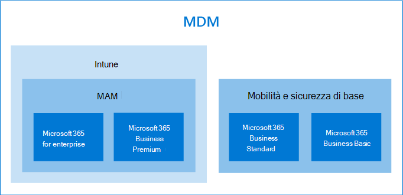

# Opzioni per la protezione dei dati di dispositivi e appOptions for protecting your devices and app data

Sono disponibili diversi modi per proteggere i dati e i dispositivi delle organizzazioni su di essi con Microsoft 365 for Business and Enterprise.You have several ways to secure your organizations devices and data on them with Microsoft 365 for business and enterprise. È possibile utilizzare i seguenti piani autonomi:You can use the following stand-alone plans:

- Intune (parte di Microsoft Endpoint Management)Intune (a part of Microsoft Endpoint Management)
- Piani di Azure Active Directory Premium.Azure Active Directory Premium plans.
- Mobilità e sicurezza di base (inclusa nella maggior parte dei piani Microsoft 365 for business e Enterprise) oppure utilizzare le sottoscrizioni che includono alcuni o tutti i piani autonomi precedenti.Basic Mobility and Security (included in most Microsoft 365 for business and enterprise plans) Or use the subscriptions that include some, or all of the previous standalone plans.

- Un abbonamento a Microsoft 365 Business Premium, che include la sicurezza e la protezione dalle minacce per le piccole aziende con 300 utenti.A Microsoft 365 Business Premium subscription, which includes security and threat protection for small business under 300 users.
- Piani di Microsoft 365 Enterprise che includono sicurezza avanzata e protezione dalle minacce.Microsoft 365 Enterprise plans that include advanced security and threat protection.

## Opzioni di gestione dei dispositiviDevice management options

- La **sicurezza e la mobilità di base** sono offerte con la maggior parte dei piani di Microsoft 365 ed è l'unica scelta integrata offerta per Microsoft 365 business standard e Microsoft 365 Business Basic.**Basic Mobility and Security** is offered with most Microsoft 365 plans, and is the only built-in choice offered for Microsoft 365 Business Standard and Microsoft 365 Business Basic. Per ulteriori informazioni, vedere [disponibilità di base per dispositivi mobili e sicurezza](../basic-mobility-security/choose-between-basic-mobility-and-security-and-intune.md#availability-of-basic-mobility-and-security-and-intune).For more information, see [availability of Basic Mobility and Security](../basic-mobility-security/choose-between-basic-mobility-and-security-and-intune.md#availability-of-basic-mobility-and-security-and-intune). 

    Se si dispone di Microsoft 365 Business Basic o Microsoft 365 business standard, è possibile acquistare Intune anche se l'organizzazione ha esigenze di sicurezza più complesse.If you have either Microsoft 365 Business Basic or Microsoft 365 Business Standard, you can also purchase Intune if your organization has more complex security needs.
 
- **Microsoft Intune** è un piano autonomo incluso anche in alcuni piani Microsoft 365 for business o Enterprise.**Microsoft Intune** is a stand-alone plan that is also included with some Microsoft 365 for business or enterprise plans. Se si dispone di Intune come autonomo o come parte dell'abbonamento, fornisce la possibilità di ottimizzare il dispositivo e la gestione dei dati di app.If you have Intune either as a stand-alone or a part of your subscription, it provides ability to fine-tune your device and app-data management. Per ulteriori informazioni sulla disponibilità con Microsoft 365, vedere [disponibilità di Intune](../basic-mobility-security/choose-between-basic-mobility-and-security-and-intune.md#availability-of-basic-mobility-and-security-and-intune).For more information on availability with Microsoft 365, see [availability of Intune](../basic-mobility-security/choose-between-basic-mobility-and-security-and-intune.md#availability-of-basic-mobility-and-security-and-intune).

    Microsoft Intune è un servizio basato su cloud che si concentra sulla gestione dei dispositivi mobili (MDM) e sulla gestione di applicazioni mobili (MAM).Microsoft Intune is a cloud-based service that focuses on mobile device management (MDM) and mobile application management (MAM). È possibile controllare in che modo vengono utilizzati i dispositivi dell'organizzazione, inclusi telefoni cellulari, tablet e laptop.You control how your organization’s devices are used, including mobile phones, tablets, and laptops. È inoltre possibile configurare criteri specifici per il controllo delle applicazioni.You can also configure specific policies to control applications. Per ulteriori informazioni, vedere [documentazione di Microsoft Intune](https://docs.microsoft.com/mem/intune/).For more information, see [Microsoft Intune documentation](https://docs.microsoft.com/mem/intune/).

- I piani di **Azure Active Directory (ad) Premium** sono piani autonomi che sono disponibili anche in alcuni dei piani Microsoft 365 for business e Enterprise.**Azure Active Directory (AD) Premium** plans are standalone plans that also come with some of the Microsoft 365 for business and enterprise plans. Per ulteriori informazioni, vedere [Listino dei prezzi di Azure ad](https://azure.microsoft.com/pricing/details/active-directory/).For more information, see [Azure AD pricing](https://azure.microsoft.com/pricing/details/active-directory/).

     Azure AD Premium P1 e Azure AD Premium P2 consentono di impostare le funzionalità di accesso condizionale, la reimpostazione della password in modalità self-service e così via. Per ulteriori informazioni sulle funzionalità dei piani Premium, vedere pagina di [pricing di Azure ad](https://azure.microsoft.com/pricing/details/active-directory/) .Azure AD Premium P1 and Azure AD Premium P2 allow you to set conditional access features, self-service password reset, etc. For more information on the capabilities of the Premium plans, see [Azure AD pricing](https://azure.microsoft.com/pricing/details/active-directory/) page.
- **Microsoft 365 Business Premium** include Intune e Azure Active Directory Premium P1 e Office 365 Advanced Threat Protection.**Microsoft 365 Business Premium** includes Intune and Azure Active Directory Premium P1 and Office 365 Advanced Threat Protection. 
 
    Microsoft 365 Business Premium offre una serie di modelli di criteri per la protezione dei dati di dispositivi e app.Microsoft 365 Business Premium offers a set of policy templates for securing your devices and app data. Offre un buon livello di sicurezza e protezione dalle minacce per la maggior parte delle aziende con 300 utenti.It offers a good level of security and threat protection for most businesses under 300 users. Per ulteriori informazioni, vedere [configurare microsoft 365 Business Premium nell'installazione guidata](../../business/set-up.md), proteggere i [computer Windows 10](../../business/secure-win-10-pcs.md)e le [funzionalità di sicurezza e conformità di Microsoft 365 Business Premium](../../business/security-features.md).For more information, see [set up Microsoft 365 Business Premium in the setup wizard](../../business/set-up.md), [secure Windows 10 computers](../../business/secure-win-10-pcs.md),  and [Microsoft 365 Business Premium security and compliance features](../../business/security-features.md).

- **Microsoft 365 per** le sottoscrizioni Enterprise include Microsoft Intune ed E5 include anche i piani di Azure ad Premium 1 e 2.**Microsoft 365 for enterprise** subscriptions include Microsoft Intune and E5 also includes the Azure AD premium plans 1 and 2.

    Microsoft 365 E5 offre il livello più elevato di sicurezza e protezione dalle minacce di tutte le sottoscrizioni di Microsoft 365.Microsoft 365 E5 offers the highest level of security and threat protection of all the Microsoft 365 subscriptions. Per ulteriori informazioni, vedere [Microsoft 365 for Enterprise Overview](../../enterprise/microsoft-365-overview.md).For more information, see [Microsoft 365 for enterprise overview](../../enterprise/microsoft-365-overview.md).
