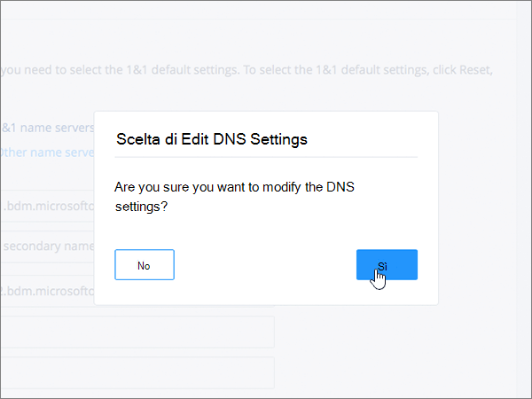
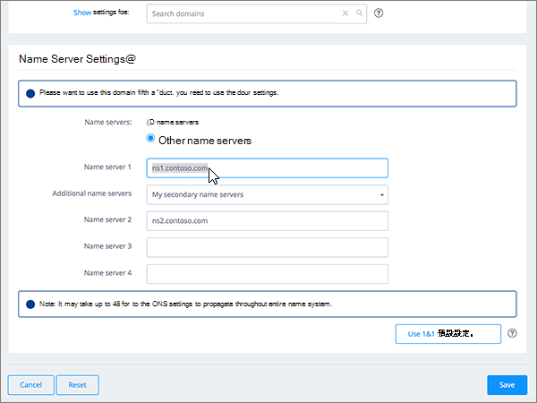

# Modificare i server dei nomi per configurare Microsoft 365 con 1&1 IONOSChange nameservers to set up Microsoft 365 with 1&1 IONOS

 Se non si trova ciò che si sta cercando, **[vedere le domande frequenti sui domini](../setup/domains-faq.md)**.**[Check the Domains FAQ](../setup/domains-faq.md)** if you don't find what you're looking for. 
  
Seguire le istruzioni riportate di seguito se si desidera che Microsoft 365 gestisca i record DNS di Microsoft 365.Follow these instructions if you want Microsoft 365 to manage your Microsoft 365 DNS records for you. Se si preferisce, è possibile [gestire tutti i record DNS di Microsoft 365 a 1&1 IONOS](create-dns-records-at-1-1-internet.md).(If you prefer, you can [manage all your Microsoft 365 DNS records at 1&1 IONOS](create-dns-records-at-1-1-internet.md).) 
  

    
## Aggiungere un record TXT a scopo di verificaAdd a TXT record for verification

Before you use your domain with Microsoft 365, we have to make sure that you own it.Before you use your domain with Microsoft 365, we have to make sure that you own it. Your ability to log in to your account at your domain registrar and create the DNS record proves to Microsoft 365 that you own the domain.Your ability to log in to your account at your domain registrar and create the DNS record proves to Microsoft 365 that you own the domain.
  
> [!NOTE]
> This record is used only to verify that you own your domain; it doesn't affect anything else.This record is used only to verify that you own your domain; it doesn't affect anything else. You can delete it later, if you like.You can delete it later, if you like. 
  
Seguire i passaggi indicati sotto oppure [guardare il video (iniziare da 0:42)](https://support.microsoft.com/office/0ef1b3b5-d27a-4004-8ca1-fbe0453a0ea3).Follow the steps below or [watch the video (start at 0:42)](https://support.microsoft.com/office/0ef1b3b5-d27a-4004-8ca1-fbe0453a0ea3).
  
1. Per iniziare, passare alla propria pagina dei domini su 1&1 IONOS tramite [questo collegamento](https://account.1and1.com/?redirect_url=https%3A%2F%2Fmy.1and1.com%2F).To get started, go to your domains page at 1&1 IONOS via [this link](https://account.1and1.com/?redirect_url=https%3A%2F%2Fmy.1and1.com%2F). You'll be prompted to log in.You'll be prompted to log in. 
    
2. In **My Domains**selezionare **Manage Domains**.Under **MY DOMAINS**, select **Manage domains**.
    
3. Nella pagina **centro Domain** individuare il dominio che si desidera aggiornare. Selezionare quindi il controllo **Panel** ( **v**) per il dominio.On the **Domain Center** page, find the domain that you want to update; then select the **Panel** ( **v**) control for that domain.
    
4. Nell'area **Impostazioni dominio** selezionare **Modifica impostazioni DNS**.In the **Domain Settings** area, select **Edit DNS Settings**.
    
5. Nella sezione **txt e SRV Records** selezionare **Aggiungi record**.In the **TXT and SRV Records** section, select **Add Record**.
    
    (You may have to scroll down.)(You may have to scroll down.) 
    
6. In the **Add Record** area, in the boxes for the new record, type or copy and paste the values from the following table.In the **Add Record** area, in the boxes for the new record, type or copy and paste the values from the following table. 
    
||||
|:-----|:-----|:-----|
|**Type****Type**   |**Prefix****Prefix**   |**Name Value****Name Value**   |
|TXTTXT    |(Leave this field empty.)(Leave this field empty.)    |MS=ms *XXXXXXXX*MS=ms *XXXXXXXX*   **Nota**: questo è un esempio.**Note**: This is an example. Usare il valore specifico di **Indirizzo di destinazione o puntamento** indicato nella tabella in Microsoft 365.Use your specific **Destination or Points to Address** value here, from the table in Microsoft 365. [Come trovarloHow do I find this?](../get-help-with-domains/information-for-dns-records.md)   |

   
7. Fare clic su **Salva**e quindi su **Salva** di nuovo.Select **Save**, and then **Save** again. 
    
8. Nella finestra di dialogo **Modifica impostazioni DNS** selezionare **Sì**.In the **Edit DNS Settings** dialog box, select **Yes**.
    
9. Attendere alcuni minuti prima di continuare, in modo che il record appena creato venga aggiornato in Internet.Wait a few minutes before you continue, so that the record you just created can update across the Internet.
    
Una volta aggiunto il record al sito del registrar, è possibile tornare in Microsoft 365 e chiedere di cercarlo.Now that you've added the record at your domain registrar's site, you'll go back to Microsoft 365 and request Microsoft 365 to look for the record.
  
Quando Microsoft 365 trova il record TXT corretto, il dominio è verificato.When Microsoft 365 finds the correct TXT record, your domain is verified.
  
1. Nell'interfaccia di amministrazione passare a **Impostazioni** \> pagina <a href="https://go.microsoft.com/fwlink/p/?linkid=834818" target="_blank">Domini</a>.In the admin center, go to the **Settings** \> <a href="https://go.microsoft.com/fwlink/p/?linkid=834818" target="_blank">Domains</a> page.
    
2. Nella pagina **Domini** selezionare il dominio da verificare.On the **Domains** page, select the domain that you are verifying. 
    
3. Nella pagina **Configurazione** selezionare **Avvia configurazione**.On the **Setup** page, select **Start setup**.
    
4. Nella pagina **Verifica dominio** selezionare **Verifica**.On the **Verify domain** page, select **Verify**.
    
> [!NOTE]
> Typically it takes about 15 minutes for DNS changes to take effect.Typically it takes about 15 minutes for DNS changes to take effect. However, it can occasionally take longer for a change you've made to update across the Internet's DNS system.However, it can occasionally take longer for a change you've made to update across the Internet's DNS system. In caso di problemi con il flusso di posta o altri problemi dopo l'aggiunta di record DNS, vedere [individuare e correggere i problemi dopo l'aggiunta del dominio o dei record DNS in Microsoft 365](../get-help-with-domains/find-and-fix-issues.md).If you're having trouble with mail flow or other issues after adding DNS records, see [Find and fix issues after adding your domain or DNS records in Microsoft 365](../get-help-with-domains/find-and-fix-issues.md). 
  
## Modificare i record del server dei nomi del dominioChange your domain's nameserver (NS) records

Per completare la configurazione del dominio con Microsoft 365, è necessario modificare i record NS del dominio presso il registrar in modo che puntino ai server dei nomi primari e secondari di Microsoft 365.To complete setting up your domain with Microsoft 365, you change your domain's NS records at your domain registrar to point to the Microsoft 365 primary and secondary name servers. In questo modo si configura Microsoft 365 per aggiornare i record DNS del dominio.This sets up Microsoft 365 to update the domain's DNS records for you. Verranno aggiunti tutti i record necessari per il funzionamento della posta elettronica, di Skype for Business online e del sito Web pubblico con il dominio.We'll add all records so that email, Skype for Business Online, and your public website work with your domain, and you'll be all set.
  
> [!CAUTION]
> Quando si modificano i record NS del dominio in modo che puntino ai server dei nomi Microsoft 365, tutti i servizi attualmente associati al dominio sono intaccati.When you change your domain's NS records to point to the Microsoft 365 name servers, all the services that are currently associated with your domain are affected. Ad esempio, tutta la posta elettronica inviata al dominio (come rob@ *your_domain* . com) inizierà a venire a Microsoft 365 dopo aver apportato questa modifica.For example, all email sent to your domain (like rob@ *your_domain*  .com) will start coming to Microsoft 365 after you make this change. 
  
È possibile modificare i record NS per consentire a Microsoft 365 di configurare il dominio?Ready to change your NS records so Microsoft 365 can set up your domain? Seguire le istruzioni riportate di seguito o [guardare il video (iniziare da 2:47)](https://support.microsoft.com/office/0ef1b3b5-d27a-4004-8ca1-fbe0453a0ea3).Follow the steps below or [watch the video (start at 2:47)](https://support.microsoft.com/office/0ef1b3b5-d27a-4004-8ca1-fbe0453a0ea3).
  
> [!IMPORTANT]
>  Nella procedura seguente viene illustrato come eliminare tutti gli altri server dei nomi indesiderati dall'elenco e come aggiungere i server dei nomi corretti se non sono già elencati.The following procedure will show you how to delete any other, unwanted nameservers from the list, and also how to add the correct nameservers if they are not already listed. > dopo aver completato la procedura descritta in questa sezione, gli unici server dei nomi da elencare sono i seguenti quattro: > ns1.bdm.microsoftonline.com > ns2.bdm.microsoftonline.com > ns3.bdm.microsoftonline.com > ns4.bdm.microsoftonline.com>  When you have completed the steps in this section, the only nameservers that should be listed are these four: >  ns1.bdm.microsoftonline.com >  ns2.bdm.microsoftonline.com >  ns3.bdm.microsoftonline.com >  ns4.bdm.microsoftonline.com 
  
1. Per iniziare, passare alla propria pagina dei domini su 1&1 IONOS usando [questo collegamento](https://account.1and1.com/?redirect_url=https%3A%2F%2Fmy.1and1.com%2F).To get started, go to your domains page at 1&1 IONOS by using [this link](https://account.1and1.com/?redirect_url=https%3A%2F%2Fmy.1and1.com%2F). You'll be prompted to log in.You'll be prompted to log in. 
    
2. In **My Domains**selezionare **Manage Domains**.Under **MY DOMAINS**, select **Manage domains**.
    
3. Nella pagina **centro Domain** individuare il dominio che si desidera aggiornare e quindi selezionare il controllo **Panel** ( **v**) per il dominio.On the **Domain Center** page, find the domain that you want to update, and then select the **Panel** ( **v**) control for that domain.
    
4. Nell'area **Impostazioni dominio** selezionare **Modifica impostazioni DNS**.In the **Domain Settings** area, select **Edit DNS Settings**.
    
5. Nella sezione **Name Server Settings** selezionare **Other name servers**.In the **Name Server Settings** section, select **Other name servers**.
    
    Può essere necessario scorrere la pagina.(You may have to scroll down.)
    
6. A seconda che siano o meno già presenti server dei nomi nella pagina visualizzata, continuare con una delle due procedure seguenti:Depending on whether or not there are already nameservers listed on the page that is displayed now, continue to one of the two following procedures:
    
  - Se **NON** sono già elencati server dei nomi, [Se NON sono già elencati server dei nomi](#if-there-are-no-nameservers-already-listed).If there are **NO** nameservers already listed, [If there are NO nameservers already listed](#if-there-are-no-nameservers-already-listed).
    
  - Se **SONO** già elencati server dei nomi, [Se SONO già elencati server dei nomi](#if-there-are-nameservers-already-listed).If there **ARE** nameservers already listed, [If there ARE nameservers already listed](#if-there-are-nameservers-already-listed).
    
### Se NON sono già elencati server dei nomiIf there are NO nameservers already listed

1. Nella seconda casella **Name server 1** digitare o copiare e incollare il valore dalla tabella seguente.In the **Name server 1** box, type or copy and paste the value from the following table. 
    
|||
|:-----|:-----|
|**Name server 1****Name server 1**   |ns1.bdm.microsoftonline.comns1.bdm.microsoftonline.com    |
   
   
  
2. Nell'elenco a discesa **Additional name servers** scegliere **My secondary name servers**.In the **Additional name servers** drop-down list, choose **My secondary name servers**.
    
    
  
3. Nelle caselle **Name server 2, 3 e 4** digitare o copiare e incollare il valore dalla tabella seguente.In the **Name server 2, 3, and 4** boxes, type or copy and paste the value from the following table. 
    
|||
|:-----|:-----|
|**Name server 2****Name server 2**   |ns2.bdm.microsoftonline.comns2.bdm.microsoftonline.com    |
|**Name server 3****Name server 3**   |ns3.bdm.microsoftonline.comns3.bdm.microsoftonline.com    |
|**Name server 4****Name server 4**   |ns4.bdm.microsoftonline.comns4.bdm.microsoftonline.com    |
   

  
4. Selezionare **Salva**.Select **Save**.
    
    
  
5. Nella finestra di dialogo **Modifica impostazioni DNS** selezionare **Sì**.In the **Edit DNS Settings** dialog box, select **Yes**.
    
    
  
> [!NOTE]
> Your nameserver record updates may take up to several hours to update across the Internet's DNS system.Your nameserver record updates may take up to several hours to update across the Internet's DNS system. L'indirizzo di posta elettronica e gli altri servizi di Microsoft saranno tutti impostati per l'utilizzo con il dominio.Then your Microsoft email and other services will be all set to work with your domain. 
  
### Se SONO già elencati server dei nomiIf there ARE nameservers already listed

> [!CAUTION]
> Follow these steps  *only*  if you have existing nameservers other than the four  *correct*  nameservers.Follow these steps  *only*  if you have existing nameservers other than the four  *correct*  nameservers. (That is, delete  *only*  any current nameservers that are  *not*  named **ns1.bdm.microsoftonline.com**, **ns2.bdm.microsoftonline.com**, **ns3.bdm.microsoftonline.com**, or **ns4.bdm.microsoftonline.com**.)(That is, delete  *only*  any current nameservers that are  *not*  named **ns1.bdm.microsoftonline.com**, **ns2.bdm.microsoftonline.com**, **ns3.bdm.microsoftonline.com**, or **ns4.bdm.microsoftonline.com**.) 
  
1. Se sono già elencati altri server dei nomi nelle caselle **Name server**, eliminarli uno alla volta selezionandoli e premendo **CANC**.If there are already nameservers listed in the **Name server** boxes, delete each one by selecting it and then pressing the **Delete** key on your keyboard. 
    
    
  
2. Nelle caselle **Name server 1, 2, 3 e 4** digitare o copiare e incollare i valori dalla tabella seguente.In the **Name server 1, 2, 3, and 4** boxes, type or copy and paste the values from the following table. 
    
|||
|:-----|:-----|
|**Name server 1****Name server 1**   |ns1.bdm.microsoftonline.comns1.bdm.microsoftonline.com    |
|**Name server 2****Name server 2**   |ns2.bdm.microsoftonline.comns2.bdm.microsoftonline.com    |
|**Name server 3****Name server 3**   |ns3.bdm.microsoftonline.comns3.bdm.microsoftonline.com    |
|**Name server 4****Name server 4**   |ns4.bdm.microsoftonline.comns4.bdm.microsoftonline.com    |
   
   
  
3. Selezionare **Salva**.Select **Save**.
    
    
  
4. Nella finestra di dialogo **Modifica impostazioni DNS** selezionare **Sì**.In the **Edit DNS Settings** dialog box, select **Yes**.
    
    
  
> [!NOTE]
> Your nameserver record updates may take up to several hours to update across the Internet's DNS system.Your nameserver record updates may take up to several hours to update across the Internet's DNS system. L'indirizzo di posta elettronica e gli altri servizi di Microsoft saranno tutti impostati per l'utilizzo con il dominio.Then your Microsoft email and other services will be all set to work with your domain. 
  

