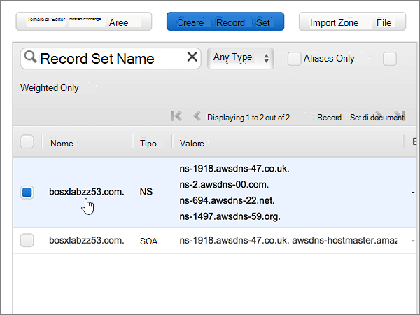
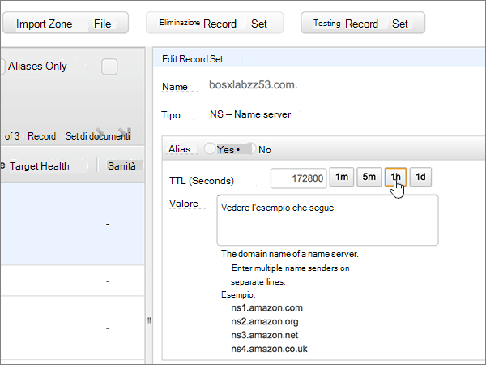

# Modificare i server dei nomi per configurare Office 365 con Amazon Web Services (AWS)Change nameservers to set up Office 365 with Amazon Web Services (AWS)

 **Se non si trova ciò che si sta cercando, [vedere le domande frequenti sui domini](../setup/domains-faq.md)**.**[Check the Domains FAQ](../setup/domains-faq.md)** if you don't find what you're looking for. 
  
Seguire queste istruzioni se si vuole che Office 365 gestisca automaticamente i record DNS di Office 365. Se si preferisce, è possibile [gestire tutti i record DNS di Office 365 su AWS](create-dns-records-at-aws.md).Follow these instructions if you want Office 365 to manage your Office 365 DNS records for you. (If you prefer, you can [manage all your Office 365 DNS records at AWS](create-dns-records-at-aws.md).)
  
    
## Aggiungere un record TXT a scopo di verificaAdd a TXT record for verification

Prima di usare il proprio dominio con Office 365, è necessario dimostrare di esserne proprietari. La capacità di accedere al proprio account nel registrar e di creare il record DNS dimostra a Office 365 che si è proprietari del dominio.Before you use your domain with Office 365, we have to make sure that you own it. Your ability to log in to your account at your domain registrar and create the DNS record proves to Office 365 that you own the domain.
  
> [!NOTE]
> Questo record viene usato esclusivamente per verificare di essere proprietari del dominio e non ha altri effetti. È possibile eliminarlo in un secondo momento, se si preferisce.This record is used only to verify that you own your domain; it doesn't affect anything else. You can delete it later, if you like. 
  
1. Per iniziare, passare alla propria pagina dei domini su AWS usando [questo collegamento](https://console.aws.amazon.com/route53/home). Verrà richiesto di eseguire l'accesso.To get started, go to your domains page at AWS by using [this link](https://console.aws.amazon.com/route53/home). You'll be prompted to log in first.
    
2. Nella pagina **risorse** selezionare **aree ospitate**.On the **Resources** page, select **Hosted Zones**.
    
3. Nella colonna **nome dominio** della pagina **aree ospitate** selezionare il nome del dominio che si desidera modificare.On the **Hosted Zones** page, in the **Domain Name** column, select the name of the domain that you want to edit. 
    
4. Selezionare **Crea set di record**.Select **Create Record Set**.
    
5. In the **Create Record Set** area, in the boxes for the new record, type or copy and paste the values from the following table.In the **Create Record Set** area, in the boxes for the new record, type or copy and paste the values from the following table. 
    
    (Choose the **Type** and **Routing Policy** values from the drop-down lists.)(Choose the **Type** and **Routing Policy** values from the drop-down lists.) 
    
    > [!TIP]
    > The quotation marks required by the onscreen instructions are supplied automatically. You don't need to type them manually.The quotation marks required by the onscreen instructions are supplied automatically. You don't need to type them manually. 
  
|||||||
|:-----|:-----|:-----|:-----|:-----|:-----|
|**Nome****Name**   |**Tipo****Type**   |**Alias****Alias**   |**TTL (Seconds)****TTL (Seconds)**   |**Value****Value**   |**Routing Policy****Routing Policy**   |
|(Lasciare vuoto questo campo)(Leave this field empty)    |TXT - TextTXT - Text    |NoNo    |300300    |MS=ms *XXXXXXXX*MS=ms *XXXXXXXX*   **Note:** questo è un esempio.**Note:** This is an example. Usare il valore specifico di **Indirizzo di destinazione o puntamento** indicato nella tabella in Office 365.Use your specific **Destination or Points to Address** value here, from the table in Office 365. [Come trovarloHow do I find this?](../get-help-with-domains/information-for-dns-records.md)     |SempliceSimple   |
   
6. Selezionare **Crea**.Select **Create**.
    
7. Attendere alcuni minuti prima di continuare, in modo che il record appena creato venga aggiornato in Internet.Wait a few minutes before you continue, so that the record you just created can update across the Internet.
    
Una volta aggiunto il record al sito del registrar, è possibile tornare in Office 365 e chiedere di cercarlo.Now that you've added the record at your domain registrar's site, you'll go back to Office 365 and request Office 365 to look for the record.
  
Quando Office 365 trova il record TXT corretto, il dominio è verificato.When Office 365 finds the correct TXT record, your domain is verified.
  
1. Nell'interfaccia di amministrazione passare a **Impostazioni** \> pagina <a href="https://go.microsoft.com/fwlink/p/?linkid=834818" target="_blank">Domini</a>.In the admin center, go to the **Settings** \> <a href="https://go.microsoft.com/fwlink/p/?linkid=834818" target="_blank">Domains</a> page.

    
2. Nella pagina **Domini** selezionare il dominio da verificare.On the **Domains** page, select the domain that you are verifying. 
    
3. Nella pagina **Configurazione** selezionare **Avvia configurazione**.On the **Setup** page, select **Start setup**.
    
4. Nella pagina **Verifica dominio** selezionare **Verifica**.On the **Verify domain** page, select **Verify**.
    
> [!NOTE]
> In genere l'applicazione delle modifiche al DNS richiede circa 15 minuti. A volte può tuttavia capitare che l'aggiornamento di una modifica nel sistema DNS di Internet richieda più tempo. In caso di problemi con il flusso di posta o di altro tipo dopo l'aggiunta dei record DNS, vedere [Individuare e correggere i problemi dopo l'aggiunta del dominio o dei record DNS in Office 365](../get-help-with-domains/find-and-fix-issues.md).Typically it takes about 15 minutes for DNS changes to take effect. However, it can occasionally take longer for a change you've made to update across the Internet's DNS system. If you're having trouble with mail flow or other issues after adding DNS records, see [Find and fix issues after adding your domain or DNS records in Office 365](../get-help-with-domains/find-and-fix-issues.md). 
  
## Modificare i record del server dei nomi del dominioChange your domain's nameserver (NS) records

Per completare la configurazione del dominio con Office 365, modificare i record del server dei nomi del dominio presso il registrar in modo che puntino ai server dei nomi primario e secondario di Office 365. Office 365 viene così configurato in modo da aggiornare automaticamente i record DNS del dominio. Verranno aggiunti tutti i record necessari per il funzionamento della posta elettronica, di Skype for Business online e del sito Web pubblico con il dominio.To complete setting up your domain with Office 365, you change your domain's NS records at your domain registrar to point to the Office 365 primary and secondary name servers. This sets up Office 365 to update the domain's DNS records for you. We'll add all records so that email, Skype for Business Online, and your public website work with your domain, and you'll be all set.
  
> [!CAUTION]
> Quando si modificano i record NS del dominio in modo che puntino ai server dei nomi di Office 365, questa modifica interessa tutti i servizi attualmente associati al dominio. Ad esempio, dopo questa modifica tutta la posta elettronica inviata al dominio (come roberto@ *nome_dominio*  .com) inizierà a essere recapitata a Office 365.When you change your domain's NS records to point to the Office 365 name servers, all the services that are currently associated with your domain are affected. For example, all email sent to your domain (like rob@ *your_domain*  .com) will start coming to Office 365 after you make this change. 
  
> [!IMPORTANT]
>  Nella procedura seguente viene illustrato come eliminare tutti gli altri server dei nomi indesiderati dall'elenco e come aggiungere i server dei nomi corretti se non sono già elencati.The following procedure will show you how to delete any other, unwanted nameservers from the list, and also how to add the correct nameservers if they are not already listed. > dopo aver completato la procedura descritta in questa sezione, gli unici server dei nomi da elencare sono i seguenti quattro: > ns1.bdm.microsoftonline.com > ns2.bdm.microsoftonline.com > ns3.bdm.microsoftonline.com > ns4.bdm.microsoftonline.com>  When you have completed the steps in this section, the only nameservers that should be listed are these four: >  ns1.bdm.microsoftonline.com >  ns2.bdm.microsoftonline.com >  ns3.bdm.microsoftonline.com >  ns4.bdm.microsoftonline.com 
  
1. Per iniziare, passare alla propria pagina dei domini su AWS usando [questo collegamento](https://console.aws.amazon.com/route53/home).To get started, go to your domains page at AWS by using [this link](https://console.aws.amazon.com/route53/home). Verrà richiesto di eseguire l'accesso.You'll be prompted to log in first.
    
2. Nella pagina **risorse** selezionare **aree ospitate**.On the **Resources** page, select **Hosted Zones**.
    
3. Nella colonna **nome dominio** della pagina **aree ospitate** selezionare il nome del dominio che si desidera modificare.On the **Hosted Zones** page, in the **Domain Name** column, select the name of the domain that you want to edit. 
    
4. Selezionare il set di record **Nameserver**.Select the **Nameserver** record set. 
    
    
  
5. Nel set di record **NS - Name server** della casella **Valore** eliminare tutti i server dei nomi selezionandoli e premendo **CANC**.In the **NS - Name server** record set in the **Value** box, delete all of the nameservers by selecting them all and then pressing the **Delete** key on your keyboard. 
    
    > [!CAUTION]
    > Follow these steps only if you have existing nameservers other than the four correct nameservers.Follow these steps only if you have existing nameservers other than the four correct nameservers. (Ovvero, eliminare solo eventuali server dei nomi correnti che *non* sono denominati **NS1.BDM.microsoftonline.com**, **NS2.BDM.microsoftonline.com**, **NS3.BDM.microsoftonline.com**o **NS4.BDM.microsoftonline.com**).(That is, delete only any current nameservers that are  *not*  named **ns1.bdm.microsoftonline.com**, **ns2.bdm.microsoftonline.com**, **ns3.bdm.microsoftonline.com**, or **ns4.bdm.microsoftonline.com**.) 
  
    
  
6. Nell'area **TTL (secondi):** selezionare **1h** (1 ora).In the **TTL (Seconds):** area, select **1h** (1 Hour). 
    
    
  
7. Sempre nel set di record **NS - Name server** della casella **Valore** digitare oppure copiare e incollare il valore **Prima riga** dalla tabella seguente, quindi premere **INVIO** e digitare oppure copiare e incollare il valore **Seconda riga**.Still in the **NS - Name server** record set, in the **Value** box, type or copy and paste the **First line** value from the following table, then press the **Enter** key on your keyboard and type or copy and paste the next **line** value. 
    
    > [!IMPORTANT]
    > Ogni valore per il nome dei server  *deve*  trovarsi su una riga separata nella casella **Valore**, come mostrato nella figura seguente.Each nameserver value  *must*  be on its own separate line within the **Value** box, as shown in the following illustration. 
  
|||
|:-----|:-----|
|**Prima riga****First line**   |ns1.bdm.microsoftonline.com.ns1.bdm.microsoftonline.com.    **This value MUST end with a period (.)****This value MUST end with a period (.)**   |
|**Seconda riga****Second line**   |ns2.bdm.microsoftonline.com.ns2.bdm.microsoftonline.com.    **This value MUST end with a period (.)****This value MUST end with a period (.)**   |
|**Terza riga****Third line**   |ns3.bdm.microsoftonline.com.ns3.bdm.microsoftonline.com.    **Questo valore DEVE terminare con un punto (.)****This value MUST end with a period (.)**   |
|**Quarta riga****Fourth line**   |ns4.bdm.microsoftonline.com.ns4.bdm.microsoftonline.com.    **Questo valore DEVE terminare con un punto (.)****This value MUST end with a period (.)**   |
   
   
  
8. Selezionare **Salva set di record**.Select **Save Record Set**.
    
    
  
> [!NOTE]
> L'aggiornamento dei record dei server dei nomi nel sistema DNS di Internet può richiedere fino a diverse ore. Al termine, la posta elettronica e altri servizi di Office 365 verranno tutti impostati per funzionare con il dominio.Your nameserver record updates may take up to several hours to update across the Internet's DNS system. Then your Office 365 email and other services will be all set to work with your domain. 
