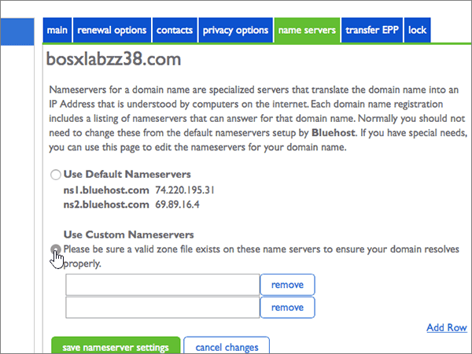

# Modificare i server dei nomi per configurare Office 365 con BluehostChange nameservers to set up Office 365 with Bluehost

 **Se non si trova ciò che si sta cercando, [vedere le domande frequenti sui domini](../setup/domains-faq.md)**.**[Check the Domains FAQ](../setup/domains-faq.md)** if you don't find what you're looking for. 
  
Seguire queste istruzioni se si vuole che Office 365 gestisca automaticamente i record DNS di Office 365. Se si preferisce, è possibile [gestire tutti i record DNS di Office 365 su Bluehost](create-dns-records-at-bluehost.md).Follow these instructions if you want Office 365 to manage your Office 365 DNS records for you. (If you prefer, you can [manage all your Office 365 DNS records at Bluehost](create-dns-records-at-bluehost.md).)
  
## Aggiungere un record TXT a scopo di verificaAdd a TXT record for verification

Prima di usare il proprio dominio con Office 365, è necessario dimostrare di esserne proprietari. La capacità di accedere al proprio account nel registrar e di creare il record DNS dimostra a Office 365 che si è proprietari del dominio.Before you use your domain with Office 365, we have to make sure that you own it. Your ability to log in to your account at your domain registrar and create the DNS record proves to Office 365 that you own the domain.
  
> [!NOTE]
> Questo record viene usato esclusivamente per verificare di essere proprietari del dominio e non ha altri effetti. È possibile eliminarlo in un secondo momento, se si preferisce.This record is used only to verify that you own your domain; it doesn't affect anything else. You can delete it later, if you like. 
  
1. Per iniziare, passare alla propria pagina dei domini su Bluehost usando [questo collegamento](https://my.bluehost.com/cgi/dm).To get started, go to your domains page at Bluehost by using [this link](https://my.bluehost.com/cgi/dm). You'll be prompted to log in first.You'll be prompted to log in first.
    
2. Nell'area **domain** della pagina **Domains** trovare la riga relativa al dominio da modificare e quindi selezionare la casella di controllo corrispondente.On the **domains** page, in the **domain** area, find the row for the domain that you're changing, and then select the check box for that domain. 
    
    Può essere necessario scorrere la pagina.(You may have to scroll down.) 
    
3. Nell'area **Domain_name** , nella riga **Editor zone DNS** , selezionare **Manage DNS Records**.In the **domain_name** area, on the **DNS Zone Editor** row, select **Manage DNS records**.
    
4. On the **DNS Zone Editor** page, in the Add DNS Record area, in the boxes for the new record, type or copy and paste the values from the following table.On the **DNS Zone Editor** page, in the Add DNS Record area, in the boxes for the new record, type or copy and paste the values from the following table. 
    
    (Choose the **Type** value from the drop-down list.)(Choose the **Type** value from the drop-down list.) 
    
|||||
|:-----|:-----|:-----|:-----|
|**Host Record****Host Record**   |**TTL****TTL**   |**Type****Type**   |**TXT Value****TXT Value**   |
|@    |1440014400    |TXTTXT    |MS=ms *XXXXXXXX*MS=ms *XXXXXXXX*   **Note:** questo è un esempio.**Note:** This is an example. Usare il valore specifico di **Indirizzo di destinazione o puntamento** indicato nella tabella in Office 365.Use your specific **Destination or Points to Address** value here, from the table in Office 365. [Come trovarloHow do I find this?](../get-help-with-domains/information-for-dns-records.md)   |

   
5. Selezionare **Aggiungi record**.Select **add record**.
    
6. Attendere alcuni minuti prima di continuare, in modo che il record appena creato venga aggiornato in Internet.Wait a few minutes before you continue, so that the record you just created can update across the Internet.
    
Now that you've added the record at your domain registrar's site, you'll go back to Office 365 and request Office 365 to look for the record.Now that you've added the record at your domain registrar's site, you'll go back to Office 365 and request Office 365 to look for the record.
  
When Office 365 finds the correct TXT record, your domain is verified.When Office 365 finds the correct TXT record, your domain is verified.
  
1. Nell'interfaccia di amministrazione, andare alla pagina \*\*\*\* \> <a href="https://go.microsoft.com/fwlink/p/?linkid=834818" target="_blank">Domains</a> Settings.In the admin center, go to the **Settings** \> <a href="https://go.microsoft.com/fwlink/p/?linkid=834818" target="_blank">Domains</a> page.

    
2. Nella pagina **Domains** selezionare il dominio che si sta verificando.On the **Domains** page, select the domain that you are verifying. 
    
3. Nella pagina **configurazione** , selezionare **Avvia installazione**.On the **Setup** page, select **Start setup**.
    
4. Nella pagina **Verifica dominio** selezionare **Verifica**.On the **Verify domain** page, select **Verify**.
    
> [!NOTE]
> In genere l'applicazione delle modifiche al DNS richiede circa 15 minuti. A volte può tuttavia capitare che l'aggiornamento di una modifica nel sistema DNS di Internet richieda più tempo. In caso di problemi con il flusso di posta o di altro tipo dopo l'aggiunta dei record DNS, vedere [Individuare e correggere i problemi dopo l'aggiunta del dominio o dei record DNS in Office 365](../get-help-with-domains/find-and-fix-issues.md).Typically it takes about 15 minutes for DNS changes to take effect. However, it can occasionally take longer for a change you've made to update across the Internet's DNS system. If you're having trouble with mail flow or other issues after adding DNS records, see [Find and fix issues after adding your domain or DNS records in Office 365](../get-help-with-domains/find-and-fix-issues.md). 
  
## Modificare i record del server dei nomi del dominioChange your domain's nameserver (NS) records

Per completare la configurazione del dominio con Office 365, modificare i record del server dei nomi del dominio presso il registrar in modo che puntino ai server dei nomi primario e secondario di Office 365. Office 365 viene così configurato in modo da aggiornare automaticamente i record DNS del dominio. Verranno aggiunti tutti i record necessari per il funzionamento della posta elettronica, di Skype for Business online e del sito Web pubblico con il dominio.To complete setting up your domain with Office 365, you change your domain's NS records at your domain registrar to point to the Office 365 primary and secondary name servers. This sets up Office 365 to update the domain's DNS records for you. We'll add all records so that email, Skype for Business Online, and your public website work with your domain, and you'll be all set.
  
> [!CAUTION]
> Quando si modificano i record NS del dominio in modo che puntino ai server dei nomi di Office 365, questa modifica interessa tutti i servizi attualmente associati al dominio. Ad esempio, dopo questa modifica tutta la posta elettronica inviata al dominio (come roberto@ *nome_dominio*  .com) inizierà a essere recapitata a Office 365.When you change your domain's NS records to point to the Office 365 name servers, all the services that are currently associated with your domain are affected. For example, all email sent to your domain (like rob@ *your_domain*  .com) will start coming to Office 365 after you make this change. 
  
> [!IMPORTANT]
>  Nella procedura seguente viene illustrato come eliminare tutti gli altri server dei nomi indesiderati dall'elenco e come aggiungere i server dei nomi corretti se non sono già elencati.The following procedure will show you how to delete any other, unwanted nameservers from the list, and also how to add the correct nameservers if they are not already listed. > dopo aver completato la procedura descritta in questa sezione, gli unici server dei nomi da elencare sono i seguenti quattro: > ns1.bdm.microsoftonline.com > ns2.bdm.microsoftonline.com > ns3.bdm.microsoftonline.com > ns4.bdm.microsoftonline.com>  When you have completed the steps in this section, the only nameservers that should be listed are these four: >  ns1.bdm.microsoftonline.com >  ns2.bdm.microsoftonline.com >  ns3.bdm.microsoftonline.com >  ns4.bdm.microsoftonline.com 
  
1. Per iniziare, passare alla propria pagina dei domini su Bluehost usando [questo collegamento](https://my.bluehost.com/cgi/dm).To get started, go to your domains page at Bluehost by using [this link](https://my.bluehost.com/cgi/dm). You'll be prompted to log in first.You'll be prompted to log in first.
    
2. Nell'area **Domain_name** della pagina **Domains** selezionare la casella di controllo per il dominio, quindi selezionare Server dei **nomi**.On the **domains** page, in the **domain_name** area, select the checkbox for your domain, and then select **name servers**.
    
    
  
3. Nell'area **Domain_name** selezionare **Usa server dei nomi personalizzati**.In the **domain_name** area, select **Use Custom Nameservers**.
    
    
  
4. A seconda che siano o meno già presenti server dei nomi nella pagina visualizzata, continuare con una delle due procedure seguenti:Depending on whether or not there are already nameservers listed on the page that is displayed now, continue to one of the two following procedures:
    
  - Se **NON** sono già elencati server dei nomi, [Se NON sono già elencati server dei nomi](#if-there-are-no-nameservers-already-listed).If there are **NO** nameservers already listed, [If there are NO nameservers already listed](#if-there-are-no-nameservers-already-listed).
    
  - Se **SONO** già elencati server dei nomi, [Se SONO già elencati server dei nomi](#if-there-are-nameservers-already-listed).If there **ARE** nameservers already listed, [If there ARE nameservers already listed](#if-there-are-nameservers-already-listed).
    
### Se NON sono già elencati server dei nomiIf there are NO nameservers already listed

1. Nella sezione **Use Custom Nameservers** digitare oppure copiare e incollare i valori della tabella seguente.In the **Use Custom Nameservers** section, type or copy and paste the values from the following table. 
    
|||
|:-----|:-----|
|**Prima riga vuota****First empty row**   |ns1.bdm.microsoftonline.comns1.bdm.microsoftonline.com    |
|**Seconda riga vuota****Second empty row**   |ns2.bdm.microsoftonline.comns2.bdm.microsoftonline.com    |
   
   
  
2. Selezionare **Aggiungi riga**.Select **Add Row**.
    
    
  
3. Sempre nella sezione **Use Custom Nameservers** digitare oppure copiare e incollare i valori della prima riga della tabella seguente nella nuova riga vuota.Still in the **Use Custom Nameservers** section, type or copy and paste the values from the first row of the following table into the new empty row. 
    
|||
|:-----|:-----|
|**Terza riga vuota****Third empty row**   |ns3.bdm.microsoftonline.comns3.bdm.microsoftonline.com    |
|**Quarta riga vuota****Fourth empty row**   |ns4.bdm.microsoftonline.comns4.bdm.microsoftonline.com    |
   
    
  
4. Per aggiungere il quarto record del server dei nomi, selezionare di nuovo **Aggiungi riga** e creare un record usando i valori dell'ultima riga della tabella precedente.To add the fourth Nameserver record, select **Add Row** again, and create a record using the values from the last row of the above table. 
    
5. Selezionare **Salva impostazioni server dei nomi**.Select **save nameserver settings**.
    
    
  
> [!NOTE]
> L'aggiornamento dei record dei server dei nomi nel sistema DNS di Internet può richiedere fino a diverse ore. Al termine, la posta elettronica e altri servizi di Office 365 verranno tutti impostati per funzionare con il dominio.Your nameserver record updates may take up to several hours to update across the Internet's DNS system. Then your Office 365 email and other services will be all set to work with your domain. 
  
### Se SONO già elencati server dei nomiIf there ARE nameservers already listed

> [!CAUTION]
> Follow these steps only if you have existing nameservers other than the four correct nameservers.Follow these steps only if you have existing nameservers other than the four correct nameservers. (Ovvero, eliminare solo eventuali server dei nomi correnti che *non* sono denominati **NS1.BDM.microsoftonline.com**, **NS2.BDM.microsoftonline.com**, **NS3.BDM.microsoftonline.com**o **NS4.BDM.microsoftonline.com**).(That is, delete only any current nameservers that are  *not*  named **ns1.bdm.microsoftonline.com**, **ns2.bdm.microsoftonline.com**, **ns3.bdm.microsoftonline.com**, or **ns4.bdm.microsoftonline.com**.) 
  
1. Se sono già presenti server dei nomi, eliminarli selezionando ogni server e premendo **CANC**.If there are any other name servers listed, delete each of them by selecting it and then pressing the **Delete** key on your keyboard. 
    
    
  
2. Sempre nella sezione **Use Custom Nameservers**, digitare oppure copiare e incollare i valori della tabella seguente.Still in the **Use Custom Nameservers** section, type or copy and paste the values from the following table. 
    
|||
|:-----|:-----|
|**Prima riga vuota****First empty row**   |ns1.bdm.microsoftonline.comns1.bdm.microsoftonline.com    |
|**Seconda riga vuota****Second empty row**   |ns2.bdm.microsoftonline.comns2.bdm.microsoftonline.com    |
   
   
  
3. Selezionare **Aggiungi riga**.Select **Add Row**.
    
    
  
4. Sempre nella sezione **Use Custom Nameservers** digitare oppure copiare e incollare i valori della prima riga della tabella seguente nella nuova riga vuota.Still in the **Use Custom Nameservers** section, type or copy and paste the values from the first row of the following table into the new empty row. 
    
|||
|:-----|:-----|
|**Terza riga vuota****Third empty row**   |ns3.bdm.microsoftonline.comns3.bdm.microsoftonline.com    |
|**Quarta riga vuota****Fourth empty row**   |ns4.bdm.microsoftonline.comns4.bdm.microsoftonline.com    |
   
   
  
5. Per aggiungere il quarto record del server dei nomi, selezionare di nuovo **Aggiungi riga** e creare un record usando i valori dell'ultima riga della tabella precedente.To add the fourth Nameserver record, select **Add Row** again, and create a record using the values from the last row of the above table. 
    
6. Selezionare **Salva impostazioni server dei nomi**.Select **save nameserver settings**.
    
    
  
> [!NOTE]
> L'aggiornamento dei record dei server dei nomi nel sistema DNS di Internet può richiedere fino a diverse ore. Al termine, la posta elettronica e altri servizi di Office 365 verranno tutti impostati per funzionare con il dominio.Your nameserver record updates may take up to several hours to update across the Internet's DNS system. Then your Office 365 email and other services will be all set to work with your domain. 
  
