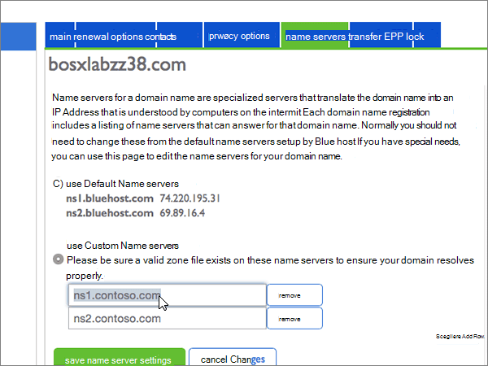

# Modificare i server dei nomi per configurare Microsoft con Bluehost

 Se non si trova ciò che si sta cercando, **[vedere le domande frequenti sui domini](../setup/domains-faq.md)**. 
  
Se si desidera gestire i record DNS per l'utente, seguire le istruzioni riportate di seguito. Se si preferisce, è possibile [gestire tutti i record DNS su Bluehost](create-dns-records-at-bluehost.md).
  
## Aggiungere un record TXT a scopo di verifica

Prima di usare il proprio dominio con Microsoft, è necessario dimostrare di esserne il proprietario. La capacità di accedere al proprio account nel registrar e di creare il record DNS dimostra a Microsoft che si è il proprietario del dominio.
  
> [!NOTE]
> Questo record viene usato esclusivamente per verificare di essere proprietari del dominio e non ha altri effetti. È possibile eliminarlo in un secondo momento, se si preferisce. 
  
1. Per iniziare, passare alla propria pagina dei domini su Bluehost usando [questo collegamento](https://my.bluehost.com/cgi/dm). Verrà richiesto di eseguire l'accesso.
    
2. Nell'area **domain** della pagina **Domains** trovare la riga relativa al dominio da modificare e quindi selezionare la casella di controllo corrispondente. 
    
    Può essere necessario scorrere la pagina. 
    
3. Nell'area **Domain_name** , nella riga **Editor zone DNS** , selezionare **Manage DNS Records**.
    
4. On the **DNS Zone Editor** page, in the Add DNS Record area, in the boxes for the new record, type or copy and paste the values from the following table. 
    
    (Choose the **Type** value from the drop-down list.) 
    
|||||
|:-----|:-----|:-----|:-----|
|**Host Record**   |**TTL**   |**Type**   |**TXT Value**   |
|@    |14400    |TXT    |MS=ms *XXXXXXXX*   **Note:** questo è un esempio. Usare il valore specifico di **Indirizzo di destinazione o puntamento** indicato nella tabella. [Come trovarlo](../get-help-with-domains/information-for-dns-records.md)   |

   
5. Selezionare **Aggiungi record**.
    
6. Attendere alcuni minuti prima di continuare, in modo che il record appena creato venga aggiornato in Internet.
    
Dopo aver aggiunto il record al sito del registrar, è possibile tornare a Microsoft e richiedere una ricerca per il record.
  
Quando Microsoft trova il record TXT corretto, il dominio è verificato.
  
1. Nell'interfaccia di amministrazione di Microsoft, passare alla pagina **Impostazioni** \> <a href="https://go.microsoft.com/fwlink/p/?linkid=834818" target="_blank">Domini</a>.

    
2. Nella pagina **Domini** selezionare il dominio da verificare. 
    
3. Nella pagina **Configurazione** selezionare **Avvia configurazione**.
    
4. Nella pagina **Verifica dominio** selezionare **Verifica**.
    
> [!NOTE]
> In genere, l'applicazione delle modifiche al DNS richiede circa 15 minuti. Tuttavia, a volte può capitare che l'aggiornamento di una modifica nel sistema DNS di Internet richieda più tempo. In caso di problemi con il flusso di posta o di altro tipo dopo l'aggiunta dei record DNS, vedere [Individuare e correggere i problemi dopo l'aggiunta del dominio o dei record DNS](../get-help-with-domains/find-and-fix-issues.md). 
  
## Modificare i record del server dei nomi del dominio

Per completare la configurazione del dominio con Microsoft, è necessario modificare i record NS del dominio presso il registrar in modo che puntino ai server dei nomi primari e secondari. Questo configura Microsoft per aggiornare i record DNS del dominio per l'utente. Verranno aggiunti tutti i record necessari per il funzionamento della posta elettronica, di Skype for Business online e del sito Web pubblico con il dominio.
  
> [!CAUTION]
> Quando si modificano i record NS del dominio in modo che puntino ai server dei nomi Microsoft, sono coinvolti tutti i servizi attualmente associati al dominio. Ad esempio, tutta la posta elettronica inviata al dominio (come rob@ *your_domain* . com) inizierà a venire a Microsoft dopo aver apportato questa modifica. 
  
> [!IMPORTANT]
>  Nella procedura seguente viene illustrato come eliminare tutti gli altri server dei nomi indesiderati dall'elenco e come aggiungere i server dei nomi corretti se non sono già elencati. > dopo aver completato la procedura descritta in questa sezione, gli unici server dei nomi da elencare sono i seguenti quattro: > ns1.bdm.microsoftonline.com > ns2.bdm.microsoftonline.com > ns3.bdm.microsoftonline.com > ns4.bdm.microsoftonline.com 
  
1. Per iniziare, passare alla propria pagina dei domini su Bluehost usando [questo collegamento](https://my.bluehost.com/cgi/dm). Verrà richiesto di eseguire l'accesso.
    
2. Nell'area **Domain_name** della pagina **Domains** selezionare la casella di controllo per il dominio, quindi selezionare Server dei **nomi**.
    
    
  
3. Nell'area **Domain_name** selezionare **Usa server dei nomi personalizzati**.
    
    
  
4. A seconda che siano o meno già presenti server dei nomi nella pagina visualizzata, continuare con una delle due procedure seguenti:
    
  - Se **NON** sono già elencati server dei nomi, [Se NON sono già elencati server dei nomi](#if-there-are-no-nameservers-already-listed).
    
  - Se **SONO** già elencati server dei nomi, [Se SONO già elencati server dei nomi](#if-there-are-nameservers-already-listed).
    
### Se NON sono già elencati server dei nomi

1. Nella sezione **Use Custom Nameservers** digitare oppure copiare e incollare i valori della tabella seguente. 
    
|||
|:-----|:-----|
|**Prima riga vuota**   |ns1.bdm.microsoftonline.com    |
|**Seconda riga vuota**   |ns2.bdm.microsoftonline.com    |
   
   
  
2. Selezionare **Aggiungi riga**.
    
    
  
3. Sempre nella sezione **Use Custom Nameservers** digitare oppure copiare e incollare i valori della prima riga della tabella seguente nella nuova riga vuota. 
    
|||
|:-----|:-----|
|**Terza riga vuota**   |ns3.bdm.microsoftonline.com    |
|**Quarta riga vuota**   |ns4.bdm.microsoftonline.com    |
  
4. Per aggiungere il quarto record del server dei nomi, selezionare di nuovo **Aggiungi riga** e creare un record usando i valori dell'ultima riga della tabella precedente. 
    
5. Selezionare **Salva impostazioni server dei nomi**.
    
    
  
> [!NOTE]
> L'aggiornamento dei record dei server dei nomi nel sistema DNS di Internet può richiedere fino a diverse ore. L'indirizzo di posta elettronica e gli altri servizi di Microsoft saranno tutti impostati per l'utilizzo con il dominio. 
  
### Se SONO già elencati server dei nomi

> [!CAUTION]
> Follow these steps only if you have existing nameservers other than the four correct nameservers. (Ovvero, eliminare solo eventuali server dei nomi correnti che *non* sono denominati **NS1.BDM.microsoftonline.com**, **NS2.BDM.microsoftonline.com**, **NS3.BDM.microsoftonline.com**o **NS4.BDM.microsoftonline.com**). 
  
1. Se sono già presenti server dei nomi, eliminarli selezionando ogni server e premendo **CANC**. 
    
    
  
2. Sempre nella sezione **Use Custom Nameservers**, digitare oppure copiare e incollare i valori della tabella seguente. 
    
|||
|:-----|:-----|
|**Prima riga vuota**   |ns1.bdm.microsoftonline.com    |
|**Seconda riga vuota**   |ns2.bdm.microsoftonline.com    |
   
   
  
3. Selezionare **Aggiungi riga**.
    
    
  
4. Sempre nella sezione **Use Custom Nameservers** digitare oppure copiare e incollare i valori della prima riga della tabella seguente nella nuova riga vuota. 
    
|||
|:-----|:-----|
|**Terza riga vuota**   |ns3.bdm.microsoftonline.com    |
|**Quarta riga vuota**   |ns4.bdm.microsoftonline.com    |
   
   
  
5. Per aggiungere il quarto record del server dei nomi, selezionare di nuovo **Aggiungi riga** e creare un record usando i valori dell'ultima riga della tabella precedente. 
    
6. Selezionare **Salva impostazioni server dei nomi**.
    
    
  
> [!NOTE]
> L'aggiornamento dei record dei server dei nomi nel sistema DNS di Internet può richiedere fino a diverse ore. L'indirizzo di posta elettronica e gli altri servizi di Microsoft saranno tutti impostati per l'utilizzo con il dominio. 
  
