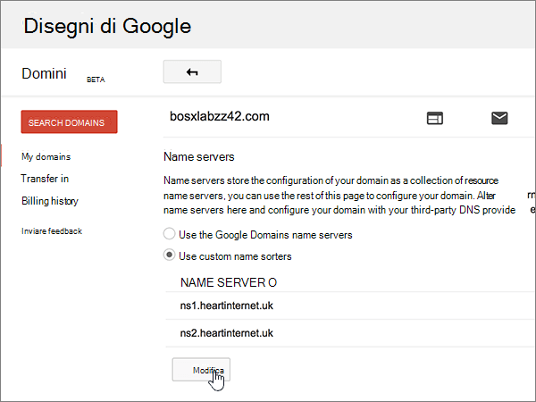
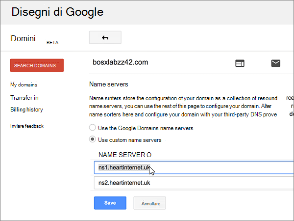
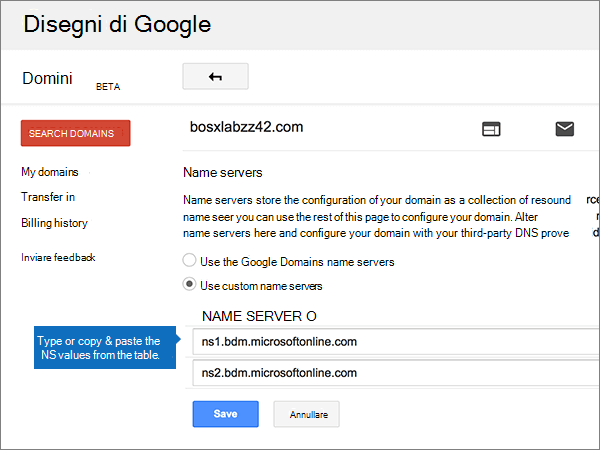
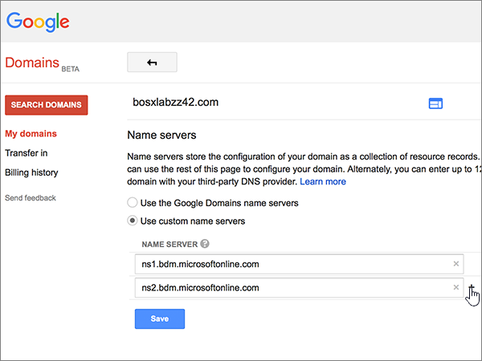

# Modificare i server dei nomi per configurare Microsoft con Google Domains

 Se non si trova ciò che si sta cercando, **[vedere le domande frequenti sui domini](../setup/domains-faq.yml)**. 
  
Se si desidera gestire i record DNS per l'utente, seguire le istruzioni riportate di seguito. Se si preferisce, è possibile [gestire tutti i record DNS su Google Domains](create-dns-records-at-google-domains.md).
  
    
## Aggiungere un record TXT a scopo di verifica

Prima di usare il proprio dominio con Microsoft, è necessario dimostrare di esserne il proprietario. La capacità di accedere al proprio account nel registrar e di creare il record DNS dimostra a Microsoft che si è il proprietario del dominio.
  
> [!NOTE]
>  Questo record viene usato esclusivamente per verificare di essere proprietari del dominio e non ha altri effetti. È possibile eliminarlo in un secondo momento, se si preferisce. 
  
1. Per iniziare, passare alla propria pagina dei domini su Google Domains tramite [questo collegamento](https://domains.google.com/registrar). You'll be prompted to sign in. To do so:
    
1. Scegliere **Accedi**.
    
2. Immettere le credenziali di accesso e selezionare **di nuovo accedi**.
    
2. Nella pagina **Domains**, nella sezione **Domain**, selezionare **Configura DNS** per il dominio che si vuole modificare. 
    
3. Nelle caselle del nuovo record nella sezione **Custom resource records** digitare oppure copiare e incollare i valori della tabella seguente. 
    
    Può essere necessario scorrere la pagina.
    
    Selezionare il valore **Type** nell'elenco a discesa. 
    
|||||
|:-----|:-----|:-----|:-----|
|**Nome**   |**Type**   |**TTL**   |**Dati**   |
|@    |TXT    |1H    |MS=ms *XXXXXXXX*   **Note:** questo è un esempio. Usare il valore specifico di **Indirizzo di destinazione o puntamento** indicato nella tabella. [Come trovarlo](../get-help-with-domains/information-for-dns-records.md)          |
   
4. Selezionare **Aggiungi**.
    
5. Attendere alcuni minuti prima di continuare, in modo che il record appena creato venga aggiornato in Internet.
    
Dopo aver aggiunto il record al sito del registrar, è possibile tornare a Microsoft e richiedere una ricerca per il record.
  
Quando Microsoft trova il record TXT corretto, il dominio è verificato.
  
1. Nell'interfaccia di amministrazione di Microsoft, passare alla pagina **Impostazioni** \> <a href="https://go.microsoft.com/fwlink/p/?linkid=834818" target="_blank">Domini</a>.

    
2. Nella pagina **Domini** selezionare il dominio da verificare. 
    
3. Nella pagina **Configurazione** selezionare **Avvia configurazione**.
    
4. Nella pagina **Verifica dominio** selezionare **Verifica**.
    
> [!NOTE]
> In genere, l'applicazione delle modifiche al DNS richiede circa 15 minuti. Tuttavia, a volte può capitare che l'aggiornamento di una modifica nel sistema DNS di Internet richieda più tempo. In caso di problemi con il flusso di posta o di altro tipo dopo l'aggiunta dei record DNS, vedere [Individuare e correggere i problemi dopo l'aggiunta del dominio o dei record DNS](../get-help-with-domains/find-and-fix-issues.md). 
  
## Modificare i record del server dei nomi del dominio

Per completare la configurazione del dominio con Microsoft, è necessario modificare i record NS del dominio presso il registrar in modo che puntino ai server dei nomi primari e secondari Microsoft. Questo configura Microsoft per aggiornare i record DNS del dominio per l'utente. Verranno aggiunti tutti i record necessari per il funzionamento della posta elettronica, di Skype for Business online e del sito Web pubblico con il dominio.
  
> [!CAUTION]
> Quando si modificano i record NS del dominio in modo che puntino ai server dei nomi Microsoft, sono coinvolti tutti i servizi attualmente associati al dominio. Ad esempio, tutti i messaggi di posta elettronica inviati al dominio (come rob@ *your_domain.*  com) inizierà a essere Microsoft dopo aver apportato questa modifica. 
  
> [!IMPORTANT]
> The following procedure will show you how to delete any other, unwanted nameservers from the list, and also how to add the correct nameservers if they are not already in the list. > dopo aver completato la procedura descritta in questa sezione, gli unici server dei nomi che devono essere elencati sono i seguenti quattro: 
  
1. Per iniziare, passare alla propria pagina dei domini su Google Domains usando [questo collegamento](https://domains.google.com/registrar). Verrà richiesto di eseguire l'accesso. A questo scopo:
    
1. Scegliere **Accedi**.
    
2. Immettere le credenziali di accesso e poi selezionare di nuovo **Accedi**.
    
2. Nella pagina **Domains**, nella sezione **Domain**, selezionare **Configura DNS** per il dominio che si vuole modificare. 
    
3. Nella pagina **Domains**, nella sezione **Name servers**, selezionare **Use custom name servers**.
    
    
  
4. A seconda che siano o meno già presenti server dei nomi nella pagina visualizzata, continuare con una delle due procedure seguenti:
    
  - Se **NON** sono già elencati server dei nomi, [Se NON sono già elencati server dei nomi](#if-there-are-no-nameservers-already-listed).
    
  - Se **SONO** già elencati server dei nomi, [Se SONO già elencati server dei nomi](#if-there-are-nameservers-already-listed).
    
### Se NON sono già elencati server dei nomi

1. Aggiungere il primo server dei nomi.
    
    Nella casella **NAME SERVER** della sezione **Name servers** digitare oppure copiare e incollare il primo valore dalla tabella seguente. 
    
|||
|:-----|:-----|
|**Primo server dei nomi**   |ns1.bdm.microsoftonline.com    |
|**Secondo server dei nomi**   |ns2.bdm.microsoftonline.com    |
|**Terzo server dei nomi**   |ns3.bdm.microsoftonline.com    |
|**Quarto server dei nomi**   |ns4.bdm.microsoftonline.com    |
   
   
  
2. Selezionare il controllo **+ (Aggiungi)** per creare una riga vuota. 
    
    
  
3. Aggiungere gli altri tre record dei server dei nomi.
    
    Nella sezione **Use Custom Name Servers** creare un record usando i valori della riga successiva della tabella e quindi selezionare il controllo **+ (Aggiungi)** per aggiungere un'altra riga. 
    
    Ripetere questa procedura fino a creare tutti e quattro i record dei server dei nomi.
    
4. Selezionare **Salva**.
    
    
  
> [!NOTE]
> L'aggiornamento dei record dei server dei nomi nel sistema DNS di Internet può richiedere fino a diverse ore. L'indirizzo di posta elettronica e gli altri servizi di Microsoft saranno tutti impostati per l'utilizzo con il dominio. 
  
### Se SONO già elencati server dei nomi

1. Se sono elencati altri server dei nomi, selezionare **modifica**.
    
    > [!CAUTION]
    > Follow these steps only if you have existing nameservers other than the four correct nameservers. (Ovvero, eliminare solo eventuali server dei nomi correnti che  *non*  sono denominati **NS1.BDM.microsoftonline.com**, **NS2.BDM.microsoftonline.com**, **NS3.BDM.microsoftonline.com** o **NS4.BDM.microsoftonline.com**). 
  
    
  
2. Eliminare ciascun valore selezionandolo e premendo **CANC**. 
    
    
  
3. Sempre nella sezione **Name servers**, nelle righe **NAME SERVER** digitare oppure copiare e incollare il valore dalla tabella seguente. 
    
|||
|:-----|:-----|
|**Primo server dei nomi**   |ns1.bdm.microsoftonline.com    |
|**Secondo server dei nomi**   |ns2.bdm.microsoftonline.com    |
|**Terzo server dei nomi**   |ns3.bdm.microsoftonline.com    |
|**Quarto server dei nomi**   |ns4.bdm.microsoftonline.com    |
   
   
  
4. Selezionare il controllo **+ (Aggiungi)** per creare una riga vuota. 
    
    
  
5. Aggiungere gli altri due record dei server dei nomi.
    
    Nella sezione **Use Custom Name Servers** creare un record usando i valori della riga successiva della tabella e quindi selezionare il controllo **+ (Aggiungi)** per aggiungere un'altra riga. 
    
    Ripetere questa procedura fino a creare tutti e quattro i record dei server dei nomi.
    
6. Selezionare **Salva**.
    
    
  
> [!NOTE]
> L'aggiornamento dei record dei server dei nomi nel sistema DNS di Internet può richiedere fino a diverse ore. L'indirizzo di posta elettronica e gli altri servizi di Microsoft saranno tutti impostati per l'utilizzo con il dominio. 
  
